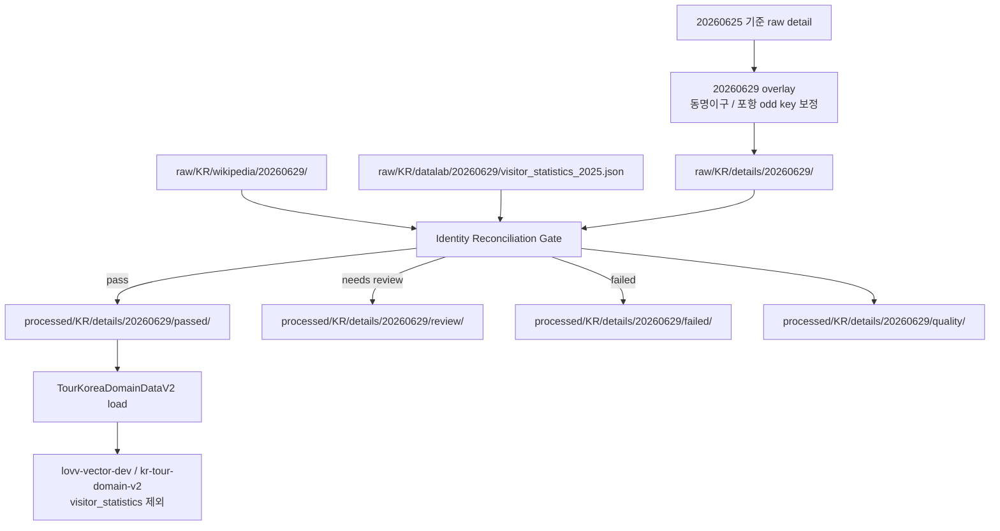

# Spec: KR 20260629 Raw 전처리 라인 재설계

> Source of truth: `docs/reports/kr_data_acquisition_report_20260629.md`
> Status: Draft updated with V2 infrastructure replacement direction
> Created: 2026-06-29
> Owner role: Spec Agent
> Required execution mode for implementation: Sequential Mode

## Assumptions

1. `raw/KR/details/20260629/`는 운영 후보 raw dataset으로 사용하되, DynamoDB V2와 vector rebuild의 직접 입력으로 사용하지 않는다.
2. `raw/KR/details/20260625/`는 rollback 및 비교 기준으로 보존한다.
3. DataLab 방문통계는 detail raw 객체를 제자리 수정하지 않고 별도 raw 객체로 보관한 뒤 전처리 단계에서 결합한다.
4. DynamoDB 운영 대상은 `TourKoreaDomainDataV2`이고, vector rebuild는 V2 table 또는 `processed/.../passed/` 산출물에서 검증된 item만 사용한다.
5. 현재 V2 운영 계약에서는 `restaurant`를 활성 entity로 복원하지 않는다. `contenttypeid=39`는 기존 정책대로 적재 제외 또는 review 대상이다.
6. `TourKoreaDomainDataV2`는 기존 live table을 삭제한 뒤 같은 이름으로 Terraform에서 재생성하는 방향을 채택한다.
7. Vector V2는 V1과 같은 S3 Vector bucket인 `lovv-vector-dev`에 `kr-tour-domain-v2` index로 생성하고, V2 table load 검증 이후에만 적재한다.
8. `T`는 Step Functions의 `TransformStage` / Lambda `kr-pipeline-transform`를 의미한다.
9. `T`의 `passed/` 산출물은 downstream load/vector의 단일 입력이므로, Wikipedia 보강과 이미지 S3 URL 치환은 `passed/` 기록에 반영되어야 한다.

## Summary

2026-06-29 KR 취득 보고서에 따르면 `20260629` raw prefix는 `20260625` 기준 데이터와 동명이구 및 포항 odd key 보정분을 병합한 운영 후보 raw dataset이다. 그러나 해당 보고서는 `processed/` 전처리, DynamoDB V2 적재, vector rebuild를 제외 범위로 명시했고, DataLab 방문통계도 local 병합 상태일 뿐 S3 detail raw 내부에는 내장되어 있지 않다고 정리했다.

따라서 다음 단계는 raw 취득 라인을 더 실행하는 것이 아니라, `20260629` raw를 대상으로 전처리 라인을 재설계하는 것이다. 핵심은 `city_name_en` 단독 키를 운영 partition key로 신뢰하지 않고, `city_id`/`city_key`/행정코드 기반 identity reconciliation을 통과한 `processed/KR/details/20260629/passed/`만 DynamoDB V2와 vector rebuild 입력으로 넘기는 것이다.

2026-06-29 사용자 결정에 따라 인프라 방향도 확정한다. Terraform은 downstream Lambda 기본값을 `TourKoreaDomainDataV2`와 `kr-tour-domain-v2`로 교체하고, live 실행 단계에서는 기존 `TourKoreaDomainDataV2`를 삭제 후 재생성한다. S3 Vector는 기존 `lovv-vector-dev` bucket을 재사용하되 V1 index를 덮어쓰지 않고 별도 V2 index를 생성한다.

## Objective

`20260629` KR raw dataset을 안전하게 전처리해 DynamoDB V2 및 vector rebuild에 연결할 수 있는 수정 Spec을 정의한다.

성공 기준은 다음과 같다.

- 동명이구, 고성군, 포항 보정 케이스가 전처리 후에도 같은 PK로 합쳐지지 않는다.
- DataLab 방문통계가 `city_metadata`, `attraction`, `festival`과 같은 canonical city key를 공유한다.
- `passed/` 산출물만 DynamoDB V2 적재와 vector rebuild 입력으로 사용된다.
- `review/`, `failed/`, `quality/` 산출물이 누락/중복/정합성 문제를 설명한다.
- Terraform 기본 배포 타겟이 V2 table과 V2 vector index로 전환된다.
- V1 vector index는 보존되고, V2 vector index는 같은 bucket 안에 별도로 생성된다.

## Tech Stack

- Language: Python 3.12
- Package runner: `uv`
- Storage: Amazon S3 raw/processed prefixes
- Database: Amazon DynamoDB `TourKoreaDomainDataV2`
- Vector: S3 Vector bucket `lovv-vector-dev`, index `kr-tour-domain-v2`, `visitor_statistics` excluded
- Images: S3 image bucket `lovv-pipeline-images-{env}-*`, URL shape `https://{bucket}.s3.amazonaws.com/images/KR/{city}/{name}_{n}.{ext}`
- Infrastructure: Terraform under `infrastructure/terraform`
- Test framework: `pytest`

## Commands

```powershell
$env:UV_CACHE_DIR='.cache\uv'
uv run python -m pytest src\kr_details_pipeline\tests src\kr_unified_pipeline\tests src\kr_vector_index\tests --basetemp .cache\pytest-tmp -p no:cacheprovider
uv run python -m compileall -q src\kr_details_pipeline src\kr_unified_pipeline src\kr_vector_index
terraform -chdir=infrastructure\terraform fmt
terraform -chdir=infrastructure\terraform validate
terraform -chdir=infrastructure\terraform plan
git diff --check
```

Implementation may use narrower commands per Subtask, but each command must keep cache and temporary files inside the workspace.

Live destructive execution is separated from local verification. The approved runbook must include an explicit checkpoint before commands that delete `TourKoreaDomainDataV2`, recreate it, create `kr-tour-domain-v2`, or upsert vectors.

## Project Structure

```text
docs/reports/kr_data_acquisition_report_20260629.md
  20260629 raw acquisition source report.

docs/specs/kr_20260629_preprocessing_redesign_spec.md
  This Spec. Source of truth for the preprocessing redesign.

src/kr_details_pipeline/
  Raw ingest, manifest, transform, domain preprocessing, and DynamoDB load helpers.

src/kr_unified_pipeline/
  Processed S3 reader, orchestration, DynamoDB loader, local-test and reporting path.

src/kr_vector_index/
  V2 export, chunk generation, metadata filtering, and vector rebuild path.

infrastructure/terraform/
  DynamoDB V2, Lambda defaults, Step Functions routing, S3 Vector IAM/outputs.

data/KR/ingest/20260629_resolved_details/
  Local manifest and upload result evidence for the 20260629 raw candidate.
```

## User Flow



## Current Evidence

From `docs/reports/kr_data_acquisition_report_20260629.md`:

- `20260629` detail raw upload objects: 240
- Detail raw unique S3 key count: 240
- Unresolved S3 key conflicts: 0
- Odd key `_.json`: absent from S3
- Wikipedia raw objects: 2
- Wikipedia city metadata records: 229
- DataLab local city keys: 271
- DataLab monthly records: 3,252
- Current report scope excludes `processed/`, DynamoDB V2 load, and vector rebuild
- Live check on 2026-06-29: `TourKoreaDomainDataV2` was `ACTIVE` with 9,778 items before the planned delete/recreate.
- Live check on 2026-06-29: `lovv-vector-dev` contained `kr-tour-domain-v1`; `kr-tour-domain-v2` was not present.

## Goals

1. Define a canonical city identity contract for `20260629` preprocessing.
2. Separate raw acquisition success from processed/DynamoDB/vector readiness.
3. Add an identity reconciliation gate before processed output generation.
4. Define DataLab raw storage and merge behavior.
5. Generate `passed/`, `review/`, `failed/`, and `quality/` prefixes for `20260629`.
6. Ensure only `passed/` is eligible for DynamoDB V2 load and vector rebuild.
7. Replace Terraform defaults so Lambda and Step Functions target `TourKoreaDomainDataV2` and `kr-tour-domain-v2`.
8. Recreate `TourKoreaDomainDataV2` before the final 20260629 V2 load.
9. Create and populate `kr-tour-domain-v2` in the same S3 Vector bucket as V1 after V2 load verification.

## Non-Goals

- Re-running nationwide TourAPI acquisition.
- Rewriting the entire KR data pipeline.
- Mutating `raw/KR/details/20260625/`.
- Mutating uploaded `raw/KR/details/20260629/` detail objects in place.
- Creating a differently named replacement table instead of `TourKoreaDomainDataV2`.
- Deleting V1 vector index or moving V2 to a different vector bucket.
- Running real DynamoDB delete/write or vector creation/rebuild during Spec approval.
- Reintroducing `restaurant` as an active V2 entity.
- Changing authentication, AWS credentials, or global environment settings.

## Data Contracts

### Raw Inputs

```text
s3://lovv-data-pipeline-dev-<AWS_ACCOUNT_ID>/raw/KR/details/20260629/
s3://lovv-data-pipeline-dev-<AWS_ACCOUNT_ID>/raw/KR/wikipedia/20260629/
s3://lovv-data-pipeline-dev-<AWS_ACCOUNT_ID>/raw/KR/datalab/20260629/visitor_statistics_2025.json
```

`raw/KR/datalab/20260629/visitor_statistics_2025.json` is the selected storage contract for DataLab. If implementation discovers that a different raw shape is required, update this Spec before writing code.

### Canonical City Identity

Every city-level processed item must carry the following fields:

| Field | Required | Purpose |
|---|---|---|
| `city_id` | yes | Stable city identifier from source metadata or fallback identity resolver |
| `city_key` | yes | DynamoDB city partition candidate, format `CITY#{canonical_city_slug}` |
| `city_name_en` | yes | Display/search value, not sufficient as the only identity source |
| `city_name_ko` | yes | Display value |
| `province` | yes | Display and reconciliation value |
| `province_key` | yes | GSI partition value, format `PROVINCE#{province}` |
| `lDongRegnCd` | conditional | Required when available from TourAPI raw |
| `lDongSignguCd` | conditional | Required when available from TourAPI raw |
| `signguCode` | conditional | Required when available from 20260629 overlay metadata |
| `identity_source` | yes | One of `city_id`, `city_key`, `ldong`, `province_city_name`, `fallback_review` |

Canonical key priority:

1. `meta.city_key` if present and collision-free.
2. `meta.city_id` if present and collision-free.
3. `KR-LDONG-{lDongRegnCd}-{lDongSignguCd}` if legal-dong codes are present.
4. `(province, city_name_ko)` mapping against `data/KR/cities.json`.
5. `fallback_review`, which must route the city to review rather than `passed/`.

### DynamoDB V2 Item Contract

All `passed/` items must use the same city partition fields:

```text
PK = city_key
city_key = PK
domain_sort_key = entity-specific sort value
```

Entity SK rules:

| entity_type | SK |
|---|---|
| `city_metadata` | `METADATA#city` |
| `attraction` | `ATTRACTION#{content_id}` |
| `festival` | `FESTIVAL#{content_id}` |
| `visitor_statistics` | `STAT#{YYYYMM}` |

`visitor_statistics` must not carry `gsi_sk`, and must not enter `FestivalMonthIndex`.

### Processed Outputs

```text
processed/KR/details/20260629/passed/
processed/KR/details/20260629/review/
processed/KR/details/20260629/failed/
processed/KR/details/20260629/quality/
```

`passed/` must contain DynamoDB-ready item objects or `records` wrappers accepted by `S3ProcessedReader`. `review/`, `failed/`, and `quality/` must be human-readable enough to explain why data did not pass.

### Transform Enrichment Contract

`kr-pipeline-transform` must enrich each raw city object before writing `processed/KR/details/{ingest_date}/passed/{city}.json`.

Wikipedia enrichment:

- Read `raw/KR/wikipedia/{ingest_date}/cities.json` from the same pipeline bucket unless `wikipedia_key` is provided in the event.
- Match by `city_name_en` first, then by `(province, city_name_ko)` when available.
- Add Wikipedia fields to the `city_metadata` record and its load candidate when a match exists.
- Preserve raw detail objects in place; do not mutate `raw/KR/details/{ingest_date}/`.
- Missing Wikipedia match must not fail the city; record `wiki_status=missing` in the city metadata item.

Image URL conversion:

- For `attraction` and `festival` records with a non-empty external `image_url`, download the image and upload it to the configured image bucket.
- Only `http` and `https` image URLs are eligible for download; other schemes are routed to image review.
- Replace `image_url` with the S3 HTTPS URL and preserve the original URL as `source_image_url`.
- Add `image_s3_key` and `image_status=ok` when upload succeeds.
- If the source image is absent, keep `image_url` empty and set `image_status=needs_review`.
- If download or upload fails, preserve the original URL in `source_image_url`, keep the record loadable, and add `image_status=needs_review` plus an image review reason.
- The updated image fields must be present in `passed/` so DynamoDB V2 and vector rebuild consume the S3-backed URL.

## Functional Requirements

- FR-REDESIGN-001: The preprocessing entrypoint must accept `ingest_date=20260629` and read detail raw, Wikipedia raw, and DataLab raw for that same date.
- FR-REDESIGN-002: The preprocessing line must run an identity reconciliation gate before writing any `passed/` output.
- FR-REDESIGN-003: The gate must reject or route to review any city whose canonical identity cannot be determined.
- FR-REDESIGN-004: The gate must detect duplicate canonical `city_key` values before DynamoDB load candidates are produced.
- FR-REDESIGN-005: The gate must produce a reconciliation summary for detail raw count, Wikipedia city count, DataLab city count, passed count, review count, and failed count.
- FR-REDESIGN-006: DataLab monthly statistics must be joined by canonical city identity, not standalone city display name.
- FR-REDESIGN-007: DataLab records that cannot be mapped to a `20260629` detail city must be retained in quality output, not silently dropped.
- FR-REDESIGN-008: `POHANG`, `GOSEONG-GANGWON`, `GOSEONG-GYEONGNAM`, and the 29 homonymous city targets must be explicitly covered by verification.
- FR-REDESIGN-009: `passed/` items must use `city_key` as `PK`; `city_name_en` alone must not be used to derive PK for homonymous cities.
- FR-REDESIGN-010: DynamoDB V2 load must read only `processed/KR/details/20260629/passed/`.
- FR-REDESIGN-011: Vector rebuild must exclude `visitor_statistics` and must not run until DynamoDB V2 load verification passes.
- FR-REDESIGN-012: Existing historical reports may remain unchanged, but current V2-facing docs must reference this Spec when describing the 20260629 preprocessing line.
- FR-REDESIGN-013: Terraform must set loader/vector Lambda defaults to `TourKoreaDomainDataV2`.
- FR-REDESIGN-014: Terraform must set the KR vector index default to `kr-tour-domain-v2` while keeping `vector_bucket_name=lovv-vector-dev`.
- FR-REDESIGN-015: Step Functions must not depend on caller-provided `table_name` for the V2 load/vector stages; the Terraform definition must provide the V2 table name.
- FR-REDESIGN-016: The live runbook must delete and recreate `TourKoreaDomainDataV2` before any 20260629 load.
- FR-REDESIGN-017: The live runbook must create `kr-tour-domain-v2` only if it is absent, then load vectors only after DDB load verification passes.
- FR-REDESIGN-018: `kr-pipeline-transform` must merge Wikipedia city metadata from `raw/KR/wikipedia/{ingest_date}/cities.json` into `city_metadata` before writing `passed/`.
- FR-REDESIGN-019: `kr-pipeline-transform` must convert external domain item `image_url` values to S3 HTTPS URLs in `passed/`, while preserving the original URL as `source_image_url`.
- FR-REDESIGN-020: Terraform must provide the image bucket name and S3 object permissions required for Transform-stage image upload.

## Acceptance Criteria

- AC-REDESIGN-001: A dry-run over local `data/KR/ingest/20260629_resolved_details/raw_manifest.json` reports 240 detail records and 240 unique raw S3 keys.
- AC-REDESIGN-002: A dry-run reconciliation report explains the `detail=240`, `wikipedia=229`, `datalab=271` count differences.
- AC-REDESIGN-003: The 29 homonymous city targets produce unique canonical `city_key` values.
- AC-REDESIGN-004: `POHANG` maps to a non-underscore city key and no `_.json` output enters processed prefixes.
- AC-REDESIGN-005: `GOSEONG-GANGWON` and `GOSEONG-GYEONGNAM` remain separate after preprocessing.
- AC-REDESIGN-006: Every `passed/` item has non-empty `PK`, `SK`, `entity_type`, `city_id`, `city_key`, `city_name_en`, `city_name_ko`, `province_key`, and `domain_sort_key`.
- AC-REDESIGN-007: Every `passed/` item satisfies `PK == city_key`.
- AC-REDESIGN-008: `visitor_statistics` items use `SK=STAT#{YYYYMM}`, `domain_sort_key=STAT#{YYYYMM}`, and omit `gsi_sk`.
- AC-REDESIGN-009: Any city with unresolved identity appears in `review/` with `source_key`, raw metadata, and reason.
- AC-REDESIGN-010: `failed/` contains parse failures or structurally invalid records only; identity ambiguity without parse failure goes to `review/`.
- AC-REDESIGN-011: DynamoDB V2 load and vector rebuild are blocked unless `quality/summary.json` reports zero duplicate canonical `city_key` values in `passed/`.
- AC-REDESIGN-012: Tests cover identity resolution, DataLab join, processed prefix routing, and DynamoDB key shape.
- AC-REDESIGN-013: `terraform -chdir=infrastructure\terraform validate` succeeds after Terraform replacement changes.
- AC-REDESIGN-014: Terraform plan shows Lambda/Step Functions defaults targeting `TourKoreaDomainDataV2` and `kr-tour-domain-v2`.
- AC-REDESIGN-015: After approved live recreate, `aws dynamodb describe-table --table-name TourKoreaDomainDataV2 --region us-east-1` reports `ACTIVE` with the expected V2 GSIs.
- AC-REDESIGN-016: After approved vector create, `aws s3vectors list-indexes --vector-bucket-name lovv-vector-dev --region us-east-1` includes both `kr-tour-domain-v1` and `kr-tour-domain-v2`.
- AC-REDESIGN-017: Vector upsert to `kr-tour-domain-v2` occurs only after V2 load summary and quality summary are recorded.
- AC-REDESIGN-018: A Transform handler test proves that a Wikipedia match adds `description`, `source_url`, and `wiki_status=matched` to the `city_metadata` record in `passed/`.
- AC-REDESIGN-019: A Transform handler test proves that an external item `image_url` is uploaded to the image bucket, rewritten to an S3 HTTPS URL, and preserved in `source_image_url`.
- AC-REDESIGN-020: Terraform validation includes Transform Lambda `IMAGE_BUCKET` environment and Lambda role access to the image bucket.

## Task Breakdown

### Task: DataLab raw contract and upload path

- Purpose: local 병합 상태인 `visitor_statistics_2025.json`을 전처리 입력으로 안정화한다.
- Scope: DataLab raw S3 path, upload manifest, documentation, local dry-run fixture.
- Dependencies: `docs/reports/kr_data_acquisition_report_20260629.md`.
- Context Budget:
  - Must read: this Spec `#data-contracts`, acquisition report sections 5 and 8.
  - Do not read: `.env`, `.env.local`, AWS credential files, unrelated `.git` internals.
- Target Files:
  - `src/kr_details_pipeline/raw_ingest.py`
  - `src/kr_details_pipeline/manifest.py`
  - `src/kr_details_pipeline/tests/`
- Acceptance Criteria:
  - DataLab raw object path is deterministic for `ingest_date=20260629`.
  - DataLab upload or dry-run manifest reports city key and monthly record counts.
- Verification:
  - `uv run python -m pytest src\kr_details_pipeline\tests\test_raw_ingest.py src\kr_details_pipeline\tests\test_manifest.py --basetemp .cache\pytest-tmp -p no:cacheprovider`

### Task: Canonical city identity resolver

- Purpose: 동명이구와 legacy city slug가 같은 DynamoDB PK로 수렴하지 않도록 한다.
- Scope: city identity helper, raw metadata normalization, duplicate detection.
- Dependencies: DataLab raw contract decision.
- Context Budget:
  - Must read: this Spec `#canonical-city-identity`, archived unique-city-key requirements Requirement 2 and 5.
  - Do not read: unrelated JP pipeline files unless a shared helper is intentionally reused.
- Target Files:
  - `src/kr_details_pipeline/transform.py`
  - `src/kr_details_pipeline/domain_preprocess.py`
  - `src/kr_details_pipeline/tests/test_transform.py`
  - `src/kr_details_pipeline/tests/test_domain_preprocess.py`
- Acceptance Criteria:
  - `city_record` includes `city_id`, `city_key`, `identity_source`, and administrative code fields when present.
  - Ambiguous or duplicate canonical identities are routed to review before load candidates are emitted.
- Verification:
  - `uv run python -m pytest src\kr_details_pipeline\tests\test_transform.py src\kr_details_pipeline\tests\test_domain_preprocess.py --basetemp .cache\pytest-tmp -p no:cacheprovider`

### Task: 20260629 processed output writer

- Purpose: raw 후보와 운영 적재 후보를 분리한다.
- Scope: `passed/`, `review/`, `failed/`, `quality/` prefix generation for `20260629`.
- Dependencies: Canonical city identity resolver.
- Context Budget:
  - Must read: this Spec `#processed-outputs`, `#acceptance-criteria`.
  - Optional read: `src/kr_unified_pipeline/s3_reader.py`.
- Target Files:
  - `src/kr_details_pipeline/domain_preprocess.py`
  - `src/kr_unified_pipeline/s3_reader.py`
  - `src/kr_unified_pipeline/tests/test_s3_reader.py`
- Acceptance Criteria:
  - `passed/` contains only DynamoDB-ready items.
  - `review/`, `failed/`, and `quality/` explain non-passed records.
  - `S3ProcessedReader` reads only `passed/`.
- Verification:
  - `uv run python -m pytest src\kr_details_pipeline\tests src\kr_unified_pipeline\tests\test_s3_reader.py --basetemp .cache\pytest-tmp -p no:cacheprovider`

### Task: Transform Wikipedia and image enrichment

- Purpose: `passed/` 산출물이 DynamoDB V2와 vector rebuild에 들어가기 전에 Wikipedia 설명과 S3 이미지 URL을 포함하도록 한다.
- Scope: Transform handler enrichment, image upload helper reuse, Terraform env/IAM for image bucket access.
- Dependencies: 20260629 processed output writer.
- Context Budget:
  - Must read: this Spec `#transform-enrichment-contract`, `src/kr_details_pipeline/handlers/domain_loader_handler.py`, `src/kr_image_processor/processor.py`, `infrastructure/terraform/main.tf`.
  - Do not read: `.env`, `terraform.tfstate`, `terraform.tfvars`, AWS credentials.
  - Optional read: `src/kr_vector_index/chunks.py` to confirm embedding text uses `description`.
- Target Files:
  - `src/kr_details_pipeline/handlers/domain_loader_handler.py`
  - `src/kr_details_pipeline/tests/test_domain_loader_handler.py`
  - `src/kr_image_processor/processor.py`
  - `src/kr_image_processor/tests/test_processor.py`
  - `infrastructure/terraform/main.tf`
- Acceptance Criteria:
  - Transform reads Wikipedia city raw once per invocation and enriches the city metadata load record when matched.
  - Transform uploads item images to the image bucket and rewrites `image_url` to the S3 HTTPS URL in `passed/`.
  - Original external image URL remains available as `source_image_url`.
  - Image failures do not block the whole city transform but are visible in status fields.
  - Terraform grants Transform/Image Lambda role access to the image bucket and injects `IMAGE_BUCKET` into Transform.
- Verification:
  - `uv run python -m pytest src\\kr_details_pipeline\\tests\\test_domain_loader_handler.py src\\kr_image_processor\\tests\\test_processor.py --basetemp .cache\\pytest-tmp -p no:cacheprovider`
  - `uv run python -m compileall -q src\\kr_details_pipeline src\\kr_image_processor`
  - `terraform -chdir=infrastructure\\terraform fmt`
  - `terraform -chdir=infrastructure\\terraform validate`
  - `git diff --check`

### Task: DynamoDB V2 load gate

- Purpose: V2 적재 전 PK/SK 정합성 실패를 차단한다.
- Scope: load candidate validation, dry-run summary, duplicate PK/SK guard.
- Dependencies: 20260629 processed output writer.
- Context Budget:
  - Must read: this Spec `#dynamodb-v2-item-contract`, `docs/guides/dynamodb_v2_query_guide.md`.
  - Do not read: live AWS resources unless the user explicitly approves a live verification run.
- Target Files:
  - `src/kr_details_pipeline/load.py`
  - `src/kr_unified_pipeline/dynamodb_loader.py`
  - `src/kr_details_pipeline/tests/test_load.py`
  - `src/kr_unified_pipeline/tests/test_dynamodb_loader.py`
- Acceptance Criteria:
  - V2 load candidates reject duplicate `PK/SK`.
  - `visitor_statistics` does not emit `gsi_sk`.
  - Load summary distinguishes loaded, skipped, review-blocked, and failed.
- Verification:
  - `uv run python -m pytest src\kr_details_pipeline\tests\test_load.py src\kr_unified_pipeline\tests\test_dynamodb_loader.py --basetemp .cache\pytest-tmp -p no:cacheprovider`

### Task: Terraform V2 infrastructure replacement

- Purpose: Lambda/Step Functions/vector 기본 타겟을 V2 운영 방향으로 교체한다.
- Scope: Terraform variables, Lambda environment defaults, Step Functions load/vector parameters, outputs, example tfvars.
- Dependencies: DynamoDB V2 load gate design.
- Context Budget:
  - Must read: this Spec `#functional-requirements`, `#boundaries`, `infrastructure/terraform/main.tf`, `infrastructure/terraform/variables.tf`, `infrastructure/terraform/step_functions.tf`.
  - Do not read: `.env`, `terraform.tfstate`, `terraform.tfvars`, AWS credentials.
- Target Files:
  - `infrastructure/terraform/main.tf`
  - `infrastructure/terraform/variables.tf`
  - `infrastructure/terraform/step_functions.tf`
  - `infrastructure/terraform/outputs.tf`
  - `infrastructure/terraform/terraform.tfvars.example`
- Acceptance Criteria:
  - Loader/vector Lambda defaults use `TourKoreaDomainDataV2`.
  - KR vector default index is `kr-tour-domain-v2` in `lovv-vector-dev`.
  - Terraform validates without duplicate data/resource declarations.
  - No Terraform state, tfvars, or environment files are modified.
- Verification:
  - `terraform -chdir=infrastructure\terraform fmt`
  - `terraform -chdir=infrastructure\terraform validate`
  - `terraform -chdir=infrastructure\terraform plan`

### Task: Approved live V2 recreate and vector V2 load

- Purpose: 기존 V2 table을 비우는 대신 삭제 후 재생성하고, 같은 vector bucket에 V2 index를 만들어 적재한다.
- Scope: Approved live operation only; no local code changes during the execution step.
- Dependencies: Terraform V2 infrastructure replacement, processed output writer, DynamoDB V2 load gate.
- Context Budget:
  - Must read: this Spec `#boundaries`, Terraform plan output, current live AWS describe/list results.
  - Do not read: `.env`, AWS credential files, `terraform.tfstate` raw contents.
- Target Resources:
  - DynamoDB `TourKoreaDomainDataV2`
  - S3 Vector bucket `lovv-vector-dev`
  - S3 Vector index `kr-tour-domain-v2`
- Acceptance Criteria:
  - User explicitly approves the destructive live run.
  - `TourKoreaDomainDataV2` is recreated and reaches `ACTIVE`.
  - `kr-tour-domain-v2` exists alongside `kr-tour-domain-v1`.
  - Load and vector manifests identify `ingest_date=20260629`.
- Verification:
  - `aws dynamodb describe-table --table-name TourKoreaDomainDataV2 --region us-east-1`
  - `aws s3vectors list-indexes --vector-bucket-name lovv-vector-dev --region us-east-1`
  - Load summary and vector manifest review before completion.

### Task: Vector rebuild readiness gate

- Purpose: vector rebuild가 불완전하거나 중복된 V2 item을 인덱싱하지 않도록 한다.
- Scope: vector export preflight, `visitor_statistics` exclusion confirmation, metadata key consistency.
- Dependencies: DynamoDB V2 load gate.
- Context Budget:
  - Must read: this Spec `#dynamodb-v2-item-contract`, `docs/guides/vector_search_v2_guide.md`.
  - Do not read: live vector index state unless the user explicitly requests live verification.
- Target Files:
  - `src/kr_vector_index/export.py`
  - `src/kr_vector_index/chunks.py`
  - `src/kr_vector_index/metadata.py`
  - `src/kr_vector_index/tests/`
- Acceptance Criteria:
  - `visitor_statistics` is excluded.
  - Vector metadata carries `city_id`, `city_name_en`, `entity_type`, `ddb_pk`, and `ddb_sk`.
  - Rebuild refuses to proceed if DDB load summary is missing or failed.
- Verification:
  - `uv run python -m pytest src\kr_vector_index\tests --basetemp .cache\pytest-tmp -p no:cacheprovider`

## Boundaries

- Always:
  - Keep all file reads/writes inside this workspace.
  - Preserve `raw/KR/details/20260625/`.
  - Use workspace-local `UV_CACHE_DIR` and pytest temp paths.
  - Keep `passed/` as the only downstream load/vector input.
  - Report `review/failed/quality` counts before any real write.
- Ask first:
  - Any live DynamoDB delete, recreate, or write.
  - Any vector index creation, deletion, or full rebuild.
  - Any `terraform apply`, `terraform destroy`, or `terraform apply -replace=...`.
  - Any decision to mutate detail raw objects in place.
  - Any decision to change current V2 entity taxonomy.
- Never:
  - Commit `.env`, `.env.local`, credentials, or real secrets.
  - Use `city_name_ko` or standalone display names as the only identity source for homonymous cities.
  - Treat raw upload success as processed/DynamoDB/vector readiness.
  - Rebuild vectors from `review/` or `failed/` outputs.

## Risks

- The `20260629` raw detail count is larger than Wikipedia city metadata count, so some raw city objects may not have a matching Wikipedia city record.
- DataLab has more city keys than detail raw objects, so some statistics may be valid but not attachable to a `20260629` detail city.
- Existing historical docs and older specs still mention legacy table names or `restaurant`; implementation must follow current V2-facing docs and this Spec.
- If `city_key` is changed after V2 load, vector metadata and DynamoDB references must be rebuilt together.
- Deleting `TourKoreaDomainDataV2` removes the current 9,778 live items; rollback depends on PITR/export/backfill readiness.
- Terraform provider support for S3 Vector index resources is not assumed; if no native resource exists, index creation remains an explicit AWS CLI live-operation step while Terraform manages bucket/index names, IAM, Lambda defaults, and outputs.

## Open Questions

1. Should DataLab records without a matching `20260629` detail city be kept only in `quality/`, or should they also be written as standalone `visitor_statistics` review records?
2. Should canonical `city_key` prefer human-readable slugs like `CITY#JUNG-ULSAN`, or opaque IDs like `CITY#KR-31-JUNG-ULSAN` for all cities?
3. Should legacy `DONG-GU`, `JUNG-GU`, `NAM-GU`, and similar non-disambiguated 0625 records be retained as separate review records when a 0629 disambiguated replacement exists?
4. Should the final implementation create a completion report under `docs/reports/` before any live DynamoDB V2 write?
5. Should a DynamoDB export or PITR restore checkpoint be captured immediately before deleting the current V2 table?

## Verification Plan

1. Dry-run local reconciliation from `data/KR/ingest/20260629_resolved_details/raw_manifest.json`.
2. Unit tests for canonical identity, DataLab join, processed routing, and load key shape.
3. Compile check for touched Python modules.
4. `git diff --check`.
5. Terraform `fmt`, `validate`, and `plan`.
6. User approval before live DynamoDB V2 delete/recreate.
7. User approval before vector V2 index creation and rebuild.

## Success Criteria

This Spec is implementation-ready when the user approves:

- the DataLab raw storage decision,
- the canonical city key priority,
- the handling of legacy non-disambiguated city records,
- and the live-write approval boundary.

Implementation is complete only after the approved Tasks produce `processed/KR/details/20260629/passed/`, `review/`, `failed/`, and `quality/`, pass the verification commands, and receive Review Agent approval.
