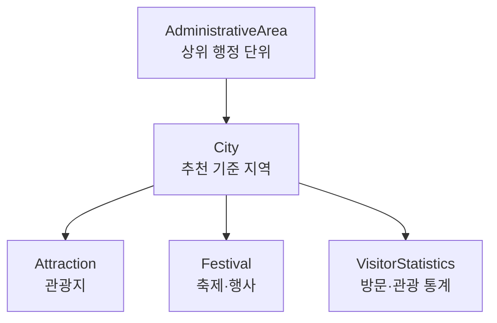

# 2. 데이터 수집 계획 명세

## 2.1 프로젝트 주제

로브(Lovv)는 대도시 편중 현상(오버투어리즘)을 완화하고 여행자에게 덜 알려진 한국(시/군/구 단위) 및 일본(시/정/촌/구 단위)의 매력적인 지역과 그에 최적화된 여행 일정 및 문화 콘텐츠를 추천하는 서비스이다.

본 계획서는 한국과 일본의 지역 기반 추천을 위해 도시, 관광지, 축제 데이터를 공통 구조로 취득하고 국가별 출처 차이를 매핑하는 방안을 다룬다.

## 2.2 데이터 모델

추천 DB는 한국·일본 상세 취득 문서의 목표 모델을 합쳐 다음 관계를 기준으로 구축한다.

| 관계 | 설명 |
| --- | --- |
| `AdministrativeArea 1:N City` | 한국의 도, 일본의 도도부현 같은 상위 행정 단위는 여러 City를 가진다. |
| `City 1:N Attraction` | 하나의 도시는 여러 관광지를 가진다. |
| `City 1:N Festival` | 하나의 도시는 여러 축제·행사를 가진다. |
| `City 1:N VisitorStatistics` | 하나의 도시는 월별 또는 지역별 방문·관광 통계 보조 지표를 가진다. |

### 2.2.1 국가별 데이터 모델 적용

이 공통 관계는 한국과 일본 수집 결과에 동일하게 적용한다. 국가별 차이는 상위 행정 단위의 명칭, `City` 식별자 체계, 관광지·축제의 1차 출처, 방문·관광 통계의 집계 단위만 다르게 매핑한다.

| 국가 | 상위 행정 단위 | City 적용 | Attraction·Festival 적용 | VisitorStatistics 적용 |
| --- | --- | --- | --- | --- |
| 한국 | `Prefecture`로 강원 `KR-42`, 경북 `KR-47`을 관리한다. | 강원·경북 40개 시·군·구를 `KR-{도_코드}-{CITY_EN}` 형식의 `city_id`로 관리한다. | `contentid` 기반 `KR-{도_코드}-{CITY_EN}-ATT-{contentid}` / `KR-{도_코드}-{CITY_EN}-FES-{contentid}` 식별자를 만들고 TourAPI 4.0(KorService2) 기준 관광지 3,709건과 축제 106건을 City에 연결한다. | DataLabService `/stayAnalysisVisitorList`를 월 단위로 조회해 40개 도시 × 12개월 방문객 통계를 City 보조 지표로 연결한다. |
| 일본 | 도도부현 간략 정보와 산하 도시 목록을 먼저 확보한다. | 관동 지역 도도부현 산하 시·정·촌·구를 City 후보로 수집하고 `JP-TOKYO-TAITO`처럼 국가·도도부현·도시 단위가 드러나는 `city_id`로 관리한다. | JNTO/JTA 및 지자체 공식 관광 데이터를 기반으로 관광지·축제를 City에 연결한다. | JNTO Statistics, RESAS, e-Stat/Statistical LOD의 제공 가능한 월별·연도별·지역별 집계 단위를 City 보조 지표로 연결하고 매핑 불확실성은 `needs_review`로 둔다. |

## 2.3 City 수집 항목

City는 추천의 기준 지역이다. 한국은 도의 간략 정보와 산하 시·군·구 목록을 먼저 취득하고, 일본은 도도부현의 간략 정보와 산하 시·정·촌·구 목록을 먼저 취득한다. 실제 도시 상세 정보 크롤링은 이 산하 도시 목록에 포함된 City만 대상으로 한다.

한국 실제 수집 기준에서는 강원과 경북의 40개 도시를 `KR-{도_코드}-{CITY_EN}` 형식의 `city_id`로 관리한다. 예시는 `KR-42-GANGNEUNG`, `KR-47-ANDONG`이며, 광역 단위는 `prefecture_id`로 연결한다. Wikipedia 기후 표는 `climate_table`로 보존하고 자동 취득 실패 시 `needs_review`로 관리한다.

| 필드 | 한국 주요 출처 | 일본 주요 출처 | 수집 상태 |
| --- | --- | --- | --- |
| `city_id` | 내부 생성 | 내부 생성 | 전부 수집 |
| `city_name_ko` | 도 산하 도시 목록, Wikipedia, 행정구역 데이터 | 도도부현 산하 도시 목록, Wikipedia, 수동 정규화 | 전부 수집 |
| `city_name_local` | 한국어 명칭 | 일본어 원문 명칭 | 전부 수집 |
| `province_or_prefecture` | 도 간략 정보, 행정구역 데이터 | 도도부현 간략 정보, e-Stat, Statistical LOD | 전부 수집 |
| `location` | Wikipedia, TourAPI, 행정구역 데이터 | Wikipedia, Wikidata | 전부 수집 |
| `latitude` | Wikipedia, TourAPI, Wikidata | Wikipedia, Wikidata | 전부 수집 |
| `longitude` | Wikipedia, TourAPI, Wikidata | Wikipedia, Wikidata | 전부 수집 |
| `description` | Wikipedia 요약, 대한민국구석구석 요약 | Wikipedia 요약 | 전부 수집 |
| `climate` | Wikipedia 취득 후 기상청 API허브·기후통계와 비교 | Wikipedia 취득 후 일본기상청(JMA) 자료와 비교 | 전부 수집 |
| `site_url` | 지자체 문화관광 홈페이지, 대한민국구석구석 | Wikipedia 외부 링크, 공식 관광 사이트 | 전부 수집 |

## 2.4 Attraction 수집 항목

Attraction은 일정 카드와 추천 결과 상세 화면의 핵심 소재로 사용한다. 한국은 TourAPI 4.0(KorService2) 기준 강원·경북 관광지 3,709건을 실제 수집 및 명세 확인 범위로 둔다.

| 필드 | 한국 주요 출처 | 일본 주요 출처 | 수집 상태 |
| --- | --- | --- | --- |
| `attraction_id` | 내부 생성 | 내부 생성 | 전부 수집 |
| `city_id` | City 매핑 | City 매핑 | 전부 수집 |
| `source_content_id` | 한국관광공사 TourAPI `contentid` | JNTO/JTA 원본 ID 또는 URL | 전부 수집 |
| `name` | TourAPI, 대한민국구석구석 | JNTO, JTA | 전부 수집 |
| `address` | TourAPI, 공식 사이트 | JNTO, JTA, 공식 사이트 | 전부 수집 |
| `description` | TourAPI 공통정보·소개정보 기반 요약 | JNTO/JTA 기반 요약 | 전부 수집 |
| `site_url` | TourAPI, 공식 사이트 | JNTO, JTA, 공식 사이트 | 전부 수집 |
| `opening_hours` | TourAPI 소개정보, 공식 사이트, 검수 | 공식 사이트, 검수 | 전부 수집 |
| `opening_period` | TourAPI 소개정보, 공식 사이트, 검수 | 공식 사이트, 검수 | 전부 수집 |
| `latitude` | TourAPI 위치정보 | JNTO, Wikidata, 지도 보조 | 전부 수집 |
| `longitude` | TourAPI 위치정보 | JNTO, Wikidata, 지도 보조 | 전부 수집 |
| `admission_fee` | TourAPI 소개정보, 공식 사이트, 검수 | 공식 사이트, 검수 | 전부 수집 |
| `photo_url` | TourAPI 이미지정보, 공식 사이트, 검수 | JNTO, 공식 사이트, 검수 | 전부 수집 |

## 2.5 Festival 수집 항목

Festival은 월별 추천과 계절성 추천의 주요 근거로 사용한다. 한국은 TourAPI 4.0(KorService2) 기준 강원·경북 축제 106건을 실제 수집 및 명세 확인 범위로 둔다.

| 필드 | 한국 주요 출처 | 일본 주요 출처 | 수집 상태 |
| --- | --- | --- | --- |
| `festival_id` | 내부 생성 | 내부 생성 | 전부 수집 |
| `city_id` | City 매핑 | City 매핑 | 전부 수집 |
| `source_content_id` | TourAPI 행사 콘텐츠 ID | JNTO/JTA 원본 ID 또는 URL | 전부 수집 |
| `name` | TourAPI 행사정보, 대한민국구석구석 | JNTO, JTA | 전부 수집 |
| `address` | TourAPI, 공식 사이트 | JNTO, JTA, 공식 사이트 | 전부 수집 |
| `period` | TourAPI 행사 시작일·종료일, 공식 사이트 | JNTO, JTA, 공식 사이트 | 전부 수집 |
| `description` | TourAPI 공통정보·소개정보 기반 요약 | JNTO/JTA 기반 요약 | 전부 수집 |
| `site_url` | TourAPI, 공식 사이트 | JNTO, JTA, 공식 사이트 | 전부 수집 |
| `photo_url` | TourAPI 이미지정보, 공식 사이트, 검수 | JNTO, 공식 사이트, 검수 | 전부 수집 |

## 2.6 데이터 출처

### 2.6.1 한국 데이터 출처

| 출처 | 취득 데이터 | 적용 방식 |
| --- | --- | --- |
| 한국관광공사 TourAPI 4.0(KorService2) | 관광지, 축제, 이미지, 위치, 소개정보, 행사정보 | Attraction·Festival 자동 수집의 1차 소스 |
| 대한민국구석구석 | 관광지·축제 상세 링크, 공식 설명, 지역 관광 정보 | TourAPI 보강 및 공식 링크 확인 |
| 지자체 문화관광 홈페이지 | 운영시간, 입장료, 최신 축제 일정, 공식 공지 | 누락·최신성 확인 |
| Wikipedia API | 도 간략 정보, 도 산하 도시 목록, 원문 링크 | 한국 City 크롤링 대상 목록 확보 |
| Wikipedia 크롤링 / Wikidata | 도 산하 도시의 설명, 위치, 좌표, 외부 링크 | 산하 City 상세 정보 취득 및 보강 |
| 기상청 API허브 / 기후통계 | 월별 기후, 평균 기온, 강수량, 계절 메모 | Wikipedia에서 취득한 한국 City `climate` 비교 검증 및 월별 추천 근거 |
| 한국관광공사 관광 빅데이터 API(DataLabService) | 월별 현지인·외지인·외국인 방문객 통계 | City 보조 지표와 월별 추천 근거 |
| 행정구역 데이터 | 시·군·구 코드와 행정구역 정규화 | City ID와 지역 매핑 |

### 2.6.2 일본 데이터 출처

| 출처 | 취득 데이터 | 적용 방식 |
| --- | --- | --- |
| Wikipedia API / 크롤링 / Wikidata | 도도부현 간략 정보, 산하 도시 목록, 도시 설명·위치·좌표 | 일본 City 대상 목록 확보 및 상세 정보 취득 |
| JNTO 관광 데이터 | 관광지, 축제, 설명, 주소, 링크 | Attraction·Festival 자동 수집의 1차 소스 |
| JTA 관광 DB | 관광지 상세 설명, 문화 정보, 지역 특산품, 축제 설명 | JNTO 데이터 설명 보강 |
| e-Stat / Statistical LOD | 행정구역 코드, 지역 통계, 시정촌 메타데이터 | City 정규화와 통계 보강 |
| 국토교통성 국토수치정보 | 좌표, 행정구역, 철도역·교통 데이터 | 위치·접근성 데이터 취득 |
| 일본기상청(JMA) | 월별 기후·관측 데이터 | Wikipedia에서 취득한 일본 City `climate` 비교 검증 및 월별 추천 근거 |
| JNTO Statistics / RESAS | 방문객 수, 관광 통계, 지역별 지표 | City 보조 지표 |
| JNTO 訪日外客統計(국적/월별) | 국적별·월별 방일객 수(2003~) | `VisitorStatistics` 인바운드 시즌성·시장규모 보조 지표(전국·국적 단위) |
| 일본관광청 旅行・観光消費動向調査 | 지방블록별 일본인 국내 여행자수·소비액·단가·평균숙박 | `VisitorStatistics` 권역 가중치·시즌 보정·혼잡도 거시 근거(지방블록·일본인 국내 한정) |
| 일본관광청 宿泊旅行統計調査(숙박여행통계) | 도도부현별·광역시정촌(130구분)별 연박수·외국인 연박수·외국인 비중 | `VisitorStatistics` 혼잡도·인바운드 비중의 City 근접 지표(130구분이 최소 단위) |
| 일본관광청 인바운드 소비동향조사 | 국적별(한국 등) 도도부현 방문율·1인1회 소비단가·평균박수·품목 | 한국 인바운드 수요·고부가 지역 식별, 한국 타깃 소도시 후보 근거 |
| 도도부현·시정촌 공식 관광 사이트 | 운영시간, 입장료, 최신 축제 일정 | 누락·최신성 확인 |

> `VisitorStatistics` 그래뉼래리티 주의: 위 JNTO 訪日外客統計은 전국·국적 단위, 旅行・観光消費動向調査는 지방블록(10개 광역권)·일본인 국내분 단위로 집계된 표본 추계치다. 둘 다 최소 단위가 City(시/정/촌)보다 상위라 City 엔티티와 직접 조인할 수 없다. 따라서 City별 방문량·혼잡도의 1차 소스가 아니라, (1) 권역 가중치·월별 시즌 보정 계수, (2) 오버투어리즘·시장규모 거시 근거, (3) 도도부현·시정촌 통계로 채운 City 값의 권역 합계 검증(calibration)에 사용한다. 인바운드(한국인 등)는 JNTO, 일본인 국내 시즌성은 旅行・観光消費動向調査로 구분해 적재한다. 다만 宿泊旅行統計調査의 광역시정촌(130구분)은 위 소스 중 City에 가장 근접한 단위로, 외국인 연박·외국인 비중을 City 매핑·혼잡도 보정에 활용할 수 있다(개별 시정촌이 아닌 130구분 집계라는 점은 유의).
>
> 출처: [JNTO 訪日外客統計(국적/월별)](https://www.jnto.go.jp/statistics/data/visitors-statistics/) · [일본관광청 旅行・観光消費動向調査](https://www.mlit.go.jp/kankocho/tokei_hakusyo/shohidoko.html) · [宿泊旅行統計調査](https://www.mlit.go.jp/kankocho/tokei_hakusyo/shukuhakutokei.html) · [인바운드 소비동향조사](https://www.mlit.go.jp/kankocho/tokei_hakusyo/gaikokujinshohidoko.html). 확인일 2026-06-22.
