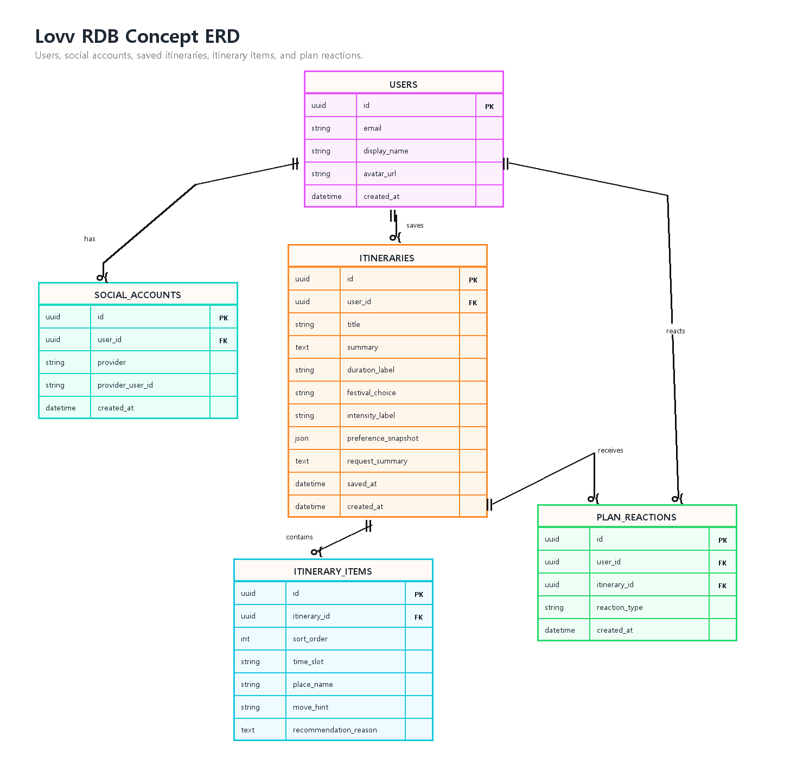
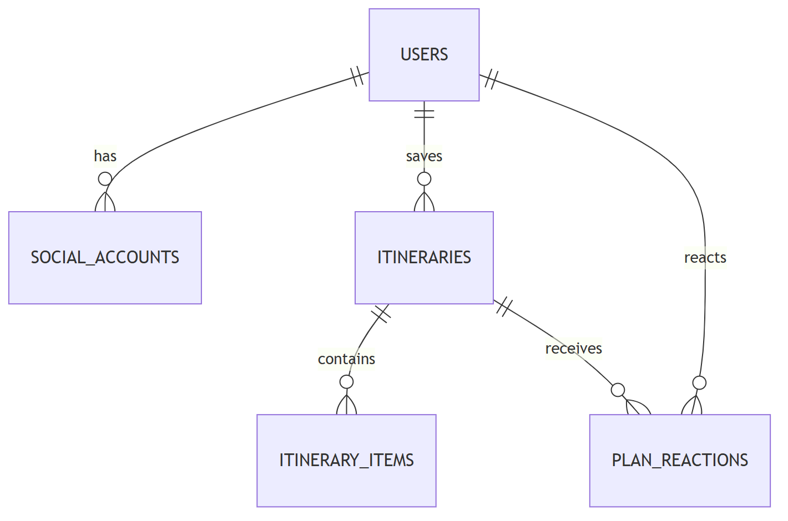

# 로브 (Lovv) 데이터베이스 설계 명세서

> 문서 버전: v0.7
> 문서 상태: 설계 진행중 (Designing)
> 기준 문서: 요구사항 명세서 v1.7, 데이터 수집 계획서 v0.7, Agent 명세서 v0.6, 기술 명세서 v0.4, API 명세서 v0.3
> 보조 문서: 데이터베이스 보존 기간·Neptune 비용 업데이트 초안, Neptune 대체 설계 명세서

> **[PRD 반영 v0.1 — 대화형 빌더 메모리]** 에이전트 상태/메모리를 2계층으로 둔다:
> **단기 = AgentCore Memory**(빌더 상태 `itinerary_builder` + 세션 + checkpoint, `event_expiry` 자동정리), **장기 = 커스텀 DynamoDB**(① 파생 개인화 프로필: 핫, TTL 없음 ② raw 이벤트: TTL→Streams→Lambda→S3 콜드).
> 매핑 테이블·raw PII는 어느 저장소에도 넣지 않고 별도 KMS·IAM, actorId=가명. 상세: `../98_prd/interactive_builder_prd.md`, 보존/TTL 라인: 보조 문서 `supplemental/database_design_retention_neptune_update.md` §0.
# 1. 문서 개요

## 1.1 목적

본 문서는 로브 서비스의 핵심 데이터 모델, 테이블 후보, 관계, 인덱스, 보존 정책을 정의한다.
PoC에서는 일부 데이터를 정적 파일과 로컬 스토리지로 대체할 수 있으나, Production 전환 시 본 문서를 기준으로 데이터베이스를 설계한다.

## 1.2 설계 기준

| 항목 | 결정 | 비고 |
| --- | --- | --- |
| 기본 모델 | 관계형 데이터베이스 우선 | 서비스 핵심 데이터는 정규화된 관계형 모델을 기준으로 설계한다. |
| RDBMS | MySQL 8 LTS | 사용자, 소셜 계정, 저장 일정, 일정 항목, 일정 반응 등 핵심 트랜잭션 데이터를 저장한다. |
| NoSQL | AWS DynamoDB | AgentCore/SAM 실행 상태, 비동기 작업, 사용자 이벤트 로그, API 로그처럼 TTL이 필요한 비정형 데이터를 저장한다. |
| RAG Vector Index | S3 vector 기능 활용 | RAG 검색용 chunk, embedding, metadata filter를 S3 vector 기능 기반 검색 인덱스로 관리한다. 별도 벡터 DB 제품 도입은 기본 전제가 아니다. |
| 관계 탐색 보조 | Lambda 기반 관계 탐색 (Neptune 직접 도입 보류) | 목적지·축제·테마·인접 도시·이동 관계를 DynamoDB 인접 리스트, 사전계산 후보, Lambda 인메모리 그래프로 탐색한다. Neptune은 고도화 승격 옵션으로만 둔다. |
| 대화 전문 | 저장하지 않음 | 요구사항 `NFR-013`에 따라 사용자 대화 로그 전문은 서버나 외부 저장소에 장기 저장하지 않는다. |
| 보조 저장소 | DynamoDB, S3 vector index, Lambda 관계 탐색 | 로그성 데이터, 의미 검색 인덱스, 관계 탐색 보조 기능을 MySQL 원장과 분리해 관리한다. |

## 1.3 저장소 책임

| 저장소 | 책임 | 주요 데이터 |
| --- | --- | --- |
| MySQL 8 LTS | 서비스 원장, 트랜잭션, 조회 기준 데이터 | 사용자 계정, 소셜 계정, 저장 일정, 일정 항목, 일정 반응 |
| DynamoDB | 비정형 실행 상태, 이벤트 로그, TTL 로그, 수집 정규화 결과 | Agent run, async job, 사용자 행동 이벤트, API 로그, 운영 trace, City/Attraction/Festival/VisitorStatistics 정규화 문서 |
| S3 vector index | 의미 검색 인덱스 | 목적지·축제·관광지 문서 chunk, embedding, source reference, metadata filter |
| Lambda 관계 탐색 | 그래프DB 대체 기능 (PoC/Prod 1차) | 도시-테마, 도시-축제, 인접 도시, 일정 항목-장소 후보 관계를 DynamoDB 인접 리스트와 Lambda 인메모리 그래프로 탐색. Neptune은 고도화 단계 승격 옵션 |
| Object Storage | 원본 수집 파일과 대용량 정적 산출물 | S3 Raw 수집 원본, 전처리 결과, 이미지/첨부 파일 |
# 2. 개념 설계

## 2.1 핵심 도메인

| 도메인 | 설명 | 대표 엔티티 |
| --- | --- | --- |
| 사용자·계정 | 일반 여행 사용자의 계정과 소셜 로그인 연결 | User, SocialAccount |
| 저장 일정 | 사용자가 저장한 여행 일정과 저장 당시의 조건 스냅샷 | Itinerary |
| 일정 항목 | 일정에 포함된 장소, 방문 순서, 이동 힌트, 추천 이유 | ItineraryItem |
| 일정 반응 | 사용자가 일정에 남긴 좋아요/싫어요 등 가벼운 반응 | PlanReaction |
| 수집·검색 보조 | RDB 원장이 아닌 DynamoDB/S3 vector/Lambda 관계 탐색 기반 검색·로그 보조 데이터 | ContentDocument, S3VectorIndex, RelationGraphSnapshot |
| Agent·로그 | Agent 실행, 비동기 작업, API 호출, 사용자 이벤트, 운영 trace | AgentRun, AsyncJob, EventLog |
| RAG 검색 | 검색 문서, chunk, embedding, metadata filter | RagDocument, RagChunk, S3VectorIndex |

## 2.2 사용자 데이터 개념 모델

사용자 데이터는 최종 상태를 보존해야 하는 원장 데이터와, 분석·디버깅에 필요한 일시 이벤트 데이터로 나눈다.

| 구분 | 저장소 | 저장 대상 | 저장하지 않는 대상 |
| --- | --- | --- | --- |
| 사용자 원장 | MySQL | 계정, 소셜 계정, 저장 일정, 일정 항목, 일정 반응 | 대화 전문, 민감 자유 입력 원문 |
| 사용자 이벤트 | DynamoDB | 로그인/로그아웃 이벤트, 추천 실행 이벤트, 일정 반응 클릭 이벤트, 화면 이벤트, 오류 로그 | 사용자 상태의 최종 원장, 삭제 권한이 필요한 본문 데이터 |
| 추천 검색 보조 | S3 vector index | 사용자 조건과 매칭할 콘텐츠 chunk 및 embedding | 사용자 개인정보, 대화 전문, 비공개 운영 메모 |
| 추천 관계 탐색 | Lambda 관계 탐색 보조 | 도시·축제·테마·인접 도시·이동 관계를 요청 시 또는 배치 사전계산으로 탐색 | 사용자 개인정보, 대화 전문, 최종 원장 데이터 |

## 2.3 개념 ERD

아래 ERD는 사용자 계정, 소셜 계정, 저장 일정, 일정 항목, 일정 반응의 관계를 나타낸다.

# 3. 논리 설계

## 3.1 MySQL 논리 ERD

MySQL은 서비스 화면과 API가 신뢰해야 하는 최종 상태를 저장한다.
사용자가 조회·수정·삭제할 수 있어야 하는 데이터는 MySQL에 원장으로 둔다.

| 영역 | 테이블 | 책임 |
| --- | --- | --- |
| 사용자 | `users` | 서비스 사용자 프로필의 기준 원장 |
| 소셜 계정 | `social_accounts` | 소셜 로그인 제공자 계정과 서비스 사용자 연결 |
| 저장 일정 | `itineraries` | 사용자가 저장한 최종 여행 일정과 요청·선호 스냅샷 |
| 일정 항목 | `itinerary_items` | 일정에 포함된 세부 장소와 방문 순서 |
| 일정 반응 | `plan_reactions` | 일정에 대한 사용자 반응 |

## 3.2 RDB 사용자 설계

사용자 RDB 설계는 첨부 ERD 기준의 계정 기반 저장을 담당한다.
PoC에서는 로컬 스토리지로 대체할 수 있으나, Production에서는 아래 5개 테이블을 기준으로 마이페이지의 저장 일정과 반응 API를 구현한다.

### 3.2.1 `users`

| 컬럼 | 타입 | 제약 | 설명 |
| --- | --- | --- | --- |
| `id` | char(36) | PK | 사용자 ID |
| `email` | varchar(255) | nullable | 소셜 제공자가 전달한 이메일 |
| `display_name` | varchar(80) | not null | 서비스에 표시할 닉네임 |
| `avatar_url` | varchar(500) | nullable | 프로필 이미지 URL |
| `created_at` | datetime | not null | 생성 시각 |

### 3.2.2 `social_accounts`

| 컬럼 | 타입 | 제약 | 설명 |
| --- | --- | --- | --- |
| `id` | char(36) | PK | 소셜 계정 연결 ID |
| `user_id` | char(36) | FK | `users.id` |
| `provider` | varchar(30) | not null | 로그인 제공자. 예: `google`, `kakao` |
| `provider_user_id` | varchar(255) | not null | 소셜 제공자 사용자 ID |
| `created_at` | datetime | not null | 연결 시각 |

Unique: (`provider`, `provider_user_id`)

### 3.2.3 `itineraries`

| 컬럼 | 타입 | 제약 | 설명 |
| --- | --- | --- | --- |
| `id` | char(36) | PK | 일정 ID |
| `user_id` | char(36) | FK | `users.id` |
| `title` | varchar(160) | not null | 일정 제목 |
| `summary` | text | nullable | 일정 요약 |
| `duration_label` | varchar(40) | not null | 여행 기간. 예: `1박 2일`, `2박 3일` |
| `festival_choice` | varchar(80) | nullable | 축제 포함 여부 또는 축제 선호 |
| `intensity_label` | varchar(40) | nullable | 일정 강도. 예: `여유`, `보통`, `빡빡` |
| `preference_snapshot` | json | nullable | 저장 당시 취향·조건 스냅샷 |
| `request_summary` | text | nullable | 채팅에서 정리된 최종 요청 요약 |
| `saved_at` | datetime | not null | 사용자가 저장한 시각 |
| `created_at` | datetime | not null | 레코드 생성 시각 |

Index: (`user_id`, `saved_at` desc)

### 3.2.4 `itinerary_items`

| 컬럼 | 타입 | 제약 | 설명 |
| --- | --- | --- | --- |
| `id` | char(36) | PK | 세부 일정 ID |
| `itinerary_id` | char(36) | FK | `itineraries.id` |
| `sort_order` | int | not null | 일정 내 표시 순서 |
| `time_slot` | varchar(40) | nullable | 시간대. 예: `오전`, `오후`, `저녁` |
| `place_name` | varchar(160) | not null | 장소명 |
| `move_hint` | varchar(255) | nullable | 이동 힌트 |
| `recommendation_reason` | text | nullable | 추천 이유 |

Unique: (`itinerary_id`, `sort_order`)

### 3.2.5 `plan_reactions`

| 컬럼 | 타입 | 제약 | 설명 |
| --- | --- | --- | --- |
| `id` | char(36) | PK | 반응 ID |
| `user_id` | char(36) | FK | `users.id` |
| `itinerary_id` | char(36) | FK | `itineraries.id` |
| `reaction_type` | varchar(30) | not null | `like`, `dislike` 등 일정 반응 |
| `created_at` | datetime | not null | 생성 시각 |

Index: (`user_id`, `created_at`), (`itinerary_id`, `created_at`)

## 3.3 DynamoDB NoSQL 사용자 설계

DynamoDB는 사용자 원장을 대체하지 않는다.
사용자 상태, 저장 일정, 일정 항목, 일정 반응의 최종값은 MySQL에 두고, DynamoDB에는 실행 추적과 TTL 이벤트를 둔다.
또한 데이터 수집 계획의 S3 Raw Bucket -> Lambda 전처리 결과는 City, Attraction, Festival, VisitorStatistics 단위의 정규화 문서로 DynamoDB에 적재한다. 이 정규화 문서는 검색·추천 후보 생성의 빠른 조회용이며, 사용자가 저장한 일정은 MySQL의 `itineraries.preference_snapshot`과 `itinerary_items`에 스냅샷으로 남긴다.

### NoSQL 사용자 이벤트 저장 원칙

| 원칙 | 내용 |
| --- | --- |
| 원장 금지 | 사용자 프로필, 저장 일정, 일정 항목, 일정 반응의 최종값은 MySQL을 기준으로 한다. |
| 해시 저장 | `user_id`, IP, user agent는 원문 대신 해시 또는 마스킹 값으로 저장한다. |
| 대화 전문 금지 | 사용자의 자연어 대화 전문, 민감 자유 입력, 비공개 운영 메모는 저장하지 않는다. |
| TTL 필수 | 이벤트와 trace에는 `expires_at`을 두고 보존 기간 이후 자동 삭제한다. |
| 추적 연결 | `recommendation_request_id`, `agent_run_id`, `request_id`로 MySQL 원장과 장애 분석 로그를 연결한다. |
| 검증 캐시 | 축제 검증 캐시는 `festival_id + travelYear` 단위로 저장하고 `confirmed` 30일, `tentative` 7일, `unknown/outdated` 1일 TTL을 권장한다. |
| 수집 정규화 | S3 Raw 원본은 Object Storage에 보존하고, Lambda 전처리 결과만 DynamoDB 정규화 문서에 저장한다. |

아래 테이블은 DynamoDB에 둘 항목을 운영 추적, 검증 캐시, 비동기 작업, API 로그, 수집 정규화 문서로 나눈 것이다. TTL이 필요한 로그성 테이블은 보존 기간 이후 자동 삭제를 전제로 하고, 수집 정규화 테이블은 S3 Raw 원본을 기준으로 재생성 가능한 조회 모델로 관리한다.

| 테이블 | Partition Key | Sort Key | 주요 속성 | TTL |
| --- | --- | --- | --- | --- |
| `lovv_user_event_logs` | `pk` = `USER#{user_id_hash}` 또는 `ANON#{anonymous_session_id}` | `sk` = `EVENT#{created_at}#{event_id}` | `event_type`, `request_id`, `session_id`, `screen`, `action`, `target_id`, `metadata_summary`, `ip_hash` | `expires_at` |
| `lovv_agent_runs` | `pk` = `RUN#{agent_run_id}` | `sk` = `STATE#{created_at}` | `user_id_hash`, `session_id`, `recommendation_request_id`, `status`, `node_name`, `tool_name`, `validation_retry_count`, `error_code`, `payload_summary` | `expires_at` |
| `lovv_festival_verify_cache` | `pk` = `FESTIVAL#{festival_id}` | `sk` = `YEAR#{travel_year}` | `date_status`, `start_date`, `end_date`, `source_url`, `source_type`, `verified_at`, `confidence`, `target_region`, `travel_month` | `expires_at` |
| `lovv_async_jobs` | `pk` = `JOB#{job_id}` | `sk` = `STATUS#{updated_at}` | `job_type`, `status`, `requested_by_user_hash`, `progress`, `result_ref`, `error_code` | `expires_at` |
| `lovv_api_logs` | `pk` = `API#{yyyyMMdd}#{endpoint_group}` | `sk` = `created_at#{request_id}` | `method`, `path`, `status`, `latency_ms`, `user_id_hash`, `error_code` | `expires_at` |
| `lovv_content_documents` | `pk` = `CONTENT#{country}#{entity_type}` | `sk` = `ENTITY#{entity_id}` | `city_id`, `source_type`, `source_url`, `normalized_payload`, `quality_status`, `raw_s3_uri`, `updated_at` | 없음 |
| `lovv_visitor_statistics` | `pk` = `CITY#{city_id}` | `sk` = `STAT#{period}#{source_type}` | `country`, `period`, `visitor_type`, `value`, `unit`, `source_url`, `collected_at`, `quality_status` | 없음 |
| `lovv_anonymous_travel_segment_stats` | `pk` = 세그먼트 식별자 | `sk` = 기간/집계 기준 | 익명 연령·성별·여행 선호 segment별 통계. 개인정보 원장이 아니라 추천 fallback용 집계 조회 모델 | 없음 |

## 3.4 S3 vector index 논리 모델

S3 vector index는 수집 원천과 일정 저장 스냅샷을 검색용으로 복제한 인덱스다.
S3 vector index의 데이터는 원본이 아니며, 장애 복구나 재색인은 MySQL 일정 스냅샷, DynamoDB 정규화 문서, S3 Raw 원본을 기준으로 수행한다.
별도 벡터 DB 제품 도입은 현재 설계의 기본 범위가 아니며, 그래프DB 직접 도입 대신 관계 탐색은 Lambda 기반 보조 기능으로 구현한다.

| 인덱스 대상 | 원본 | S3 vector metadata |
| --- | --- | --- |
| 목적지 | DynamoDB 정규화 문서, S3 Raw 원본 | `destination_id`, `country`, `region`, `themes`, `recommended_months` |
| 축제 | DynamoDB 정규화 문서, S3 Raw 원본 | `festival_id`, `destination_id`, `start_date`, `end_date`, `season_tags` |
| 방문·관광 통계 | `lovv_visitor_statistics`, S3 Raw 원본 | `city_id`, `period`, `visitor_type`, `trend_summary`, `source_type` |
| 관광지·체험 | DynamoDB 정규화 문서, S3 Raw 원본 | `content_id`, `destination_id`, `content_type`, `theme_tags` |
| 출처 문서 | object storage | `source_id`, `source_url`, `collected_at`, `license_type` |

Agent 추천 검색은 S3 vector metadata에 `city_id`, `country`, `latitude`, `longitude`, `theme_tags`, `content_type`, `recommended_months`를 포함해야 한다.
`active_required_themes`, 거리 기반 1차 필터, 콘텐츠 타입 균형, 임베딩 유사도 재랭킹은 이 metadata와 MySQL 일정 스냅샷 필드를 함께 사용한다.

## 3.5 Lambda 관계 탐색 논리 모델

Lambda 관계 탐색은 S3 vector index의 의미 검색 결과를 도시·축제·테마·장소 관계로 확장·검증하는 보조 기능이다.
관계 데이터는 원본이 아니며, DynamoDB 정규화 문서, S3 Raw 원본, 운영 검증 결과를 기준으로 재생성할 수 있어야 한다.

> 비용 주의: Neptune은 상시 가동 비용이 높아 PoC/Production 1차에서는 직접 도입하지 않는다.
> 동일 그래프 용도는 DynamoDB 인접 리스트, 사전계산 후보 테이블, Lambda 인메모리 그래프로 구현한다.
> Neptune은 3-hop 이상 임의 경로 탐색, 대규모 실시간 그래프 쓰기, 복잡한 그래프 알고리즘이 실제 병목이 될 때의 고도화 승격 옵션이다.

| 그래프 요소 | 라벨/관계 | 주요 속성 | 용도 |
| --- | --- | --- | --- |
| 목적지 노드 | `City` | `city_id`, `country`, `region`, `latitude`, `longitude` | 추천 후보의 중심 노드 |
| 축제 노드 | `Festival` | `festival_id`, `travel_year`, `date_status`, `start_date`, `end_date` | 축제 포함 추천과 날짜 검증 연결 |
| 테마 노드 | `Theme` | `theme_id`, `theme_name`, `theme_group` | 필수·선호 테마 충족 여부 탐색 |
| 장소 노드 | `Place` | `content_id`, `content_type`, `source_type` | 일정 항목 후보 확장 |
| 관계 | `HAS_THEME`, `HOSTS_FESTIVAL`, `NEAR_CITY`, `HAS_PLACE`, `SEASONAL_FIT` | `weight`, `confidence`, `source_id`, `updated_at` | 다단계 후보 확장과 그래프 기반 재랭킹 |

Lambda 관계 탐색 입력에는 사용자 ID 원문, 대화 전문, 비공개 운영 메모를 포함하지 않는다.
사용자 일정 저장 결과는 MySQL에 남기고, 관계 탐색에는 추천 후보 생성을 위한 공용 콘텐츠 관계만 사용한다.

## 3.6 API 식별자 매핑

API 명세의 camelCase 식별자는 DB 내부에서는 snake_case 컬럼, DynamoDB 속성, Lambda 관계 탐색 노드 ID로 매핑한다.

| API 필드 | MySQL 기준 | DynamoDB/S3 vector/Lambda 관계 탐색 기준 | 비고 |
| --- | --- | --- | --- |
| `userId` | `users.id` | 해시 처리된 `user_id_hash` | 사용자 원장과 이벤트 로그 연결 |
| `itineraryId` | `itineraries.id`, `itinerary_items.itinerary_id`, `plan_reactions.itinerary_id` | 이벤트 로그의 `target_id` | 저장 일정 조회·삭제 기준 |
| `reactionType` | `plan_reactions.reaction_type` | 클릭 이벤트의 `action` 또는 `reaction_type` | 일정 반응 원장은 MySQL 기준 |
| `destinationId` | 없음 | `city_id`, `destination_id` metadata, Lambda 관계 탐색 `City.city_id` | 추천 후보와 지도 마커는 검색·수집 보조 저장소 기준 |
| `festivalId` | 없음 | `lovv_festival_verify_cache.pk`, S3 vector metadata, Lambda 관계 탐색 `Festival.festival_id` | 축제 날짜 검증 캐시와 추천 응답 연결 |
# 4. 물리 설계

## 4.1 MySQL 물리 설계 기준

| 기준 | 결정 |
| --- | --- |
| ID | `CHAR(36)` UUID 문자열을 기본으로 한다. |
| 시간 | `created_at`, `saved_at`을 기본 시간 컬럼으로 둔다. |
| 삭제 | 사용자 삭제 가능 데이터는 PoC 단순 모델에서는 hard delete를 우선하고, Production 확장 시 soft delete 컬럼 추가를 검토한다. |
| JSON | 추천 조건 스냅샷, 점수 상세, 일정 경로처럼 유연한 구조는 MySQL `JSON`을 사용한다. |
| 외래키 | 사용자, 소셜 계정, 일정, 일정 항목, 일정 반응 사이에는 FK를 둔다. 대량 로그는 FK 대신 참조 ID 문자열만 둔다. |

## 4.2 주요 인덱스

| 조회 패턴 | 인덱스 후보 |
| --- | --- |
| 현재 사용자 조회 | `users(email)`, `social_accounts(provider, provider_user_id)` |
| 사용자 저장 일정 | `itineraries(user_id, saved_at desc)` |
| 일정 항목 조회 | `itinerary_items(itinerary_id, sort_order)` |
| 사용자 일정 반응 이력 | `plan_reactions(user_id, created_at desc)` |
| 일정별 반응 집계 | `plan_reactions(itinerary_id, reaction_type)` |

## 4.3 DynamoDB 물리 설계 기준

| 기준 | 결정 |
| --- | --- |
| 파티션 분산 | 일자, 이벤트 타입, 해시 사용자 ID를 조합해 hot partition을 피한다. |
| 조회 단위 | 사용자 이벤트 타임라인, Agent run 단건 trace, API 일자별 장애 분석을 기준으로 PK/SK를 설계한다. |
| TTL | 로그성 테이블은 `expires_at`을 필수 속성으로 둔다. 권고·잠정 보존 기간은 5.1절을 따른다(법무·보안 검토로 확정). |
| GSI | `request_id`, `agent_run_id`, `recommendation_request_id`, `event_type` 조회가 필요하면 GSI를 추가한다. |
| Payload | 원문 대신 `payload_summary`, `error_code`, `result_ref`처럼 최소 요약만 저장한다. |

## 4.4 DynamoDB GSI 후보

| GSI | Partition Key | Sort Key | 용도 |
| --- | --- | --- | --- |
| `GSI1RequestLookup` | `request_id` | `created_at` | API 요청 단위 trace 연결 |
| `GSI2AgentRunLookup` | `agent_run_id` | `created_at` | Agent 실행 전체 단계 조회 |
| `GSI3EventTypeDaily` | `event_type#yyyyMMdd` | `created_at` | 이벤트 타입별 일자 분석 |
| `GSI4RecommendationLookup` | `recommendation_request_id` | `created_at` | 추천 요청과 로그 연결 |

## 4.5 S3 vector index 물리 설계 기준

| 기준 | 결정 |
| --- | --- |
| Index layout | 국가 또는 콘텐츠 유형별 prefix 분리를 검토하되 PoC는 단일 S3 vector index로 시작한다. |
| Vector ID | `source_type#source_id#chunk_no` 형식을 사용한다. |
| Metadata filter | `country`, `destination_id`, `city_id`, `content_type`, `theme_tags`, `recommended_months`, `source_type`을 필터로 둔다. |
| 원본 참조 | 각 vector record에는 `raw_s3_uri`, DynamoDB 정규화 문서 ID, 또는 MySQL 일정 ID를 함께 둔다. |
| 개인정보 | 사용자 ID, 대화 전문, 비공개 운영 메모는 metadata에 저장하지 않는다. |

## 4.6 Lambda 관계 탐색 물리 설계 기준

| 기준 | 결정 |
| --- | --- |
| 관계 ID | `city#{city_id}`, `festival#{festival_id}`, `theme#{theme_id}`, `place#{content_id}` 형식을 사용한다. |
| 관계 가중치 | `weight`, `confidence`, `source_id`, `updated_at`을 DynamoDB 인접 리스트와 사전계산 후보 공통 속성으로 둔다. |
| 재생성 기준 | DynamoDB 정규화 문서와 S3 Raw 원본을 기준으로 관계 후보를 배치 재생성할 수 있게 한다. |
| 개인정보 | 사용자 ID, 대화 전문, 비공개 운영 메모는 관계 탐색 입력과 캐시에 저장하지 않는다. |
| 조회 패턴 | 도시 기준 2-hop 이내 테마·축제·장소 확장, 인접 도시 후보 탐색, 축제 일정 관계 검증을 우선한다. |
| 실행 방식 | Lambda가 DynamoDB 인접 리스트, 사전계산 후보 테이블, S3 vector metadata를 읽어 요청 시 후보 확장·재랭킹을 수행한다. |
# 5. 보존 정책 및 권한

| 데이터 | 보존 정책 | 사용자 통제 |
| --- | --- | --- |
| 사용자 계정 | 탈퇴 시 soft delete 후 보존 기간 종료 시 익명화 | 탈퇴 가능 |
| 저장 조건 스냅샷 | 일정 저장 시 `preference_snapshot`에 보존 | 일정 삭제 시 함께 삭제 |
| 저장 일정 | 사용자가 삭제하면 관련 `itinerary_items`, `plan_reactions`와 함께 삭제 | 조회·삭제 가능 |
| 일정 반응 | 개인화에 활용하되 삭제 요청 시 제외 | 조회·삭제 가능 |
| 대화 전문 | 장기 저장하지 않음 | 저장 대상 아님 |
| Agent trace | DynamoDB TTL 기반 단기 보존 | 원문 개인정보 저장 금지 |
| API/이벤트 로그 | DynamoDB TTL 기반 단기 보존 | 해시·마스킹 저장 |
| S3 vector record | 원본 재색인 가능성을 기준으로 운영 보존 | 사용자 개인정보와 대화 전문 저장 금지 |
| Lambda 관계 탐색 캐시 | 원본 재생성 가능성을 기준으로 운영 보존 | 공용 콘텐츠 관계만 저장 |

## 5.1 보존 기간 및 TTL (권고·잠정)

아래 기간은 운영 관행 기준 **권고·잠정값(신뢰도 중)**이며, 법무·보안·개인정보 검토로 확정한다.
`expires_at`은 레코드 생성 시각 + 보존 기간으로 계산해 저장한다. 세부 근거는
`supplemental/database_design_retention_neptune_update.md`를 따른다.

| 대상 | 권고·잠정 보존 기간(TTL) | 비고 |
| --- | --- | --- |
| `lovv_user_event_logs` | 90일 | 분석·퍼널 집계 기준 |
| `lovv_agent_runs` | 30일 | 장애 분석용 단기 trace |
| `lovv_async_jobs` | 14일 | 완료/실패 확인 후 단기 |
| `lovv_api_logs` | 30일 (장기 필요 시 S3 아카이브) | 운영/보안 추적 |
| `lovv_festival_verify_cache` | 상태별 TTL: `confirmed` 30일, `tentative` 7일, `unknown·outdated` 1일 | 기존 확정값 |
| `lovv_content_documents`, `lovv_visitor_statistics` | TTL 없음 | S3 Raw 기준 재생성 |
| 사용자 계정 | 탈퇴 후 30일 유예 → 익명화 | 분쟁/오삭제 대비, 법무 확인 필요 |
| S3 Raw 수집 원본 | 운영 보존(기본 365일 후 재검토) | 재색인·재생성 기준 |
| S3 vector / 관계 탐색 캐시 | TTL 없음 | 원본 재생성 기준 운영 보존 |
# 6. PoC 적용 범위와 Production 전환

| 단계 | 적용 범위 |
| --- | --- |
| PoC | 정적 데이터, 로컬 스토리지 기반 사용자 일정·반응, 최소 MySQL 테이블 또는 샘플 DB, S3 vector 기능 기반 검색 실험 |
| Production 1차 | 계정 기반 MySQL 사용자 원장, 소셜 계정, 저장 일정, 일정 항목, 일정 반응 |
| Production 운영 | DynamoDB Agent trace, async job, 사용자 이벤트 로그, API 로그, 운영 검수 로그, TTL 정책(5.1절), CloudWatch 기반 운영 대시보드·AWS Budgets 예산 알람 |
| Production 고도화 | 개인화 랭킹 재학습, A/B 테스트 이벤트, S3 vector 재색인 자동화, 3-hop 이상 관계 탐색 병목 확인 시 Neptune 승격 검토 |
# 7. 구현 체크리스트

- [ ] MySQL에 `users`, `social_accounts`, `itineraries`, `itinerary_items`, `plan_reactions` 테이블을 생성했는가?
- [ ] 마이페이지 저장 일정 조회·삭제 API가 MySQL 원장 테이블 기준으로 동작하는가?
- [ ] 일정 반응 저장·집계 로직이 `plan_reactions`와 API 응답 필드에 연결되어 있는가?
- [ ] DynamoDB 이벤트·trace 테이블에 `expires_at` TTL과 해시 저장 로직을 적용했는가?
- [ ] 사용자 대화 전문, 민감 자유 입력, 비공개 운영 메모가 장기 저장소에 남지 않도록 차단했는가?
- [ ] S3 vector index 재색인 배치가 DynamoDB 정규화 문서와 S3 Raw 원본 기준으로 재생성되는가?
- [ ] Lambda 관계 탐색 보조 기능이 공용 콘텐츠 관계만 읽고 사용자 개인정보를 캐시하지 않는가?
- [ ] PoC 로컬 스토리지 대체 코드와 Production DB 연동 코드의 전환 지점을 분리했는가?
# 8. 후속 작업

1. `users`, `social_accounts`, `itineraries`, `itinerary_items`, `plan_reactions` 기준으로 MySQL DDL 초안을 작성한다.
2. DynamoDB `lovv_user_event_logs`, `lovv_agent_runs`, `lovv_async_jobs`, `lovv_api_logs`의 TTL 기간을 확정한다. (5.1절에 권고·잠정값 반영 완료, 법무·보안 검토로 최종 확정 예정)
3. API 명세의 `/me/itineraries`, `/me/itineraries/{itineraryId}`, `/me/itineraries/{itineraryId}/reactions` 응답 필드와 테이블 컬럼을 1:1로 매핑한다.
4. S3 vector index의 prefix, vector ID, metadata filter, 재색인 배치 기준을 기술 명세와 맞춘다.
5. Lambda 관계 탐색 보조 기능의 `City`, `Festival`, `Theme`, `Place` 관계 ID와 인접 리스트 생성 기준을 기술 명세와 맞춘다.
6. 구현 체크리스트를 기준으로 개발 완료 항목을 점검하고 미구현 항목을 백로그에 등록한다.
# 9. 변경 이력

| 버전 | 날짜 | 작성자 | 변경 내용 |
| --- | --- | --- | --- |
| v0.1 | 2026-06-04 | 로브 기획팀 | DBMS 방향 초안 작성 |
| v0.2 | 2026-06-07 | 로브 기획팀 | 개념 설계, 논리 설계, 물리 설계 구조와 RDB/NoSQL 사용자 설계 반영 |
| v0.3 | 2026-06-07 | 로브 기획팀 | 별도 벡터 DB 전제를 S3 vector 기능 기반 RAG 인덱스로 정리하고, VisitorStatistics와 S3 Raw/Lambda/DynamoDB 정규화 흐름 반영 |
| v0.4 | 2026-06-08 | 로브 기획팀 | AWS Neptune을 추천 관계 탐색용 그래프 인덱스로 반영 |
| v0.5 | 2026-06-08 | 로브 기획팀 | 보존 기간·TTL 권고·잠정값(5.1절) 추가, Neptune 비용 주의·대체 설계 명세서 반영, 운영 대시보드(CloudWatch·Budgets)를 Production 운영 단계에 추가 |
| v0.6 | 2026-06-12 | 로브 기획팀 | 그래프DB 직접 도입 대신 Lambda 기반 관계 탐색 보조 기능 구현 예정으로 물리 설계와 운영 기준 조정 |
