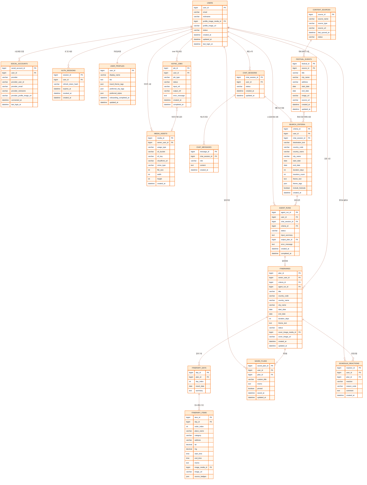

# Lovv 전체 서비스 DB ERD

본 문서는 Lovv 전체 서비스 흐름을 기준으로 한 데이터베이스 ERD 초안이다.
소셜 로그인, 사용자 프로필, 이미지 메타데이터, AI 일정 생성, 저장 일정, 좋아요/싫어요, SAM 비동기 작업, 축제 데이터 수집 흐름을 포함한다.

```mermaid
%%{init: {
  "theme": "base",
  "themeVariables": {
    "background": "#fff7ed",
    "mainBkg": "#ffedd5",
    "primaryColor": "#ffedd5",
    "secondaryColor": "#fed7aa",
    "tertiaryColor": "#fff7ed",
    "primaryTextColor": "#111827",
    "secondaryTextColor": "#111827",
    "tertiaryTextColor": "#111827",
    "primaryBorderColor": "#f97316",
    "lineColor": "#9a3412",
    "textColor": "#111827",
    "fontFamily": "Arial"
  }
}}%%

erDiagram
    USERS ||--o{ SOCIAL_ACCOUNTS : "소셜 계정 연결"
    USERS ||--o{ AUTH_SESSIONS : "로그인 세션"
    USERS ||--|| USER_PROFILES : "프로필/취향"

    USERS ||--o{ MEDIA_ASSETS : "이미지 소유"
    USERS ||--o{ CHAT_SESSIONS : "채팅 시작"
    CHAT_SESSIONS ||--o{ CHAT_MESSAGES : "메시지 포함"
    CHAT_SESSIONS ||--o{ SEARCH_CRITERIA : "여행 조건 확정"

    USERS ||--o{ AGENT_RUNS : "AI 일정 생성 요청"
    SEARCH_CRITERIA ||--o{ AGENT_RUNS : "생성 입력"
    AGENT_RUNS ||--o| ITINERARIES : "일정 생성"

    USERS ||--o{ ITINERARIES : "일정 소유"
    ITINERARIES ||--o{ ITINERARY_DAYS : "일차 구성"
    ITINERARY_DAYS ||--o{ ITINERARY_ITEMS : "장소/활동 구성"

    USERS ||--o{ SAVED_PLANS : "일정 저장"
    ITINERARIES ||--o{ SAVED_PLANS : "저장됨"

    USERS ||--o{ SCHEDULE_REACTIONS : "좋아요/싫어요"
    ITINERARIES ||--o{ SCHEDULE_REACTIONS : "반응 받음"

    USERS ||--o{ ASYNC_JOBS : "SAM 작업 요청"
    ASYNC_JOBS }o--o| MEDIA_ASSETS : "이미지 처리 결과"

    CONTENT_SOURCES ||--o{ FESTIVAL_EVENTS : "축제 데이터 수집"
    FESTIVAL_EVENTS }o--o{ SEARCH_CRITERIA : "축제 포함 추천에 사용"

    USERS {
        bigint user_id PK
        varchar email
        varchar nickname
        bigint profile_image_media_id FK
        varchar profile_image_url
        varchar status
        datetime created_at
        datetime updated_at
        datetime last_login_at
    }

    SOCIAL_ACCOUNTS {
        bigint social_account_id PK
        bigint user_id FK
        varchar provider
        varchar provider_user_id
        varchar provider_email
        varchar provider_nickname
        varchar provider_profile_image_url
        datetime connected_at
        datetime last_login_at
    }

    AUTH_SESSIONS {
        bigint session_id PK
        bigint user_id FK
        varchar refresh_token_hash
        datetime expires_at
        datetime revoked_at
        datetime created_at
    }

    USER_PROFILES {
        bigint user_id PK
        varchar display_name
        text bio
        json travel_theme_tags
        json preferred_city_tags
        json preferred_styles
        datetime onboarding_completed_at
        datetime updated_at
    }

    MEDIA_ASSETS {
        bigint media_id PK
        bigint owner_user_id FK
        varchar usage_type
        varchar s3_bucket
        varchar s3_key
        varchar cloudfront_url
        varchar mime_type
        int file_size
        int width
        int height
        datetime created_at
    }

    CHAT_SESSIONS {
        bigint chat_session_id PK
        bigint user_id FK
        varchar status
        datetime created_at
        datetime updated_at
    }

    CHAT_MESSAGES {
        bigint message_id PK
        bigint chat_session_id FK
        varchar role
        text content
        datetime created_at
    }

    SEARCH_CRITERIA {
        bigint criteria_id PK
        bigint user_id FK
        bigint chat_session_id FK
        varchar destination_text
        varchar country_code
        varchar country_name
        varchar city_name
        date start_date
        date end_date
        int duration_days
        int travelers_count
        text theme_text
        json theme_tags
        boolean include_festivals
        datetime created_at
    }

    AGENT_RUNS {
        bigint agent_run_id PK
        bigint user_id FK
        bigint chat_session_id FK
        bigint criteria_id FK
        varchar status
        text input_summary
        bigint output_plan_id FK
        text error_message
        datetime created_at
        datetime completed_at
    }

    ITINERARIES {
        bigint plan_id PK
        bigint owner_user_id FK
        bigint criteria_id FK
        bigint agent_run_id FK
        varchar title
        varchar country_code
        varchar country_name
        varchar city_name
        date start_date
        date end_date
        int duration_days
        text theme_text
        varchar status
        bigint cover_image_media_id FK
        varchar cover_image_url
        datetime created_at
        datetime updated_at
    }

    ITINERARY_DAYS {
        bigint day_id PK
        bigint plan_id FK
        int day_index
        date travel_date
        text summary
    }

    ITINERARY_ITEMS {
        bigint item_id PK
        bigint day_id FK
        int order_index
        varchar place_name
        varchar category
        varchar address
        decimal lat
        decimal lng
        time start_time
        time end_time
        text memo
        bigint image_media_id FK
        varchar image_url
        json source_badges
    }

    SAVED_PLANS {
        bigint saved_plan_id PK
        bigint user_id FK
        bigint plan_id FK
        varchar custom_title
        text memo
        boolean pinned
        datetime saved_at
        datetime updated_at
    }

    SCHEDULE_REACTIONS {
        bigint reaction_id PK
        bigint user_id FK
        bigint plan_id FK
        varchar reaction
        varchar reason_code
        text comment
        datetime created_at
    }

    ASYNC_JOBS {
        bigint job_id PK
        bigint user_id FK
        varchar job_type
        varchar status
        varchar input_ref
        varchar output_ref
        text error_message
        datetime created_at
        datetime completed_at
    }

    CONTENT_SOURCES {
        bigint source_id PK
        varchar source_name
        varchar source_type
        varchar source_url
        datetime last_synced_at
        varchar status
    }

    FESTIVAL_EVENTS {
        bigint festival_id PK
        bigint source_id FK
        varchar title
        varchar city_name
        varchar address
        date start_date
        date end_date
        varchar image_url
        varchar source_url
        datetime created_at
        datetime updated_at
    }
```
