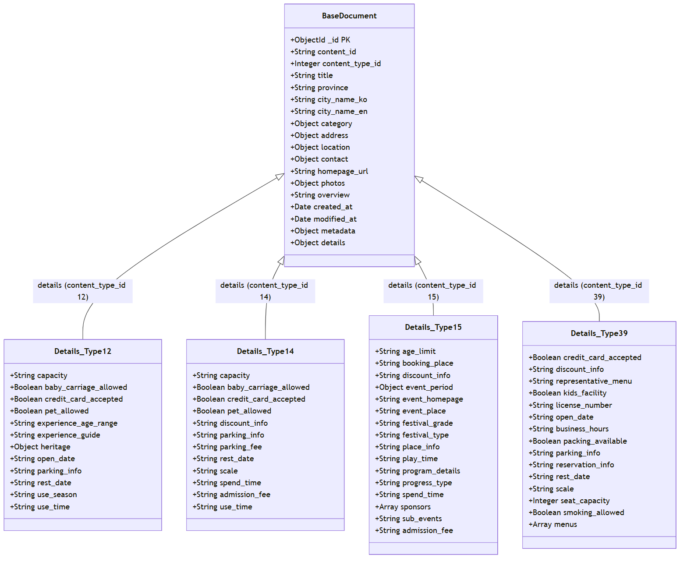

# TourAPI 기반 NoSQL 데이터 정규화 및 스키마 설계

작성일: 2026-06-06

## 1. 설계 범위

본 설계는 공공데이터 포털 TourAPI(KorService2)로부터 수집된 40개 도시의 관광지 및 축제 상세 정보(총 3,815건)를 MongoDB 등 도큐먼트 지향 NoSQL 데이터베이스 및 DynamoDB에 효율적으로 저장하고 서비스하기 위한 **JSON 정규화 및 스키마 설계**를 다룬다.

### 포함 범위

- 40개 도시의 관광지, 문화시설, 축제/공연행사, 음식점 데이터 (총 3,815건)
- 공통 정보(`common`) 및 소개 정보(`intro`)의 통합 JSON 단일 컬렉션/테이블 스키마
- GeoJSON Point 형식을 사용한 2D 공간 정보 및 DynamoDB용 Geohash 데이터
- 데이터 타입 정형화 (Boolean 변환, 문자열의 리스트/배열 정규화 등)
- 결측이 높은 항목의 보존(null/생략) 처리 및 전화번호 상세 폴백(Fallback) 연동
- AWS DynamoDB 적재를 전제로 하는 Single-Table Design 및 글로벌 보조 인덱스(GSI) 설계

### 제외 범위

- 사용자 세션 및 개인별 AI 채팅 대화 로그 저장 (별도 DB 범위)
- 추천 알고리즘 피드백 및 사용자 취향 선호 수집용 원시 데이터 분석 테이블
- DynamoDB 외 기타 특정 RDBMS용 관계형 매핑 스키마
- 100% 결측값으로 확인된 속성(예: `bookingplace`, `discountinfofestival`, `eventhomepage` 등)의 세부 저장 구조 배제 (도큐먼트 최적화)

## 2. 핵심 설계 방향

도큐먼트 데이터 모델(BSON/JSON)은 관계형 데이터 모델과 달리 다형성(Polymorphism)을 자연스럽게 지원한다. 따라서 모든 데이터가 공유하는 **공통 필드(Common Field)**를 최상위 레벨에 위치시키고, `contenttypeid`에 따라 각기 다른 구조를 가지는 상세 속성들을 **유형별 임베디드 도큐먼트(Sub-document)**인 `details` 필드로 구조화하는 **단일 컬렉션 설계(Single-Collection Design with Polymorphic Schema)** 전략을 채택한다.

- **네이밍 일관성**: TourAPI의 가독성이 낮은 로우 네임(예: `accomcountculture`, `chkcreditcardfood`)을 일관된 표준 네이밍(예: `capacity`, `credit_card_accepted`)으로 매핑 및 통일한다.
- **GeoJSON 형식 준수**: 공간 탐색 쿼리(위치 기반 반경 검색 등)의 성능 극대화를 위해 `mapx`, `mapy` 좌표 정보를 NoSQL의 표준인 `GeoJSON Point` 포맷으로 구조화한다.
- **타입 정형화**: 문자열로 수집된 날짜 정보(예: `20261025`) 및 숫자 정보(좌석 수, 수용 인원 등)를 적절한 숫자 타입 또는 Date 형식으로 가공하여 저장한다.
- **결측치 관리 및 왜곡 방지**: 데이터 누락이나 빈 값의 경우 무조건 `false`로 치환하지 않고, 필드 생략(undefined) 또는 `null` 유지를 원칙으로 하여 데이터 정합성을 확보한다.
- **연락처 폴백 로직**: 수집되지 않는 공통 `tel` 대신 `detail.intro` 내 세부 연락처 필드를 탐색하여 상위 공통 연락처 필드로 우선 연동하는 폴백 설계를 적용한다.
- **리스트/배열 정규화**: 줄바꿈이나 콤마로 구분된 텍스트 형태의 데이터(예: 취급 메뉴)를 파싱하여 JSON 배열 구조로 변환한다.
- **DynamoDB Single-Table Design 지원**: 조인이 불가능한 DynamoDB의 한계를 극복하기 위해 PK/SK 복합 키 설계와 Geohash를 도입하여 단일 테이블 내에 모든 엔티티를 관리한다.

## 3. ERD (NoSQL 다형성 구조 설계)

NoSQL의 단일 컬렉션 내 다형성(Polymorphic) 도큐먼트 구조 및 DynamoDB 엔티티 관계를 아래와 같이 도식화한다.



## 4. 스키마 설계

### 4.1 공통 Base 스키마

관광지, 문화시설, 축제/공연행사, 음식점 데이터가 공통으로 가질 최상위 구조이다.

| 필드 | 타입 | 키 | 설명 |
| --- | --- | --- | --- |
| _id | ObjectId | PK | NoSQL 도큐먼트 기본 고유 ID |
| content_id | String |  | TourAPI 고유 콘텐츠 ID (Unique) |
| content_type_id | Integer |  | 콘텐츠 타입 구분 ID (12, 14, 15, 39) |
| title | String |  | 장소 및 축제 명칭 |
| province | String |  | 광역시/도 명칭 (예: 전라북도, 경상북도) |
| city_name_ko | String |  | 시/군/구 국문명 (예: 전주시, 군산시) |
| city_name_en | String |  | 시/군/구 영문명 (예: Jeonju, Gunsan) |
| category | object |  | 카테고리 정보 (`cat1`, `cat2`, `cat3`) |
| address | object |  | 주소 정보 (`addr1`, `addr2`, `zipcode`) |
| location | object |  | GeoJSON Point 위치 정보 (`coordinates` 배열 포함) |
| contact | object |  | 연락처 정보 (`phone`은 infocenter 계열 우선 폴백 적용, `phone_name`은 거의 결측) |
| homepage_url | String |  | 공식 웹사이트 또는 블로그 주소 |
| photos | object |  | 사진 정보 (`main`, `thumbnail`, `copyright`) |
| overview | String |  | 개요 및 소개글 설명 |
| created_at | Date |  | 도큐먼트 생성 시각 |
| modified_at | Date |  | 도큐먼트 최종 수정 시각 |
| metadata | object |  | 수집 메타데이터 (`source`, `collected_at`, `assigned_theme`) |
| details | object |  | 유형별 세부 다형성 속성 서브 도큐먼트 |

### 4.2 관광지 세부 스키마 (ContentTypeID: 12)

관광지 분류(수량: 1,959건)의 `details` 내부 전용 속성 필드이다.

| 필드 | 타입 | 설명 | 대응 원본 속성 (TourAPI) |
| --- | --- | --- | --- |
| capacity | String | 수용 인원 | `accomcount` |
| baby_carriage_allowed | Boolean / String | 유모차 대여 여부 | `chkbabycarriage` |
| credit_card_accepted | Boolean / String | 신용카드 가능 여부 | `chkcreditcard` |
| pet_allowed | Boolean / String | 애완동물 동반 가능 여부 | `chkpet` |
| experience_age_range | String | 체험 가능 연령 | `expagerange` |
| experience_guide | String | 체험 안내 | `expguide` |
| heritage | object | 세계유산 여부 (`cultural`, `natural`, `documentary`) | `heritage1` / `heritage2` / `heritage3` |
| open_date | String | 개장일 | `opendate` |
| parking_info | String | 주차시설 | `parking` |
| rest_date | String | 쉬는 날 | `restdate` |
| use_season | String | 이용 시기 | `useseason` |
| use_time | String | 이용 시간 | `usetime` |

### 4.3 문화시설 세부 스키마 (ContentTypeID: 14)

문화시설 분류(수량: 145건)의 `details` 내부 전용 속성 필드이다.

| 필드 | 타입 | 설명 | 대응 원본 속성 (TourAPI) |
| --- | --- | --- | --- |
| capacity | String | 수용 인원 | `accomcountculture` |
| baby_carriage_allowed | Boolean / String | 유모차 대여 여부 | `chkbabycarriageculture` |
| credit_card_accepted | Boolean / String | 신용카드 가능 여부 | `chkcreditcardculture` |
| pet_allowed | Boolean / String | 애완동물 동반 가능 여부 | `chkpetculture` |
| discount_info | String | 할인 정보 | `discountinfo` |
| parking_info | String | 주차시설 | `parkingculture` |
| parking_fee | String | 주차 요금 | `parkingfee` |
| rest_date | String | 쉬는 날 | `restdateculture` |
| scale | String | 시설 규모 | `scale` |
| spend_time | String | 관람 소요 시간 | `spendtime` |
| admission_fee | String | 관람료 및 이용 요금 | `usefee` |
| use_time | String | 이용 시간 | `usetimeculture` |

### 4.4 축제/공연행사 세부 스키마 (ContentTypeID: 15)

축제/공연행사 분류(수량: 106건)의 `details` 내부 전용 속성 필드이다. 100% 결측으로 파악된 일부 속성은 설계 검토 단계를 거쳐 생략 또는 제외가 권장된다.

| 필드 | 타입 | 설명 | 대응 원본 속성 (TourAPI) |
| --- | --- | --- | --- |
| age_limit | String | 관람 가능 연령 | `agelimit` |
| booking_place | String | 예매처 (100% 결측, 제외 권장) | `bookingplace` |
| discount_info | String | 할인 정보 (100% 결측, 제외 권장) | `discountinfofestival` |
| event_period | object | 행사 기간 (`start_date`, `end_date`) | `eventstartdate` / `eventenddate` |
| event_homepage | String | 행사 홈페이지 (100% 결측, 제외 권장) | `eventhomepage` |
| event_place | String | 행사 장소 | `eventplace` |
| festival_grade | String | 축제 등급 (100% 결측, 제외 권장) | `festivalgrade` |
| festival_type | String | 축제 종류 | `festivaltype` |
| place_info | String | 행사장 위치 정보 | `placeinfo` |
| play_time | String | 공연/행사 시각 | `playtime` |
| program_details | String | 행사 프로그램 내용 | `program` |
| progress_type | String | 행사 진행 방법 | `progresstype` |
| spend_time | String | 관람 소요 시간 | `spendtimefestival` |
| sponsors | Array | 주최/주관사 정보 목록 (`sponsor2tel`은 100% 결측으로 제외 권장) | `sponsor1` / `sponsor1tel`, `sponsor2` / `sponsor2tel` |
| sub_events | String | 부대 행사 (100% 결측, 제외 권장) | `subevent` |
| admission_fee | String | 이용 요금 및 티켓가 | `usetimefestival` |

### 4.5 음식점 세부 스키마 (ContentTypeID: 39)

음식점 분류(수량: 1,601건)의 `details` 내부 전용 속성 필드이다. 100% 결측으로 파악된 일부 속성은 설계 검토 단계를 거쳐 생략 또는 제외가 권장된다.

| 필드 | 타입 | 설명 | 대응 원본 속성 (TourAPI) |
| --- | --- | --- | --- |
| credit_card_accepted | Boolean / String | 신용카드 가능 여부 | `chkcreditcardfood` |
| discount_info | String | 할인 정보 | `discountinfofood` |
| representative_menu | String | 대표 메뉴 | `firstmenu` |
| kids_facility | Boolean / String | 어린이 놀이방 여부 | `kidsfacility` |
| license_number | String | 인허가 번호 | `lcnsno` |
| open_date | String | 개업일 | `opendatefood` |
| business_hours | String | 영업 시간 | `opentimefood` |
| packing_available | Boolean / String | 포장 가능 여부 | `packing` |
| parking_info | String | 주차시설 | `parkingfood` |
| reservation_info | String | 예약 안내 | `reservationfood` |
| rest_date | String | 쉬는 날 | `restdatefood` |
| scale | String | 매장 규모 (100% 결측, 제외 권장) | `scalefood` |
| seat_capacity | Integer / String | 좌석 수 | `seat` |
| smoking_allowed | Boolean / String | 금연/흡연 여부 | `smoking` |
| menus | Array | 취급 메뉴 목록 (텍스트 분해 배열) | `treatmenu` |

## 5. JSON 처리 스키마

NoSQL 데이터 모델에서는 최상위의 객체 지향적 복합 필드(`category`, `address`, `location`, `photos`, `details`)를 적극 활용하여 데이터 접근성을 향상시킨다.

### 5.1 JSON 컬럼(필드) 목록

| 컬렉션/테이블 | 필드명 | 권장 DB 타입 | 용도 |
| --- | --- | --- | --- |
| `Places` | `category` | Object / JSON | 대/중/소 분류 코드 매핑 정보 |
| `Places` | `address` | Object / JSON | 도로명/지번 주소 및 우편번호 통합 관리 |
| `Places` | `location` | Object (GeoJSON) | MongoDB 공간 인덱스(2dsphere) 지원 좌표 |
| `Places` | `photos` | Object / JSON | 썸네일, 고화질 원본 이미지 및 저작권 정보 |
| `Places` | `details` | Object / JSON | `content_type_id`별 가변적 세부 소개 정보 |

### 5.2 JSON 수집 가공 적재 예시 (관광지 Type 12)

```json
{
  "content_id": "2633896",
  "content_type_id": 12,
  "title": "가산수피아",
  "province": "경상북도",
  "city_name_ko": "칠곡군",
  "city_name_en": "Chilgok",
  "category": {
    "cat1": "A01",
    "cat2": "A0101",
    "cat3": "A01010400"
  },
  "address": {
    "addr1": "경상북도 칠곡군 가산면 학하들안2길 105",
    "addr2": "",
    "zipcode": "39800"
  },
  "location": {
    "type": "Point",
    "coordinates": [128.4850691574, 36.0861545517]
  },
  "contact": {
    "phone": "054-971-9001",
    "phone_name": "가산수피아 안내실"
  },
  "homepage_url": "http://gasansupia.com",
  "photos": {
    "main": "http://tong.visitkorea.or.kr/cms/resource/96/2633896_image1_1.jpg",
    "thumbnail": "http://tong.visitkorea.or.kr/cms/resource/96/2633896_image1_2.jpg",
    "copyright": "Type3"
  },
  "overview": "가산수피아는 경북 칠곡군에 위치한 국내 최대 민간 정원입니다.",
  "created_at": "2026-06-06T10:00:00Z",
  "modified_at": "2026-06-06T12:30:00Z",
  "metadata": {
    "source": "TourAPI",
    "collected_at": "2026-06-06T16:30:00+09:00",
    "assigned_theme": "자연·트레킹"
  },
  "details": {
    "capacity": "1,000명",
    "baby_carriage_allowed": true,
    "credit_card_accepted": true,
    "pet_allowed": true,
    "experience_guide": "숲공예 / 산림교육 등",
    "heritage": {
      "cultural": false,
      "natural": false,
      "documentary": false
    },
    "open_date": "20190412",
    "parking_info": "가능",
    "rest_date": "연중무휴",
    "use_season": "사계절",
    "use_time": "10:00~18:00"
  }
}
```

### 5.3 JSON Schema (MongoDB Validation 기준)

```json
{
  "$schema": "https://json-schema.org/draft/2020-12/schema",
  "title": "NormalizedTourPlace",
  "type": "object",
  "additionalProperties": false,
  "required": [
    "content_id",
    "content_type_id",
    "title",
    "city_name_en",
    "location",
    "details"
  ],
  "properties": {
    "content_id": {
      "type": "string",
      "pattern": "^[0-9]+$",
      "description": "숫자로 이루어진 문자열 형태의 콘텐츠 ID"
    },
    "content_type_id": {
      "type": "integer",
      "enum": [12, 14, 15, 39],
      "description": "12:관광지, 14:문화시설, 15:축제, 39:음식점"
    },
    "title": {
      "type": "string",
      "minLength": 1
    },
    "province": {
      "type": "string"
    },
    "city_name_ko": {
      "type": "string"
    },
    "city_name_en": {
      "type": "string"
    },
    "category": {
      "type": "object",
      "properties": {
        "cat1": { "type": "string" },
        "cat2": { "type": "string" },
        "cat3": { "type": "string" }
      }
    },
    "address": {
      "type": "object",
      "properties": {
        "addr1": { "type": "string" },
        "addr2": { "type": "string" },
        "zipcode": { "type": "string" }
      }
    },
    "location": {
      "type": "object",
      "required": ["type", "coordinates"],
      "properties": {
        "type": {
          "type": "string",
          "enum": ["Point"]
        },
        "coordinates": {
          "type": "array",
          "minItems": 2,
          "maxItems": 2,
          "items": { "type": "number" },
          "description": "[경도(Longitude), 위도(Latitude)]"
        }
      }
    },
    "contact": {
      "type": "object",
      "properties": {
        "phone": { "type": "string" },
        "phone_name": { "type": "string" }
      }
    },
    "homepage_url": {
      "type": "string"
    },
    "photos": {
      "type": "object",
      "properties": {
        "main": { "type": "string" },
        "thumbnail": { "type": "string" },
        "copyright": { "type": "string" }
      }
    },
    "overview": {
      "type": "string"
    },
    "created_at": {
      "type": "string",
      "format": "date-time"
    },
    "modified_at": {
      "type": "string",
      "format": "date-time"
    },
    "metadata": {
      "type": "object",
      "properties": {
        "source": { "type": "string" },
        "collected_at": { "type": "string", "format": "date-time" },
        "assigned_theme": { "type": "string" }
      }
    },
    "details": {
      "type": "object",
      "description": "Polymorphic sub-document depending on content_type_id"
    }
  }
}
```

### 5.4 JSON 정규화 및 저장 규칙

- **Boolean 변환 및 결측 예방**: `Y`, `가능` 등 명시적인 긍정 텍스트는 `true`로 변환하고 `N`, `불가`, `없음` 등 명시적인 부정 텍스트는 `false`로 변환하여 적재한다. **데이터가 누락되었거나 빈 값(결측)인 경우, 무조건 false로 채우지 않고 필드 자체를 생략(undefined)하거나 null로 유지**하여 데이터의 왜곡을 방지한다.
- **전화번호 통합 및 폴백 (Phone Fallback)**: 공통 `tel`과 `telname`은 100% 결측 상태이므로, 최상위 공통 `contact.phone`을 매핑할 때 세부 소개 정보(`details`) 내의 실질적 연락처 필드(`infocenter`, `infocenterculture`, `infocenterfood`, `sponsor1tel` 등)를 탐색하여 최우선 매핑하는 폴백 처리를 적용한다.
- **배열 파싱 (Array Splitting)**: 음식점의 취급 메뉴(`treatmenu`)와 같이 긴 콤마나 슬래시(`/`) 구분 문자열은 공백을 정리(Trim)한 뒤 `["오리 소금구이", "얼큰라면", "볶음밥"]` 형태의 1차원 배열로 전환한다.
- **위치 정보 GeoJSON 정규화**: `mapx`(경도)와 `mapy`(위도) 데이터를 `location.coordinates: [경도, 위도]` 형태의 float 타입 배열로 매핑하여 공간 쿼리 표준 규격을 충족한다.
- **유연성 보존**: TourAPI 데이터 특성상 수집 정보가 부실한 필드가 많으므로 스키마 레벨에서 필수 요구 조건을 핵심 식별 정보(`content_id`, `content_type_id` 등)로 최소화한다.

### 5.5 DB 레벨 검증 및 인덱스 설정 예시 (MongoDB)

수집된 데이터에 대한 고속 조회를 지원하기 위해 다음과 같이 인덱스를 구성한다.

```javascript
// 1. 공간 인덱스 (Geospatial Index) 생성 - 반경 기준 추천용
db.places.createIndex({ "location.coordinates": "2dsphere" });

// 2. 복합 인덱스 (Compound Index) 생성 - 도시별 필터 및 카테고리 필터 속도 향상
db.places.createIndex({ "city_name_en": 1, "content_type_id": 1 });

// 3. 텍스트 인덱스 (Text Index) 생성 - 통합 검색 엔진용
db.places.createIndex({ "title": "text", "overview": "text" });
```

---

## 6. DynamoDB 싱글 테이블 모델링 및 관계 설계

AWS DynamoDB를 사용해 단일 테이블 구조(Single-Table Design)로 설계하는 경우, 테이블 스키마와 인덱스를 아래와 같이 일원화한다.

### 6.1 DynamoDB 테이블 구조 (Single-Table Schema)

테이블명: `TourKoreaData`

| 관계 | 카디널리티 | PK 포맷 | SK 포맷 | 주요 특징 및 대상 속성 |
| --- | --- | --- | --- | --- |
| `CITY` -> `ATTRACTION` | 1:N | `CITY#{city_name_en}` | `ATTRACTION#{content_id}` | 관광지 상세 데이터 및 Geohash, details 맵 포함 |
| `CITY` -> `FESTIVAL` | 1:N | `CITY#{city_name_en}` | `FESTIVAL#{content_id}` | 축제 데이터 및 행사 기간 포함 |
| `CITY` -> `METADATA` | 1:1 | `CITY#{city_name_en}` | `METADATA` | 도시 한글명, 시/도, 도시 위경도 정보 |

### 6.2 글로벌 보조 인덱스 (GSI - Global Secondary Index) 설계

| 인덱스 명칭 | 파티션 키 (GSI-PK) | 정렬 키 (GSI-SK) | 용도 |
| --- | --- | --- | --- |
| `GSI1-Lookup` | `content_id` | (없음) | 도시 정보를 모르는 상태에서 `content_id`로 개별 상세 정보 직접 즉시 조회 |
| `GSI2-Geohash` | `geohash_prefix` (앞 5자리) | `geohash` (전체 12자리) | 특정 위치 주변 반경의 관광지/축제 필터링 및 공간 검색 지원 |

### 6.3 공간 탐색 한계 극복: Geohash 솔루션

DynamoDB는 공간 인덱스(2dsphere)를 지원하지 않으므로 위/경도를 지오해시 문자열로 인코딩하여 저장한다.

1. **지오해시 인코딩**: 위도 `36.5407`, 경도 `128.5227`은 `wy74dg72hx8f`로 인코딩된다.
2. **접두사(Prefix) 매핑**: 5자리 접두사인 `wy74d`를 `geohash_prefix`에 저장한다.
3. **위치 쿼리**: GSI2 인덱스에서 `GSI2-PK = wy74d` 인 데이터를 찾아 `GSI2-SK begins_with wy74dg` 등으로 범위 스캔하여 물리적으로 가까운 위치의 대상을 효율적으로 추출한다.

### 6.4 DynamoDB 적재 아이템 JSON 데이터 예시

```json
{
  "PK": {"S": "CITY#Chilgok"},
  "SK": {"S": "ATTRACTION#2633896"},
  "content_id": {"S": "2633896"},
  "content_type_id": {"N": "12"},
  "title": {"S": "가산수피아"},
  "latitude": {"N": "36.0861545517"},
  "longitude": {"N": "128.4850691574"},
  "geohash": {"S": "wy7e2e3df2v1"},
  "geohash_prefix": {"S": "wy7e2"},
  "assigned_theme": {"S": "자연·트레킹"},
  "details": {
    "M": {
      "capacity": {"S": "1,000명"},
      "baby_carriage_allowed": {"BOOL": true},
      "credit_card_accepted": {"BOOL": true},
      "pet_allowed": {"BOOL": true},
      "experience_guide": {"S": "숲공예 / 산림교육 등"},
      "heritage": {
        "M": {
          "cultural": {"BOOL": false},
          "natural": {"BOOL": false},
          "documentary": {"BOOL": false}
        }
      },
      "parking_info": {"S": "가능"},
      "rest_date": {"S": "연중무휴"},
      "use_time": {"S": "10:00~18:00"}
    }
  }
}
```

---

## 7. NoSQL 데이터 흐름

1. 공공데이터 포털 TourAPI(KorService2) API 호출을 거쳐 40개 도시의 관광지, 문화시설, 축제/행사, 음식점 원시 데이터를 수집한다.
2. 로우 데이터 필드 중 비정형화되거나 결측률이 높은 필드명들을 표준화된 JSON 속성 이름으로 리네이밍하며, 수집 연락처가 누락되었을 시 세부 연락처 필드를 상위 `contact.phone`으로 연동하는 폴백 처리를 거친다.
3. 빈 값(결측치)의 경우 무조건 `false`로 치환하지 않고, 필드 생략(undefined) 또는 `null`로 보존하여 데이터 왜곡을 방지한다.
4. `mapx`, `mapy` 위경도 데이터 좌표를 GeoJSON Point 표준 포맷으로 재구성하고, DynamoDB 적재 대상인 경우 12자리 Geohash 값 및 5자리 prefix 값을 변환하여 추가한다.
5. 가변 정보(소개 정보 `intro` 객체 등)를 `details` 서브 도큐먼드로 감싸 통합 다형성 모델을 완성한다.
6. MongoDB 단일 컬렉션(`Places`)에 Document 형식으로 적재하거나, DynamoDB 단일 테이블(`TourKoreaData`)에 PK/SK 포맷으로 매핑하여 적재를 수행한다.
7. 클라이언트 서비스에서 지도 조회나 위치 필터링 요청 시 생성된 `2dsphere` 인덱스 또는 `GSI2-Geohash` 인덱스를 쿼리하여 데이터를 서빙한다.

## 8. 제외 모델 구조 판단 근거

| 제외 구조 및 모델 | 제외 이유 |
| --- | --- |
| `도시별/타입별 분리 컬렉션` | NoSQL의 장점인 스키마 다형성을 살려 단일 컬렉션에 적재하므로, 개별 테이블 관리에 드는 오버헤드가 불필요하다. |
| `위도/경도 숫자 범위 필터링` | 공간 쿼리 표준인 GeoJSON 포맷 또는 DynamoDB Geohash를 사용하므로, 위경도 최솟값/최댓값을 이용한 단순 수학적 연산 필터링은 채택하지 않는다. |
| `DynamoDB 조인 중간 테이블` | DynamoDB에서는 Single-Table Design에 의거해 PK/SK 복합 구조 및 GSI로 모든 일대다 관계를 자체 해결하므로 분리 조인 테이블이 존재할 이유가 없다. |
| `결측치 기본값(false) 일괄 채우기` | 결측률이 높은 항목을 무분별하게 false로 채우면 데이터의 참/거짓 판단 왜곡이 발생하므로 필드 자체를 생략하거나 null로 유지한다. |
| `100% 결측 속성 (bookingplace 등)` | 수집 데이터 전체에서 실질 데이터가 전혀 확인되지 않으므로 스키마 설계 및 저장 대상에서 제외한다. |

## 9. 보안 및 개인정보 고려사항

- **공개 데이터 안전성**: TourAPI 데이터는 공공 포털에 공개된 일반 콘텐츠로 구성되어 있어 민감 개인정보(PII) 유출 우려는 기본적으로 낮다.
- **클라이언트 이미지 렌더링 검증**: 외부 포털에서 연동되는 사진 이미지 주소(`photos.main`, `photos.thumbnail`) 렌더링 시 XSS 및 피싱을 방지하기 위해 지정 이미지 도메인 주소에 대한 화이트리스트 검증을 적용할 것을 권장한다.
- **인증 토큰 격리**: 공공데이터 API 연동 인증 토큰(서비스 키) 및 AWS IAM 인증 정보는 DB나 설계 문서, 소스 코드에 저장하지 않고 암호화된 환경 변수로 안전하게 격리한다.

## 10. 구현 시 우선순위

1. **정규화 파서 구현**: TourAPI 응답 로우 데이터를 입력받아 공통 필드 및 `details` 동적 스키마 형태로 표준화하는 정규화 모듈 우선 개발. (전화번호 폴백 및 결측 처리 적용)
2. **위치 좌표 및 지오해시 산출**: 수집 좌표에 대한 GeoJSON Point 생성 및 DynamoDB 대응을 위한 Geohash 12자리/5자리 접두사 연산 모듈 구현.
3. **단일 컬렉션/테이블 적재**: 가공 완료된 JSON 패키지를 MongoDB 또는 DynamoDB에 벌크 적재(Bulk Insert) 수행.
4. **인덱스 및 GSI 배포**: MongoDB의 `2dsphere`/복합/텍스트 인덱스 생성 또는 DynamoDB의 `GSI1`, `GSI2` 인덱스 정의 및 배포.
5. **검색 API 연동**: 공간 근접 쿼리(`$near` 또는 `begins_with` Geohash prefix)와 키워드 텍스트 쿼리를 활용한 추천/검색 API 테스트 및 최적화.

## 11. 설계 검토 체크리스트

- [ ] 4개 `contenttypeid`에 대응하는 고유 필드명이 표준화 규격으로 누락 없이 변환되었는가?
- [ ] 위치 좌표가 GeoJSON Point 형태로 정상화되었으며 위도/경도 순서(coordinates: [경도, 위도])가 올바른가?
- [ ] 다형성 도큐먼트 구조의 `details` 내부 속성에 각 타입별 특성이 명확히 정의되었는가?
- [ ] DynamoDB 적재를 위한 PK/SK 조합 포맷(예: `CITY#{city}`, `ATTRACTION#{id}`)이 Access Pattern을 반영하였는가?
- [ ] GSI1(콘텐츠 단독 직접 검색), GSI2(지오해시 공간 쿼리) 구성이 완료되었는가?
- [ ] 텍스트 문자열의 Boolean 치환 및 취급메뉴 목록의 배열 분해 규칙이 올바르게 설계에 반영되었는가?
- [ ] 테이블 및 인덱스 생성을 위한 DDL/Script 예시가 일치하는가?
- [ ] 100% 결측으로 확인된 불필요한 속성들이 실제 세부 스키마에서 제외 또는 보류되었는가?
- [ ] 결측 데이터를 무분별하게 `false`로 치환하지 않고 `null`/생략 상태로 처리하는 결측 제어 규칙을 준수하였는가?
- [ ] 최상위 `contact.phone`에 대해 `detail.intro` 내부 연락처 필드를 참조하는 폴백 로직이 파서에 구현되었는가?
