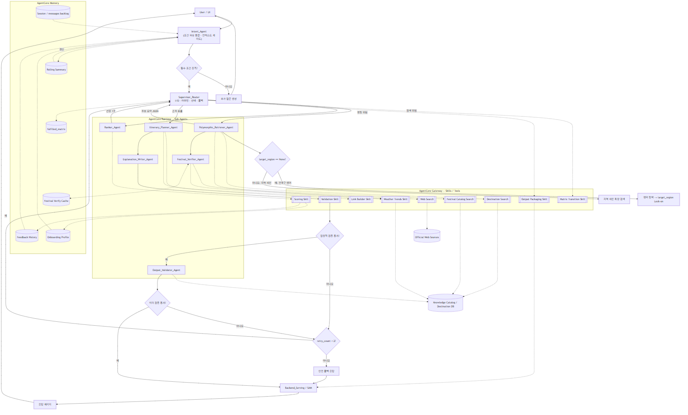

# 로브 (Lovv) Agent 명세서

> 문서 버전: v0.11
> 문서 상태: 검토 중 (Review)
> 기준 문서: 요구사항 명세서 v1.7, 서비스 흐름 명세서 v0.2, 데이터 수집 계획서 v0.7, 데이터베이스 설계 명세서 v0.5, 기술 명세서 v0.3, API 명세서 v0.2
> 상세 정본: `langgraph_flow.md`, `intent_agent.md`, `candidate_evidence_agent.md`, `candidate_evidence_baseline_comparison.md`, `planner_agent.md`, `agent_harness_design.md`

# 1. 문서 개요

## 1.1 목적

본 문서는 로브 추천 Agent의 공개 정본이다.
Agent는 단일 LLM 호출이 아니라 `Intent_Agent`가 사용자 의도와 조건을 정리하고, `Supervisor_Router`가 상태 기반으로 전문 Agent와 결정적 Skill을 호출하는 멀티스텝 파이프라인으로 동작한다.

정본의 범위는 다음과 같다.

- 사용자 자연어, 온보딩 선호, 지도 진입 조건을 추천 가능한 상태로 구조화한다.
- 한국/일본 소도시와 장소 evidence 후보를 검색·점수화하고 Planner가 사용할 후보 패키지를 구성한다.
- 축제 날짜, 일정 구성, 추천 근거, 최종 응답의 안전성을 검증한다.
- AgentCore Runtime, Memory, Gateway, Policy, Observability에 연결 가능한 상태·노드·도구 계약을 정의한다.

## 1.2 설계 원칙

| 원칙 | 설명 |
| --- | --- |
| Supervisor I/O 허브 | `Supervisor_Router`는 raw 대화·웹 원문·RAG 원문을 보유하지 않고 압축 상태와 참조 키만 라우팅한다. |
| Sub-Agent / Skill 분리 | 자연어 해석, 검색 결과 해석, 일정·설명 생성, 의미 검증은 Sub-Agent가 수행하고, 계산·검증·링크 생성·상태 전이는 결정적 Skill이 수행한다. |
| 멀티턴 상태 보존 | `messages`, `conversation_summary`, `fulfilled_matrix`, `target_region`, `selected_destination`은 세션 상태로 이어진다. |
| 단일 목적지 추천 | 최종 추천은 소도시 1곳 중심으로 구성한다. |
| 검증 우선 | 미검증 축제 날짜, 국가 혼합, DB 근거 없는 장소·설명은 최종 응답에 확정값으로 노출하지 않는다. |

# 2. Agent 목표

| 목표 | 설명 |
| --- | --- |
| 조건 구조화 | 자연어와 UI 조건을 `UnifiedAgentState`의 구조화 필드로 변환 |
| 근거 기반 추천 | 목적지 DB, Knowledge Catalog, 임베딩 검색, 월별 기상 경향을 근거로 Candidate Evidence Package 구성 |
| 개인화 반영 | 온보딩 테마, 현재 자연어 의도, 좋아요/싫어요 피드백을 분리해 반영 |
| 일정 구성 | 일정 유형과 콘텐츠 타입 균형에 맞는 일별 일정 생성 |
| 설명 가능성 | 추천 이유, 일정 흐름 이유, 반영 불가 조건 안내를 구조화해 제공 |
| 안전한 폴백 | 데이터 부족, 웹 검색 실패, 검증 실패, 조건 충돌 시 재시도 상한과 폴백 응답 적용 |

# 3. Agent 입력

| 입력 | 출처 | 설명 | 필수 여부 |
| --- | --- | --- | --- |
| `session_id` | 시스템 | 세션 구분 식별자 | 필수 |
| `onboardingProfile` | 저장 데이터 | 장기 선호 테마와 여행 성향 | 필수 |
| `feedbackHistory` | 저장 데이터 | 좋아요/싫어요, 저장, 재추천 이력 | 선택 |
| `naturalLanguageQuery` | 챗봇/UI | 현재 턴 자연어 요청 | 선택 |
| `entryType` | UI | `chatbot`, `map_marker` 등 진입 방식 | 필수 |
| `country` | UI/챗봇 | `KR` 또는 `JP` | 필수 |
| `travelMonth` | UI/챗봇 | 여행 월, 1~12 | 필수 |
| `travelYear` | UI/시스템 | 축제 개최일 검증 기준 연도 | 선택 |
| `destinationId` | 지도 | 지도 마커 진입 시 고정 목적지 | 선택 |
| `themes` | UI/챗봇 | 현재 요청에서 명시 선택한 테마 코드 배열 | 선택 |
| `tripType` | UI/챗봇 | `daytrip`, `2d1n`, `3d2n` 등 일정 유형 | 필수 |
| `includeFestivals` | UI/챗봇 | 축제·행사 포함 여부 | 필수 |
| `user_location` | UI 권한 | 거리 기반 1차 필터의 기준 좌표 | 선택 |

# 4. Agent 출력

| 출력 | 설명 |
| --- | --- |
| `selectedDestination` | 선정된 소도시 1곳 |
| `itinerary` | 일정 유형에 맞춘 일별 세부 일정 |
| `recommendationReasons` | 사용자 조건, 계절, 테마, 접근성, 콘텐츠 균형 기반 추천 이유 |
| `itineraryFlowReason` | 일정 순서와 동선 흐름 이유 |
| `alternativeItinerary` | 기상 악화 또는 결측 상황의 대체 일정 |
| `festivalDateVerifications` | 축제별 해당 연도 날짜 검증 결과와 신뢰도 |
| `externalLinks` | 지도, 숙소 검색, 현지 탐색 링크 |
| `confidence` | 추천 신뢰도와 결측 정도 |
| `user_notice` | 반영 불가 조건, 검증 한계, 검색 링크 안내 |

API 응답에서는 `externalLinks`를 `links` 객체로 직렬화한다.
Agent 내부 상태와 문서 본문은 링크 생성 책임을 명확히 하기 위해 `externalLinks`라는 논리명을 사용하되, `/recommendations` 응답 계약은 API 명세의 `links.map`, `links.staySearch`를 따른다.
`recommendationReasons`, `itineraryFlowReason`, `confidence`, `user_notice`, `festivalDateVerifications`는 API 명세의 `explainability`와 최상위 검증 필드로 매핑한다.

# 5. 파이프라인

`Intent_Agent`는 조건 파싱을 내장한 entry node다.
`Condition_Parser_Agent`는 별도 물리 노드로 두지 않고 `Intent_Agent`의 논리 책임으로 통합한다.
이후 `Supervisor_Router`가 `fulfilled_matrix`와 구조화 조건을 기준으로 `Candidate_Evidence_Agent`를 호출한다.
`Candidate_Evidence_Agent`는 기존 `Polymorphic_Retriever_Agent`와 `Ranker_Agent`의 책임을 통합해 장소 evidence 검색, 도시/장소 점수화, Planner 입력 후보 패키지 구성을 수행한다.
목적지와 후보 장소 패키지가 구성된 뒤에는 `Planner_Agent`가 일정 생성, 설명 생성, 최종 출력 검증을 통합 담당한다.

## 5.1 Agent 구성도



## 5.2 파이프라인 단계

| 단계 | 노드/모듈 | 역할 | 출력 |
| --- | --- | --- | --- |
| 1 | `Intent_Agent` | 멀티턴 컨텍스트 정리, 조건 파싱, 필수 조건 확인 | handoff payload, 초기 `fulfilled_matrix` |
| 2 | `Supervisor_Router` | 상태 기반 라우팅, 재시도·폴백 제어, Skill 호출 | `next_node`, 라우팅 결정 |
| 3 | `Candidate_Evidence_Agent` | 장소 evidence 검색, 도시/장소 scoring, primary/reserve 후보 패키징 | `selected_city`, `recommended_places`, `reserve_places`, `city_rankings`, audit |
| 4 | `Festival_Verifier_Agent` | 축제 후보의 해당 연도 개최일 검증 | 검증 JSON, 캐시 |
| 5 | `Planner_Agent` | 일정 생성, 추천 설명 생성, 최종 출력 검증을 통합 수행 | `itinerary`, `alternativeItinerary`, `recommendationReasons`, `itineraryFlowReason`, `user_notice` |
| 6 | `Backend_Serving / SAM` | 응답 패키징, 저장, UI 서빙 | 최종 추천 응답 |

# 6. UnifiedAgentState

LangGraph 그래프 전역 상태다.
구현 기준은 Python 3.12 `TypedDict`이며 상세 정본은 `langgraph_flow.md`를 따른다.

```python
from typing import TypedDict, List, Dict, Any, Optional

class UnifiedAgentState(TypedDict):
    # --- 대화/컨텍스트 (Intent_Agent 소유) ---
    messages: List[Dict[str, str]]            # 전체 멀티턴 백로그 (Supervisor에 미전달)
    conversation_summary: str                 # 롤링 요약 (백로그 토큰 bound)
    turn_index: int                           # 현재 사용자 턴 번호
    session_id: str                           # 세션 식별자
    recommendation_request_id: Optional[str]  # MySQL 추천 요청/결과 원장 연결 키
    agent_run_id: Optional[str]               # DynamoDB Agent 실행 trace 연결 키

    # --- Intent → Supervisor handoff payload ---
    extracted_inputs: Dict[str, Any]          # country, travelMonth, travelYear, tripType, theme, entryType, includeFestivals
    user_preferences: List[str]               # RAG/검색용 선호 문장 (의도 관련성 명확분만)
    onboarding_themes: List[str]              # 장기 선호 (온보딩 1~3개)
    chat_extracted_themes: List[str]          # 자연어에서 추출된 테마
    active_required_themes: List[str]         # 필수 충족 대상 (온보딩+자연어 병합, 최대 3)
    theme_priority: Dict[str, str]            # 테마별 high|normal|low
    soft_preferences: List[str]               # quiet, scenic_view 등 랭킹 가산 조건
    cleaned_raw_query: str                    # 반영 가능 조건만 남긴 원문
    theme_queries: Dict[str, str]             # 테마별 벡터 검색 쿼리
    soft_preference_query: str                # 분위기 통합 쿼리
    unsupported_conditions: List[str]         # RAG 미전달, user_notice 대상
    backup_themes: List[str]                  # active 3개 초과 시 밀려난 온보딩 테마
    user_location: Optional[Dict[str, float]] # 거리 기반 1차 필터 기준 좌표
    user_notice: Optional[str]                # 예외 안내 문구
    excluded_themes: List[str]                # 명시적 거부 테마

    # --- 라우팅 제어 (Supervisor 소유) ---
    next_node: str
    fulfilled_matrix: Dict[str, str]          # 테마/단계별 X|O|△|N/A
    target_region: Optional[str]              # 하위 호환용 지역 상태. 신규 흐름은 selected_city/candidate_evidence_package를 우선 사용
    validation_retry_count: int               # 검증 실패 재시도 카운터 (상한 2)

    # --- 수집/생성물 (Worker/Skill 누적) ---
    candidate_evidence_package: Optional[Dict[str, Any]]  # Candidate_Evidence_Agent 출력
    raw_collected_data: List[Dict[str, Any]]  # 하위 호환용 수집 데이터, 기상 경향 등
    festival_verifications: List[Dict[str, Any]]  # Festival_Verifier 결과 JSON
    selected_destination: Optional[Dict[str, Any]]
    itinerary: Optional[Dict[str, Any]]
    recommendation_reasons: Optional[List[str]]
    confidence: Optional[float]
```

상태 정책:

- `messages` 원문은 Memory에만 두고 Supervisor에 통째 전달하지 않는다.
- `conversation_summary`와 최근 N턴만 `Intent_Agent` 입력으로 사용한다.
- `fulfilled_matrix`는 `X`, `O`, `△`, `N/A`만 사용한다.
- `validation_retry_count` 상한은 2회다.
- `unsupported_conditions`는 RAG 검색 조건으로 전달하지 않고 `user_notice`와 외부 검색 링크로 분리한다.
- `recommendation_request_id`는 MySQL 추천 요청/결과 원장과 연결되는 추적 키다.
- `agent_run_id`는 DynamoDB `lovv_agent_runs`의 Agent 실행 trace와 연결되는 추적 키다.
- `agent_run_id`, `recommendation_request_id`, `session_id`는 원문 대화 없이 상태 요약과 장애 분석 로그를 연결하기 위한 최소 식별자로만 사용한다.

# 7. 단계별 명세

## 7.1 `Intent_Agent`

| 항목 | 내용 |
| --- | --- |
| 책임 | 멀티턴 대화 정리, 자연어 조건 파싱, 온보딩·현재 의도 병합, 추가 질문 여부 판단 |
| 입력 | `messages`, `conversation_summary`, UI 조건, 온보딩, 피드백 |
| 출력 | `extracted_inputs`, `active_required_themes`, `soft_preferences`, `unsupported_conditions`, `fulfilled_matrix` |
| 통합 책임 | 기존 `Condition_Parser_Agent`의 물리 노드는 제거하고 논리 책임을 내장한다. |
| 분리 트리거 | 파싱 정확도 저하, 프롬프트 비대화, 테스트 하네스에서 파싱 실패율 상승 시 별도 노드로 분리한다. |

온보딩은 장기 선호, 자연어는 현재 여행 의도로 본다.
active theme는 최대 3개를 기본으로 하며, 자연어가 강하게 요구한 테마가 온보딩보다 우선한다.

현재 단계의 Intent Agent 구현 기준은 `intent_agent.md`를 따른다. 핵심 산출물은 `candidate_evidence_agent.md`의 입력 계약에 맞춘 `candidate_evidence_input`이며, Intent Agent는 도시 검색·점수화·일정 생성을 수행하지 않는다.

## 7.2 `Supervisor_Router`

| 항목 | 내용 |
| --- | --- |
| 책임 | `fulfilled_matrix`를 읽고 다음 노드 호출, 재시도·폴백 제어, 최종 패키징 전 상태 조립 |
| 직접 수행 | 상태 읽기/쓰기, handoff payload 조립, `Matrix Transition Skill` 호출, retry 상한 판단 |
| 수행하지 않음 | 대화 원문 해석, 웹 원문 해석, 점수 계산, 일정·설명 생성 |
| raw 정책 | raw 대화, raw RAG 결과, raw 웹 검색 결과를 보유하지 않는다. |

`fulfilled_matrix` 기호 규격은 8.2를 단일 출처로 사용한다.

## 7.3 `Candidate_Evidence_Agent`

| 항목 | 내용 |
| --- | --- |
| 책임 | 장소 evidence 검색, 도시/장소 scoring, Planner 입력용 primary/reserve 후보 패키징 |
| 통합 책임 | 기존 `Polymorphic_Retriever_Agent`와 `Ranker_Agent`의 물리 노드를 통합한다. |
| 도구 | `Destination Search Tool`, `Scoring Tool`, `Weather Trends Skill` |
| 출력 | `selected_city`, `city_rankings`, `recommended_places`, `reserve_places`, `coverage_audit`, `retrieval_audit` |
| 하지 않음 | 일정 생성, 추천 설명 생성, 최종 API 응답 생성 |
| city discovery | `destinationId`가 없으면 여러 도시의 장소 evidence를 검색하고 scoring으로 `selected_city`를 고른다. |
| anchored search | `destinationId`가 있으면 해당 도시 내부의 장소 evidence와 예비 후보를 구성한다. |
| 제약 | 한국 요청에는 한국 데이터만, 일본 요청에는 일본 데이터만 검색한다. |

Candidate Evidence Agent의 기본 로직:

1. `Intent_Agent`가 구조화한 `active_required_themes`, `cleaned_raw_query`, `soft_preference_query`, `user_location`, `destinationId`를 입력으로 받는다.
2. `active_required_themes`는 deterministic metadata gate와 theme coverage 계산에 사용한다.
3. `cleaned_raw_query`와 `soft_preference_query`는 장소 evidence 검색의 별도 query channel로 사용한다.
4. `Scoring Tool`은 도시/장소 점수, 테마 커버리지, 테마 균형, 거리/일수 가능성, 후보 충분성을 계산한다.
5. Planner fallback 지연을 줄이기 위해 최종 일정 필요 수보다 넉넉한 `recommended_places`와 `reserve_places`를 반환한다.
6. 복수 테마 선택 시 theme quota와 balance audit을 적용해 특정 테마 후보로 쏠리지 않게 한다.
7. `unsupported_conditions`는 검색 조건으로 전달하지 않는다.

검색 인덱스 계약:

| 항목 | 기준 |
| --- | --- |
| 정형 원장 | 목적지, 축제, 관광지, 일정 결과의 확정 기준은 MySQL 원장을 따른다. |
| 실행/이벤트 상태 | Agent trace, API 로그, 사용자 이벤트, async job은 DynamoDB TTL 테이블에 요약 저장한다. |
| 의미 검색 | S3 vector index는 재생성 가능한 검색 인덱스로만 사용하며 원본 저장소로 보지 않는다. |
| 관계 탐색 | 그래프DB 직접 도입 대신 Lambda 관계 탐색 보조 기능으로 도시·축제·테마·장소 관계를 확장한다. |
| 필수 metadata | `country`, `destination_id`, `city_id`, `content_type`, `theme_tags`, `recommended_months`, `source_type` |
| 금지 metadata | 사용자 ID 원문, 대화 전문, 비공개 운영 메모 |

Candidate Evidence Agent는 S3 vector metadata filter로 국가·도시·테마·월·콘텐츠 유형을 1차 제한하고, Lambda 관계 탐색 보조 기능으로 도시·축제·테마·장소 관계를 확장한 뒤 MySQL 원장 또는 DynamoDB 정규화 문서의 확정 필드로 후보를 재검증한다.
S3 vector 결과만으로 장소 존재, 축제 일정, 운영 여부를 확정하지 않는다.

## 7.4 `Festival_Verifier_Agent`

| 항목 | 내용 |
| --- | --- |
| 책임 | 축제 후보의 해당 연도 개최 기간을 공식 웹 출처 기준으로 검증 |
| 입력 | 축제 후보, `target_region`, `travelYear`, `travelMonth`, 공식 출처 후보 |
| 출력 | `festival_id`, `date_status`, `start_date`, `end_date`, `source_url`, `source_type`, `verified_at`, `confidence` |
| 캐시 키 | `festival_id + travelYear` |
| downstream 정책 | 웹 검색 원문은 전달하지 않고 검증 JSON만 반환한다. |

캐시 TTL:

| `date_status` | TTL | 처리 |
| --- | --- | --- |
| `confirmed` | 30일 | TTL 내 웹 검색 생략 |
| `tentative` | 7일 | 짧은 주기로 재검증 |
| `unknown` / `outdated` | 1일 | 다음 요청에서 재검색 유도 |

`confirmed` 축제만 일정에 직접 배치한다.
`tentative`는 안내 문구 또는 후보 정보로만 사용한다.
축제 포함 요청에서는 모든 후보를 웹 검증하지 않고, Candidate Evidence Agent가 구성한 상위 도시/축제 후보 K곳(기본 2~3곳)만 검증한다.
`includeFestivals=false`이면 Festival Verifier를 건너뛰고 `festival` 매트릭스 항목을 `N/A`로 둔다.

## 7.5 `Planner_Agent`

| 항목 | 내용 |
| --- | --- |
| 책임 | 일정 생성, 추천 설명 생성, 최종 출력 검증을 하나의 Planner 책임으로 통합 |
| 입력 | Candidate Evidence Package, `tripType`, `active_required_themes`, 축제 검증, 사용자 안내 대상 조건 |
| 출력 | `itinerary`, `alternativeItinerary`, `recommendationReasons`, `itineraryFlowReason`, `externalLinks`, `confidence`, `user_notice` |
| 통합 이유 | 일정, 설명, 검증이 같은 후보·점수·검증 결과를 보게 해 "이유-일정" 불일치와 후단 재호출을 줄인다. |
| 규칙 | 필수 테마를 일정과 설명에 함께 반영하고, 과도한 이동·검증되지 않은 축제 배치·DB 근거 없는 장소 설명을 금지한다. |

Planner Agent의 상세 정본은 `planner_agent.md`를 따른다. `itinerary_flow.md`는 PlanDraft, 수정 흐름, 대체 일정 아이디어를 담은 초안 문서로 유지하되 구현 기준은 `planner_agent.md`를 우선한다.

추천 이유와 동선 설명은 다음 세 축을 중심으로 작성한다.

| 축 | 포함 내용 |
| --- | --- |
| 조건 충족 | 국가, 월, 일정 유형, 선택 테마, 거리 조건 |
| 도시 특성 | 테마 특화도, 희소 테마, 혼잡·규모 보정 |
| 일정 가능성 | 콘텐츠 타입 균형, soft/raw 적합도, `confirmed` 축제 여부 |

반영하기 어려운 조건은 `user_notice`로 분리한다.
숙박 품질, 가격, 예약 가능 여부, 실시간 혼잡도, 실시간 운영 여부는 확정 추천 근거로 쓰지 않는다.

## 7.6 `Validation Skill`

Planner Agent 내부에서 LLM 의미 검증 전에 결정적으로 검사한다.

| 검증 | 기준 |
| --- | --- |
| 필드 누락 | 필수 출력 필드가 존재하는가 |
| 국가 혼합 | 한 응답에 KR/JP 데이터가 섞이지 않는가 |
| 단일 목적지 | 최종 추천이 소도시 1곳 중심인가 |
| 축제 배치 | 일정 배치 축제는 `confirmed`인가 |
| active theme | `active_required_themes`가 결과에 반영됐는가 |

## 7.7 Planner 의미 검증

| 항목 | 기준 | 실패 카테고리 |
| --- | --- | --- |
| 근거성 | 추천 이유가 DB/검색 근거와 연결되는가 | `grounding_missing` |
| 환각 방지 | 존재하지 않는 장소·축제·운영 정보를 만들지 않았는가 | `hallucination` |
| 조건 충족 | `active_required_themes`가 최종 결과에 반영됐는가 | `condition_unmet` |
| 설명 가능성 | 추천 이유와 일정 흐름 이유가 자연어로 충분한가 | `explanation_weak` |
| 폴백 안전성 | 결측과 실패 상황이 `confidence`, `user_notice`로 안내되는가 | `fallback_unsafe` |

검증 실패 시 `validation_retry_count`를 증가시킨다.
2회 미만이면 Supervisor가 실패 카테고리별 결정 규칙으로 분기한다.
2회에 도달하면 안전 폴백 응답으로 종료한다.

| 실패 카테고리 | Supervisor 분기 |
| --- | --- |
| `grounding_missing` | `Planner_Agent` 재호출. 동일 Candidate Evidence Package를 유지하되 설명·근거 필드를 우선 재작성한다. |
| `hallucination` | `Candidate_Evidence_Agent` 재탐색 또는 해당 항목 제거 |
| `condition_unmet` | `Candidate_Evidence_Agent` 재탐색 또는 Planner 재구성 |
| `explanation_weak` | `Planner_Agent` 재호출. 일정 골격을 유지하고 설명 필드를 보강한다. |
| `fallback_unsafe` | 안전 폴백 템플릿으로 즉시 전환 |

# 8. 도구 및 Skill

## 8.1 사용 도구/Skill

| 도구/Skill | 책임 | 호출 주체 |
| --- | --- | --- |
| `Destination Search Tool` | S3 vector metadata filter, 목적지·장소·테마 DB 조회, 의미 검색 기반 장소 evidence 조회 | Candidate Evidence Agent |
| `Festival Catalog Search` | 축제명, 지역, 대략 시기, 공식 출처 후보 조회 | Festival Verifier |
| `Web Search` | 해당 연도 축제 공식 출처 검색 | Festival Verifier |
| `Weather Trends Skill` | 월별 기상 경향 정형값 조회 | Candidate Evidence Agent, Planner Agent |
| `Scoring Skill` | 도시/장소 후보 점수 계산과 primary/reserve 후보 구성 | Candidate Evidence Agent |
| `Matrix Transition Skill` | `fulfilled_matrix` 전이 | Supervisor |
| `Validation Skill` | 결정적 출력 검증 | Planner Agent |
| `Link Builder Skill` | 지도·숙소 검색 링크 생성 | Planner Agent |
| `Output Packaging Skill` | UI 응답 패키징과 민감정보 마스킹 | Backend Serving |
| `WeatherAPI Proxy` | 상세 화면 표시용 실시간 날씨 조회 | Backend Serving |

## 8.2 `fulfilled_matrix` 규격

표준 키는 `evidence`, `festival`, `planning`으로 고정한다.
Supervisor는 `X` 항목을 아래 우선순위로 처리한다.
`evidence`는 기존 retrieval/ranking을 통합한 Candidate Evidence Agent 구간이며, 장소 evidence 검색, 도시/장소 scoring, primary/reserve 후보 패키징을 포함한다.
`planning`은 일정 생성, 설명 생성, 결정적/의미 검증을 포함한 Planner Agent 구간이다.

| 우선순위 | 키 | 담당 |
| --- | --- | --- |
| 1 | `evidence` | Candidate Evidence Agent |
| 2 | `festival` | Festival Verifier |
| 3 | `planning` | Planner Agent |

| 기호 | 의미 | 라우팅 |
| --- | --- | --- |
| `X` | Pending / 탐색 또는 처리 필요 | Supervisor 라우팅 대상 |
| `O` | Success / 성공적으로 처리 완료 | 라우팅 제외 |
| `△` | Fallback / 데이터 결측 또는 실패로 대체 처리 | 라우팅 제외 또는 제한적 재시도 |
| `N/A` | Excluded / 조건 미선택 또는 명시 거부 | 라우팅 제외 |

멀티턴에서 사용자가 명시 거부를 번복하면 `Matrix Transition Skill`이 `N/A → X` 전이를 수행한다.
확신이 낮으면 전이하지 않고 추가 질문을 생성한다.

# 9. Bedrock 및 AgentCore 매핑

| 본 설계 요소 | 매핑 |
| --- | --- |
| Sub-Agent, Supervisor 그래프 | AgentCore Runtime |
| 온보딩, 피드백, 세션, 요약, `fulfilled_matrix`, 축제 검증 캐시 | AgentCore Memory |
| Scoring, Matrix, Validation, Link, Weather, Packaging Skill | AgentCore Gateway 또는 Lambda |
| Festival 웹 검색 | AgentCore Browser 또는 Web Search |
| Agent별 권한 | AgentCore Identity |
| 국가 혼합 금지, 미검증 축제 차단 | AgentCore Policy |
| trace, latency, token, retry, fallback 비율 | AgentCore Observability |
| 회귀 평가, trajectory 평가, LLM-as-Judge | AgentCore Evaluations |

AgentCore 하네스는 도메인 추론을 대체하지 않는다. 요청 정규화, graph compile/cache,
model adapter, identity, runtime guard, redacted logging, entrypoint contract test는
하네스 책임으로 두고, Agent node·routing rule·prompt·schema·fallback behavior는
도메인 workflow의 정본으로 유지한다. 상세 책임 경계는 `agent_harness_design.md`
2.2.1을 따른다.

Memory에는 다음 턴의 의도 해석과 재추천에 필요한 요약 상태만 저장한다.
`messages` recent window, `conversation_summary`, `fulfilled_matrix`, `city_anchor`,
`festival_verifications` summary, `PlanDraft` summary는 저장 후보지만, raw RAG result,
raw web content, full `candidate_evidence_package`, embedding cache, secret, PII는
Memory와 log에 저장하지 않는다. 전체 `candidate_evidence_package`는 단일 실행 내부
payload로만 사용하고, 멀티턴 재추천에는 city/place id와 audit 요약만 남긴다.

LLM 호출은 Bedrock Converse API로 추상화한다.
본 정본은 특정 모델 ID나 Agent별 모델 tier 배정을 고정하지 않는다.
실제 모델 ID와 tier 배정은 Bedrock Converse adapter, 배포 환경 설정, 비용·지연·품질
평가 결과에 따라 결정한다.
임베딩은 Amazon Titan Text Embeddings V2 또는 Cohere Embed 계열을 후보로 두고, S3 vector 기능 기반 RAG 인덱스와 연동한다.

## 9.1 저장소 연결 원칙

| 데이터 | 저장소 | Agent 책임 |
| --- | --- | --- |
| 추천 요청/결과 원장 | MySQL `recommendation_requests`, `recommendation_results` | `recommendation_request_id` 기준으로 요청과 결과를 연결한다. |
| 생성 일정 | MySQL `itineraries`, `itinerary_days`, `itinerary_items` | 최종 검증을 통과한 일정만 저장 대상으로 전달한다. |
| Agent 실행 trace | DynamoDB `lovv_agent_runs` | DB 설계 명세서 v0.5 기준으로 `agent_run_id`, `node_name`, `tool_name`, `validation_retry_count`, `error_code`, `payload_summary` 중심의 원문 없는 실행 요약만 남긴다. `next_node`, `fulfilled_matrix`, `target_region`은 런타임/Memory 상태로 관리하고, `token_usage`는 AgentCore Observability 메트릭으로 분리한다. |
| 비동기 작업 상태 | DynamoDB `lovv_async_jobs` | 장시간 실행 또는 재시도 작업의 `job_type`, `status`, `progress`, `result_ref`, `error_code`를 갱신한다. |
| 축제 검증 캐시 | DynamoDB `lovv_festival_verify_cache` | `festival_id + travelYear` 단위로 `date_status`, 날짜, 공식 출처, 신뢰도를 재사용한다. |
| RAG 검색 인덱스 | S3 vector index | 목적지·축제·관광지 chunk와 metadata filter를 조회하되 원본 확정 근거로 단독 사용하지 않는다. |
| 관계 탐색 보조 | Lambda + DynamoDB 인접 리스트 | 도시·축제·테마·장소 관계를 탐색해 후보를 확장하되 원본 확정 근거로 단독 사용하지 않는다. |

Agent는 저장소별 책임을 넘지 않는다.
MySQL 원장은 사용자에게 조회·저장·피드백으로 노출되는 최종 상태를 담당하고, DynamoDB는 TTL 기반 실행 상태와 로그성 데이터를 담당한다.
S3 vector index는 검색 성능과 의미 재랭킹을 위한 파생 인덱스이며, 재색인과 복구는 MySQL, DynamoDB 정규화 문서, S3 Raw 원본을 기준으로 수행한다.
Lambda 관계 탐색 보조 기능은 관계 탐색과 그래프 기반 후보 확장을 위한 파생 기능이며, 재적재와 복구는 DynamoDB 정규화 문서와 S3 Raw 원본을 기준으로 수행한다. Neptune은 3-hop 이상 임의 경로 탐색이나 대규모 실시간 그래프 쓰기가 필요해질 때의 고도화 승격 옵션으로 둔다.

# 10. 품질 검증 기준

| 검증 항목 | 기준 |
| --- | --- |
| 조건 충족 | 국가, 월, 일정 유형, active theme 반영 100% |
| 단일 목적지 | 최종 추천은 소도시 1곳 중심 |
| 축제 날짜 정확성 | 일정 배치 축제는 `confirmed` 100% |
| 국가 분리 | KR/JP 혼합 0건 |
| 루프 안전성 | `validation_retry_count <= 2` |
| 근거성 | 추천 이유가 DB/검색 근거와 연결 |
| 폴백 안전성 | 결측·실패 시 `confidence` 하향과 `user_notice` 포함 |
| 후보 없음 분기 | `no_candidate`는 검증 재시도와 분리해 즉시 안전 폴백 |
| 축제 검증 비용 | 축제 포함 요청은 Candidate Evidence Agent가 구성한 상위 도시/축제 후보 K건만 웹 검증 |

테스트 하네스는 `agent_harness_design.md`를 따른다.
PR 단계는 결정적 L1/L2/L4 핵심 케이스를 우선하고, LLM 평가와 전체 trajectory 평가는 nightly 또는 릴리즈 게이트로 분리한다.

## 10.1 Candidate Evidence Agent 비교 검증

검색·후보 구성의 Baseline은 raw query similarity만 사용하는 단순 RAG로 정의한다. Ours는 동일한 hard-theme gate, 후보 예산, fallback 조건 위에 soft retrieval, 다요소 scoring, entropy balance, min quota와 soft max quota를 추가한다.

설계 차이와 현재 실험 근거는 `candidate_evidence_baseline_comparison.md`를 따른다. 도시·관광지 검색 테스트 계획과 상세 결과의 정본은 `../10_test_plan/candidate_evidence_search_test_plan.md`, `../10_test_plan/candidate_evidence_evaluation_results.md`다.

# 11. 금지 사항

- 대화 로그 전문을 장기 저장하지 않는다.
- Supervisor에 전체 대화 로그, 웹 검색 원문, RAG 원문을 전달하지 않는다.
- Memory와 log에 raw RAG result, raw web content, full `candidate_evidence_package`, embedding cache, secret, PII를 저장하지 않는다.
- WeatherAPI 실시간 예보를 추천 후보 스코어링 기준으로 사용하지 않는다.
- 출처 없는 장소 정보를 확정 사실처럼 제시하지 않는다.
- 검증되지 않은 축제 날짜를 확정 일정처럼 제시하지 않는다.
- 한국 요청에 일본 목적지를 섞거나, 일본 요청에 한국 목적지를 섞지 않는다.
- 숙소를 직접 추천하지 않고 검색 링크만 제공한다.
- 검증 실패 결과를 최종 추천으로 반환하지 않는다.

# 12. 변경 이력

| 버전 | 날짜 | 작성자 | 변경 내용 |
| --- | --- | --- | --- |
| v0.11 | 2026-06-13 | llm | Candidate Evidence 관련 외부 평가 구현 경로 직접 참조를 제거하고 정본 내부 문서 연결 중심으로 정리 |
| v0.10 | 2026-06-12 | llm팀 | 정본에서 특정 LLM 모델 고정 문구를 제거하고 Bedrock Converse 추상화 원칙으로 정리 |
| v0.9 | 2026-06-12 | llm팀 | AgentCore 하네스/Memory/Gateway/Policy/Observability 책임 경계와 Memory 저장 금지 원칙을 대표 문서에 반영 |
| v0.8 | 2026-06-12 | llm팀 | `intent_agent.md`를 Intent Agent 상세 정본으로 추가하고, 모델 호출 경계를 Bedrock Converse adapter로 분리 |
| v0.7 | 2026-06-12 | llm팀 | `planner_agent.md`를 Planner Agent 상세 정본으로 추가하고, 일정 생성·설명·검증의 구현 기준을 대표 문서에 연결 |
| v0.6 | 2026-06-12 | llm팀 | Candidate Evidence Agent의 Baseline/Ours 비교 원칙과 테스트 계획·결과 문서 연결 추가 |
| v0.5 | 2026-06-10 | llm팀 | UnifiedAgentState를 `langgraph_flow.md` 상세 정본과 정합화하고, `Candidate_Evidence_Agent` 검색 도구 명칭을 `Destination Search Tool`로 통일 |
| v0.4 | 2026-06-10 | llm팀 | Retriever/Ranker 분리 구간을 `Candidate_Evidence_Agent`로 통합하고 Planner가 일정·설명·검증을 구조 수준에서 통합 담당하도록 정리 |
| v0.4 | 2026-06-08 | llm팀 | DB v0.5 기준으로 Agent trace 저장 필드를 `lovv_agent_runs` 요약 필드와 Observability 메트릭으로 분리 |
| v0.4 | 2026-06-08 | llm팀 | Itinerary Planner와 Explanation Writer를 `Itinerary_Writer_Agent`로 통합하고 생성 matrix 키를 `generation`으로 정리 |
| v0.4 | 2026-06-08 | llm팀 | Top-K 축제 검증, 후보 0건 폴백, Validator 실패 카테고리, `fulfilled_matrix` 표준 키와 라우팅 우선순위 반영 |
| v0.4 | 2026-06-08 | llm팀 | 버전 상향 없이 API `themes`/`links` 매핑, Agent trace 식별자, DynamoDB/S3 vector 저장소 계약을 대표 문서에 보강 |
| v0.4 | 2026-06-07 | llm팀 | Agent 05 번호 체계 반영, Intent/Condition 통합, Supervisor I/O 허브, LangGraph 상태, Skill 분리, 추천 흐름, AgentCore/Bedrock 매핑, 검증 루프 가드 반영 |
| v0.3 | 2026-06-01 | 로브 기획팀 | Intent Agent 도입, Festival Verifier Agent 승격, Agent 구성도 및 전국구 RAG 조회 흐름 반영 |
| v0.2 | 2026-05-31 | 로브 기획팀 | LangGraph 기반 순환형 아키텍처 개편 및 Supervisor Router 도입, Polymorphic Retriever 노드 모드 분리, 하이브리드 데이터 조회 및 실시간 API 검증 반영 |
| v0.1 | 2026-05-29 | 로브 기획팀 | Agent 명세서 초안 작성 |
