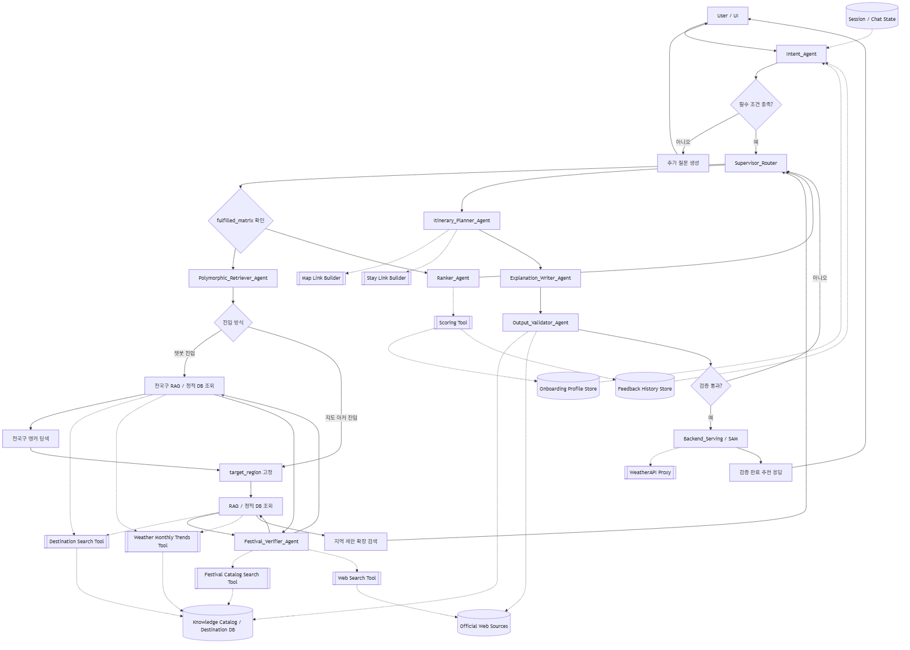

# 로브 Agent 구축 대상 정리

> 문서 상태: 초안 (Draft)
> 작성 목적: 구현 단계에서 어떤 Agent를 만들 것인지 역할 단위로 정리
> 기준 문서: `docs/05_agent_spec/05_agent_spec.md` v0.4

# 1. 문서 목적

본 문서는 로브(Lovv) 서비스에서 구현할 Agent의 종류와 책임 범위를 정리한다.
상세 입출력, 상태 전이, 도구 사용 규칙은 `05_agent_spec.md`를 기준으로 하며, 이 문서는 개발자가 구현 대상을 빠르게 파악하기 위한 목록형 문서로 사용한다.

# 2. 구축할 Agent 개요

로브 Agent는 하나의 거대한 Agent가 모든 작업을 처리하는 구조가 아니라, 의도 정리 Agent와 중앙 제어 Agent가 여러 전문 Agent를 호출하는 멀티 Agent 파이프라인으로 구성한다.

멀티턴 대화에서는 `Intent_Agent`가 사용자 의도와 선호를 먼저 정리하고, 조건 파싱까지 통합해 `Supervisor_Router`에는 라우팅에 필요한 최소 컨텍스트만 전달한다. `Condition_Parser_Agent`는 별도 물리 노드가 아니라 `Intent_Agent`의 논리 책임으로 보며, 파싱 실패율이나 프롬프트 비대화가 확인될 때만 분리한다.

| 구분 | Agent | 핵심 책임 |
| --- | --- | --- |
| 의도 정리 | `Intent_Agent` | 멀티턴 대화 정리, 불필요한 컨텍스트 제거, handoff payload 생성 |
| 중앙 제어 | `Supervisor_Router` | 전체 실행 흐름 제어, 상태 점검, 다음 Agent 호출 결정 |
| 데이터 검색 | `Polymorphic_Retriever_Agent` | RAG와 정적 DB를 조회해 소도시, 관광지, 축제, 계절 데이터를 조건에 맞게 검색 |
| 축제 검증 | `Festival_Verifier_Agent` | 해당 연도 축제 개최일을 웹 검색과 공식 출처 기준으로 검증 |
| 후보 평가 | `Ranker_Agent` | 후보지를 점수화하고 최종 추천 소도시 1곳 선정 |
| 일정 생성 | `Itinerary_Planner_Agent` | 여행 기간과 목적지에 맞는 일자별 일정 생성 |
| 설명 생성 | `Explanation_Writer_Agent` | 추천 이유와 일정 흐름 이유를 사용자에게 설명 |
| 검증 | `Output_Validator_Agent` | 결과의 조건 충족, 근거성, 환각 여부, 폴백 적용 여부 검증 |
| 서빙 | `Backend_Serving / SAM` | 검증 완료 패키지 저장 및 UI 서빙 데이터 제공 |

## 2.1 Agent 구성도



# 3. Agent별 구현 목적

## 3.1 Intent_Agent

멀티턴 대화에서 사용자의 현재 의도와 선호를 정리하는 Agent다.
전체 대화 로그를 그대로 Supervisor에 넘기지 않고, 추천과 라우팅에 필요한 정보만 추려 handoff payload를 만든다.
자연어와 UI 입력값을 구조화된 여행 조건으로 변환하는 조건 파싱 책임도 이 노드에 포함한다.

| 항목 | 내용 |
| --- | --- |
| 구현 목적 | 멀티턴 컨텍스트 정리 및 환각/라우팅 오판 방지 |
| 주요 입력 | 사용자 메시지, 이전 대화 맥락, UI 입력, 온보딩 프로필 |
| 주요 출력 | `extracted_inputs`, `active_required_themes`, `soft_preferences`, `unsupported_conditions`, `fulfilled_matrix`, `excluded_themes` |
| 중요 규칙 | 관련성이 불확실한 컨텍스트는 Supervisor 전달 payload에서 제거한다 |

## 3.2 Supervisor_Router

전체 Agent 실행을 관리하는 중앙 제어 Agent다.
사용자의 요청이 들어오면 현재 상태를 확인하고, 어떤 Agent를 어떤 순서로 실행할지 결정한다.

| 항목 | 내용 |
| --- | --- |
| 구현 목적 | 추천 파이프라인의 흐름 제어 |
| 주요 입력 | 구조화 조건, 세션 상태, `fulfilled_matrix` |
| 주요 출력 | 다음 실행 Agent 결정, 최종 응답 흐름 분기 |
| 중요 규칙 | 각 Agent 실행 후 제어권은 반드시 Supervisor로 돌아오며, Supervisor는 raw 대화·웹 원문·RAG 원문을 보유하지 않는다 |

## 3.3 Polymorphic_Retriever_Agent

조건에 맞는 소도시와 관련 데이터를 검색하는 Agent다.
현재 구조에서 RAG 조회는 별도 Agent를 추가하지 않고 `Polymorphic_Retriever_Agent`가 담당한다.
축제 후보의 대략적인 시기는 Knowledge Catalog에서 조회하되, 해당 연도의 정확한 날짜 검증은 `Festival_Verifier_Agent`에 위임한다.
초기에는 전국 단위로 대표 목적지를 찾고, 이후에는 선택된 소도시 내부로 검색 범위를 좁힌다.
단, 지도 마커 진입처럼 `destinationId`가 이미 존재하는 경우에는 전국 단위 앵커 탐색을 생략하고, 해당 목적지의 `target_region`을 고정한 뒤 지역 제한 확장 모드로 바로 진입한다.

| 항목 | 내용 |
| --- | --- |
| 구현 목적 | RAG 및 정적 DB 기반 후보 데이터 인출 |
| 주요 입력 | 국가, 월, 테마, `target_region`, 피드백 이력 |
| 주요 출력 | 후보 소도시, 관광지, 축제, 기상 경향 데이터 |
| 중요 규칙 | 한국 요청은 한국 데이터, 일본 요청은 일본 데이터만 사용 |

## 3.4 Festival_Verifier_Agent

축제 후보에 대해 해당 연도의 정확한 개최 기간을 검증하는 Agent다.
Knowledge Catalog에는 대략적인 개최 시기만 저장하고, 실제 여행 연도의 시작일과 종료일은 공식 웹 출처를 우선 검색해 보완한다.

| 항목 | 내용 |
| --- | --- |
| 구현 목적 | 축제 개최일의 연도별 정확도 보완 및 출처 신뢰도 판단 |
| 주요 입력 | 축제 후보, `target_region`, `travelYear`, `travelMonth`, 공식 출처 후보 |
| 주요 출력 | `date_status`, `start_date`, `end_date`, `source_url`, `source_type`, `confidence` |
| 사용 Tool | `Festival Catalog Search Tool`, `Web Search Tool` |
| 중요 규칙 | 웹 검색 원문 전체를 downstream Agent에 넘기지 않고 검증 결과 JSON만 반환한다 |
| 캐시 정책 | `festival_id + travelYear` 키로 검증 결과를 캐싱하고 `confirmed` 30일, `tentative` 7일, `unknown/outdated` 1일 TTL을 적용한다 |

## 3.5 Ranker_Agent

검색된 후보를 평가하고 최종 추천 소도시 1곳을 선정하는 Agent다.
사용자 조건, 접근성, 선택 테마 충족도, 테마 특화도, 희소 테마, 콘텐츠 타입 균형, soft preference, cleaned raw query 유사도, 축제 조건, 좋아요/싫어요 이력을 점수에 반영한다.

| 항목 | 내용 |
| --- | --- |
| 구현 목적 | 후보지 점수화 및 최종 목적지 선정 |
| 주요 입력 | 후보 목록, 온보딩 프로필, 피드백 이력, 월별 기상 경향 |
| 주요 출력 | 최종 추천 소도시 1곳, 점수 근거 |
| 중요 규칙 | 설명 가능한 점수 근거를 남긴다 |

## 3.6 Itinerary_Planner_Agent

선정된 소도시를 기준으로 여행 기간에 맞는 일정을 생성하는 Agent다.
당일치기, 1박2일, 2박3일 이상에 따라 일정 밀도와 동선을 다르게 구성한다.

| 항목 | 내용 |
| --- | --- |
| 구현 목적 | 사용자 조건에 맞는 일자별 여행 일정 생성 |
| 주요 입력 | 선정 소도시, 일정 유형, 축제 포함 여부, 관광지 목록 |
| 주요 출력 | 일자별 일정, 이동 흐름, 대체 일정 |
| 중요 규칙 | 과도한 이동과 조건 불일치 일정을 만들지 않는다 |

## 3.7 Explanation_Writer_Agent

추천 결과를 사용자가 이해할 수 있도록 설명하는 Agent다.
단순 홍보 문구가 아니라 조건 매칭, 계절성, 혼잡도, 기상 경향, 동선 효율 중 2개 이상의 근거를 포함한다.

| 항목 | 내용 |
| --- | --- |
| 구현 목적 | 추천 이유와 일정 흐름 설명 생성 |
| 주요 입력 | 사용자 조건, 랭킹 점수, 생성 일정, 검색 근거 |
| 주요 출력 | 추천 이유, 일정 흐름 이유 |
| 중요 규칙 | DB 근거 없이 장소나 사실을 새로 만들어내지 않는다 |

## 3.8 Output_Validator_Agent

최종 응답이 사용자 조건과 서비스 정책을 만족하는지 검증하는 Agent다.
조건 누락, 국가 혼합, 존재하지 않는 장소, 근거 없는 설명, 폴백 누락을 확인한다.

| 항목 | 내용 |
| --- | --- |
| 구현 목적 | 최종 추천 결과 품질 검증 |
| 주요 입력 | 최종 목적지, 일정, 추천 이유, 사용 데이터 근거 |
| 주요 출력 | 검증 완료 응답, 수정 필요 항목, 신뢰도 |
| 중요 규칙 | 결정적 `Validation Skill`을 먼저 통과한 뒤 의미 검증을 수행한다. 검증 실패 시 `validation_retry_count`를 증가시키고, 2회 도달 시 안전 폴백으로 종료한다 |

## 3.9 Backend_Serving / SAM

검증이 완료된 최종 추천 패키지를 저장하고 UI에서 사용할 수 있는 형태로 제공하는 서빙 계층이다.
Agent의 추론 결과를 그대로 노출하지 않고, 검증된 데이터 패키지와 상태 정보를 보존한다.

| 항목 | 내용 |
| --- | --- |
| 구현 목적 | 검증 완료 결과 저장 및 UI 서빙 데이터 제공 |
| 주요 입력 | 검증 완료 목적지, 일정, 추천 이유, 링크, 신뢰도 |
| 주요 출력 | UI 응답 패키지, 저장된 Agent 실행 결과 |
| 중요 규칙 | 저장 전 민감정보와 불필요한 대화 원문을 제거하거나 마스킹한다 |

# 4. 구현 우선순위

| 우선순위 | Agent | 이유 |
| --- | --- | --- |
| 1 | `Intent_Agent` | 사용자 의도, 입력 조건, Supervisor 전달 payload 구조를 결정 |
| 2 | `Supervisor_Router` | 전체 Agent의 상태 계약, 호출 순서, 실패 복귀 흐름을 먼저 고정 |
| 3 | `Polymorphic_Retriever_Agent` | 추천 품질의 핵심인 근거 데이터를 확보 |
| 4 | `Festival_Verifier_Agent` | 축제 날짜 검증 결과를 일정 생성 전에 확정 |
| 5 | `Ranker_Agent` | 후보 중 최종 목적지를 선택하는 기준 제공 |
| 6 | `Itinerary_Planner_Agent` | 서비스의 사용자 체감 결과물 생성 |
| 7 | `Explanation_Writer_Agent` | 추천의 설득력과 설명 가능성 확보 |
| 8 | `Output_Validator_Agent` | 환각과 조건 불일치 방지 |
| 9 | `Backend_Serving / SAM` | 검증 완료 결과를 저장하고 UI 서빙 형태로 제공 |

# 5. 초기 구현 범위

초기 버전에서는 아래 범위를 우선 구현한다.

| 범위 | 포함 여부 | 설명 |
| --- | --- | --- |
| 자연어 조건 파싱 | 포함 | 국가, 월, 일정 유형, 테마 추출 |
| 지도 마커 진입 | 포함 | `destinationId`가 있을 때 전국 단위 앵커 탐색을 생략하고 해당 목적지의 `target_region`을 고정 |
| RAG 검색 | 포함 | 구축된 목적지 DB 기준 검색 |
| 결정적 Skill 분리 | 포함 | Scoring, Matrix Transition, Validation, Link, Weather, Packaging Skill을 LLM 노드와 분리 |
| 개인화 피드백 반영 | 포함 | 좋아요/싫어요 이력 기반 가감점 |
| 축제 실시간 검증 | 제한 포함 | MVP 단계에서는 정적 데이터 우선, 최종 정책에서는 `Festival_Verifier_Agent`가 공식 웹 출처로 교차 검증 |
| 실시간 날씨 기반 추천 | 제외 | 실시간 WeatherAPI는 상세 화면 표시용으로 분리 |
| 다국가 혼합 추천 | 제외 | 한 요청에서는 한국 또는 일본 중 하나만 처리 |

# 6. 구현 시 금지 사항

- 하나의 LLM 호출로 조건 파싱, 검색, 선정, 일정 생성, 설명, 검증을 모두 처리하지 않는다.
- DB에 없는 장소, 축제, 이동 수단, 영업 정보를 임의로 생성하지 않는다.
- 한국과 일본 데이터를 하나의 추천 결과 안에서 섞지 않는다.
- 실시간 날씨 API 결과를 월별 추천 점수의 주 근거로 사용하지 않는다.
- 검증 실패 결과를 사용자에게 최종 추천으로 반환하지 않는다.
- Supervisor에 전체 대화 로그를 기본 전달하지 않는다.

# 7. 다음 작성 필요 문서

| 문서 | 목적 |
| --- | --- |
| Agent 상태 스키마 | Agent 간 공유할 `state` 구조 정의 |
| Agent 테스트 시나리오 | 조건별 정상/폴백/실패 케이스 정리 |
| Tool 입출력 명세 | Retriever, Scoring, Link Builder 등 도구 계약 정의 |
| 프롬프트 초안 | 각 Agent별 시스템 프롬프트와 출력 포맷 정의 |
| 지도 마커 진입 플로우 | `destinationId` 기반 추천 흐름과 Ranker 생략/적용 기준 정의 |

# 8. Agent / Tool 분리 결정사항

## 8.1 결정 요약

현재 구조에서는 모든 Tool을 Agent로 승격하지 않는다.
단, 축제의 해당 연도 정확한 개최일을 검증하는 기능은 단순 조회가 아니라 검색, 출처 우선순위 판단, 날짜 추출, 신뢰도 산정이 필요하므로 `Festival_Verifier_Agent`로 승격한다.

| 대상 | 결정 | 이유 |
| --- | --- | --- |
| `Festival Date Verifier / Web Search Tool` | `Festival_Verifier_Agent`로 승격 | 웹 검색 결과 해석, 공식 출처 판별, 날짜 충돌 해결, confidence 산정이 필요 |
| `Destination Search Tool` | Tool 유지 | Knowledge Catalog와 목적지 DB를 조회하는 단순 검색 책임 |
| `Festival Catalog Search Tool` | Tool 유지 | Catalog에 저장된 축제명, 지역, 대략 시기 조회 책임 |
| `Weather Monthly Trends Tool` | Tool 유지 | 월별 기상 경향 정형 데이터 조회 책임 |
| `Scoring Skill` | Skill 유지 | 후보 점수 계산은 결정적 함수에 가까움 |
| `Matrix Transition Skill` | Skill 신설 | `fulfilled_matrix` 전이는 규칙 기반으로 처리 |
| `Validation Skill` | Skill 신설 | 필드 누락, 국가 혼합, 단일 목적지, 축제 confirmed 여부를 결정적으로 검사 |
| `Link Builder Skill` | Skill 유지 | 지도·숙소 검색 링크 생성은 단순 변환 작업 |
| `Output Packaging Skill` | Skill 신설 | UI 응답 직렬화와 민감정보 마스킹 |
| `WeatherAPI Proxy` | Tool 유지 | 상세 화면 표시용 실시간 날씨 조회 프록시 |

## 8.2 변경 후 권장 구조

```text
Polymorphic_Retriever_Agent
  ├─ Destination Search Tool
  ├─ Weather Monthly Trends Tool
  └─ Festival_Verifier_Agent
       ├─ Festival Catalog Search Tool
       ├─ Web Search Tool
       ├─ Official Source Check
       └─ Date Confidence Scoring
```

## 8.3 토큰 효율 판단

`Festival_Verifier_Agent`는 웹 검색 원문과 여러 출처의 날짜 후보를 내부에서만 소비하고, downstream Agent에는 검증 결과 JSON만 전달한다.
이 방식은 Retriever, Planner, Writer, Validator가 긴 웹 검색 결과를 반복해서 들고 다니는 것을 막아 토큰 사용량을 줄인다.

| 조건 | 권장 방식 | 판단 |
| --- | --- | --- |
| 축제 후보가 없거나 1개이고 Catalog 날짜만 필요한 경우 | Tool 중심 처리 | 별도 Agent 호출 오버헤드가 더 클 수 있음 |
| 축제 후보가 여러 개이고 해당 연도 날짜 확인이 필요한 경우 | `Festival_Verifier_Agent` 호출 | 웹 검색 결과를 내부에서 압축하므로 토큰 효율이 좋음 |
| 공식 출처와 비공식 출처 날짜가 충돌하는 경우 | `Festival_Verifier_Agent` 호출 | 출처 우선순위와 신뢰도 판단이 필요 |

## 8.4 Festival_Verifier_Agent 출력 계약

`Festival_Verifier_Agent`는 긴 검색 결과나 원문을 그대로 반환하지 않는다.
최종 응답에는 검증에 필요한 최소 필드만 포함한다.

```json
{
  "festival_id": "kr_jinhae_cherry_blossom",
  "name": "진해군항제",
  "date_status": "confirmed",
  "start_date": "2026-03-28",
  "end_date": "2026-04-06",
  "source_url": "https://example.official.kr",
  "source_type": "official",
  "verified_at": "2026-06-01",
  "confidence": 0.92
}
```

## 8.5 날짜 상태값

| 상태값 | 의미 | 처리 기준 |
| --- | --- | --- |
| `confirmed` | 해당 연도 개최일 확정 | 공식 사이트, 지자체, 관광공사 등 신뢰 출처에서 확인 |
| `tentative` | 잠정 또는 비공식 확인 | 뉴스, 블로그, 행사 플랫폼 등 보조 출처만 확인 |
| `unknown` | 해당 연도 날짜 확인 불가 | Catalog의 대략 시기만 존재하거나 검색 실패 |
| `outdated` | 과거 연도 정보만 확인 | 최신 연도 날짜로 사용 금지 |

## 8.6 구현 규칙

- `Polymorphic_Retriever_Agent`는 축제 후보를 찾고, 해당 연도 날짜 검증이 필요한 경우에만 `Festival_Verifier_Agent`를 호출한다.
- `Festival_Verifier_Agent`는 공식 출처를 최우선으로 사용한다.
- 공식 출처가 없으면 `date_status`를 `tentative` 또는 `unknown`으로 낮춘다.
- 검증되지 않은 날짜를 확정 일정처럼 Planner에 넘기지 않는다.
- `Festival_Verifier_Agent`는 웹 검색 원문 전체를 downstream Agent에 전달하지 않는다.
- `Itinerary_Planner_Agent`는 `confirmed` 축제만 일정에 직접 배치하고, `tentative` 축제는 안내 문구 또는 후보 정보로만 사용한다.
