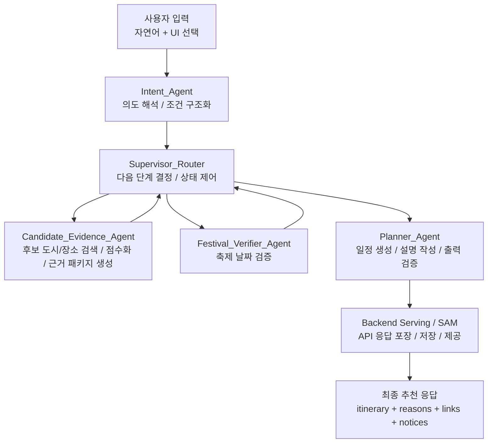
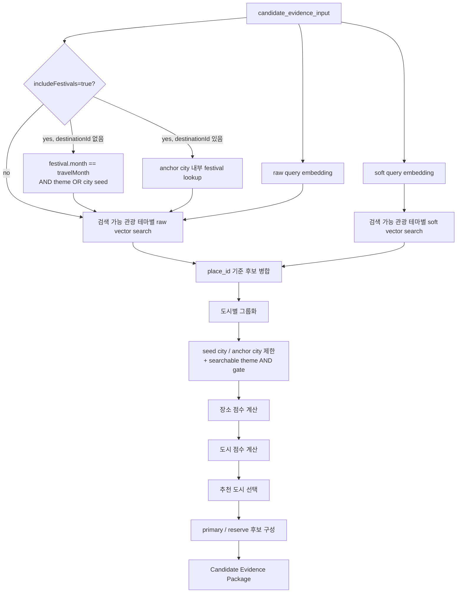

# Lovv Agent 통합 상세 설명서

> 목적: Lovv의 Agent 구조를 처음 보는 사람도 "사용자 입력이 어떻게 여행 추천 결과로 바뀌는지" 이해할 수 있도록, 전체 파이프라인과 핵심 Agent별 역할, Tool 활용, 입력/출력 계약을 하나의 문서로 설명한다.

## 문서 정보

| 항목 | 내용 |
| --- | --- |
| 문서 상태 | Draft |
| 대상 독자 | Agent 구조를 처음 보는 팀원, 발표 청중, 백엔드/API/프론트엔드 협업자 |
| 기준 문서 | [05_agent_spec.md](./05_agent_spec.md), [intent_agent.md](./intent_agent.md), [candidate_evidence_agent.md](./candidate_evidence_agent.md), [planner_agent.md](./planner_agent.md) |
| 핵심 범위 | 초기 입력, 최종 출력, Agent별 책임, Tool/Skill 활용, 상태 흐름, 검증 방식 |

---

## 1. Lovv Agent를 한 문장으로 설명하면

Lovv Agent는 사용자의 여행 요청을 바로 일정으로 쓰는 단일 LLM 호출이 아니라, **의도 해석 → 후보 근거 수집/랭킹 → 일정 생성/검증 → API 응답 포장**으로 이어지는 다단계 추천 파이프라인이다.

쉽게 말해, Lovv는 다음 순서로 움직인다.

1. 사용자가 무엇을 원하는지 정리한다.
2. 그 조건에 맞는 도시와 장소 후보를 데이터에서 찾는다.
3. 후보들이 실제로 조건을 얼마나 만족하는지 점수와 근거로 비교한다.
4. 가장 적절한 소도시 하나를 고르고, 그 안에서 여행 일정을 만든다.
5. 만들어진 일정과 설명이 근거 데이터에 맞는지 검증한다.
6. 프론트엔드가 바로 사용할 수 있는 최종 응답 형태로 내보낸다.

이 구조에서 중요한 점은 **LLM이 모든 것을 상상해서 추천하지 않는다는 것**이다.  
LLM은 사용자의 문장을 해석하거나 설명을 자연어로 만드는 데 쓰이고, 도시/장소 후보 검색, 점수 계산, 검증, 링크 생성 같은 부분은 정해진 Tool/Skill과 데이터 기반 로직이 담당한다.

---

## 2. 전체 Overview: 초기 입력과 최종 Output

### 2.1 초기 입력

Lovv Agent는 자연어 입력과 UI 입력을 함께 받는다. 사용자는 문장으로 말할 수도 있고, 화면에서 국가, 여행 월, 여행 유형, 테마 등을 선택할 수도 있다.

대표 입력은 다음과 같다.

| 입력 항목 | 예시 | 설명 |
| --- | --- | --- |
| `naturalLanguageQuery` | "조용한 바다랑 노포 맛집이 있는 1박2일 여행지 추천해줘" | 사용자의 자유 문장 |
| `country` | `KR`, `JP` | 추천 대상 국가 |
| `travelMonth` | `5` | 여행 예정 월 |
| `travelYear` | `2026` | 여행 예정 연도 |
| `tripType` | `daytrip`, `2d1n`, `3d2n` | 여행 기간 유형 |
| `themes` | `["바다·해안", "미식·노포"]` | 사용자가 선택한 테마 |
| `entryType` | `city_discovery`, `anchored_place_search` | 추천 진입 방식 |
| `destinationId` | `...` | 특정 도시/장소에서 시작할 때의 기준 ID |
| `includeFestivals` | `true`, `false` | 축제 포함 여부 |
| `userLocation` | 위도/경도 또는 지역명 | API 입력 기준 사용자 위치. Intent 단계에서 내부 `user_location`으로 정규화 가능 |

입력은 항상 완벽하지 않다. 예를 들어 사용자가 "가을에 조용한 곳"이라고만 말하면 국가, 월, 여행 기간이 부족할 수 있다. 이때 Lovv Agent는 바로 추천을 만들지 않고, 필요한 질문을 먼저 던질 수 있다.

### 2.2 최종 Output

최종 Output은 사용자에게 보여줄 여행 추천 응답이다. 핵심은 **한 개의 소도시를 중심으로 한 일정과 설명**이다.

| 출력 항목 | 설명 |
| --- | --- |
| `selected_destination` | 최종 추천된 도시 또는 목적지 |
| `itinerary` | 날짜/시간대별 추천 일정 |
| `alternativeItinerary` | MVP에서는 `null` 또는 빈 값 가능. 기상 대체 일정은 후속 고도화 후보 |
| `recommendationReasons` | 왜 이 도시를 추천했는지에 대한 설명 |
| `itineraryFlowReason` | 일정 순서와 밀도를 이렇게 구성한 이유 |
| `festivalDateVerifications` | 축제가 포함될 경우 날짜 검증 결과 |
| `externalLinks` | 지도, 숙소 검색, 선택 도시 맛집 검색 등 외부 연결 링크 |
| `confidence` | 추천 신뢰도 |
| `user_notice` | 조건 미충족, 후보 부족, 실시간 정보 한계 등 사용자에게 알려야 할 주의 사항 |

최종 응답의 핵심 원칙은 다음과 같다.

| 원칙 | 의미 |
| --- | --- |
| 한 도시 중심 | 여러 도시를 섞어 이동 부담이 큰 추천을 만들지 않는다. |
| 근거 기반 | 데이터에 없는 장소나 설명을 최종 사실처럼 만들지 않는다. |
| 검증 우선 | 축제 날짜, 국가 혼합, 장소 근거, 설명 일치 여부를 검증한다. |
| 한계 고지 | 숙소 가격, 예약 가능 여부, 실시간 혼잡도처럼 보장할 수 없는 정보는 명확히 분리한다. |

---

## 3. 전체 파이프라인

Lovv Agent는 다음과 같은 흐름으로 동작한다.



각 단계는 서로 다른 책임을 갖는다.

| 단계 | 핵심 질문 | 산출물 |
| --- | --- | --- |
| Intent Agent | "사용자가 정확히 어떤 여행을 원하는가?" | 구조화된 추천 조건 |
| Supervisor Router | "지금 어떤 Agent를 실행해야 하는가?" | 다음 노드, 상태 전이 |
| Candidate Evidence Agent | "조건에 맞는 도시와 장소 후보는 무엇인가?" | Candidate Evidence Package |
| Festival Verifier Agent | "축제 날짜가 목표 연도에 실제로 유효한가?" | 축제 검증 결과 |
| Planner Agent | "후보들을 어떻게 실제 일정으로 배치할 것인가?" | 일정, 설명, 검증 결과 |
| Backend Serving | "프론트엔드/API가 쓸 형태로 어떻게 제공할 것인가?" | 최종 응답 JSON |

---

## 4. 초심자를 위한 핵심 개념

### 4.1 Agent

Agent는 단순히 "LLM에게 질문하고 답을 받는 코드"가 아니다. Lovv에서 Agent는 다음을 모두 포함하는 실행 단위다.

| 구성 | 설명 |
| --- | --- |
| 역할 | 이 Agent가 해결해야 하는 문제 |
| 입력 계약 | 어떤 데이터를 받아야 하는지 |
| 출력 계약 | 다음 단계에 무엇을 넘겨야 하는지 |
| Tool 사용 | 검색, 점수 계산, 검증 등 외부 기능 호출 |
| 실패 처리 | 후보 없음, 입력 부족, 검증 실패 시 대응 방식 |

예를 들어 Planner Agent는 "여행 일정을 만들어라"가 역할이지만, 마음대로 장소를 지어낼 수 없다. 반드시 Candidate Evidence Agent가 넘겨준 후보 안에서 일정을 만들어야 한다.

### 4.2 Tool / Skill

Tool 또는 Skill은 Agent가 호출하는 기능이다. LLM이 직접 계산하거나 판단하기 어려운 일을 맡는다.

| Tool/Skill | 역할 |
| --- | --- |
| Destination Search Tool | S3 Vector attraction 검색, 테마 필터, 장소/도시 후보 조회 |
| DynamoLookupTool | DynamoDB festival seed 조회, 최종 배치 item 상세 정보 보강 |
| Scoring Skill | 도시와 장소 후보 점수 계산 |
| Matrix Transition Skill | 단계별 상태 전이 판단 |
| Festival Catalog Search / Web Search | 축제 날짜 검증용 검색 |
| Validation Skill | 최종 일정과 설명의 오류 검증 |
| Link Builder Skill | 지도/숙소 검색 링크 생성 |
| Output Packaging Skill | API 응답 형태로 포장 |

중요한 구분은 다음과 같다.

| Agent가 잘하는 일 | Tool/Skill이 잘하는 일 |
| --- | --- |
| 자연어 의도 해석 | DB/벡터 검색 |
| 설명 생성 | 정량 점수 계산 |
| 후보 근거 해석 | 규칙 기반 검증 |
| 사용자에게 읽기 쉬운 문장 작성 | 링크 생성, 포맷 변환 |

### 4.3 State

State는 파이프라인이 공유하는 현재 작업 상태다. 각 Agent가 자기 결과를 State에 기록하고, 다음 Agent는 그 값을 이어받아 사용한다.

대표 State 필드는 다음과 같다.

| 필드 | 설명 |
| --- | --- |
| `messages` | 최근 대화 메시지 |
| `conversation_summary` | 장기 대화를 압축한 요약 |
| `extracted_inputs` | Intent Agent가 정리한 사용자 조건 |
| `user_preferences` | 온보딩이나 이전 대화에서 얻은 선호 |
| `fulfilled_matrix` | evidence, festival, planning 진행 상태 |
| `target_region` | 현재 추천 대상 지역 |
| `candidate_evidence_package` | Candidate Evidence Agent가 만든 후보 근거 묶음 |
| `festival_verifications` | 축제 검증 결과 |
| `selected_destination` | 최종 선택 목적지 |
| `itinerary` | 최종 일정 |
| `recommendation_reasons` | 추천 이유 |
| `confidence` | 추천 신뢰도 |

Supervisor는 이 State를 보고 다음으로 실행할 Agent를 결정한다.

### 4.4 Fulfilled Matrix

`fulfilled_matrix`는 추천 생성에 필요한 주요 작업이 끝났는지 표시하는 간단한 상태표다.

| 값 | 의미 |
| --- | --- |
| `X` | 아직 처리해야 함 |
| `O` | 성공적으로 완료 |
| `△` | 완전하지는 않지만 대체 경로로 진행 가능 |
| `N/A` | 이 요청에는 해당 없음 |

Lovv에서는 기본적으로 다음 세 항목을 본다.

| 항목 | 의미 |
| --- | --- |
| `evidence` | 후보 도시/장소 근거 수집 완료 여부 |
| `festival` | 축제 검증 완료 여부 |
| `planning` | 일정 생성 및 검증 완료 여부 |

처리 우선순위는 보통 `evidence → festival → planning`이다.  
즉, 후보 근거가 없는데 일정을 먼저 만들지 않는다.

### 4.5 Candidate Evidence Package

Candidate Evidence Package는 Candidate Evidence Agent가 Planner Agent에게 넘기는 내부 데이터 묶음이다.

이 패키지는 최종 API 응답이 아니다. 사용자에게 그대로 보여주는 데이터도 아니다.  
Planner가 일정을 만들 수 있도록 정리된 **후보 도시/장소와 그 근거**다.

포함되는 대표 항목은 다음과 같다.

| 항목 | 설명 |
| --- | --- |
| `status` | 후보 수집 결과 상태 |
| `mode` | 도시 탐색인지, 특정 도시 고정인지 |
| `selected_city` | 추천 대상으로 선택된 도시 |
| `city_rankings` | 도시 후보별 점수와 순위 |
| `recommended_places` | Planner가 우선 사용할 장소 후보 |
| `reserve_places` | 후보 부족 시 사용할 예비 장소 |
| `coverage_audit` | 테마 커버리지, 할당량, 부족 여부 |
| `retrieval_audit` | 어떤 검색 쿼리와 Tool을 사용했는지 |
| `fallback_audit` | 후보 부족 시 어떤 fallback이 적용됐는지 |
| `warnings` | 주의해야 할 상황 |

---

## 5. Intent Agent: 사용자의 말을 추천 조건으로 바꾸는 단계

### 5.1 역할

Intent Agent는 Lovv Agent의 입구다.
API structured input, 사용자의 자연어, 온보딩 선호, 이전 대화 요약을 모아서 **추천 파이프라인이 이해할 수 있는 구조화된 입력**으로 바꾼다.

중요한 점은 Intent Agent가 여행지를 직접 고르지 않는다는 것이다.  
이 단계는 "추천을 만들 준비"를 하는 단계다.
또한 `country`, `travelMonth`, `tripType`, canonical `themes`, `includeFestivals`, `destinationId`, `userLocation`처럼 API가 이미 구조화해서 넘기는 core field는 자연어에서 새로 추론하지 않는다.

### 5.2 입력

Intent Agent는 다음 정보를 함께 본다.

| 입력 | 설명 |
| --- | --- |
| 현재 사용자 발화 | 방금 사용자가 입력한 자연어 |
| API structured input | 국가, 월, 여행 유형, 테마, 목적지 ID, 축제 포함 여부, 사용자 위치 등 |
| 대화 요약 | 이전 턴에서 합의된 조건 |
| 온보딩 선호 | 사용자가 평소 선호한다고 설정한 여행 스타일 |

입력 우선순위는 다음과 같다.

1. API structured input의 core field
2. API adapter가 정규화한 legacy field
3. 현재 턴 자연어의 보조 선호, 제외 조건, 명시적 변경 요청 신호
4. 이전 대화 요약과 온보딩 선호

예를 들어 API에서 `country=KR`이 왔는데 문장에 "일본으로 바꿔줘"가 있으면, Intent Agent가 조용히 `country`를 덮어쓰지 않는다.
변경 요청 신호로 기록하거나 확인 질문을 만들어 API structured input이 다음 턴에서 갱신되도록 한다.

### 5.3 출력

Intent Agent의 핵심 출력은 `candidate_evidence_input`이다.

```json
{
  "country": "KR",
  "travelMonth": 5,
  "travelYear": 2026,
  "tripType": "2d1n",
  "destinationId": null,
  "active_required_themes": ["바다·해안", "미식·노포"],
  "cleaned_raw_query": "조용한 바다와 노포 맛집이 있는 1박2일 여행지",
  "soft_preference_query": "조용한 분위기, 덜 붐비는 동선, 감성적인 바다 풍경",
  "unsupported_conditions": [],
  "user_location": null,
  "includeFestivals": false
}
```

### 5.4 Raw Query와 Soft Preference Query를 나누는 이유

Intent Agent는 사용자 문장을 두 갈래로 정리한다.

| 필드 | 의미 | 예시 |
| --- | --- | --- |
| `cleaned_raw_query` | 검색과 설명에 쓸 핵심 요청 | "바다 노포 맛집 1박2일 여행지" |
| `soft_preference_query` | 분위기, 취향, 감성 조건 | "조용한, 덜 붐비는, 여유로운" |

이렇게 나누는 이유는, 모든 문장 표현이 같은 성격의 조건은 아니기 때문이다.

예를 들어 "바다"는 관광지 후보를 찾는 데 직접적인 조건이고, "노포 맛집"은 현재 단계에서 선택 도시 맛집 검색 링크와 식사 CTA로 넘기는 미식 의도다.
반면 "조용한", "덜 붐비는", "감성적인"은 후보의 성격을 판단하는 보조 신호에 가깝다.

Candidate Evidence Agent는 raw/soft query를 서로 다른 근거 채널로 다루되, 실제 vector 검색은 `searchable_place_themes` 중심으로 수행한다.

### 5.5 Unsupported Conditions

Intent Agent는 현재 Lovv가 보장할 수 없는 조건을 별도로 분리한다.

예시는 다음과 같다.

| 조건 | 왜 분리하는가 |
| --- | --- |
| 숙소 가격 보장 | 실시간 가격/예약 가능 여부를 직접 보장할 수 없음 |
| 실시간 혼잡도 | 현재 시점의 혼잡도를 추천 근거로 확정할 수 없음 |
| 영업 중 보장 | 실시간 영업 상태는 별도 API 없이는 보장 불가 |
| 주차 가능 보장 | 장소별 실시간 주차 가능 여부를 확정할 수 없음 |

이런 조건은 검색 필터에 섞지 않고, 최종 응답의 `user_notice`나 외부 링크 안내로 분리한다.

### 5.6 Intent Agent가 하지 않는 일

| 하지 않는 일 | 이유 |
| --- | --- |
| 도시/장소 후보 검색 | Candidate Evidence Agent의 책임 |
| 후보 점수 계산 | Scoring Skill의 책임 |
| 일정 생성 | Planner Agent의 책임 |
| 축제 날짜 검증 | Festival Verifier Agent의 책임 |
| 숙소 예약/가격 추천 | 외부 서비스 또는 링크 안내 영역 |

---

## 6. Supervisor Router: 다음 실행 단계를 정하는 제어 노드

### 6.1 역할

Supervisor Router는 사용자의 요청을 직접 해석하거나 일정을 만들지 않는다.  
대신 State와 `fulfilled_matrix`를 보고 다음에 어떤 Agent를 실행해야 할지 결정한다.

쉽게 말하면, Supervisor는 파이프라인의 교통정리 담당이다.

### 6.2 판단 기준

Supervisor는 주로 다음 정보를 본다.

| 정보 | 판단 예시 |
| --- | --- |
| `fulfilled_matrix.evidence` | 후보 근거가 아직 없으면 Candidate Evidence Agent 실행 |
| `fulfilled_matrix.festival` | Candidate Evidence가 선택 도시의 축제 후보를 만든 뒤 Festival Verifier Agent 실행 |
| `fulfilled_matrix.planning` | 근거와 검증이 준비되면 Planner Agent 실행 |
| `validation_retry_count` | 검증 실패가 반복되면 안전한 fallback으로 전환 |
| `candidate_evidence_package.status` | 후보 없음, 후보 부족, 정상 상태에 따라 다음 단계 조정 |

`candidate_evidence_package.needs_clarification=true`이면 Supervisor는 Planner를 호출하지 않고 사용자 질문을 전달한 뒤 다음 턴을 기다린다.

### 6.3 Supervisor가 직접 들고 있지 않는 것

Supervisor는 다음을 직접 보관하거나 판단하지 않는 설계다.

| 직접 보관하지 않는 것 | 이유 |
| --- | --- |
| 전체 원문 대화 로그 | State와 Memory가 관리 |
| 원본 RAG 검색 결과 전체 | Candidate Evidence Agent와 Audit이 관리 |
| 원본 웹 검색 결과 전체 | Festival Verifier가 필요한 범위에서만 사용 |
| 최종 일정 세부 생성 로직 | Planner Agent의 책임 |

이렇게 역할을 제한해야 Agent 간 책임이 섞이지 않고, 검증과 디버깅이 쉬워진다.

---

## 7. Candidate Evidence Agent: 추천할 도시와 장소 근거를 만드는 단계

### 7.1 역할

Candidate Evidence Agent는 Intent Agent가 정리한 조건을 받아, 데이터 기반으로 추천 후보를 만든다.

이 Agent의 질문은 다음과 같다.

> "이 사용자의 조건을 만족할 가능성이 높은 도시는 어디이고, 그 도시 안에서 일정에 쓸 수 있는 장소 후보는 무엇인가?"

Candidate Evidence Agent는 최종 일정을 만들지 않는다.  
대신 Planner Agent가 사용할 수 있는 후보 묶음인 Candidate Evidence Package를 만든다.

### 7.2 입력

주요 입력은 Intent Agent가 만든 `candidate_evidence_input`이다.

| 입력 | 설명 |
| --- | --- |
| `country` | 국가 |
| `travelMonth` | 여행 월 |
| `tripType` | 여행 기간 |
| `destinationId` | 특정 목적지 고정 여부 |
| `includeFestivals` | 축제 포함 여부 |
| `active_required_themes` | API `themes`에서 온 canonical travel theme |
| `cleaned_raw_query` | 핵심 검색 쿼리 |
| `soft_preference_query` | 분위기/취향 검색 쿼리 |
| `user_location` | 거리 계산에 쓸 수 있는 사용자 위치 |

### 7.3 검색 모드

Candidate Evidence Agent는 상황에 따라 모드를 달리한다.

| 모드 | 언제 사용하나 | 결과 |
| --- | --- | --- |
| `city_discovery` | 사용자가 특정 도시를 고르지 않았을 때 | 여러 도시를 비교해 추천 도시 선택 |
| `anchored_place_search` | 사용자가 특정 도시/장소에서 출발했을 때 | 고정된 도시 안에서 장소 후보 구성 |
| `festival_seeded_city_discovery` | `includeFestivals=true`이고 목적지가 고정되지 않았을 때 | 월·테마 조건에 맞는 축제가 있는 도시만 먼저 남긴 뒤 그 안에서 장소 후보 검색과 scoring |

예를 들어 사용자가 "5월에 조용한 바다 여행지 추천"이라고 하면 `city_discovery`다.  
반면 "강릉 안에서 1박2일 코스 짜줘"라고 하면 `anchored_place_search`에 가깝다.
여기에 축제 포함을 선택하고 목적지가 고정되지 않았다면, 축제가 열리지 않는 도시는 검색 후보군에서 먼저 제외된다.

### 7.4 내부 처리 흐름

Candidate Evidence Agent의 현재 구현 방향은 다음과 같다.



여기서 핵심은 "그럴듯한 도시 이름을 LLM이 골라 쓰는 것"이 아니라, 검색된 장소 후보를 도시별로 묶고 점수화해서 선택한다는 점이다.
축제 포함 city discovery에서는 scoring 전에 축제 seed city pool이 먼저 확정되므로, 해당 월·테마에 맞는 축제가 없는 도시는 관광지 점수가 높아도 최종 도시가 될 수 없다.

### 7.5 Destination Search Tool

Candidate Evidence Agent가 관광지 후보를 찾을 때 사용하는 S3 Vector 검색 Tool이다.

| 기능 | 설명 |
| --- | --- |
| 벡터 검색 | raw query와 soft query에 가까운 장소 후보 검색 |
| 테마 필터 | 검색 가능한 관광 테마별 후보 제한 |
| 메타데이터 필터 | 국가, 도시, content type 등 조건 반영 |

이 Tool은 DynamoDB 조회, 점수 계산, 일정 생성, 사용자용 추천 이유 생성을 수행하지 않는다.
Lovv는 S3 Vector Index를 통해 후보를 빠르게 찾고, 최종 배치 후 필요한 상세 정보는 `DynamoLookupTool`로 원본 저장소에서 다시 가져온다.
현재 단계에서 `restaurant` 후보나 식당 table은 조회하지 않는다.
미식 요청은 선택 도시 기준 `foodSearch` 링크 생성 요구로 Planner에 전달된다.

### 7.5.1 DynamoLookupTool

`DynamoLookupTool`은 DynamoDB 조회를 전담하는 Tool이다.

| 기능 | 설명 |
| --- | --- |
| 축제 city seed 조회 | `includeFestivals=true`일 때 DynamoDB에서 `festival.month == travelMonth`와 theme OR 조건을 만족하는 축제 도시 후보 조회 |
| fixed-city festival lookup | `anchored_place_search`에서 선택 도시 내부의 축제 후보만 조회 |
| 최종 item detail enrichment | Planner가 최종 일정에 배치한 attraction item만 `ddb_pk`/`ddb_sk`로 상세 보강 |

이 Tool은 S3 Vector 검색, 점수 계산, 일정 생성, 후보 부족 fallback을 수행하지 않는다.

### 7.6 Scoring Skill

Scoring Skill은 후보를 정량적으로 비교한다.

도시 점수에는 다음 요소가 들어간다.

| 점수 요소 | 의미 |
| --- | --- |
| `semantic_evidence_score` | 검색 결과가 사용자 쿼리와 얼마나 의미적으로 가까운지 |
| `theme_coverage_score` | 검색 가능한 관광 테마를 얼마나 잘 포함하는지 |
| `theme_balance_score` | 특정 테마에만 치우치지 않는지 |
| `scale_correction` | 후보 수가 너무 많은 도시가 과도하게 유리해지지 않도록 보정 |
| `candidate_sufficiency_bonus` | 일정 구성에 충분한 후보가 있는지 |
| `distance_penalty` | 사용자 위치와 너무 멀 경우 감점 |
| `congestion_penalty` | 방문객/혼잡도 추정치가 높을 경우 감점 |

장소 점수에는 다음 요소가 들어간다.

| 점수 요소 | 의미 |
| --- | --- |
| raw similarity | 핵심 검색 쿼리와의 의미적 유사도 |
| soft similarity | 분위기/취향 쿼리와의 의미적 유사도 |
| theme match | 검색 가능한 관광 테마와의 일치도 |
| source quality | 후보 데이터가 설명/이미지/좌표 등 충분한 정보를 갖는지 |
| local distance penalty | 같은 도시 안에서 동선상 너무 불리한지 |

### 7.7 Theme Quota와 Reserve

추천 후보를 만들 때 특정 검색 가능 관광 테마가 결과를 독점하면 안 된다.
예를 들어 사용자가 `바다·해안`과 `역사·문화`를 함께 요구했는데, 해안 명소만 잔뜩 나오면 실제 요청을 만족하지 못한다.

그래서 Candidate Evidence Agent는 primary 관광지 후보를 구성할 때 `searchable_place_themes` 기준 최소 할당량과 완화 가능한 최대 할당량을 둔다.
현재 `미식·노포`는 관광지 후보 검색 테마가 아니라, 선택 도시 기준 `foodSearch` 링크와 식사 슬롯 CTA로 Planner에 전달되는 `external_link_themes`로 분리한다.

| 개념 | 설명 |
| --- | --- |
| primary 후보 | Planner가 우선 사용하는 장소 후보 |
| reserve 후보 | 후보 부족이나 일정 슬롯 보완에 쓰는 예비 후보 |
| min quota | 각 검색 가능 관광 테마가 최소한 포함되어야 하는 후보 수 |
| soft max quota | 한 관광 테마가 primary 후보를 과도하게 차지하지 않게 하는 완화 가능한 상한 |

현재 설계에서 quota는 primary 후보에 적용된다.  
reserve 후보는 남은 후보 중 점수가 높은 것들을 보관해 Planner의 fallback 재료로 쓴다.

### 7.8 Candidate Evidence Package 출력

Candidate Evidence Agent는 다음과 같은 패키지를 만든다.

```json
{
  "status": "ok",
  "mode": "city_discovery",
  "selected_city": {
    "city_id": "KR-...",
    "name": "예시 소도시",
    "country": "KR"
  },
  "city_rankings": [],
  "recommended_places": [],
  "reserve_places": [],
  "festival_candidates": [],
  "selected_festival_candidates": [],
  "coverage_audit": {
    "required_themes": ["바다·해안", "미식·노포"],
    "searchable_place_themes": ["바다·해안"],
    "external_link_themes": ["미식·노포"],
    "primary_theme_counts": {},
    "min_quota_shortfalls": []
  },
  "festival_seed_audit": {},
  "retrieval_audit": {
    "cleaned_raw_query": "바다 노포 맛집 1박2일 여행지",
    "soft_preference_query": "조용한 분위기, 덜 붐비는 동선"
  },
  "fallback_audit": {
    "applied": false
  },
  "warnings": []
}
```

이 JSON은 사용자가 직접 보는 최종 응답이 아니라, Planner에게 넘겨지는 내부 계약이다.

### 7.9 상태값 처리

Candidate Evidence Package의 `status`는 이후 흐름에 큰 영향을 준다.

| 상태 | 의미 | 다음 처리 |
| --- | --- | --- |
| `ok` | 일정 구성에 충분한 후보가 있음 | Planner가 정상 일정 생성 |
| `insufficient_candidates` | 후보가 부족하지만 일부 추천은 가능 | Planner가 축소 일정, notice, 낮은 confidence 적용 |
| `no_candidate` | 조건을 만족하는 후보가 없음 | `needs_clarification=true`이면 사용자 질문 후 대기. 그 외에는 일정 생성 없이 안전 폴백 |
| `error` | AWS/API/런타임 오류 | 안전한 실패 응답 또는 재시도 |

---

## 8. Festival Verifier Agent: 축제 날짜를 별도로 검증하는 단계

### 8.1 왜 별도 Agent가 필요한가

축제 정보는 일반 장소 정보보다 시간 의존성이 강하다.  
같은 축제라도 매년 날짜가 바뀔 수 있고, 운영 여부가 변경될 수도 있다.

따라서 Lovv는 축제를 일반 장소 추천과 똑같이 처리하지 않는다.
사용자가 `includeFestivals=true`를 선택하면 Candidate Evidence Agent가 먼저 여행 월과 테마에 맞는 축제 후보를 찾고, 최종 선택 도시의 `selected_festival_candidates`만 Festival Verifier Agent에 넘긴다.
Festival Verifier Agent는 이 후보들이 목표 연도에 실제로 유효한지 검증한다.

### 8.2 처리 원칙

| 원칙 | 설명 |
| --- | --- |
| 확인된 축제만 일정에 배치 | `confirmed` 상태가 아니면 확정 일정으로 넣지 않음 |
| 날짜 불확실성 고지 | 확인되지 않은 날짜는 `user_notice`로 분리 |
| 도시 검색과 분리 | Verifier는 도시 seed나 city ranking을 다시 수행하지 않음 |
| 선택 도시 한정 | Candidate Evidence가 넘긴 최종 선택 도시의 축제 후보만 검증 |

Festival Verifier의 결과는 `festival_verifications`로 State에 저장되고, Planner가 일정을 만들 때 참고한다.

---

## 9. Planner Agent: 후보 근거를 실제 여행 일정으로 바꾸는 단계

### 9.1 역할

Planner Agent는 Candidate Evidence Package를 받아 최종 사용자 경험에 가까운 결과를 만든다.

Planner의 핵심 질문은 다음과 같다.

> "이미 선택된 도시와 후보 장소를 사용해, 사용자가 이해하기 쉬운 여행 일정과 추천 이유를 어떻게 만들 것인가?"

Planner는 검색 Agent가 아니다.  
새로운 도시나 장소를 찾아오지 않고, Candidate Evidence Agent가 넘긴 후보 안에서만 일정을 만든다.

### 9.2 입력

Planner는 다음 정보를 사용한다.

| 입력 | 설명 |
| --- | --- |
| `candidate_evidence_package.status` | 후보 상태 |
| `mode` | `city_discovery`, `anchored_place_search`, `festival_seeded_city_discovery` |
| `selected_city` | 최종 추천 대상 도시 |
| `recommended_places` | 우선 사용할 관광지 후보 |
| `reserve_places` | 부족할 때 사용할 예비 관광지 후보 |
| `selected_festival_candidates` | Festival Verifier가 검증할 선택 도시의 축제 후보 |
| `coverage_audit` | 테마별 후보 충족 여부 |
| `fallback_audit` | 후보 부족으로 대체 로직이 쓰였는지 |
| `tripType` | 당일치기, 1박2일, 2박3일 등 |
| `travelMonth`, `travelYear` | 여행 시점 |
| `active_required_themes` | 사용자가 요구한 테마 |
| `festival_verifications` | 검증된 축제 정보 |
| `unsupported_conditions` | 최종 안내로 분리해야 할 조건 |

### 9.3 일정 생성 방식

Planner는 여행 기간에 맞는 슬롯 템플릿을 선택한다.

예를 들어 `2d1n`이면 다음과 같은 구조가 가능하다.

| Day | Slot | 후보 사용 방식 |
| --- | --- | --- |
| Day 1 | 오전 | 대표 명소 또는 도착 후 가벼운 장소 |
| Day 1 | 점심 | 선택 도시 맛집 검색 CTA 또는 식사 placeholder |
| Day 1 | 오후 | 핵심 테마 명소 |
| Day 1 | 저녁 | 맛집 검색 CTA, 자유 식사, 또는 야간 산책 |
| Day 2 | 오전 | 실내/자연/문화 후보 |
| Day 2 | 점심 | 선택 도시 맛집 검색 CTA 또는 식사 placeholder |
| Day 2 | 오후 | 마무리 방문지 |

Planner는 후보를 다음 순서로 사용한다.

1. `recommended_places`를 먼저 사용한다.
2. 슬롯이 부족하면 `reserve_places`를 사용한다.
3. 그래도 부족하면 이름 없는 placeholder를 만든다.
4. 식사 슬롯은 특정 식당명을 생성하지 않고, `foodSearch` 링크 CTA 또는 placeholder로 둔다.
5. placeholder는 실제 장소처럼 꾸미지 않고, "자유 시간", "현지 식당 탐색"처럼 안전하게 표현한다.

### 9.4 `미식·노포` 테마의 특별 처리

`미식·노포`는 일반 관광지 테마와 다르게 다룬다.

현재 단계에서 `미식·노포`는 Candidate Evidence가 restaurant table이나 식당 후보를 조회해 처리하지 않는다.
Planner는 이 테마를 선택 도시 기준 `foodSearch` 링크와 식사 슬롯 CTA로 표현한다.

| 상황 | 처리 |
| --- | --- |
| 미식과 관광 테마가 함께 있음 | 관광 테마는 관광 슬롯에 배치하고, 미식은 식사 CTA와 `foodSearch` 링크로 반영 |
| 관광 후보가 부족함 | 일정 밀도를 낮추고 자유시간/산책 placeholder를 사용 |
| `foodSearch` 링크 생성 실패 | 식당 이름을 지어내지 않고 placeholder와 `user_notice`로 안내 |

이 처리가 없으면 존재하지 않는 식당을 추천하거나, 반대로 사용자가 원한 미식 조건이 일정에서 사라질 수 있다.

### 9.5 축제 배치

Planner는 축제를 다음 기준으로 다룬다.

| 축제 상태 | 처리 |
| --- | --- |
| `confirmed` | 일정에 확정 배치 가능 |
| 날짜 미확인 | 일정에 확정 배치하지 않고 notice로 안내 |
| 목표 연도와 불일치 | 추천 근거로 사용하지 않음 |

축제가 확정되지 않았는데 "이 날짜에 열리는 축제입니다"라고 말하면 안 된다.  
이 부분은 Lovv의 validation-first 원칙에서 중요한 안전 장치다.

축제는 관광 baseline을 먼저 배치한 뒤 overlay하는 방식으로 넣는다.
Planner는 축제를 이용해 도시를 다시 선택하지 않는다.
`festival_seeded_city_discovery`에서는 Candidate Evidence가 이미 축제 seed 도시군 안에서 `selected_city`를 골랐고, `anchored_place_search`에서는 사용자가 고정한 도시를 유지한다.

### 9.6 대안 일정

MVP 단계에서 Planner는 기본 일정을 우선 생성한다.
`alternativeItinerary`는 `null` 또는 빈 값으로 둘 수 있으며, 기상 대체 일정은 후속 고도화 후보로 둔다.

후속 고도화에서 대안 일정은 다음 상황에서 유용하다.

| 상황 | 대안 일정 방향 |
| --- | --- |
| 비나 날씨 변수 | 실내, 문화, 공방, 카페 등 실내 후보 중심 |
| 야외 후보 부족 | 밀도를 낮추고 식사/휴식 슬롯 보강 |
| 후보 부족 | reserve 후보 또는 안전한 placeholder 활용 |

단, 같은 도시 안에서만 대안을 만든다.
대안 일정을 만들기 위해 갑자기 다른 도시를 섞지 않는다.

### 9.7 설명 생성

Planner는 일정뿐 아니라 "왜 이 추천이 적절한가"도 설명한다.

| 설명 항목 | 내용 |
| --- | --- |
| `recommendationReasons` | 도시가 사용자 조건과 맞는 이유 |
| `itineraryFlowReason` | 일정 순서와 밀도에 대한 이유 |
| `user_notice` | 후보 부족, 축제 미확인, 실시간 정보 한계 등 |
| `confidence` | 추천 신뢰도 |

좋은 설명은 다음을 만족해야 한다.

1. 실제 후보와 일정에 있는 장소를 근거로 말한다.
2. 사용자가 요구한 테마와 어떤 관련이 있는지 설명한다.
3. 부족한 조건은 숨기지 않고 알려준다.
4. 경로 최적화나 실시간 정보처럼 검증하지 않은 것을 과장하지 않는다.

### 9.8 검증

Planner는 결과를 만든 뒤 검증을 거친다.

검증 항목은 크게 두 종류다.

| 검증 | 설명 |
| --- | --- |
| deterministic validation | 규칙으로 확인 가능한 검증 |
| semantic validation | 설명과 일정의 의미적 일치 여부 검증 |

Deterministic validation 예시는 다음과 같다.

| 항목 | 실패 예시 |
| --- | --- |
| 한 도시 원칙 | 하루는 강릉, 다음 날은 통영으로 이동 |
| 장소 grounding | 후보에 없는 장소를 일정에 포함 |
| 축제 검증 | 미확인 축제를 확정 일정으로 배치 |
| 숙소 정책 | 특정 숙소 가격/예약 가능을 보장 |
| no_candidate 처리 | 후보가 없는데 일정을 만들어냄 |

Semantic validation 예시는 다음과 같다.

| 항목 | 실패 예시 |
| --- | --- |
| 설명-일정 일치 | "해안 중심"이라고 설명했지만 실제 일정에는 해안 장소가 없음 |
| hallucination | 데이터에 없는 특징을 도시 장점으로 단정 |
| route overclaim | 실제 거리 계산 없이 "최적 동선"이라고 주장 |
| fallback safety | 후보 부족을 숨기고 완벽한 추천처럼 표현 |

검증 실패 시 Planner는 가능한 경우 다시 작성하거나 후보를 교체한다.  
반복 실패하면 안전한 fallback 응답으로 전환한다.

---

## 10. Backend Serving / SAM: 최종 API 응답으로 포장하는 단계

Backend Serving 단계는 Planner 결과를 프론트엔드와 저장소가 사용하기 쉬운 형태로 정리한다.

대표 작업은 다음과 같다.

| 작업 | 설명 |
| --- | --- |
| 응답 포장 | itinerary, reasons, confidence, notice 등을 API 스키마에 맞춤 |
| 링크 생성 결과 연결 | 지도 링크, 숙소 검색 링크 등 포함 |
| 저장 | 필요한 경우 MySQL 등 서비스 저장소에 기록 |
| UI 전달 | 프론트엔드가 바로 렌더링 가능한 JSON 제공 |

이 단계는 추천 판단을 새로 하지 않는다.  
이미 Planner에서 생성 및 검증된 결과를 서비스 응답으로 만드는 역할이다.

---

## 11. Agent별 입출력 계약 요약

### 11.1 전체 입출력 흐름

| From | To | 전달 데이터 | 목적 |
| --- | --- | --- | --- |
| User/UI | Intent Agent | 자연어, UI 입력, 온보딩 선호 | 추천 조건 구조화 |
| Intent Agent | Supervisor | `candidate_evidence_input`, `fulfilled_matrix` | 다음 단계 결정 |
| Supervisor | Candidate Evidence Agent | 구조화된 추천 조건 | 후보 도시/장소 검색 |
| Candidate Evidence Agent | Supervisor/Planner | `candidate_evidence_package` | 일정 생성 재료 제공 |
| Supervisor | Festival Verifier | 축제 검증 요청 | 날짜/운영 여부 확인 |
| Festival Verifier | Planner | `festival_verifications` | 확정 축제만 일정에 반영 |
| Planner | Backend | 일정, 설명, 검증 결과 | API 응답 포장 |
| Backend | Frontend/User | 최종 추천 응답 | 화면 표시 |

### 11.2 세부 Agent 책임 비교

| Agent | 핵심 책임 | 하지 않는 일 |
| --- | --- | --- |
| Intent Agent | 사용자 의도와 조건을 구조화 | 도시 검색, 일정 생성 |
| Candidate Evidence Agent | 후보 도시/장소 검색, 점수화, 패키징 | 최종 일정 작성, 사용자용 설명 생성 |
| Festival Verifier Agent | 축제 날짜 검증 | 일반 장소 랭킹 |
| Planner Agent | 일정 생성, 설명 작성, 출력 검증 | 새 장소 검색, 축제 날짜 임의 확정 |
| Supervisor Router | 다음 노드 결정, 상태 전이 | 원문 데이터 직접 해석, 일정 작성 |
| Backend Serving | 응답 포장, 저장, 제공 | 추천 로직 재판단 |

---

## 12. Tool/Skill 활용 지도

| Tool/Skill | 주로 사용하는 Agent | 사용 목적 | 결과가 영향을 주는 부분 |
| --- | --- | --- | --- |
| Bedrock Converse Adapter | Intent, Candidate Evidence, Planner | 모델 호출 인터페이스 통일 | 의도 해석, 근거 해석, 설명 생성 |
| Destination Search Tool | Candidate Evidence | 관광지 후보 S3 Vector 검색 | `recommended_places`, `reserve_places` |
| DynamoLookupTool | Candidate Evidence, Planner | 축제 city seed 조회, 최종 배치 item 상세 정보 보강 | `festival_candidates`, Planner가 사용할 장소 상세 |
| S3 Vector Search | Candidate Evidence | raw/soft query 기반 의미 검색 | 후보 수집, semantic score |
| Scoring Skill | Candidate Evidence | 도시/장소 점수 계산 | `selected_city`, 후보 순위 |
| Weather Trends Skill | Candidate Evidence, Planner | 계절/날씨 경향 참고 | 향후 대안 일정 및 점수 보조 |
| Matrix Transition Skill | Supervisor | `fulfilled_matrix` 상태 전이 | 다음 Agent 선택 |
| Festival Search/Verifier | Festival Verifier | 축제 날짜 확인 | 일정 배치 가능 여부 |
| Validation Skill | Planner | 최종 일정/설명 검증 | 재작성, fallback, confidence |
| Link Builder Skill | Planner/Backend | 지도/숙소/맛집 검색 링크 생성 | `externalLinks.map`, `externalLinks.staySearch`, `externalLinks.foodSearch` |
| Output Packaging Skill | Backend | API 응답 스키마 구성 | 최종 응답 JSON |

---

## 13. 예시로 보는 End-to-End 흐름

### 13.1 사용자 요청

> "5월에 1박2일로 조용한 바다도 보고, 노포 맛집도 갈 수 있는 국내 소도시 추천해줘."

### 13.2 Intent Agent 결과

Intent Agent는 이 요청을 다음처럼 구조화한다.

| 필드 | 값 |
| --- | --- |
| `country` | `KR` |
| `travelMonth` | `5` |
| `tripType` | `2d1n` |
| `active_required_themes` | `["바다·해안", "미식·노포"]` |
| `cleaned_raw_query` | "5월 1박2일 국내 소도시 바다 노포 맛집" |
| `soft_preference_query` | "조용한 분위기, 덜 붐비는 바다, 여유로운 동선" |
| `includeFestivals` | `false` |
| `unsupported_conditions` | `[]` |

그리고 `fulfilled_matrix`를 다음처럼 초기화한다.

| 항목 | 값 |
| --- | --- |
| `evidence` | `X` |
| `festival` | `N/A` |
| `planning` | `X` |

### 13.3 Candidate Evidence Agent 결과

Candidate Evidence Agent는 다음을 수행한다.

1. `바다·해안` 테마 후보를 raw/soft query로 검색한다.
2. `미식·노포`는 관광지 후보 검색에서 제외하고 `external_link_themes`로 분리한다.
3. 후보를 도시별로 묶는다.
4. 검색 가능한 관광 테마를 만족하는 도시를 우선 본다.
5. 도시 점수와 장소 점수를 계산한다.
6. 최종 추천 도시와 primary/reserve 관광지 후보를 만든다.
7. 선택 도시 기준 `foodSearch` 링크 생성 요구를 Planner에 넘긴다.

예시 결과는 다음과 같은 형태다.

| 항목 | 예시 |
| --- | --- |
| `status` | `ok` |
| `selected_city` | "예시 해안 소도시" |
| `recommended_places` | 해안 명소, 전망지, 산책 장소 등 관광지 후보 |
| `reserve_places` | 실내 장소, 예비 전망지, 산책 장소 등 |
| `coverage_audit` | 바다·해안은 `searchable_place_themes`, 미식·노포는 `external_link_themes`로 분리됐는지 기록 |

### 13.4 Planner Agent 결과

Planner는 Candidate Evidence Package를 사용해 다음처럼 구성한다.

| 일정 슬롯 | 배치 원칙 |
| --- | --- |
| Day 1 오전 | 이동 후 부담이 적은 해안 명소 |
| Day 1 점심 | 선택 도시 맛집 검색 CTA 또는 식사 placeholder |
| Day 1 오후 | 대표 바다·해안 후보 |
| Day 1 저녁 | `foodSearch` 링크와 함께 자유 식사/현지 맛집 탐색 |
| Day 2 오전 | 산책/전망/실내 대안 후보 |
| Day 2 점심 | 선택 도시 맛집 검색 CTA 또는 식사 placeholder |
| Day 2 오후 | 귀가 전 짧게 들를 수 있는 장소 |

그리고 설명을 만든다.

| 설명 | 내용 |
| --- | --- |
| 추천 이유 | 바다 테마와 미식 테마를 모두 만족하는 도시라는 점 |
| 동선 이유 | 1박2일에 맞게 첫날 핵심 장소, 둘째 날 가벼운 장소로 구성했다는 점 |
| 주의 사항 | 실시간 혼잡도나 식당 영업 여부는 외부 링크에서 별도 확인 필요 |
| 신뢰도 | 후보 충분성과 검증 결과에 따라 숫자 confidence로 표현 |

### 13.5 최종 응답

최종적으로 프론트엔드는 다음을 받는다.

```json
{
  "selected_destination": {},
  "itinerary": [],
  "alternativeItinerary": null,
  "explainability": {
    "recommendationReasons": [],
    "itineraryFlowReason": "",
    "confidence": 0.86,
    "user_notice": []
  },
  "festivalDateVerifications": [],
  "externalLinks": {
    "map": "",
    "staySearch": "",
    "foodSearch": ""
  }
}
```

### 13.6 축제 포함 요청이면 무엇이 달라지나

사용자가 같은 조건에서 `includeFestivals=true`를 선택하면 Candidate Evidence 흐름이 먼저 달라진다.

```text
includeFestivals=true
destinationId 없음
→ festival.month == travelMonth
→ DynamoLookupTool이 사용자 travel theme OR 조건으로 축제 후보 조회
→ 축제가 있는 city seed pool 생성
→ seed city pool 안에서만 관광지 후보 retrieve/scoring
→ selected_city 결정
→ selected_city의 selected_festival_candidates만 Festival Verifier로 전달
```

이 경우 축제가 열리지 않는 도시는 관광지 점수가 높아도 `selected_city`가 될 수 없다.
월·테마 조건을 만족하는 축제 city seed가 하나도 없으면 Candidate Evidence는 일반 추천으로 몰래 완화하지 않고 `needs_clarification=true`와 질문을 반환한다.
Supervisor는 이때 Festival Verifier나 Planner를 호출하지 않고 사용자 응답을 기다린다.

---

## 14. 설계상 중요한 안전 규칙

Lovv Agent 구조에서 반드시 지켜야 하는 규칙은 다음과 같다.

| 규칙 | 이유 |
| --- | --- |
| 전체 대화 원문을 Supervisor에 그대로 넘기지 않는다 | 제어 노드가 과도하게 많은 비정형 데이터를 들고 있으면 추적이 어려워짐 |
| RAG 원본 결과 전체를 장기 Memory에 저장하지 않는다 | 비용, 개인정보, 디버깅 복잡도 문제 |
| Candidate Evidence에 없는 장소를 Planner가 만들지 않는다 | hallucination 방지 |
| 검증되지 않은 축제를 확정 일정으로 넣지 않는다 | 날짜 오류 방지 |
| 한 추천 결과 안에서 국가나 도시를 무리하게 섞지 않는다 | Lovv의 소도시 집중 추천 원칙 유지 |
| 실시간 날씨/혼잡도/영업 여부를 확정 사실처럼 말하지 않는다 | 데이터 신뢰성 한계 고지 |
| 후보 부족을 숨기지 않는다 | 사용자 신뢰와 설명 가능성 확보 |

---

## 15. 자주 헷갈리는 포인트

### 15.1 "Intent Agent가 추천 도시를 고르나요?"

아니다.  
Intent Agent는 추천 조건을 구조화할 뿐이다. 추천 도시 선택은 Candidate Evidence Agent의 검색과 점수화 결과에서 나온다.

### 15.2 "Candidate Evidence Package가 최종 API 응답인가요?"

아니다.  
Candidate Evidence Package는 Planner가 일정을 만들기 위한 내부 입력이다. 최종 사용자 응답은 Planner와 Backend를 거친 뒤 만들어진다.

### 15.3 "Planner가 부족한 장소를 새로 검색해도 되나요?"

기본 원칙상 안 된다.  
Planner는 검색 Agent가 아니며, Candidate Evidence Agent가 제공한 `recommended_places`와 `reserve_places` 안에서 일정을 구성한다.

### 15.4 "미식·노포는 관광지처럼 배치하나요?"

대부분의 경우 아니다.  
현재 단계에서 `미식·노포`는 restaurant table이나 식당 후보 조회로 처리하지 않는다.
Planner는 선택 도시 기준 `foodSearch` 링크와 식사 슬롯 CTA/placeholder로 미식 의도를 반영한다.

### 15.5 "축제는 장소 후보와 동일하게 다루나요?"

아니다.  
축제는 날짜 검증이 중요하므로 Festival Verifier Agent를 통해 별도로 확인한다.
다만 축제 포함 city discovery에서는 그 전에 Candidate Evidence가 `DynamoLookupTool`을 통해 `festival.month == travelMonth`와 사용자 테마 OR 조건으로 축제 city seed를 먼저 만든다.
확인되지 않은 축제는 확정 일정에 넣지 않는다.

### 15.6 "실시간 WeatherAPI는 추천 점수에 쓰이나요?"

현재 설계에서 실시간 WeatherAPI는 추천 점수의 핵심 근거가 아니라 표시나 참고용에 가깝다.  
추천 점수에는 사전 구축된 데이터, 검색 결과, 계절/날씨 경향 같은 안정적인 정보가 더 적합하다.

---

## 16. 발표용 압축 설명

발표에서 1분 내로 전체 구조를 설명해야 한다면 다음처럼 말할 수 있다.

> Lovv의 Agent는 사용자의 문장을 바로 일정으로 바꾸는 단일 모델 호출이 아니라, Intent Agent가 API 입력과 자연어 보조 선호를 구조화하고, Candidate Evidence Agent가 데이터 기반으로 도시와 관광지 후보를 찾고 점수화한 뒤, Planner Agent가 그 후보만 사용해 일정과 설명을 만들고 검증하는 파이프라인입니다. Supervisor는 각 단계의 상태를 보고 다음 Agent를 실행하며, 축제 포함 요청은 먼저 월·테마 기준 city seed로 좁힌 뒤 별도 Verifier에서 목표 연도 날짜를 확인합니다. 미식은 식당 후보를 직접 추천하지 않고 선택 도시 기준 맛집 검색 링크로 제공합니다.

좀 더 자세히 3분 정도 설명한다면 다음 순서가 좋다.

1. 사용자는 자연어와 UI 선택으로 여행 조건을 입력한다.
2. Intent Agent는 API structured input을 정본으로 사용하고, 자연어에서는 `raw query`, `soft preference`, 제외 조건, 변경 요청 신호를 정리한다.
3. Supervisor는 후보 근거가 필요하다고 판단해 Candidate Evidence Agent를 실행한다.
4. Candidate Evidence Agent는 축제 포함이면 월·테마 city seed를 먼저 적용하고, 관광지 벡터 검색과 점수화로 추천 도시와 primary/reserve 후보를 만든다.
5. 축제가 필요한 경우 Festival Verifier가 선택 도시의 축제 후보만 목표 연도 기준으로 검증한다.
6. Planner Agent는 후보만 사용해 일정, 추천 이유, 주의 사항을 만들고, 미식은 `foodSearch` 링크와 식사 CTA로 처리한다.
7. Validation을 통과한 결과만 Backend가 최종 API 응답으로 제공한다.

---

## 17. 구현과 문서에서 확인할 위치

| 확인하고 싶은 내용 | 기준 문서 |
| --- | --- |
| 전체 Agent 구조와 State | [05_agent_spec.md](./05_agent_spec.md) |
| 사용자 입력 해석과 조건 구조화 | [intent_agent.md](./intent_agent.md) |
| 후보 검색, 랭킹, Candidate Evidence Package | [candidate_evidence_agent.md](./candidate_evidence_agent.md) |
| 일정 생성, 설명, 검증 | [planner_agent.md](./planner_agent.md) |

---

## 18. 핵심 요약

Lovv Agent의 핵심은 역할 분리다.

| 역할 | 담당 |
| --- | --- |
| 사용자의 말 이해 | Intent Agent |
| 다음 단계 제어 | Supervisor Router |
| 도시/관광지 후보 근거 수집 | Candidate Evidence Agent |
| 축제 날짜 확인 | Festival Verifier Agent |
| 일정과 설명 생성 | Planner Agent |
| 응답 포장 | Backend Serving |

이 구조 덕분에 Lovv는 다음 장점을 얻는다.

1. 추천 결과가 데이터 근거에 연결된다.
2. Agent별 실패 원인을 추적하기 쉽다.
3. 후보 부족, 축제 미검증, 실시간 정보 한계 같은 문제를 사용자에게 숨기지 않는다.
4. 향후 Weather Trends, 더 정교한 거리 계산, 개인화 Memory 등을 각 단계에 독립적으로 확장할 수 있다.

결론적으로 Lovv Agent는 "좋아 보이는 여행 일정을 말로 만들어내는 시스템"이 아니라, **사용자 의도를 구조화하고, 데이터 근거를 수집하고, 그 근거 안에서 일정을 생성하며, 검증을 통과한 결과만 제공하는 추천 파이프라인**이다.
