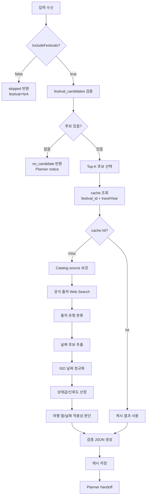

# Festival Verifier Agent 명세서

> 문서 성격: 보조 Markdown
> 대표 문서: `05_agent_spec.md`

> 문서 버전: v0.4
> 문서 상태: Draft / Festival Verifier Agent 상세 정본 초안
> 작성일: 2026-06-13
> 기준 문서: `05_agent_spec.md`, `langgraph_flow.md`, `candidate_evidence_agent.md`, `planner_agent.md`, `agent_build_target.md`, `agent_harness_design.md`

## 1. 문서 목적

본 문서는 Lovv 추천 Agent에서 `Festival_Verifier_Agent`가 수행해야 하는 축제 날짜 검증 책임을 상세화한 정본 초안이다.

축제는 일반 관광지와 다르다. 장소는 대체로 상시 존재하지만, 축제는 특정 연도와 특정 기간에만 열린다. 같은 축제라도 매년 개최일이 바뀔 수 있고, 취소, 연기, 축소, 명칭 변경이 발생할 수 있다.

따라서 Lovv는 축제를 일반 장소 RAG 검색 결과와 동일하게 확정하지 않는다. `Festival_Verifier_Agent`는 Candidate Evidence 단계에서 올라온 축제 후보 중 필요한 상위 후보만 대상으로, 목표 여행 연도의 개최 기간을 공식 출처 중심으로 검증하고 Planner가 안전하게 사용할 수 있는 검증 JSON을 만든다.

`includeFestivals=true`인 city discovery에서는 Candidate Evidence Agent가 먼저 `festival.month == travelMonth`와 사용자 테마 OR 조건으로 축제 도시 seed를 만들고, 그 seed 도시들 안에서 장소 evidence 검색과 scoring을 수행한다. Festival Verifier는 이 도시 seed를 새로 만들거나 도시 ranking을 다시 수행하지 않는다. Verifier의 역할은 최종 `selected_city`에 속한 `selected_festival_candidates`의 목표 연도 개최 여부와 여행 기간 적용성을 검증하는 것이다.

초기 구현 단계에서는 외부 웹 검증 범위를 넓히지 않고, DynamoDB에 적재된 축제 detail의 시작일자 데이터를 먼저 확인한다. 이때 입력으로 들어온 `travelYear`와 축제 `start_date`의 연도가 일치하는지만 최소 검증 조건으로 사용하며, 공식 웹 출처 재확인은 이후 확장 단계로 둔다.

핵심 목표는 다음과 같다.

1. 목표 연도 기준 축제 개최 기간을 확인한다.
2. 공식 출처와 보조 출처의 신뢰도를 구분한다.
3. 검증되지 않은 축제가 확정 일정에 들어가지 않게 막는다.
4. 긴 웹 검색 원문을 downstream Agent에 넘기지 않고, 최소 검증 결과만 전달한다.
5. 반복 검증 비용을 줄이기 위해 `festival_id + travelYear` 단위로 캐시한다.

## 2. 그래프 내 위치

`Festival_Verifier_Agent`는 Candidate Evidence와 Planner 사이에 위치한다.

```text
Intent_Agent
→ Supervisor_Router
→ Candidate_Evidence_Agent
→ Festival_Verifier_Agent 또는 skip
→ Planner_Agent
→ Backend_Serving
```

라우팅 관점에서 Festival Verifier는 다음 조건에서 실행된다.

| 조건 | 처리 |
| --- | --- |
| `includeFestivals=false` | 실행하지 않음. `fulfilled_matrix.festival=N/A` |
| `includeFestivals=true`이고 `selected_festival_candidates`가 있음 | 최종 선택 도시의 상위 K개 후보 검증 |
| 축제 후보가 없지만 축제 포함 요청이 있음 | Web Search를 무제한 수행하지 않고 `no_candidate` 결과로 Planner에 안내. 단, 일반 city discovery의 축제 월·테마 seed 생성 실패는 Candidate Evidence 단계에서 먼저 사용자 질문 fallback으로 처리될 수 있음 |
| Candidate Evidence가 `no_candidate` 또는 `error` | Festival Verifier는 일반적으로 실행하지 않고 Supervisor가 안전 폴백으로 전환 |

Festival Verifier의 결과는 `festival_verifications`에 저장되고 Planner는 이 결과를 사용해 축제를 일정에 배치할지 결정한다.

## 3. 책임 범위

Festival Verifier가 담당하는 범위:

| 범위 | 설명 |
| --- | --- |
| 축제 후보 수신 | Candidate Evidence Package의 `selected_festival_candidates`에서 축제 후보를 받음 |
| Top-K 검증 제한 | 모든 축제를 검증하지 않고 상위 K개만 검증해 비용과 지연을 제어 |
| 캐시 조회 | `festival_id + travelYear` 기준으로 기존 검증 결과 재사용 |
| 내부 detail 검증 | DynamoDB에 적재된 축제 시작일자와 입력 `travelYear`의 연도 일치 여부 확인 |
| 공식 출처 탐색 | 축제 공식 사이트, 지자체, 문화재단, 관광공사 등 우선 검색 |
| 날짜 추출 | 목표 연도 개최 시작일과 종료일을 추출하고 ISO 날짜로 정규화 |
| 출처 신뢰도 판단 | 공식, 준공식, 보조, 비공식 출처를 구분 |
| 상태 산정 | `confirmed`, `tentative`, `unknown`, `outdated` 중 하나로 날짜 상태 결정 |
| Planner handoff | 검증 JSON만 반환하고 원문 HTML, 긴 검색 snippet은 전달하지 않음 |
| 캐시 저장 | 상태별 TTL 정책에 따라 검증 결과 저장 |

Festival Verifier가 담당하지 않는 범위:

| 비범위 | 담당 |
| --- | --- |
| 사용자 의도 해석 | `Intent_Agent` |
| 축제 포함 여부 결정 | `Intent_Agent`, UI 입력 |
| 도시/장소 후보 검색과 ranking | `Candidate_Evidence_Agent` |
| 축제 월 조건 기반 city seed 생성 | `Candidate_Evidence_Agent` |
| 축제를 포함한 최종 일정 생성 | `Planner_Agent` |
| 축제 홍보문 작성 | `Planner_Agent`, 단 `festival_verifications` 근거 안에서만 가능 |
| 실시간 행사 취소 여부 보장 | 외부 공식 링크 확인 안내 |
| 숙소, 교통, 티켓 가격 확정 | 외부 링크 또는 별도 서비스 |

## 4. 모델 정책

Festival Verifier 정본은 특정 LLM 모델 ID를 고정하지 않는다.

| 항목 | 기준 |
| --- | --- |
| 모델 호출 방식 | Bedrock Converse API adapter |
| LLM 사용 구간 | 웹 검색 결과 요약, 출처 유형 판단, 날짜 후보 추출, 충돌 출처 해석 |
| deterministic 구간 | 입력 검증, Top-K 제한, 캐시 키 생성, 날짜 정규화, 상태값 검증, TTL 계산 |
| 고정 금지 | 특정 모델의 암묵적 추론에 의존하는 출력 계약 |

LLM은 날짜를 "상상"해서 채우면 안 된다. 날짜가 출처에서 명시적으로 확인되지 않으면 `unknown` 또는 `outdated`로 낮춘다.

## 5. 입력 계약

Festival Verifier의 입력은 Candidate Evidence 이후의 구조화된 축제 후보와 요청 컨텍스트다.

```json
{
  "request_context": {
    "country": "KR",
    "target_region": {
      "city_id": "KR-...",
      "city_name": "예시시"
    },
    "travelYear": 2026,
    "travelMonth": 5,
    "tripType": "2d1n",
    "includeFestivals": true,
    "entryType": "city_discovery",
    "user_date_range": {
      "start_date": null,
      "end_date": null
    }
  },
  "festival_candidates": [
    {
      "festival_id": "kr_example_festival",
      "name": "예시 축제",
      "country": "KR",
      "city_id": "KR-...",
      "city_name": "예시시",
      "month": 5,
      "catalog_months": [5],
      "catalog_start_date": null,
      "catalog_end_date": null,
      "official_source_candidates": [
        "https://example.official.kr"
      ],
      "candidate_rank": 1,
      "candidate_score": 0.87,
      "candidate_reason": "선택 도시와 여행 월에 맞는 축제 후보"
    }
  ],
  "verification_policy": {
    "top_k": 3,
    "prefer_cache": true,
    "require_official_for_confirmed": true,
    "max_web_search_per_candidate": 3
  }
}
```

### 5.1 필수 입력

| 필드 | 필수 | 설명 |
| --- | --- | --- |
| `request_context.country` | Y | 국가 코드. 현재 추천 흐름에서는 `KR` 또는 `JP` |
| `request_context.travelYear` | Y | 축제 날짜 검증 기준 연도 |
| `request_context.travelMonth` | Y | 여행 예정 월 |
| `request_context.includeFestivals` | Y | 축제 포함 여부 |
| `festival_candidates[].festival_id` | Y | 캐시와 grounding에 사용할 축제 ID |
| `festival_candidates[].name` | Y | 검색과 사용자 안내에 사용할 축제명 |
| `festival_candidates[].city_id` | Y | Candidate Evidence/Planner의 단일 도시 원칙 확인용 |
| `festival_candidates[].month` | Y | Candidate Evidence가 적용한 `festival.month == travelMonth` seed 조건의 근거 |
| `festival_candidates[].theme_tags` 또는 `assigned_theme` | Y | Candidate Evidence가 적용한 사용자 테마 OR seed 조건의 근거 |
| `verification_policy.top_k` | N | 기본 2-3. 미지정 시 3 |

### 5.2 입력 전제

Festival Verifier는 도시와 축제를 새로 무제한 탐색하는 Agent가 아니다.

기본 전제는 다음과 같다.

1. 검증할 축제 후보는 Candidate Evidence Agent에서 전달된다.
2. 모든 축제 후보를 검증하지 않고 `candidate_rank` 기준 상위 K개만 검증한다.
3. `includeFestivals=false`이면 Verifier를 호출하지 않는다.
4. `festival_candidates`가 비어 있으면 Web Search로 전국 축제 탐색을 시작하지 않는다.
5. 일반 `includeFestivals=true` city discovery에서 Verifier가 받는 `festival_candidates`는 Candidate Evidence가 `festival.month == travelMonth`와 사용자 테마 OR 조건으로 선별하고 최종 `selected_city`에 속한다고 판단한 `selected_festival_candidates`다.
6. Verifier는 이 후보 목록으로 도시 후보군을 넓히거나 city ranking을 재수행하지 않는다.

초기 구현에서 DynamoDB detail의 날짜는 후보의 `catalog_start_date`/`catalog_end_date` 또는 detail 하위의 `start_date`/`end_date`로 전달될 수 있다. Verifier는 이 값을 내부적으로 `start_date`/`end_date`로 정규화한 뒤, `year(start_date) == request_context.travelYear`인지 확인한다.

## 6. 출력 계약

Festival Verifier의 출력은 Planner와 Backend가 사용할 수 있는 구조화 검증 결과다.

```json
{
  "status": "ok",
  "target_year": 2026,
  "target_month": 5,
  "verified_count": 1,
  "confirmed_count": 1,
  "festival_verifications": [
    {
      "festival_id": "kr_example_festival",
      "name": "예시 축제",
      "country": "KR",
      "city_id": "KR-...",
      "city_name": "예시시",
      "date_status": "confirmed",
      "start_date": "2026-05-03",
      "end_date": "2026-05-07",
      "date_granularity": "date_range",
      "is_applicable_to_trip": true,
      "applicability_reason": "목표 여행 월과 개최 기간이 겹침",
      "source_url": null,
      "source_title": "DynamoDB normalized festival detail",
      "source_type": "dynamodb_detail",
      "verified_at": "2026-06-13T00:00:00+09:00",
      "confidence": 0.82,
      "evidence_summary": "내부 정규화 detail의 시작일자가 입력 travelYear와 일치함을 확인했다.",
      "conflict_summary": null
    }
  ],
  "audit": {
    "top_k": 3,
    "cache_hits": 0,
    "web_search_calls": 0,
    "raw_web_payload_returned": false,
    "warnings": []
  }
}
```

### 6.1 Agent-level `status`

| 상태 | 의미 | Planner 처리 |
| --- | --- | --- |
| `ok` | 검증 실행 완료. confirmed가 1개 이상이거나 상태별 결과가 정상 생성됨 | 상태별 정책 적용 |
| `skipped` | `includeFestivals=false`로 실행하지 않음 | 축제 없이 일정 생성 |
| `no_candidate` | 축제 포함 요청은 있었지만 검증 대상 후보가 없음 | 축제 없이 일정 생성, `user_notice` |
| `partial` | 일부 후보만 검증 성공, 일부는 검색 실패 또는 파싱 실패 | confirmed만 배치 가능, 나머지는 안내 |
| `error` | Verifier 런타임 오류 | 축제 직접 배치 금지, 안전 fallback |

### 6.2 축제별 `date_status`

| 상태값 | 의미 | 처리 기준 | Planner 정책 |
| --- | --- | --- | --- |
| `confirmed` | 목표 연도 개최일이 신뢰 출처에서 확인됨 | 공식 사이트, 지자체, 관광공사, 공식 문화재단 등 | 일정 블록 직접 배치 가능 |
| `tentative` | 목표 연도 개최 가능성은 있으나 확정 출처가 부족함 | 보조 출처만 확인, 공식 출처가 "예정" 또는 미확정 표현 | 확정 배치 금지, 안내 문구 또는 후보 정보 |
| `unknown` | 목표 연도 날짜를 확인하지 못함 | 검색 실패, 날짜 미표기, 월 정보만 존재 | 확정 배치 금지, 검증 한계 안내 |
| `outdated` | 과거 연도 날짜만 확인됨 | 최신 연도 정보 없음 | 확정 배치 금지, 재검증 필요 안내 |

### 6.3 Planner 소비 기준

현재 MVP에서는 별도 Planner 소비 정책 필드를 두지 않는다.

Candidate Evidence가 먼저 `festival.month == travelMonth`와 사용자 테마 OR 조건으로 후보를 선별하므로, Festival Verifier의 핵심 출력은 `date_status`다. Planner는 `date_status=confirmed`인 축제만 일정 블록으로 직접 배치할 수 있고, `tentative`, `unknown`, `outdated`는 직접 배치하지 않는다.

`is_applicable_to_trip`과 `applicability_reason`은 감사·검증용 보조 필드다. 정상 입력에서는 월 조건이 이미 맞아야 하므로 `confirmed`와 `is_applicable_to_trip=true`가 함께 나와야 한다. 만약 Verifier 단계에서 월 불일치가 발견되면 해당 후보는 `confirmed`로 내보내지 않거나 후보에서 제외한다.

## 7. 날짜 적용성 판단

현재 MVP의 정상 입력에서는 Candidate Evidence가 여행 월과 겹치는 축제만 Verifier에 전달한다. 따라서 Planner의 직접 배치 기준은 `date_status=confirmed`로 단순화한다.

다만 방어적 검증을 위해 Festival Verifier는 날짜 상태와 적용성을 함께 계산한다. 월 불일치가 발견되면 이는 Candidate Evidence handoff 오류 또는 원천 데이터 불일치로 보고, 해당 후보를 제외하거나 `tentative`/`unknown`으로 낮춘다.

| 필드 | 설명 |
| --- | --- |
| `date_status` | 목표 연도 개최일 자체가 얼마나 검증됐는지 |
| `is_applicable_to_trip` | 사용자의 여행 월 또는 날짜 범위와 실제로 겹치는지 |
| `applicability_reason` | 적용 가능/불가능 이유 |

적용성 판단 규칙:

1. `user_date_range`가 있으면 축제 기간과 날짜 범위가 하루 이상 겹쳐야 한다.
2. `user_date_range`가 없으면 `travelMonth`와 축제 개최 월이 겹치면 적용 가능하다.
3. 시작일/종료일 중 하나만 있는 경우 `date_granularity`를 낮추고 confidence를 낮춘다.
4. 월 정보만 있는 경우 `confirmed`가 아니라 `tentative` 또는 `unknown`으로 처리한다.

## 8. 출처 우선순위

Festival Verifier는 출처 유형을 구분해 신뢰도를 산정한다.

| 우선순위 | `source_type` | 예시 | 기본 해석 |
| --- | --- | --- | --- |
| 1 | `official` | 축제 공식 사이트, 공식 SNS, 행사 주최 공식 페이지 | confirmed 가능 |
| 2 | `local_government` | 시청, 군청, 구청, 문화재단, 지역 관광재단 | confirmed 가능 |
| 3 | `tourism_org` | 한국관광공사, 일본정부관광국, 공공 관광 포털 | confirmed 가능 |
| 4 | `ticketing_or_platform` | 티켓 플랫폼, 행사 플랫폼 | 단독이면 tentative, 공식 주최 연동 확인 시 confirmed 가능 |
| 5 | `dynamodb_detail` | 내부 정규화 축제 detail | 초기 구현에서 `start_date` 연도 일치 여부 확인에 사용 |
| 6 | `news` | 언론 기사 | 보조 출처. 단독이면 tentative |
| 7 | `blog_or_social` | 개인 블로그, 커뮤니티, 비공식 SNS | 보조 출처. 단독이면 tentative 또는 unknown |
| 8 | `unknown` | 출처 유형 판별 불가 | confirmed 불가 |

공식 출처와 비공식 출처가 충돌하면 공식 출처를 우선한다.

공식 출처끼리 충돌하면 다음 순서로 판단한다.

1. 더 최신 게시일 또는 수정일을 가진 출처
2. 주최 또는 주관 기관에 더 가까운 출처
3. 날짜가 더 구체적인 출처
4. 충돌이 해결되지 않으면 `tentative`로 낮추고 `conflict_summary`에 기록

## 9. 검증 절차

Festival Verifier의 기본 실행 흐름은 다음과 같다.

초기 구현 범위에서는 아래 목표 흐름 중 Catalog source 보강과 Web Search를 바로 사용하지 않는다. 먼저 DynamoDB 축제 detail에 정규화된 시작일자가 있는지 확인하고, `start_date`의 연도가 `request_context.travelYear`와 일치하면 해당 축제를 목표 연도 후보로 검증한다.

입력 후보의 `month`와 theme fields는 Candidate Evidence가 `festival.month == travelMonth` 및 사용자 테마 OR 조건으로 선별한 seed 근거다. Verifier는 이 coarse seed를 신뢰하되, detail에서 `start_date`/`end_date`를 확인한 뒤 실제 여행 월 또는 사용자 날짜 범위와 겹치는지 `is_applicable_to_trip`으로 다시 계산한다.

```text
selected_festival_candidate
→ candidate.month == request_context.travelMonth seed 근거 확인
→ candidate theme intersects active_required_themes seed 근거 확인
→ DynamoDB festival detail 조회 또는 전달된 detail 확인
→ start_date 존재 여부 확인
→ year(start_date) == request_context.travelYear 확인
→ 여행 월/날짜 적용성 판단
→ 검증 JSON 생성
```

이 단계의 `confirmed`는 "내부 정규화 detail 기준으로 입력 연도와 시작일자가 일치한다"는 의미다. 공식 웹 출처에서 해당 연도 개최 기간을 재확인했다는 의미는 아니므로 `evidence_summary`에 내부 detail 기준 검증임을 남긴다.



### 9.1 후보 선택

모든 축제 후보를 검증하지 않는다.

| 정책 | 기준 |
| --- | --- |
| 기본 Top-K | 3 |
| 최소 | 1 |
| 권장 범위 | 2-3 |
| 정렬 기준 | `candidate_rank`, `candidate_score`, selected city 적합성, theme 매칭 강도 |
| 제한 이유 | Web Search 비용, 지연 시간, 검색 결과 오염 방지 |

현재 정본에서는 별도 축제 선택 mode를 두지 않는다. Verifier는 Candidate Evidence가 넘긴 `selected_festival_candidates`를 기준으로 Top-K 제한을 적용한다.

### 9.2 캐시 조회

캐시 키:

```text
festival_id + travelYear
```

예시:

```text
kr_example_festival#2026
```

캐시 hit 조건:

1. `festival_id`가 일치한다.
2. `travelYear`가 일치한다.
3. TTL이 만료되지 않았다.
4. 캐시된 결과의 schema version이 현재 Verifier schema와 호환된다.

캐시를 사용해도 `travelMonth` 또는 `user_date_range` 적용성은 현재 요청 기준으로 다시 계산한다. 같은 축제와 같은 연도라도 사용자의 여행 월이 다르면 `is_applicable_to_trip`이 달라질 수 있기 때문이다.

### 9.3 웹 검색과 출처 해석

검색 쿼리 예시:

```text
"예시 축제" 2026 개최 기간 공식
"예시 축제" 2026 일정 예시시
"예시 축제" site:go.kr 2026
```

국가별 검색어는 현지어와 영어를 함께 사용할 수 있다.

| 국가 | 검색어 구성 |
| --- | --- |
| KR | 축제명, 도시명, 연도, 개최 기간, 공식, 지자체 |
| JP | 축제명 원문/영문, 도시명, 연도, 開催, 日程, 公式 |

웹 검색 결과 원문은 내부 해석에만 사용한다. Planner와 Backend에는 원문 HTML이나 긴 snippet을 전달하지 않는다.

### 9.4 날짜 추출과 정규화

날짜는 ISO 8601 형식으로 정규화한다.

| 원문 표현 | 정규화 예시 |
| --- | --- |
| 2026. 5. 3. - 5. 7. | `2026-05-03` - `2026-05-07` |
| 2026년 5월 3일부터 7일까지 | `2026-05-03` - `2026-05-07` |
| 5월 초 예정 | exact date 없음. `tentative` 또는 `unknown` |
| 2025년 개최 기록만 존재 | `outdated` |

날짜 정규화 실패 시 확정 상태로 올리지 않는다.

## 10. 신뢰도 산정

`confidence`는 0.0-1.0 범위의 수치다.

권장 산정 요소:

| 요소 | 설명 |
| --- | --- |
| source trust | 공식/공공 출처일수록 높음 |
| year match | 목표 연도와 명시적으로 일치하는지 |
| date specificity | 정확한 시작일/종료일이 있는지 |
| source consensus | 여러 출처가 같은 날짜를 말하는지 |
| recency | 게시일 또는 수정일이 최신인지 |
| conflict penalty | 출처 간 날짜 충돌 여부 |

상태별 권장 범위:

| `date_status` | 권장 confidence |
| --- | --- |
| `confirmed` | 0.85-1.00 |
| `tentative` | 0.50-0.79 |
| `unknown` | 0.00-0.49 |
| `outdated` | 0.20-0.55 |

confidence는 Planner가 추천 신뢰도를 낮추거나 `user_notice`를 만드는 데 사용할 수 있다. 단, Planner가 `confidence`만 보고 미검증 축제를 확정 배치하면 안 된다. 직접 배치 가능 여부는 `date_status=confirmed` 여부로 판단한다.

## 11. 캐시 정책

검증 결과는 DynamoDB `lovv_festival_verify_cache`에 저장한다.

| `date_status` | TTL | 이유 |
| --- | --- | --- |
| `confirmed` | 30일 | 공식 일정이 확인됐으므로 반복 검색 비용 절감 |
| `tentative` | 7일 | 잠정 일정은 변경 가능성이 높아 짧게 유지 |
| `unknown` | 1일 | 다음 요청에서 재검색 가능성을 열어 둠 |
| `outdated` | 1일 | 최신 정보가 올라올 수 있으므로 짧게 유지 |

캐시에 저장 가능한 값:

| 저장 | 설명 |
| --- | --- |
| `festival_id`, `travelYear` | 캐시 키 |
| `date_status`, `start_date`, `end_date` | 검증 핵심 결과 |
| `source_url`, `source_type`, `source_title` | 최소 출처 정보 |
| `verified_at`, `expires_at` | 검증 시각과 만료 시각 |
| `confidence`, `evidence_summary`, `conflict_summary` | Planner/감사에 필요한 요약 |

캐시에 저장하지 않는 값:

| 저장 금지 | 이유 |
| --- | --- |
| raw HTML 전문 | 비용, 개인정보, 저작권, trace 크기 문제 |
| 전체 검색 결과 목록 | downstream 불필요, 오염 가능성 |
| LLM prompt 전문 | 운영 보안 및 trace 최소화 |
| 비밀키, 세션 토큰 | 보안 |

## 12. `fulfilled_matrix` 전이

Festival Verifier는 `fulfilled_matrix.festival`을 다음 기준으로 갱신한다.

| 상황 | `fulfilled_matrix.festival` | 설명 |
| --- | --- | --- |
| `includeFestivals=false` | `N/A` | 축제 검증이 필요 없음 |
| confirmed 축제 1개 이상 | `O` | 축제 일정 배치 가능 |
| Verifier 실행 완료, confirmed 없음 | `△` | 축제 없이 일반 일정으로 진행 가능 |
| 후보 없음 | `△` | 축제 조건 미충족 안내 후 일반 일정 가능 |
| 일시적 검색 오류 후 안전 결과 생성 | `△` | 축제 직접 배치 금지 |
| Verifier 런타임 실패로 결과 생성 불가 | `△` 또는 retry | Supervisor가 재시도 횟수와 오류 유형에 따라 결정 |

`festival=△`는 전체 추천 실패를 뜻하지 않는다. 축제 조건은 만족하지 못했지만, 일반 장소 중심 추천은 계속 진행할 수 있다는 뜻이다.

## 13. Planner handoff 정책

Planner는 Festival Verifier 결과를 다음처럼 사용한다.

| Verifier 결과 | Planner 동작 |
| --- | --- |
| `date_status=confirmed` | 일정 블록에 직접 배치 가능 |
| `date_status=tentative` | 일정 블록 배치 금지. `user_notice` 또는 후보 안내 |
| `date_status=unknown` | 일정 블록 배치 금지. 검증 한계 안내 |
| `date_status=outdated` | 일정 블록 배치 금지. 최신 정보 없음 안내 |
| Verifier `status=no_candidate` | "해당 조건에서 확정 검증된 축제가 없어 일반 장소 중심으로 구성" 안내 |
| Verifier `status=error` | 축제 직접 배치 금지. 추천 신뢰도 하향 또는 안전 폴백 |

`status=no_candidate`는 Verifier가 받은 최종 선택 도시의 검증 대상 축제 후보가 없다는 뜻이다. `includeFestivals=true` 요청에서 월·테마 seed 조건을 만족하는 도시 seed 자체가 없으면 Candidate Evidence가 먼저 `no_candidate` 또는 `no_festival_city_seed`로 처리하고 사용자에게 조건 완화 질문을 생성할 수 있다.

Planner는 Festival Verifier가 제공하지 않은 축제명을 새로 만들면 안 된다.

Planner는 `evidence_summary`를 사용자 설명으로 바꿀 수 있지만, `source_url`에 없는 세부 정보나 운영 정보를 확정적으로 추가하면 안 된다.

## 14. 오류와 폴백

| 오류 유형 | 감지 기준 | 처리 |
| --- | --- | --- |
| `invalid_input` | `travelYear`, `festival_id`, `name` 등 필수값 누락 | Supervisor에 입력 오류 반환, 필요 시 clarification |
| `no_candidate` | 검증할 축제 후보 없음 | Verifier 결과 `no_candidate`, Planner notice |
| `cache_corrupt` | 캐시 schema 불일치 또는 필수 필드 누락 | 캐시 무시 후 재검증 |
| `web_search_failed` | 검색 API/Browser 오류 | 후보별 `date_status=unknown`, agent `partial` 또는 `error` |
| `date_parse_failed` | 날짜 후보는 있으나 ISO 정규화 실패 | `tentative` 또는 `unknown` |
| `source_conflict` | 신뢰 출처끼리 날짜 충돌 | 공식/최신 출처 우선. 해결 불가 시 `tentative` |
| `out_of_region` | 후보 도시가 `selected_city` 또는 anchor와 다름 | 해당 후보 제외 |
| `rate_limited` | 검색 호출 제한 | 캐시 결과 우선, 없으면 `unknown` |

폴백 원칙:

1. 검증 실패가 축제 배치를 막을 수는 있지만, 일반 장소 중심 추천까지 반드시 막지는 않는다.
2. 축제가 확정되지 않으면 Planner는 축제를 직접 배치하지 않는다.
3. 축제 조건 미충족은 `user_notice`에 명확히 남긴다.
4. 날짜가 불확실한 축제를 "열릴 예정"처럼 단정하지 않는다.

## 15. 금지 동작

Festival Verifier는 다음을 하면 안 된다.

| 금지 | 이유 |
| --- | --- |
| 공식 출처 없이 임의 날짜 생성 | 날짜 hallucination 방지 |
| 과거 연도 날짜를 목표 연도 날짜처럼 사용 | 시기성 오류 방지 |
| 웹 검색 원문 전체를 Planner에 전달 | 토큰, 저작권, trace 오염 방지 |
| 모든 축제 후보를 무제한 검증 | 비용과 지연 시간 폭증 방지 |
| `festival.month == travelMonth`와 사용자 테마 OR 도시 seed를 Verifier에서 새로 생성 | 도시 검색과 ranking 책임은 Candidate Evidence에 있음 |
| Candidate Evidence가 선택한 도시와 다른 도시 축제를 몰래 섞음 | 단일 도시 추천 원칙 유지 |
| `tentative` 축제를 확정 일정으로 표시 | 사용자 신뢰 저하 방지 |
| 개인 블로그 단독 근거로 `confirmed` 부여 | 출처 신뢰도 기준 위반 |
| 축제 검증 결과로 도시 ranking을 재수행 | Candidate Evidence 책임 침범 |

## 16. Tool/Skill 활용

| Tool/Skill | 사용 목적 | 출력 |
| --- | --- | --- |
| Festival Catalog Search Tool | 내부 catalog와 DynamoDB detail의 축제 후보, 시작일/종료일, 대략 개최 월, 공식 URL 후보 조회 | 후보 보강 정보 |
| Cache Lookup/Write Skill | `festival_id + travelYear` 기준 검증 결과 재사용/저장 | cache hit/miss, cached verification |
| Web Search Tool 또는 Browser | 확장 단계에서 목표 연도 공식 출처 검색 | source candidates |
| Source Classifier | 출처 유형 판별 | `source_type`, trust score |
| Date Extraction Skill | 페이지 제목/snippet/본문 요약에서 날짜 후보 추출 | date candidates |
| Date Normalizer | 날짜를 ISO 형식으로 변환 | `start_date`, `end_date`, `date_granularity` |
| Validation Skill | 출력 schema, 상태값, confirmed 조건 검증 | validation result |

Tool 사용 시 원칙:

1. Tool 원본 결과는 Agent 내부에서만 사용한다.
2. downstream에는 검증 JSON과 짧은 audit만 전달한다.
3. 출력 schema 검증 실패 시 1회 재작성 또는 안전 상태값으로 낮춘다.

## 17. 출력 검증

Festival Verifier 출력은 Planner handoff 전에 검증한다.

결정적 검증:

| 항목 | 기준 | 실패 처리 |
| --- | --- | --- |
| 필수 필드 | `festival_id`, `date_status`, `verified_at` 존재 | 재작성 또는 후보 제외 |
| 상태값 | 허용 enum만 사용 | `unknown`으로 낮춤 |
| 날짜 형식 | `YYYY-MM-DD` 또는 null | 정규화 재시도 |
| confirmed 조건 | 초기 구현에서는 DynamoDB detail의 `start_date` 연도가 `travelYear`와 일치해야 함. 확장 단계에서는 start/end date와 신뢰 출처 필요 | `tentative` 또는 `unknown`으로 낮춤 |
| target year | `start_date`/`end_date`가 목표 연도와 호환 | `outdated` 또는 `unknown` |
| Planner policy | status와 적용성 기준에 맞음 | 재계산 |
| raw payload | raw HTML 또는 긴 snippet 미포함 | 제거 |

의미 검증:

| 항목 | 기준 | 실패 처리 |
| --- | --- | --- |
| 출처-상태 일치 | 비공식 출처 단독인데 confirmed면 안 됨 | 상태 하향 |
| 날짜 충돌 설명 | 충돌이 있으면 `conflict_summary` 존재 | summary 추가 |
| 적용성 설명 | `date_status=confirmed`인데 여행 월과 겹치지 않으면 안 됨 | 후보 제외 또는 상태 하향 |
| 지역 일치 | 축제 도시가 selected city/anchor와 일치 | 후보 제외 |

## 18. 테스트 케이스 초안

| ID | 유형 | 입력 | 기대 결과 |
| --- | --- | --- | --- |
| FV-N01 | skip | `includeFestivals=false` | Verifier 미실행, `festival=N/A` |
| FV-N02 | cache | confirmed 캐시 hit | Web Search 없이 캐시 결과 사용 |
| FV-N03 | normal | DynamoDB detail의 `start_date` 연도가 입력 `travelYear`와 일치 | `date_status=confirmed`, 내부 detail 기준 evidence summary |
| FV-N04 | normal | 공식 사이트에 목표 연도 날짜 존재 | `date_status=confirmed`, 직접 배치 가능 |
| FV-N05 | normal | 지자체와 관광공사 날짜 일치 | `confirmed`, 높은 confidence |
| FV-N06 | normal | 후보가 여행 월과 불일치 | 후보 제외 또는 `date_status` 하향 |
| FV-N07 | normal | Candidate Evidence가 `month == travelMonth` 및 theme OR 조건으로 넘긴 selected city 축제 후보 | Verifier는 도시 ranking 없이 연도와 적용성만 검증 |
| FV-F01 | fallback | 과거 연도 날짜만 검색됨 | `date_status=outdated`, 직접 배치 금지 |
| FV-F02 | fallback | 뉴스/블로그만 날짜 언급 | `date_status=tentative`, 직접 배치 금지 |
| FV-F03 | fallback | Web Search 실패 | `date_status=unknown`, `festival=△` |
| FV-F04 | fallback | 공식 출처와 블로그 날짜 충돌 | 공식 출처 우선, 충돌 요약 |
| FV-F05 | fallback | 후보 없음 | agent `status=no_candidate`, Planner notice |
| FV-R01 | regression | 후보 10개, `top_k=3` | Web Search 대상 3개 이하 |
| FV-R02 | regression | `includeFestivals=true`이나 selected city의 축제가 tentative | 일반 장소 일정 유지, 축제 블록 미배치 |
| FV-R03 | regression | 후보 city가 selected city와 다름 | 후보 제외 |
| FV-V01 | validation | 출력에 raw HTML 포함 | Validation 실패 후 raw 제거 |
| FV-V02 | validation | confirmed인데 날짜 null | `tentative` 또는 `unknown`으로 하향 |

## 19. 운영 로그와 관측 지표

운영에서 추적할 지표:

| 지표 | 설명 |
| --- | --- |
| `festival_verifier_invocation_count` | Verifier 호출 수 |
| `festival_verifier_skip_count` | `includeFestivals=false`로 skip된 수 |
| `cache_hit_rate` | 검증 캐시 재사용 비율 |
| `web_search_call_count` | Web Search 호출 수 |
| `confirmed_rate` | 검증 대상 중 confirmed 비율 |
| `tentative_unknown_rate` | 확정되지 않은 축제 비율 |
| `outdated_rate` | 과거 정보만 확인된 비율 |
| `date_parse_failure_rate` | 날짜 파싱 실패 비율 |
| `source_conflict_rate` | 출처 간 날짜 충돌 비율 |
| `planner_direct_placement_rate` | Planner가 실제 일정에 배치한 축제 비율 |

관측 로그는 원문 웹 페이지 전체가 아니라 다음 정도의 요약만 남긴다.

```json
{
  "festival_id": "kr_example_festival",
  "travelYear": 2026,
  "date_status": "confirmed",
  "source_type": "official",
  "cache_hit": false,
  "confidence": 0.92,
  "tool_call_count": 2,
  "validation_passed": true
}
```

## 20. 구현 메모

MVP 구현에서는 다음 순서로 좁게 시작한다.

1. Candidate Evidence가 넘긴 상위 K개 축제 후보만 받는다.
2. `festival_id + travelYear` 캐시를 먼저 조회한다.
3. 캐시 miss인 후보는 DynamoDB에 적재된 festival detail을 확인한다.
4. detail의 `start_date`가 있고 `year(start_date) == travelYear`이면 초기 단계의 연도 일치 검증을 통과한 것으로 본다.
5. 여행 월 또는 사용자 날짜 범위와 개최 기간의 적용성을 계산한다.
6. 출력 JSON을 검증한 뒤 Planner에 전달한다.

초기 구현에서는 Web Search를 필수 경로로 두지 않는다. 공식/지자체/관광공사 출처 재확인, 출처 충돌 해석, 취소/연기 감지는 향후 확장 후보로 둔다.

향후 확장 후보:

| 확장 | 설명 |
| --- | --- |
| 국가별 출처 도메인 allowlist | `go.kr`, 지자체, 관광공사, 일본 지자체/관광협회 도메인 우선 |
| 공식 웹 출처 재검증 | DynamoDB detail 검증 이후 공식/지자체/관광공사 출처에서 목표 연도 시작일과 종료일 재확인 |
| 날짜 conflict resolver 강화 | 여러 공식 출처 충돌 시 최신성/주최 우선순위 세분화 |
| event cancellation signal | 취소/연기/축소 표현 감지 |
| festival page freshness score | 게시일, 수정일, 연도 표기 기반 최신성 점수 |
| multilingual extraction | 일본어 날짜 표현과 영문 날짜 표현 동시 처리 |

## 21. Change History

| 버전 | 날짜 | 작성자 | 변경 내용 |
| --- | --- | --- | --- |
| v0.4 | 2026-06-13 | llm | 별도 축제 선택 mode와 Planner 소비 정책 필드 계약을 제거하고, 현재 MVP의 Planner 직접 배치 기준을 `date_status=confirmed`로 단순화 |
| v0.3 | 2026-06-13 | llm | Candidate Evidence가 `festival.month == travelMonth`와 사용자 테마 OR 조건으로 선별한 `selected_festival_candidates`를 입력으로 받는 전제를 추가하고, Verifier는 도시 seed/ranking을 수행하지 않음을 명시 |
| v0.2 | 2026-06-13 | llm | 초기 구현 범위를 DynamoDB festival detail의 `start_date` 연도 일치 검증으로 명시하고 Web Search 기반 공식 출처 재검증을 확장 단계로 분리 |
| v0.1 | 2026-06-13 | llm | `Festival_Verifier_Agent` 상세 정본 초안 작성. 입력/출력 계약, 상태값, 캐시 TTL, 출처 우선순위, Planner handoff, 테스트 케이스 초안 정의 |
