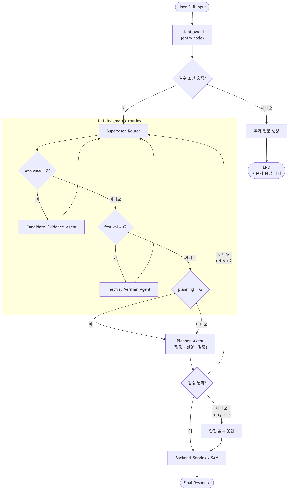
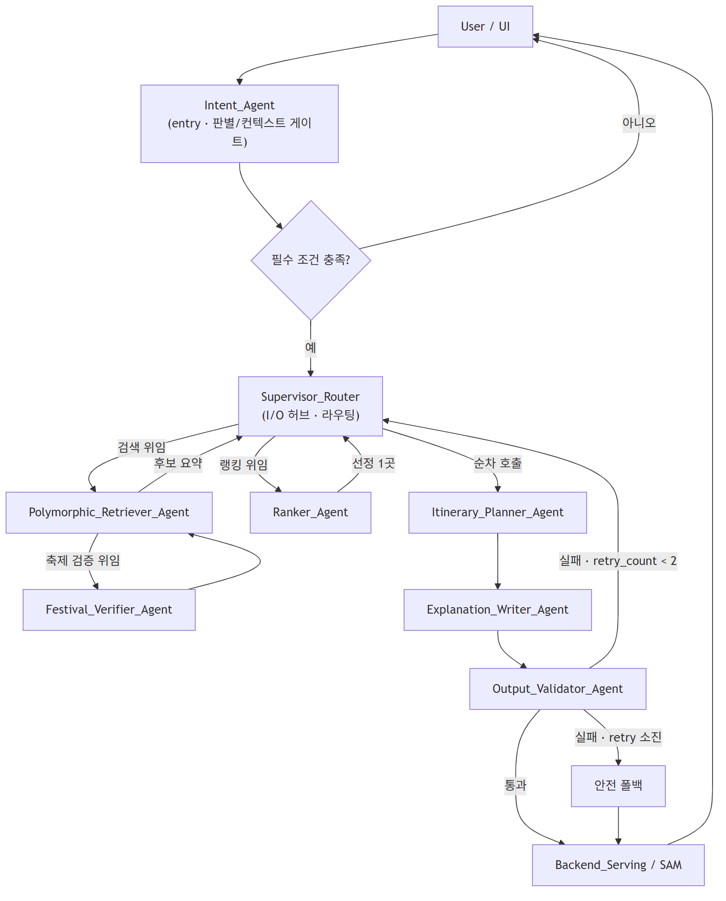
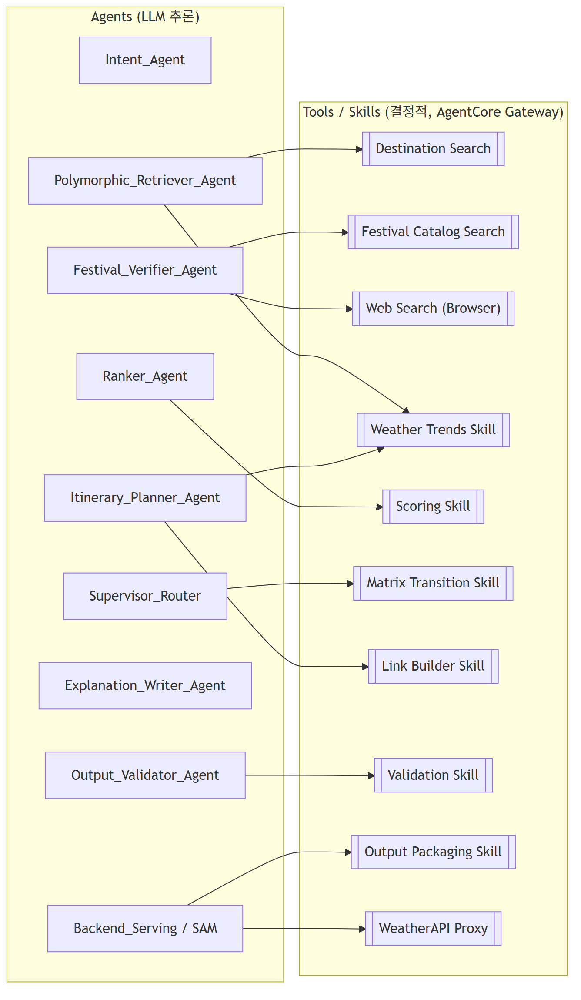

# 로브 (Lovv) LangGraph Flow 명세 (Canonical)

> 문서 버전: v1.0
> 문서 상태: 검토 중 (Review)
> 위상: 본 문서는 Lovv 에이전트의 **그래프 토폴로지·상태·라우팅 최상위 기준**이다.
> 연관 문서: `05_agent_spec.md`(에이전트 명세), `agent_update.md`(수정 방안/A안 확정), `agent_harness_design.md`(하네스), `../01_requirements/lovv_agent_multiturn_context_spec.md`(멀티턴 컨텍스트 정책)

# 1. 문서 개요

본 문서는 Lovv 추천 에이전트를 LangGraph(Orchestrator-Worker) 그래프로 구현하기 위한 정본을 정의한다. 그래프 노드/엣지, 공유 상태(`UnifiedAgentState`), 라우팅 규칙, 자연어 멀티턴 생명주기를 다룬다.

설계 결정의 전제:

- **A안 확정**: `Intent_Agent`는 오케스트레이션 루프 이전의 **entry node(컨텍스트 게이트)** 로 두고, `Supervisor_Router`는 raw를 보유하지 않는 **루프 오케스트레이터**로 둔다. (`agent_update.md` 4장·설계 결정 참조)
- **I/O 허브 원칙**: Supervisor는 압축 상태와 `fulfilled_matrix`만으로 라우팅하며, 토큰이 무겁거나 결정적인 작업은 Sub-Agent / Skill로 위임한다.
- **개발 플랫폼**: AWS Bedrock AgentCore(Runtime/Memory/Gateway/Identity/Policy/Observability). LangGraph 그래프를 Runtime에 그대로 호스팅한다.

# 2. 아키텍처 개요

Lovv는 `User → Intent_Agent → Supervisor_Router → (Workers/Skills 루프) → Backend_Serving` 토폴로지를 따른다.

- **Entry**: 자연어/UI 입력은 항상 `Intent_Agent`로 진입한다. Intent_Agent가 멀티턴 백로그를 정리해 의도 중심 handoff payload를 만든다.
- **Loop**: Supervisor_Router가 `fulfilled_matrix`를 스캔해 검색·후보 선정 구간을 순환 제어한다. 축제 포함 요청은 구조화 1차 랭킹 상위 K곳만 웹 검증한다.
- **Sequential**: 목적지 선정 후 `Itinerary_Writer → Validation Skill → Output_Validator`는 매트릭스 재평가 없이 순차 호출한다.
- **Exit**: 검증 통과 또는 폴백 확정 시 `Backend_Serving / SAM`으로 전이한다.

# 3. 그래프 정의 (Mermaid)



> 표기: 사각형 = Sub-Agent(LLM), `[[ ]]` = Skill/Tool(결정적), 원통 = Memory/저장소. 점선 = 데이터 참조, 실선 = 제어 흐름.

## 3.1 Agent 전용 뷰 (오케스트레이션 토폴로지)

Tool/Skill·저장소를 제외하고 **에이전트 간 제어 흐름**만 표현한 뷰다. Supervisor가 허브이며, 검색·랭킹은 위임 후 복귀, 일정·설명·검증은 순차 호출, 검증 실패는 재시도 가드로 Supervisor에 복귀한다.



## 3.2 Agent–Tool 매핑 뷰 (도구/스킬 사용)

각 에이전트가 호출하는 **Tool/Skill(결정적)** 만 분리한 뷰다. 에이전트는 LLM 추론을 담당하고, 계산·검색·변환·검증은 Gateway에 등록된 Skill로 위임한다.



| 에이전트 | 사용 Tool / Skill |
| --- | --- |
| `Intent_Agent` | 없음 (Memory의 대화 백로그·요약만 사용) |
| `Supervisor_Router` | Matrix Transition Skill (Output Packaging은 서빙 단계에서) |
| `Polymorphic_Retriever_Agent` | Destination Search, Weather Trends Skill |
| `Festival_Verifier_Agent` | Festival Catalog Search, Web Search(Browser) |
| `Ranker_Agent` | Scoring Skill |
| `Itinerary_Writer_Agent` | Link Builder Skill, Weather Trends Skill |
| `Output_Validator_Agent` | Validation Skill (결정적 검증 선행) |
| `Backend_Serving / SAM` | Output Packaging Skill, WeatherAPI Proxy |

# 4. UnifiedAgentState 스키마

LangGraph 그래프 전역 상태다(구현: **Python 3.12**, LangGraph `TypedDict`). 기존 멀티턴 명세(§5)의 모델을 확장한다.

```python
from typing import TypedDict, List, Dict, Any, Optional, Literal

class UnifiedAgentState(TypedDict):
    # --- 대화/컨텍스트 (Intent_Agent 소유) ---
    messages: List[Dict[str, str]]            # 전체 멀티턴 백로그 (Supervisor에 미전달)
    conversation_summary: str                 # 롤링 요약 (백로그 토큰 bound)
    turn_index: int                           # 현재 사용자 턴 번호

    # --- Intent → Supervisor handoff payload ---
    extracted_inputs: Dict[str, Any]          # country, travelMonth, travelYear, tripType, theme, entryType, includeFestivals
    user_preferences: List[str]               # RAG/검색용 선호 문장 (의도 관련성 명확분만)
    onboarding_themes: List[str]              # 장기 선호 (온보딩 1~3개)
    chat_extracted_themes: List[str]          # 자연어에서 추출된 테마
    active_required_themes: List[str]         # 필수 충족 대상 (온보딩+자연어 병합, 최대 3)
    theme_priority: Dict[str, str]            # 테마별 high|normal|low
    soft_preferences: List[str]               # quiet, scenic_view 등 랭킹 가산 조건
    cleaned_raw_query: str                    # 반영 가능 조건만 남긴 원문
    theme_queries: Dict[str, str]             # 테마별 벡터 검색 쿼리
    soft_preference_query: str                # 분위기 통합 쿼리
    unsupported_conditions: List[str]         # RAG 미전달, user_notice 대상
    backup_themes: List[str]                  # active 3개 초과 시 밀려난 온보딩 테마
    user_location: Optional[Dict[str, float]] # 거리 기반 1차 필터 기준 좌표
    user_notice: Optional[str]                # 예외 안내 문구
    excluded_themes: List[str]                # 명시적 거부 테마

    # --- 라우팅 제어 (Supervisor 소유) ---
    next_node: str
    fulfilled_matrix: Dict[str, str]          # 테마/단계별 X|O|△|N/A
    target_region: Optional[str]              # None=전국구 앵커 모드, 값=지역 제한 모드
    validation_retry_count: int               # 검증 실패 재시도 카운터 (상한 2)

    # --- 수집/생성물 (Worker/Skill 누적) ---
    raw_collected_data: List[Dict[str, Any]]  # Retriever 후보, 기상 경향 등
    festival_verifications: List[Dict[str, Any]]  # Festival_Verifier 결과 JSON
    selected_destination: Optional[Dict[str, Any]]
    itinerary: Optional[Dict[str, Any]]
    recommendation_reasons: Optional[List[str]]
    confidence: Optional[float]
```

상태 정책 요약:

| 필드 | 소유/갱신 주체 | 컨텍스트 정책 |
| --- | --- | --- |
| `messages` | Intent_Agent | Memory 단기에 유지, Supervisor에 통째 미전달 (AG-FR-004) |
| `conversation_summary` | Intent_Agent | 백로그 길이가 임계 초과 시 롤링 요약으로 압축 |
| `extracted_inputs` / `user_preferences` / `excluded_themes` | Intent_Agent | pruning 후 Supervisor 전달 |
| `fulfilled_matrix` | Intent 초기화 → Supervisor 제어 | 턴 간 유지(persist), 라우팅·종료 제어 |
| `target_region` | Retriever(모드1에서 Lock-on) | None→값 전이 후 모드2 |
| `validation_retry_count` | Supervisor/Validator | 상한 도달 시 폴백 확정 |
| `raw_collected_data` 등 생성물 | Worker/Sub-Agent | 실행 후 누적, 최종 SAM 패키지 입력 |

# 5. 노드 명세

| 노드 | 유형 | 입력 | 출력 | 비고 |
| --- | --- | --- | --- | --- |
| `Intent_Agent` | Sub-Agent (entry) | `messages`, `conversation_summary`, UI 조건, 온보딩, 피드백 | handoff payload(`extracted_inputs`/`user_preferences`/`excluded_themes`), 초기 `fulfilled_matrix` | Condition_Parser 통합. 턴당 1회 |
| `Supervisor_Router` | Orchestrator | handoff payload, `fulfilled_matrix` | `next_node`, 흐름 분기 | raw 미보유. Matrix Transition Skill 사용 |
| `Polymorphic_Retriever_Agent` | Sub-Agent | 국가/월/테마, `target_region` | 후보 요약 JSON, 기상 경향, `target_region` 고정 | 모드1 앵커 / 모드2 지역제한 |
| `Ranker_Agent` | Sub-Agent | 후보 목록, 온보딩/피드백, 기상 경향 | 구조화 1차 Top-K, 최종 소도시 1곳, 점수 근거 | Scoring Skill 사용. 후보 0건 시 `no_candidate` 반환 |
| `Festival_Verifier_Agent` | Sub-Agent | Top-K 축제 후보, `target_region`, `travelYear/Month` | 검증 JSON(`date_status` 등) | 캐시 키 `festival_id+travelYear` |
| `Itinerary_Writer_Agent` | Sub-Agent | 선정지, `tripType`, 축제 검증, 점수 근거, 후보 장소 | 일별 일정, 대체 일정, 링크, 추천 이유, 동선 이유, 안내 문구 | 일정과 설명을 하나의 구조화 출력으로 생성 |
| `Output_Validator_Agent` | Sub-Agent | 최종 생성물 | 의미 검증 판정, 실패 카테고리 | 결정적 검증(Validation Skill) 선행 |
| `Backend_Serving / SAM` | Serving | 검증 완료 패키지 | UI 응답 | PII 마스킹(Output Packaging Skill) |

# 6. 엣지 및 라우팅 규칙

## 6.1 진입·명료화

- `Intent_Agent`는 그래프 entry. 출력 후 `NEED_MORE`(필수 조건 충족?) 조건 분기.
- 미충족 → `추가 질문 생성` → `END(사용자 응답 대기)`. 다음 사용자 발화는 **다시 Intent_Agent로 진입**(턴 재개).
- 충족 → `Supervisor_Router`.

## 6.2 검색·후보 선정 루프 (매트릭스 제어)

- Supervisor는 `fulfilled_matrix`에서 `X` 항목 중 우선순위 최상위를 골라 라우팅한다. 우선순위는 `retrieval → ranking → festival → generation → validation`이다.
- 1회차: `target_region == None` → Retriever 모드1(전국구 앵커) → `target_region` Lock-on → 복귀.
- 지도 마커 진입(`destinationId` 존재): 앵커 탐색 생략, `target_region` 즉시 고정 → 모드2.
- 2회차 이후: 모드2(지역 제한 확장) 검색 후 Ranker가 구조화 1차 점수 상위 K곳(기본 2~3곳)을 선별한다.
- `includeFestivals=true`이면 Top-K 후보만 `Festival_Verifier`에 위임하고, 검증 결과를 반영해 최종 Ranker를 다시 호출한다.
- `includeFestivals=false`이면 `festival=N/A`로 두고 축제 웹 검증을 건너뛴다.
- 필수 테마 충족 후보가 0건이면 Ranker가 `no_candidate`를 반환하고, Supervisor는 재시도 카운터를 소모하지 않고 조건 완화 안내 또는 검색 링크 폴백으로 종료한다.
- `X`가 더 없으면 순차 구간으로 전이.

## 6.3 순차 생성 구간 (매트릭스 재평가 없음)

- `Itinerary_Writer → Validation Skill(결정적) → Output_Validator(의미)`.

## 6.4 검증·루프 가드

- `Validation Skill`(결정적: 필드 누락, 국가 혼합, 단일 목적지, 축제 `confirmed` 여부) 실패 → 재시도 분기.
- `Output_Validator`(의미) 실패 → 실패 카테고리별 재시도 분기.
- 재시도 분기: `validation_retry_count < 2`이면 아래 결정 규칙으로 재진입하고, 아니면 **안전 폴백 응답 확정**(`confidence` 하향 + 결측 안내).
- 통과 시 `Backend_Serving`.

| 실패 카테고리 | Supervisor 분기 |
| --- | --- |
| `grounding_missing` | `Itinerary_Writer_Agent` 재호출. 동일 선정지와 후보 장소를 유지하되 설명·근거 필드를 우선 재작성 |
| `hallucination` | `Polymorphic_Retriever_Agent` 재탐색 또는 해당 항목 제거 |
| `condition_unmet` | Retriever 재탐색 또는 Ranker 재랭킹 |
| `explanation_weak` | `Itinerary_Writer_Agent` 재호출. 일정 골격을 유지하고 설명 필드를 보강 |
| `fallback_unsafe` | 안전 폴백 템플릿으로 즉시 전환 |

# 7. 자연어 멀티턴 생명주기

본 절은 `lovv_agent_multiturn_context_spec.md`의 컨텍스트 정책을 그래프 동작으로 구체화한다.

## 7.1 실행 단위

- `Intent_Agent`는 **사용자 턴당 1회** 실행되는 entry node다. 새 발화마다 백로그+요약을 읽어 의도/선호를 재증류한다.
- 한 턴 내부에서 Supervisor가 매트릭스를 여러 번 순환할 때는 Intent를 재호출하지 않는다.

## 7.2 턴 간 상태 유지

- `fulfilled_matrix`, `target_region`, `selected_destination`, `messages`, `conversation_summary`는 AgentCore Memory(단기 세션)에 persist되어 다음 턴으로 이어진다.
- Supervisor는 매 턴 pruned payload + 매트릭스만 받는다 → 대화 길이와 무관하게 라우팅 비용 평탄.

## 7.3 지원 패턴

| 패턴 | 트리거(자연어) | 그래프 동작 |
| --- | --- | --- |
| 명료화 | "봄에 조용한 곳" 등 조건 부족 | NEED_MORE 아니오 → 추가 질문 → 다음 턴 Intent 재진입으로 조건 보강 |
| 수정/재추천 | "여기 말고 다른 곳", "2박3일로" | Intent가 변경분 반영 → 해당 매트릭스 항목 `X` 재설정 → Supervisor 재라우팅 |
| 선호 추가 | "바다도 보고 싶어" | `user_preferences` 추가 → 관련 테마 `X` |
| 선호 번복 | "역시 축제도 넣어줘" | **N/A → X 재활성**(7.4) |

## 7.4 N/A → X 재활성 규칙 (멀티턴 보강)

기본 매트릭스에서 명시 거부 테마는 `N/A`(스케줄링 금지)다. 자연어 멀티턴에서 사용자가 거부를 번복하면 다음을 따른다.

- Intent_Agent가 **명시적 재포함 의도**(높은 확신)를 감지하면 해당 테마를 `N/A → X`로 전이하고 `excluded_themes`에서 제거한다.
- 확신이 불확실하면 전이하지 않고 추가 질문으로 확인한다(불확실성 처리 원칙, 멀티턴 명세 §8).
- 전이는 Matrix Transition Skill의 결정적 규칙으로 처리하고, 전이 사유를 trace 메타데이터에 남긴다.

## 7.5 백로그 토큰 bound

- `messages` 길이가 임계(예: 최근 12턴 또는 N 토큰) 초과 시 Intent_Agent가 오래된 구간을 `conversation_summary`로 롤링 압축한다.
- 이후 Intent 입력 = `conversation_summary` + 최근 N턴. 긴 대화에서도 Intent 입력이 bound된다.
- 원문 전체 장기 저장 금지(멀티턴 명세 8장)와 정합.

# 8. 토폴로지 정합화 (기존 Worker 명칭 매핑)

`lovv_agent_multiturn_context_spec.md`는 `Festival/Media/Theme_Worker` + `Route_Critic`을 예시 Worker로 들었다. 본 정본에서는 더 상세한 현행 노드 집합으로 통합하며, 매핑은 다음과 같다.

| 멀티턴 명세 Worker | 본 정본 노드 | 비고 |
| --- | --- | --- |
| `Theme_Worker` | `Polymorphic_Retriever_Agent` (모드1/2) | 테마 기반 후보 검색을 Retriever가 흡수 |
| `Festival_Worker` | `Festival_Verifier_Agent` (+ Festival Catalog Skill) | 축제 검증 전담 |
| `Media_Worker` | (선택) Retriever 서브검색 또는 향후 별도 노드 | 현 단계 미구현 시 `N/A` 처리 |
| `Route_Critic` | `Output_Validator_Agent` + Supervisor 재시도 | 검증 실패 테마 `X` 되돌림 = 재시도 분기 |

`fulfilled_matrix` 표준 키는 `retrieval`, `festival`, `ranking`, `generation`, `validation`으로 고정한다. 모든 테스트 픽스처와 evaluation trace는 이 키 집합을 사용한다. DB 저장 trace에는 전체 matrix를 저장하지 않고 `payload_summary`의 결측·실패 요약으로 축약한다.

# 9. Bedrock + AgentCore 매핑 (요약)

상세는 `agent_update.md` 6장 참조. 본 설계는 **모델 계층(Bedrock)** 과 **런타임 계층(AgentCore)** 을 함께 사용한다.

모델 계층 — **Amazon Bedrock**:

- **LLM 추론**: 모든 LLM 노드는 Bedrock 모델을 Converse API로 호출. 작업별 차등 티어(파싱=경량 Nova Lite/OpenAI gpt-oss-20b/Claude Haiku, 검증=중급 OpenAI gpt-oss-120b/Llama 70B, 생성=상위 Claude Sonnet 계열). 2026년 OpenAI 오픈웨이트(gpt-oss)는 us-east-1 후보로 추가, 프런티어(GPT-5.5/5.4·Codex)는 us-east-1 미제공이라 리전 변경 시에만 후보. 상세 단가·리전·배정은 `agent_update.md` 6.3.
- **임베딩**: 장소·쿼리 임베딩은 Amazon Titan Text Embeddings V2(1,024차원) 또는 Cohere Embed.
- **관리형 RAG**: 전국구 RAG는 Bedrock Knowledge Bases(청킹·임베딩·검색)로 구현, 정형 필터는 DB와 하이브리드.

런타임 계층 — **AgentCore**:

- **Runtime**: Supervisor·Sub-Agent 그래프 호스팅.
- **Memory**: `messages`/`conversation_summary`/`fulfilled_matrix`/검증 캐시/온보딩·피드백.
- **Gateway**: Skill(Scoring/Matrix/Validation/Link/Weather/Packaging)·Catalog Search를 도구로 노출.
- **Browser**: Festival_Verifier 웹 검색.
- **Identity / Policy / Observability**: 에이전트 권한·모델/KB 접근 제한, 정책(금지사항 강제), 추적(LangSmith redacted + CloudWatch). `token_usage`, 라우팅 경로, matrix 전이는 Observability/evaluation 메트릭으로 관리하고 DynamoDB `lovv_agent_runs`에는 DB 설계 명세서 v0.5의 요약 필드만 저장한다.
- **Evaluations**: On-demand 평가로 CI/CD 배포 게이트, Online 평가로 프로덕션 품질 모니터링. 상세는 `agent_harness_design.md` 4장 참조.

# 10. 불변식 (Invariants)

- Supervisor는 `messages` 원문을 보유·전달하지 않는다.
- Intent_Agent는 턴당 1회만 실행한다.
- `fulfilled_matrix`의 `X`만 라우팅 대상이다.
- `fulfilled_matrix` 표준 키와 라우팅 우선순위는 `retrieval → ranking → festival → generation → validation`이다.
- `no_candidate`는 검증 실패가 아니므로 `validation_retry_count`를 증가시키지 않는다.
- 검증 재시도는 최대 2회, 초과 시 폴백 확정.
- 한국/일본 데이터는 한 응답에서 혼합하지 않는다.
- 미검증(`tentative`/`unknown`) 축제는 일정에 확정 배치하지 않는다.
- LangSmith/trace에는 redacted 메타데이터만 기록한다. DynamoDB `lovv_agent_runs`에는 `node_name`, `tool_name`, `validation_retry_count`, `error_code`, `payload_summary` 수준의 실행 요약만 저장한다.

# 11. 변경 이력

| 버전 | 날짜 | 변경 내용 |
| --- | --- | --- |
| v1.1 | 2026-06-08 | DB v0.5 기준으로 DynamoDB 저장 trace와 Observability/evaluation trace를 분리 |
| v1.1 | 2026-06-08 | Itinerary Planner와 Explanation Writer를 `Itinerary_Writer_Agent` 단일 생성 노드로 통합 |
| v1.1 | 2026-06-08 | Top-K 축제 검증, 후보 0건 폴백, Validator 실패 카테고리, fulfilled_matrix 표준 키와 라우팅 우선순위 반영 |
| v1.0 | 2026-06-07 | A안 기준 LangGraph 정본 작성. 멀티턴 생명주기·N/A→X 재활성·백로그 bound·토폴로지 정합화 포함 |
