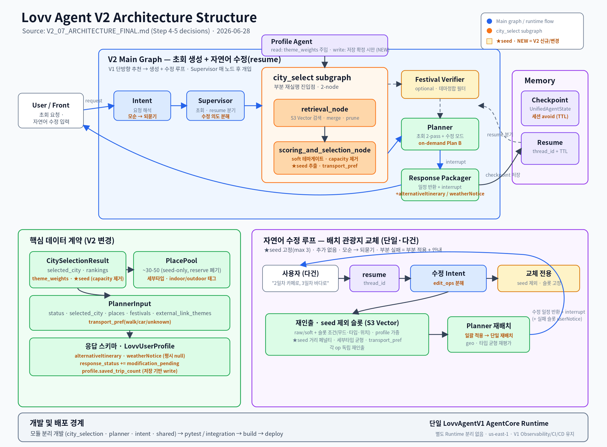

# Lovv Agent V2 — 아키텍처 확정본 + 우선순위 (Step 5)

> 문서 성격: 보조 Markdown (V2 스냅샷 묶음 = `supplemental/v2/`)
> 대표 문서: `../../05_agent_spec.md` (현 대표문서는 V1 기준 — 본 `v2/` 문서들은 **V2 설계 스냅샷**)
> 정본 위치: `Lovv-agent/docs/reports/v2/` — **이 문서는 공유용 스냅샷이며, 충돌 시 Lovv-agent repo가 우선한다.**
> 연관: `scenario_coverage.md` · `intent_parsing_spec.md` · `verification_plan.md` · `decisions_log.md`
> V2 인프라 스펙: `memory_checkpointer_spec.md`(수정 루프 resume/interrupt 토대) · `cognito_pseudonymization_memory_lifecycle.md`(가명화·메모리 수명)
> 표기: ⚠ 경계 확인 필요.

V1(`../langgraph_flow.md`의 fulfilled_matrix·Candidate_Evidence 토폴로지)에서 V2로 바뀌는 **확정 델타 + 빌드 우선순위**를 정리한다. 노드 단위 세부 로직의 정본은 Lovv-agent repo의 `V2_SCENARIO_MATRIX`.

## 그래프 토폴로지

> 초회 생성(상단) + 자연어 수정 루프(resume) + Memory(checkpoint·세션 avoid). V1의 단방향 추천 → **일정 생성 + 자연어 수정(resume)**.

---

## 1. 컴포넌트별 델타 (vs V1)

### Intent
- 모순 입력 → 절충 없이 되묻기(`needs_clarification`). 긴서사 → 핵심 키워드 추출(상세 `intent_parsing_spec.md`).

### Supervisor (중앙 허브 라우터)
- 초회/resume 분기(thread_id + checkpoint). 수정 의도 분류(슬롯 교체 1차 / 도시 변경 경로만 / 백로그). 다건 동시 수정 → `edit_ops` 분해. 응답상태 결정(`completed`/`END_WAIT_USER`/`modification_pending`). 전면 불만 시 세션 avoid 주입.

### city_select subgraph (2-node)
- `retrieval_node`: S3 Vector 검색·merge·prune. 수정 시 슬롯 단위 재인출 진입점.
- `scoring_and_selection_node`: **capacity(candidate_sufficiency) 제거**(항상 rank 0, insufficient는 Planner Pass2로) · **테마 soft 게이트**(theme_weights 가중, 미충족 강감점) · 다테마 seed soft 보장 · **seed 추출**(day anchor, reserve 폐기) · transport_pref 페널티.

### Festival Verifier
- `festival_seeded_city_discovery`일 때 활성. confirmed 축제만 실제 날짜 분산 배치. 축제 테마 정합 필터(데이터 적재 시).

### Planner (2-pass + 수정 모드)
- 초회: Pass1(도시·테마 게이트) → Pass2(도시 고정·테마 off·PlacePool ~30–50) → seed 라운드로빈 배치 + geo_penalty(haversine).
- 수정: 비-seed 슬롯 교체(슬롯 조건=무드·타입·위치 추가 query), seed 고정·배치 ≤3 불변. 다건은 일괄 적용 → 단일 재배치.
- on-demand Plan B: weatherNotice 동의 시 실내 대안 생성 → `alternativeItinerary`. 출력 `move`는 front 담당(미채움).

### Response Packager
- 출력 스키마 확장: `alternativeItinerary`(nullable) · `weatherNotice` · `response_status`에 `modification_pending`. interrupt → checkpoint 저장 → resume 대기.

### Profile Agent
- read: theme_weights 주입. write: **저장 확정 일정에서만** 집계(수정 발화 누적 안 함). fallback "충분"=`saved_trip_count ≥ n`. 신규 의존: front "일정 저장" 이벤트.

### Memory (AgentCore)
- checkpoint/interrupt/resume, thread_id + TTL. 세션 avoid 상태 = checkpoint 보관, TTL까지 유지(영구 profile 아님).

### 데이터 계약 변경
| 계약 | 변경 |
|---|---|
| `CitySelectionResult` | candidate_sufficiency 제거 · theme_weights · seed 명시 |
| `PlacePool` | seed-only(reserve 폐기) · 세부타입 · indoor/outdoor 태그 |
| `PlannerInput` | transport_pref(walk/car/unknown) |
| 응답 스키마 | alternativeItinerary · weatherNotice · response_status: modification_pending |
| `LovvUserProfile` | saved_trip_count · 집계 theme_weights |

### §1.5 다건 동시 수정 (배치 편집)
한 입력의 복수 편집 → `edit_ops:[{target, op:REPLACE, condition}]` 분해 → 각 비-seed 슬롯 재인출 → **일괄 적용 후 단일 재배치**(순차 금지). seed 슬롯 지정 거부. op 간/슬롯 내 모순 → 되묻기. **부분 실패 = 부분 적용 + 안내**(`modification_pending`).

---

## 2. 우선순위 (검증가능성 · 구현난이도 · 신규/수정)

| # | 항목 | 신규/수정 | 검증 | 난이도 | 의존 | 등급 |
|---|---|---|---|---|---|---|
| F1 | 데이터 4종 적재(세부타입·indoor/outdoor·기상·visitor) | 신규 | 상 | 중 | — | **P0** |
| F2 | 출력 스키마 확장 | 신규 | 상 | 하 | front | **P0** |
| F3 | 수정 루프 인프라(resume·interrupt·분기) | 신규 | 하 | 상 | checkpoint | **P0** |
| C1 | capacity 제거 | 수정 | 상 | 하 | — | P1 |
| C2 | soft 테마 게이트 + theme_weights | 수정 | 중 | 중 | F1 | P1 |
| C3 | seed 추출 + 라운드로빈 배치 | 수정/고도화 | 중 | 중 | — | P1 |
| C4 | 슬롯 교체(단일·다건) 재인출·재배치 | 신규 | 중 | 중상 | F3 | P1 |
| W1 | weatherNotice 임계 판정(룰) | 신규 | 상 | 하중 | F1 | P1 |
| T1 | transport_pref geo_penalty | 신규 | 중 | 하중 | C3 | P2 |
| K1 | profile write + fallback n | 신규/수정 | 중 | 중 | F2 | P2 |
| W2 | on-demand Plan B 생성 | 신규 | 중 | 중 | W1·C4 | P2 |
| A1 | 세션 avoid | 신규 | 중 | 하중 | F3 | P2 |
| M1 | 모순→되묻기 / 되묻기 경계 | 신규/수정 | 하 | 중 | — | P2 |
| V1 | 축제 테마 정합 필터 | 수정 | 상 | 하 | F1 | P2 |

**빌드 순서**: P0(F1∥F2∥F3) → P1(C1→C2→C3→C4+W1) → P2.
**★ V2.0 thin slice**: `F1+F2+F3+C1+C2+C3+C4+W1` = 품질 개선된 초회 + 슬롯 교체(단일·다건) 수정 + 날씨 안내. Plan B 생성(W2)·profile write(K1)·transport(T1)·avoid(A1)·되묻기(M1)는 V2.1.

---

## 3. 결정 요약 (상세 `decisions_log.md`)
| ID | 결정 |
|---|---|
| D-A | alternativeItinerary 두되 **on-demand**(weatherNotice 후 동의 시 수정 루프로 생성) |
| D-B | 1차=슬롯 교체+슬롯 조건. 도시 변경=경로만. 길이/날짜/전체무드/4d3n=백로그 |
| D-K | profile=저장 확정 일정에서만 write. 모호 fallback=저장 수 ≥ n |
| D-C | 출력 move=front. 배치=haversine 1차, 실이동 API ⚠검토 |
| D-E | transport_pref walk/car/unknown(거친 soft) |
| D-J | 기온 KMA(33/-12) + 강수 일평균·상대. 임계 수치 추후 |
| 4d3n | 짧은 일정 먼저 → 4d3n+ 확장(백로그) |
| 응답상태 | +modification_pending |
| 되묻기 | 모순=무조건 되묻기 |
| 기피 | 세션 avoid(세션 끝까지 제외), 영구 profile 아님 |
| 배치 편집 | 다건 분해 → 일괄 재배치 → 부분 적용+안내 |

**남은 미정(구체화 단계)**: D-J 임계 수치 · D-C 실이동 API · profile fallback n · 4d3n 확장 시점 · 수정 응답 diff 반환(front) · 축제 테마 태깅 데이터 · ⚠쿼리 임베딩 생성 위치 · tripType 결측 기본값.
