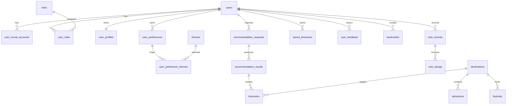

# 로브 (Lovv) 데이터베이스 설계 명세서

> 문서 버전: v0.2
> 문서 상태: 설계 진행중 (Designing)
> 기준 문서: `docs/01_requirements/01_requirements.md` v1.5

# 1. 문서 개요

## 1.1 목적

본 문서는 로브 서비스의 핵심 데이터 모델, 테이블 후보, 관계, 인덱스, 보존 정책을 정의한다.
PoC에서는 일부 데이터를 정적 파일과 로컬 스토리지로 대체할 수 있으나, Production 전환 시 본 문서를 기준으로 데이터베이스를 설계한다.

## 1.2 설계 기준

| 항목 | 결정 | 비고 |
| --- | --- | --- |
| 기본 모델 | 관계형 데이터베이스 우선 | 서비스 핵심 데이터는 정규화된 관계형 모델을 기준으로 설계한다. |
| RDBMS | MySQL 8 LTS | 사용자, 목적지, 축제, 추천, 저장 일정, 검토 이력 등 핵심 트랜잭션 데이터를 저장한다. |
| NoSQL | AWS DynamoDB | AgentCore/SAM 실행 상태, 비동기 작업, 사용자 이벤트 로그, API 로그처럼 TTL이 필요한 비정형 데이터를 저장한다. |
| VectorDB | PoC 단계에서는 VectorDB로 구현 | RAG 검색용 chunk와 embedding index를 저장한다. 이후 GraphDB 이관 여부는 별도 검토한다. |
| 대화 전문 | 저장하지 않음 | 요구사항 `NFR-013`에 따라 사용자 대화 로그 전문은 서버나 외부 저장소에 장기 저장하지 않는다. |
| 보조 저장소 | DynamoDB 및 VectorDB | 로그성 데이터와 검색 보조 데이터를 MySQL 원장과 분리해 관리한다. |

## 1.3 저장소 책임

| 저장소 | 책임 | 주요 데이터 |
| --- | --- | --- |
| MySQL 8 LTS | 서비스 원장, 트랜잭션, 조회 기준 데이터 | 사용자 계정, 역할, 선호, 일정, 피드백, 북마크, 방문 기록, 목적지, 축제, 검수 이력 |
| DynamoDB | 비정형 실행 상태, 이벤트 로그, TTL 로그 | Agent 실행 상태, async job, 사용자 행동 이벤트, API 호출 로그, feedback clickstream, admin operation trace |
| VectorDB | 의미 검색 인덱스 | 목적지·축제·관광지 문서 chunk, embedding, source reference |
| Object Storage | 원본 수집 파일과 대용량 정적 산출물 | 수집 원본, 전처리 결과, 이미지/첨부 파일 |

# 2. 개념 설계

## 2.1 핵심 도메인

| 도메인 | 설명 | 대표 엔티티 |
| --- | --- | --- |
| 사용자·권한 | 일반 여행 사용자, 관광 운영자, 서비스 관리자, 데이터 제공 기관의 계정과 권한 | User, SocialAccount, Role, Organization |
| 개인화 | 온보딩 선호, 북마크, 방문 기록, 별점, 좋아요/싫어요 기반 개인화 입력 | UserProfile, UserPreference, Bookmark, VisitRecord, UserFeedback |
| 여행 콘텐츠 | 국가, 도시, 소도시, 관광지, 축제, 체험, 외부 링크 | Destination, Attraction, Festival, Experience, ContentSource |
| 추천·일정 | 추천 요청, 추천 결과, 생성 일정, 일정 아이템, 대체 일정 | RecommendationRequest, RecommendationResult, Itinerary |
| 운영 검수 | 수집 데이터 배치, 원천 스냅샷, 검수 상태, 승인·반려 이력 | DataSubmission, DataVerification, AuditLog |
| Agent·로그 | Agent 실행, 비동기 작업, API 호출, 사용자 이벤트, 운영 trace | AgentRun, AsyncJob, EventLog |
| RAG 검색 | 검색 문서, chunk, embedding, metadata filter | RagDocument, RagChunk, VectorIndex |

## 2.2 사용자 데이터 개념 모델

사용자 데이터는 최종 상태를 보존해야 하는 원장 데이터와, 분석·디버깅에 필요한 일시 이벤트 데이터로 나눈다.

| 구분 | 저장소 | 저장 대상 | 저장하지 않는 대상 |
| --- | --- | --- | --- |
| 사용자 원장 | MySQL | 계정, 소셜 계정, 역할, 온보딩 결과, 선호 테마, 저장 일정, 피드백, 북마크, 방문 기록, 별점 | 대화 전문, 민감 자유 입력 원문 |
| 사용자 이벤트 | DynamoDB | 로그인/로그아웃 이벤트, 추천 실행 이벤트, 피드백 클릭 이벤트, 화면 이벤트, 오류 로그 | 사용자 상태의 최종 원장, 삭제 권한이 필요한 본문 데이터 |
| 추천 검색 보조 | VectorDB | 사용자 조건과 매칭할 콘텐츠 chunk 및 embedding | 사용자 개인정보, 대화 전문, 비공개 운영 메모 |

## 2.3 개념 ERD

# 3. 논리 설계

## 3.1 MySQL 논리 모델

MySQL은 서비스 화면과 API가 신뢰해야 하는 최종 상태를 저장한다.
사용자가 조회·수정·삭제할 수 있어야 하는 데이터는 MySQL에 원장으로 둔다.

| 영역 | 테이블 | 책임 |
| --- | --- | --- |
| 인증·권한 | `users`, `user_social_accounts`, `roles`, `user_roles`, `organizations` | 사용자 식별, 소셜 로그인 연결, 권한과 소속 관리 |
| 사용자 프로필 | `user_profiles`, `user_preferences`, `user_preference_themes` | 온보딩 완료 상태, 대도시 스타일 선택, 기본 테마 가중치 |
| 추천 조건 | `recommendation_requests`, `search_criteria` | 구조화된 추천 요청과 확정 조건 저장 |
| 추천 결과 | `recommendation_results`, `recommendation_candidate_scores` | 추천 결과, 점수, explainability, 후보 비교 근거 |
| 일정 | `itineraries`, `itinerary_days`, `itinerary_items`, `saved_itineraries` | 생성 일정, 일정 상세, 사용자 저장 목록 |
| 개인화 행동 | `user_feedback`, `bookmarks`, `visit_records`, `visit_ratings` | 좋아요/싫어요, 북마크, 실제 방문 기록, 방문 별점 |
| 콘텐츠 | `destinations`, `attractions`, `festivals`, `experiences`, `content_sources` | 목적지·관광지·축제·체험과 출처 원장 |
| 운영 검수 | `data_submissions`, `data_submission_reviews`, `data_verifications`, `audit_logs` | 데이터 제안, 승인·반려, 검수 이력 |

## 3.2 RDB 사용자 설계

사용자 RDB 설계는 Production 기준의 계정 기반 저장을 담당한다.
PoC에서는 로컬 스토리지로 대체할 수 있으나, Production에서는 아래 테이블을 기준으로 마이페이지와 개인화 API를 구현한다.

### 3.2.1 `users`

| 컬럼 | 타입 | 제약 | 설명 |
| --- | --- | --- | --- |
| `id` | char(36) | PK | 사용자 ID |
| `email` | varchar(255) | unique, nullable | 이메일. 소셜 로그인만 사용할 경우 nullable |
| `display_name` | varchar(80) | not null | 서비스 표시명 |
| `profile_image_url` | varchar(500) | nullable | 프로필 이미지 |
| `status` | enum | not null | `active`, `blocked`, `deleted` |
| `last_login_at` | datetime | nullable | 마지막 로그인 시각 |
| `created_at` | datetime | not null | 생성 시각 |
| `updated_at` | datetime | not null | 수정 시각 |
| `deleted_at` | datetime | nullable | 탈퇴 또는 삭제 시각 |

### 3.2.2 `user_social_accounts`

| 컬럼 | 타입 | 제약 | 설명 |
| --- | --- | --- | --- |
| `id` | char(36) | PK | 소셜 계정 연결 ID |
| `user_id` | char(36) | FK | `users.id` |
| `provider` | varchar(30) | not null | `google`, `kakao`, `naver` 등 |
| `provider_user_id` | varchar(255) | not null | 소셜 제공자 사용자 ID |
| `created_at` | datetime | not null | 연결 시각 |

Unique: (`provider`, `provider_user_id`)

### 3.2.3 `user_profiles`

| 컬럼 | 타입 | 제약 | 설명 |
| --- | --- | --- | --- |
| `user_id` | char(36) | PK, FK | `users.id` |
| `onboarding_completed` | boolean | not null | 온보딩 완료 여부 |
| `onboarding_completed_at` | datetime | nullable | 온보딩 완료 시각 |
| `country_track` | varchar(20) | nullable | 한국/일본 등 추천 트랙 |
| `preferred_styles` | json | nullable | 선택한 대도시 스타일 스냅샷 |
| `created_at` | datetime | not null | 생성 시각 |
| `updated_at` | datetime | not null | 수정 시각 |

### 3.2.4 `user_preferences`

| 컬럼 | 타입 | 제약 | 설명 |
| --- | --- | --- | --- |
| `id` | char(36) | PK | 선호 프로필 ID |
| `user_id` | char(36) | FK | `users.id` |
| `country_track` | varchar(20) | not null | 한국/일본 등 추천 대상 |
| `selected_city_style` | varchar(80) | nullable | 온보딩에서 선택한 대도시 스타일 |
| `travel_experience_level` | varchar(30) | nullable | 초심자/경험자 등 여행 경험 수준 |
| `mobility_preference` | varchar(30) | nullable | 도보, 대중교통, 렌터카 등 이동 선호 |
| `created_at` | datetime | not null | 생성 시각 |
| `updated_at` | datetime | not null | 수정 시각 |

Index: (`user_id`, `country_track`)

### 3.2.5 `user_preference_themes`

| 컬럼 | 타입 | 제약 | 설명 |
| --- | --- | --- | --- |
| `preference_id` | char(36) | PK, FK | `user_preferences.id` |
| `theme_id` | char(36) | PK, FK | `themes.id` |
| `weight` | decimal(5,2) | not null | 테마 가중치 |

### 3.2.6 `saved_itineraries`

| 컬럼 | 타입 | 제약 | 설명 |
| --- | --- | --- | --- |
| `id` | char(36) | PK | 저장 ID |
| `user_id` | char(36) | FK | `users.id` |
| `itinerary_id` | char(36) | FK | `itineraries.id` |
| `title` | varchar(160) | nullable | 사용자 지정 제목 |
| `created_at` | datetime | not null | 저장 시각 |
| `deleted_at` | datetime | nullable | 사용자 삭제 시각 |

Unique: (`user_id`, `itinerary_id`, `deleted_at`)

### 3.2.7 `user_feedback`

| 컬럼 | 타입 | 제약 | 설명 |
| --- | --- | --- | --- |
| `id` | char(36) | PK | 피드백 ID |
| `user_id` | char(36) | FK | `users.id` |
| `target_type` | enum | not null | `destination`, `festival`, `itinerary`, `recommendation_result` |
| `target_id` | char(36) | not null | 대상 ID |
| `feedback_type` | enum | not null | `like`, `dislike` |
| `reason_code` | varchar(60) | nullable | 선택형 피드백 사유 |
| `created_at` | datetime | not null | 생성 시각 |
| `updated_at` | datetime | not null | 수정 시각 |
| `deleted_at` | datetime | nullable | 삭제 시각 |

Index: (`user_id`, `created_at`), (`target_type`, `target_id`, `feedback_type`)

### 3.2.8 `bookmarks`, `visit_records`, `visit_ratings`

| 테이블 | 주요 컬럼 | 책임 |
| --- | --- | --- |
| `bookmarks` | `id`, `user_id`, `target_type`, `target_id`, `created_at`, `deleted_at` | 소도시·대도시 북마크 |
| `visit_records` | `id`, `user_id`, `destination_id`, `visited_on`, `trip_type`, `route_json`, `memo`, `created_at`, `deleted_at` | 실제 방문 기록 |
| `visit_ratings` | `id`, `visit_record_id`, `user_id`, `destination_id`, `rating`, `rating_reason`, `created_at`, `deleted_at` | 방문 소도시 별점 |

## 3.3 DynamoDB NoSQL 사용자 설계

DynamoDB는 사용자 원장을 대체하지 않는다.
사용자 상태, 저장 일정, 명시적 선호의 최종값은 MySQL에 두고, DynamoDB에는 실행 추적과 TTL 이벤트를 둔다.

| 테이블 | Partition Key | Sort Key | 주요 속성 | TTL |
| --- | --- | --- | --- | --- |
| `lovv_user_event_logs` | `pk` = `USER#{user_id_hash}` 또는 `ANON#{anonymous_session_id}` | `sk` = `EVENT#{created_at}#{event_id}` | `event_type`, `request_id`, `session_id`, `screen`, `action`, `target_type`, `target_id`, `metadata_summary`, `ip_hash`, `user_agent_hash` | `expires_at` |
| `lovv_agent_runs` | `pk` = `RUN#{agent_run_id}` | `sk` = `STATE#{created_at}` | `user_id_hash`, `session_id`, `recommendation_request_id`, `status`, `node_name`, `tool_name`, `token_usage`, `error_code`, `payload_summary` | `expires_at` |
| `lovv_async_jobs` | `pk` = `JOB#{job_id}` | `sk` = `STATUS#{updated_at}` | `job_type`, `status`, `requested_by_user_hash`, `progress`, `result_ref`, `error_code` | `expires_at` |
| `lovv_api_logs` | `pk` = `API#{yyyyMMdd}#{endpoint_group}` | `sk` = `created_at#{request_id}` | `method`, `path`, `status`, `latency_ms`, `user_id_hash`, `error_code` | `expires_at` |

### NoSQL 사용자 이벤트 저장 원칙

| 원칙 | 내용 |
| --- | --- |
| 원장 금지 | 사용자 프로필, 선호 최종값, 저장 일정, 명시적 피드백 최종값은 MySQL을 기준으로 한다. |
| 해시 저장 | `user_id`, IP, user agent는 원문 대신 해시 또는 마스킹 값으로 저장한다. |
| 대화 전문 금지 | 사용자의 자연어 대화 전문, 민감 자유 입력, 비공개 운영 메모는 저장하지 않는다. |
| TTL 필수 | 이벤트와 trace에는 `expires_at`을 두고 보존 기간 이후 자동 삭제한다. |
| 추적 연결 | `recommendation_request_id`, `agent_run_id`, `request_id`로 MySQL 원장과 장애 분석 로그를 연결한다. |

## 3.4 VectorDB 논리 모델

VectorDB는 MySQL 또는 수집 원천을 검색용으로 복제한 인덱스다.
VectorDB의 데이터는 원본이 아니며, 장애 복구나 재색인은 MySQL과 수집 원본을 기준으로 수행한다.

| 인덱스 대상 | 원본 | VectorDB metadata |
| --- | --- | --- |
| 목적지 | `destinations` | `destination_id`, `country`, `region`, `themes`, `recommended_months` |
| 축제 | `festivals` | `festival_id`, `destination_id`, `start_date`, `end_date`, `season_tags` |
| 관광지·체험 | `attractions`, `experiences` | `content_id`, `destination_id`, `content_type`, `theme_tags` |
| 출처 문서 | `content_sources`, object storage | `source_id`, `source_url`, `collected_at`, `license_type` |

# 4. 물리 설계

## 4.1 MySQL 물리 설계 기준

| 기준 | 결정 |
| --- | --- |
| ID | `CHAR(36)` UUID 문자열을 기본으로 한다. |
| 시간 | `created_at`, `updated_at`, `deleted_at`을 기본 감사 컬럼으로 둔다. |
| 삭제 | 사용자 삭제 가능 데이터는 soft delete를 기본으로 하고, 보존 기간 이후 익명화 또는 hard delete를 검토한다. |
| JSON | 추천 조건 스냅샷, 점수 상세, 일정 경로처럼 유연한 구조는 MySQL `JSON`을 사용한다. |
| 외래키 | 사용자 원장과 일정·피드백·북마크는 FK를 둔다. 대량 로그는 FK 대신 참조 ID 문자열만 둔다. |

## 4.2 주요 인덱스

| 조회 패턴 | 인덱스 후보 |
| --- | --- |
| 현재 사용자 조회 | `users(email)`, `user_social_accounts(provider, provider_user_id)` |
| 사용자 마이페이지 일정 | `saved_itineraries(user_id, created_at desc)` |
| 사용자 선호 조회 | `user_preferences(user_id, country_track)` |
| 사용자 피드백 이력 | `user_feedback(user_id, created_at desc)` |
| 대상별 피드백 집계 | `user_feedback(target_type, target_id, feedback_type)` |
| 북마크 목록 | `bookmarks(user_id, target_type, created_at desc)` |
| 방문 기록 | `visit_records(user_id, visited_on desc)` |
| 목적지 탐색 | `destinations(country, is_active)`, `destinations(country, province_or_prefecture)` |
| 추천 결과 조회 | `recommendation_results(recommendation_request_id)`, `itineraries(owner_user_id, created_at desc)` |

## 4.3 DynamoDB 물리 설계 기준

| 기준 | 결정 |
| --- | --- |
| 파티션 분산 | 일자, 이벤트 타입, 해시 사용자 ID를 조합해 hot partition을 피한다. |
| 조회 단위 | 사용자 이벤트 타임라인, Agent run 단건 trace, API 일자별 장애 분석을 기준으로 PK/SK를 설계한다. |
| TTL | 로그성 테이블은 `expires_at`을 필수 속성으로 둔다. |
| GSI | `request_id`, `agent_run_id`, `recommendation_request_id`, `event_type` 조회가 필요하면 GSI를 추가한다. |
| Payload | 원문 대신 `payload_summary`, `error_code`, `result_ref`처럼 최소 요약만 저장한다. |

## 4.4 DynamoDB GSI 후보

| GSI | Partition Key | Sort Key | 용도 |
| --- | --- | --- | --- |
| `GSI1RequestLookup` | `request_id` | `created_at` | API 요청 단위 trace 연결 |
| `GSI2AgentRunLookup` | `agent_run_id` | `created_at` | Agent 실행 전체 단계 조회 |
| `GSI3EventTypeDaily` | `event_type#yyyyMMdd` | `created_at` | 이벤트 타입별 일자 분석 |
| `GSI4RecommendationLookup` | `recommendation_request_id` | `created_at` | 추천 요청과 로그 연결 |

## 4.5 VectorDB 물리 설계 기준

| 기준 | 결정 |
| --- | --- |
| Collection | 국가 또는 콘텐츠 유형별 분리를 검토하되 PoC는 단일 collection으로 시작한다. |
| Vector ID | `source_type#source_id#chunk_no` 형식을 사용한다. |
| Metadata filter | `country`, `destination_id`, `content_type`, `theme_tags`, `recommended_months`를 필터로 둔다. |
| 개인정보 | 사용자 ID, 대화 전문, 비공개 운영 메모는 metadata에 저장하지 않는다. |

# 5. 보존 정책 및 권한

| 데이터 | 보존 정책 | 사용자 통제 |
| --- | --- | --- |
| 사용자 계정 | 탈퇴 시 soft delete 후 보존 기간 종료 시 익명화 | 탈퇴 가능 |
| 온보딩 선호 | 사용자가 재응답하면 최신값을 원장으로 갱신 | 조회·수정 가능 |
| 저장 일정 | 사용자가 삭제하면 `deleted_at` 처리 | 조회·삭제 가능 |
| 피드백·북마크 | 개인화에 활용하되 삭제 요청 시 제외 | 조회·삭제 가능 |
| 방문 기록·별점 | 개인화와 마이페이지에 활용 | 조회·삭제 가능 |
| 대화 전문 | 장기 저장하지 않음 | 저장 대상 아님 |
| Agent trace | DynamoDB TTL 기반 단기 보존 | 원문 개인정보 저장 금지 |
| API/이벤트 로그 | DynamoDB TTL 기반 단기 보존 | 해시·마스킹 저장 |

# 6. PoC 적용 범위와 Production 전환

| 단계 | 적용 범위 |
| --- | --- |
| PoC | 정적 데이터, 로컬 스토리지 기반 사용자 일정·선호·피드백, 최소 MySQL 테이블 또는 샘플 DB, VectorDB 검색 실험 |
| Production 1차 | 계정 기반 MySQL 사용자 원장, 마이페이지, 저장 일정, 온보딩 선호, 피드백, 북마크, 방문 기록 |
| Production 운영 | DynamoDB Agent trace, async job, 사용자 이벤트 로그, API 로그, 운영 검수 로그, TTL 정책 |
| Production 고도화 | 개인화 랭킹 모델 재학습, A/B 테스트 이벤트, VectorDB 재색인 자동화 |

# 7. 설계 검토 체크리스트

- [ ] 사용자 대화 전문이 MySQL, DynamoDB, VectorDB 어디에도 장기 저장되지 않는가?
- [ ] 사용자 원장 데이터와 이벤트 로그가 MySQL/DynamoDB로 분리되어 있는가?
- [ ] 마이페이지에서 조회·삭제해야 하는 데이터가 MySQL에 원장으로 남아 있는가?
- [ ] DynamoDB 테이블에 TTL과 해시 저장 원칙이 반영되어 있는가?
- [ ] VectorDB가 원본 저장소가 아니라 재생성 가능한 검색 인덱스로 정의되어 있는가?
- [ ] PoC 로컬 스토리지 대체 범위와 Production DB 범위가 분리되어 있는가?

# 8. 후속 작업

1. `integrated_draft.md`의 상세 테이블 후보를 기준으로 MySQL DDL 초안을 작성한다.
2. DynamoDB `lovv_user_event_logs`, `lovv_agent_runs`, `lovv_async_jobs`, `lovv_api_logs`의 TTL 기간을 확정한다.
3. API 명세의 `/me/preferences`, `/me/itineraries`, `/me/feedback` 응답 필드와 테이블 컬럼을 1:1로 매핑한다.
4. `pages/06_database_design.html`을 대표 Markdown 기준으로 재생성한다.

# 9. 변경 이력

| 버전 | 날짜 | 작성자 | 변경 내용 |
| --- | --- | --- | --- |
| v0.1 | 2026-06-04 | 로브 기획팀 | DBMS 방향 초안 작성 |
| v0.2 | 2026-06-07 | Codex | 개념 설계, 논리 설계, 물리 설계 구조와 RDB/NoSQL 사용자 설계 반영 |
