# 로브 (Lovv) 데이터베이스 설계 명세서

> 문서 버전: v0.2
> 문서 상태: 설계 초안 (Draft)
> 기준 문서: `docs/01_requirements/01_requirements.md` v1.8, `docs/02_service_flow/02_service_flow.md` v0.2, `docs/05_api_spec/05_api_spec.md` v0.1, `docs/07_agent_spec/07_agent_spec.md` v0.3

# 1. 문서 개요

## 1.1 목적

본 문서는 로브 서비스의 Production 전환을 기준으로 핵심 관계형 데이터 모델, ERD, 테이블 후보, 관계, 인덱스, 보존 정책을 정의한다.
PoC에서는 일부 데이터를 정적 JSON과 브라우저 로컬 스토리지로 대체할 수 있으나, 서버 저장 전환 시 본 문서를 기준으로 데이터베이스를 설계한다.

## 1.2 설계 전제

| 항목 | 결정 | 비고 |
| --- | --- | --- |
| 기본 모델 | 관계형 데이터베이스 우선 | 사용자, 목적지, 추천, 일정, 피드백, 검수 이력은 관계가 명확하다. |
| 권장 RDBMS | MySQL 8 LTS | 기존 DBMS 문서의 MySQL 8 LTS 결정을 기준으로 서비스 핵심 관계형 데이터를 저장한다. |
| ID 전략 | `CHAR(36)` UUID 문자열 | 분산 생성과 외부 연동을 고려해 논리 ID는 UUID를 사용하되, MySQL에서는 `CHAR(36)`으로 저장한다. |
| JSON 저장 | MySQL `JSON` | 구조화 조건, 추천 근거, 점수 상세, 태그 스냅샷처럼 유연한 필드는 MySQL JSON 타입을 사용한다. |
| VectorDB | 별도 VectorDB | RAG 검색 인덱스는 MySQL 핵심 RDBMS와 분리해 관리한다. |
| 로그 저장소 | DynamoDB 또는 로그 전용 저장소 | Agent/SAM 실행 로그, 장문 원문 로그는 핵심 RDBMS와 분리한다. |
| 대화 로그 | 장기 저장 금지 | 추천에 필요한 구조화 조건, 최종 추천 결과, 명시적 피드백만 저장한다. 디버깅용 메시지 저장은 TTL·마스킹·동의가 있는 경우로 제한한다. |

## 1.3 저장소별 책임 매핑

서비스 아키텍처는 MySQL 8 LTS, VectorDB/RAG Index, DynamoDB Logs의 3개 저장소로 나눈다.
MySQL은 정합성과 관계가 필요한 원장 데이터, VectorDB는 의미 검색용 복제 인덱스, DynamoDB는 대량·비정형·TTL 로그를 담당한다.

| 저장소 | 저장 책임 | 대표 데이터 |
| --- | --- | --- |
| MySQL 8 LTS | 서비스 원장 데이터와 트랜잭션 데이터 | `users`, `user_preferences`, `destinations`, `festivals`, `itineraries`, `user_feedback`, `audit_logs` |
| VectorDB / RAG Index | 추천 검색을 위한 임베딩과 청크 인덱스 | 목적지 청크, 축제 청크, 로컬 정보 청크, 임베딩 벡터 |
| DynamoDB Logs (NoSQL) | TTL 가능한 비정형 로그와 상세 실행 추적 | API logs, Agent traces, feedback event logs, admin operation logs |

| 데이터 성격 | 원장 저장 | 로그/인덱스 저장 |
| --- | --- | --- |
| 사용자, 선호, 일정, 명시적 좋아요/싫어요 | MySQL | 필요한 경우 DynamoDB에 이벤트 로그 복제 |
| 목적지, 축제, 장소, 체험, 출처 | MySQL | 검색용 청크와 임베딩은 VectorDB |
| Agent 실행 상태 | MySQL `agent_runs`, `async_jobs` | 상세 trace, tool 호출 로그는 DynamoDB |
| 관리자 승인/반려 원장 | MySQL `audit_logs`, `data_submission_reviews` | 상세 운영 trace는 DynamoDB |
| API 호출 로그 | 저장하지 않음 또는 집계만 MySQL | DynamoDB |

# 2. 핵심 도메인

로브의 DB는 다음 9개 도메인으로 나눈다.

| 도메인 | 포함 데이터 |
| --- | --- |
| 사용자·권한 | 사용자, 소셜 계정, 인증 세션, 역할, 기관, 담당 지역 |
| 목적지·콘텐츠 | 소도시, 장소, 축제, 체험, 이미지, 외부 링크, 출처 |
| 태그·분류 | 기본 6개 테마, 확장 테마, 동행, 계절, 우천, 혼잡 회피, 일본 특화 태그 |
| 추천 실행·Agent | 채팅 세션, 검색 조건, Agent 실행, SAM 비동기 작업, 제한적 메시지 로그 |
| 추천·일정 | 추천 요청, 추천 결과, 추천 후보 점수, 일정, 일정 아이템, 대체 일정 |
| 개인화 행동 | 좋아요/싫어요, 북마크, 저장 일정, 방문 기록, 방문 별점 |
| 리뷰·댓글·신고 | 목적지/장소/축제/일정 리뷰, 댓글, 좋아요, 신고, 블라인드 처리 |
| 운영 검수 | 데이터 제안, 검토 이력, 승인/반려, 감사 로그 |
| RAG·품질 | 문서 청크, 임베딩 참조, 축제 날짜 검증, 데이터 품질 상태 |

# 3. ERD

```mermaid
erDiagram
    users ||--o{ user_social_accounts : has
    users ||--o{ auth_sessions : logs_in
    users ||--o{ user_roles : has
    roles ||--o{ user_roles : assigned
    organizations ||--o{ users : includes
    organizations ||--o{ organization_regions : manages
    destinations ||--o{ organization_regions : covered_by
    users ||--o{ media_assets : owns

    users ||--|| user_profiles : has
    users ||--o{ user_preferences : owns
    user_preferences ||--o{ user_preference_themes : maps
    themes ||--o{ user_preference_themes : selected

    destinations ||--o{ attractions : has
    destinations ||--o{ festivals : has
    destinations ||--o{ experiences : has
    destinations ||--o{ destination_monthly_weather : has
    destinations ||--o{ destination_crowd_metrics : has
    destinations ||--o{ destination_external_links : has
    destinations ||--o{ destination_themes : tagged
    media_assets ||--o{ destinations : represents
    themes ||--o{ destination_themes : classifies

    attractions ||--o{ attraction_tags : tagged
    festivals ||--o{ festival_tags : tagged
    experiences ||--o{ experience_tags : tagged
    tags ||--o{ attraction_tags : classifies
    tags ||--o{ festival_tags : classifies
    tags ||--o{ experience_tags : classifies

    data_ingestion_batches ||--o{ raw_source_snapshots : includes
    data_ingestion_batches ||--o{ staging_records : stages
    raw_source_snapshots ||--o{ content_sources : becomes
    destinations ||--o{ content_sources : sourced
    attractions ||--o{ content_sources : sourced
    festivals ||--o{ content_sources : sourced
    experiences ||--o{ content_sources : sourced
    content_sources ||--o{ data_verifications : verified_by
    destination_external_links ||--o{ external_link_checks : checked

    users ||--o{ chat_sessions : starts
    chat_sessions ||--o{ chat_messages : may_log
    chat_sessions ||--o{ search_criteria : confirms
    users ||--o{ search_criteria : owns
    search_criteria ||--o{ search_criteria_festivals : includes
    festivals ||--o{ search_criteria_festivals : considered
    search_criteria ||--o{ agent_runs : feeds
    users ||--o{ agent_runs : requests
    chat_sessions ||--o{ agent_runs : runs_in
    users ||--o{ async_jobs : requests
    async_jobs }o--o| media_assets : outputs

    users ||--o{ recommendation_requests : requests
    search_criteria ||--o{ recommendation_requests : becomes
    agent_runs ||--o{ recommendation_results : produces
    recommendation_requests ||--o{ recommendation_results : produces
    destinations ||--o{ recommendation_results : selected
    recommendation_results ||--o{ recommendation_candidate_scores : ranks
    destinations ||--o{ recommendation_candidate_scores : candidate
    recommendation_results ||--o{ itineraries : has
    agent_runs ||--o{ itineraries : creates
    itineraries ||--o{ itinerary_days : has
    itinerary_days ||--o{ itinerary_items : has
    attractions ||--o{ itinerary_items : may_reference
    festivals ||--o{ itinerary_items : may_reference
    experiences ||--o{ itinerary_items : may_reference

    users ||--o{ saved_itineraries : saves
    itineraries ||--o{ saved_itineraries : saved
    users ||--o{ user_feedback : leaves
    recommendation_results ||--o{ user_feedback : receives
    destinations ||--o{ user_feedback : target
    users ||--o{ bookmarks : creates
    users ||--o{ visit_records : records
    visit_records ||--o{ visit_ratings : has

    users ||--o{ reviews : writes
    reviews ||--o{ review_comments : has
    users ||--o{ review_comments : writes
    reviews ||--o{ review_reactions : receives
    users ||--o{ review_reactions : leaves
    users ||--o{ reports : submits
    reviews ||--o{ reports : may_target
    review_comments ||--o{ reports : may_target

    users ||--o{ data_submissions : submits
    data_submissions ||--o{ data_submission_reviews : reviewed
    users ||--o{ data_submission_reviews : reviews
    users ||--o{ audit_logs : acts
```

# 4. 테이블 설계

## 4.1 사용자·권한

### `users`

| 컬럼 | 타입 | 제약 | 설명 |
| --- | --- | --- | --- |
| `id` | char(36) | PK | 사용자 ID |
| `email` | varchar(255) | unique, nullable | 자체 로그인 또는 연락용 이메일 |
| `display_name` | varchar(80) | not null | 표시 이름 |
| `nickname` | varchar(80) | nullable | 서비스 닉네임 |
| `profile_image_media_id` | char(36) | FK, nullable | 프로필 이미지 미디어 |
| `avatar_url` | text | nullable | 프로필 이미지 |
| `status` | enum | not null | `active`, `suspended`, `deleted` |
| `organization_id` | char(36) | FK, nullable | 운영자/기관 소속 |
| `last_login_at` | datetime | nullable | 마지막 로그인 |
| `created_at` | datetime | not null | 생성 시각 |
| `updated_at` | datetime | not null | 수정 시각 |
| `deleted_at` | datetime | nullable | 탈퇴/삭제 시각 |

### `user_social_accounts`

| 컬럼 | 타입 | 제약 | 설명 |
| --- | --- | --- | --- |
| `id` | char(36) | PK | 소셜 계정 ID |
| `user_id` | char(36) | FK | 사용자 |
| `provider` | enum | not null | `google`, `kakao` |
| `provider_user_id` | varchar(255) | not null | 공급자 사용자 ID |
| `email` | varchar(255) | nullable | 공급자 이메일 |
| `provider_nickname` | varchar(120) | nullable | 공급자 닉네임 |
| `provider_profile_image_url` | text | nullable | 공급자 프로필 이미지 |
| `created_at` | datetime | not null | 연결 시각 |
| `last_login_at` | datetime | nullable | 마지막 소셜 로그인 |

Unique: (`provider`, `provider_user_id`)

### `auth_sessions`

Refresh Token과 로그인 세션을 관리한다. Access Token 원문은 저장하지 않는다.

| 컬럼 | 타입 | 제약 | 설명 |
| --- | --- | --- | --- |
| `id` | char(36) | PK | 인증 세션 ID |
| `user_id` | char(36) | FK | 사용자 |
| `refresh_token_hash` | varchar(255) | not null | Refresh Token 해시 |
| `user_agent` | text | nullable | 접속 클라이언트 정보 |
| `ip_address` | varchar(45) | nullable | 접속 IP |
| `expires_at` | datetime | not null | 만료 시각 |
| `revoked_at` | datetime | nullable | 폐기 시각 |
| `created_at` | datetime | not null | 생성 시각 |

Index: (`user_id`, `created_at`), (`refresh_token_hash`), (`expires_at`).

### `roles`, `user_roles`

| 테이블 | 주요 컬럼 | 설명 |
| --- | --- | --- |
| `roles` | `id`, `code`, `name` | `R-USER`, `R-LOCAL-OPERATOR`, `R-ADMIN`, `R-DATA-PROVIDER`, `R-SYSTEM` |
| `user_roles` | `user_id`, `role_id`, `created_at` | 사용자별 다중 역할 매핑 |

### `organizations`, `organization_regions`

| 테이블 | 주요 컬럼 | 설명 |
| --- | --- | --- |
| `organizations` | `id`, `name`, `type`, `country`, `status` | 지자체, 관광 운영자, 데이터 제공 기관 |
| `organization_regions` | `organization_id`, `destination_id`, `permission_scope` | 담당 지역 범위 제한 |

### `media_assets`

프로필, 목적지 대표 이미지, 관광지/축제 이미지, 일정 커버, 비동기 이미지 처리 결과를 공통으로 관리한다.

| 컬럼 | 타입 | 제약 | 설명 |
| --- | --- | --- | --- |
| `id` | char(36) | PK | 미디어 ID |
| `owner_user_id` | char(36) | FK, nullable | 업로드/소유 사용자 |
| `usage_type` | enum | not null | `profile`, `destination`, `attraction`, `festival`, `itinerary_cover`, `generated`, `review` |
| `s3_bucket` | varchar(120) | nullable | S3 버킷 |
| `s3_key` | text | nullable | S3 키 |
| `cloudfront_url` | text | nullable | CDN URL |
| `external_url` | text | nullable | 외부 출처 이미지 URL |
| `mime_type` | varchar(80) | nullable | MIME 타입 |
| `file_size` | int | nullable | 파일 크기 |
| `width` | int | nullable | 이미지 너비 |
| `height` | int | nullable | 이미지 높이 |
| `source_id` | char(36) | FK, nullable | 이미지 출처 |
| `status` | enum | not null | `active`, `blocked`, `deleted`, `needs_review` |
| `created_at` | datetime | not null | 생성 시각 |

Index: (`owner_user_id`, `created_at`), (`usage_type`, `status`).

## 4.2 목적지·콘텐츠

### `destinations`

소도시를 표현하는 중심 테이블이다. 한국은 시·군·구, 일본은 시·정·촌·구 또는 서비스가 정의한 소도시 단위를 사용한다.

| 컬럼 | 타입 | 제약 | 설명 |
| --- | --- | --- | --- |
| `id` | char(36) | PK | 목적지 ID |
| `country` | char(2) | not null | `KR`, `JP` |
| `name_ko` | varchar(120) | not null | 한국어 명칭 |
| `name_local` | varchar(120) | nullable | 현지어 명칭 |
| `name_en` | varchar(120) | nullable | 영문 명칭 |
| `province_or_prefecture` | varchar(120) | nullable | 광역 행정구역 |
| `district_type` | varchar(40) | nullable | 한국 시·군·구, 일본 시·정·촌·구 구분 |
| `admin_code` | varchar(80) | nullable | 행정구역 코드 |
| `area_code` | varchar(40) | nullable | TourAPI 등 국가별 지역 코드 |
| `sigungu_code` | varchar(40) | nullable | TourAPI 시군구 코드 |
| `region_area` | varchar(120) | nullable | 권역: 호쿠리쿠, 강원 등 |
| `description` | text | nullable | 내부 요약 설명 |
| `climate_summary` | text | nullable | 기후 개요 또는 월별 기후 메모 |
| `latitude` | numeric(10,7) | not null | 위도 |
| `longitude` | numeric(10,7) | not null | 경도 |
| `representative_media_id` | char(36) | FK, nullable | 대표 이미지 미디어 |
| `representative_image_url` | text | nullable | 대표 이미지 |
| `site_url` | text | nullable | 공식/대표 사이트 |
| `verification_status` | enum | not null | `draft`, `needs_review`, `verified`, `rejected` |
| `data_confidence` | numeric(4,3) | nullable | 0~1 신뢰도 |
| `is_active` | boolean | not null | 공개 여부 |
| `created_at` | datetime | not null | 생성 시각 |
| `updated_at` | datetime | not null | 수정 시각 |

Index: (`country`, `is_active`), (`country`, `province_or_prefecture`), (`latitude`, `longitude`) 복합 인덱스. 위치 검색 고도화 시 MySQL `POINT SRID 4326`과 `SPATIAL INDEX` 적용을 검토한다.

### `attractions`

| 컬럼 | 타입 | 제약 | 설명 |
| --- | --- | --- | --- |
| `id` | char(36) | PK | 관광지 ID |
| `destination_id` | char(36) | FK | 소속 소도시 |
| `source_content_id` | varchar(255) | nullable | TourAPI/JNTO 등 원본 ID |
| `source_content_type_id` | varchar(80) | nullable | TourAPI `contenttypeid` 또는 원본 콘텐츠 유형 |
| `raw_category_json` | json | nullable | TourAPI `cat1`, `cat2`, `cat3` 등 원본 카테고리 |
| `name` | varchar(160) | not null | 관광지명 |
| `address` | text | nullable | 주소 |
| `description` | text | nullable | 내부 요약 |
| `opening_hours` | text | nullable | 운영시간 |
| `opening_period` | text | nullable | 운영기간 |
| `admission_fee` | text | nullable | 입장료 |
| `latitude` | numeric(10,7) | nullable | 위도 |
| `longitude` | numeric(10,7) | nullable | 경도 |
| `photo_media_id` | char(36) | FK, nullable | 이미지 미디어 |
| `photo_url` | text | nullable | 사용 가능 이미지 |
| `rain_friendly` | boolean | nullable | 우천 적합 |
| `expected_duration_minutes` | int | nullable | 예상 체류 시간 |
| `verification_status` | enum | not null | 검증 상태 |
| `is_active` | boolean | not null | 공개 여부 |
| `created_at` | datetime | not null | 생성 시각 |
| `updated_at` | datetime | not null | 수정 시각 |

### `festivals`

| 컬럼 | 타입 | 제약 | 설명 |
| --- | --- | --- | --- |
| `id` | char(36) | PK | 축제 ID |
| `destination_id` | char(36) | FK | 소속 소도시 |
| `source_content_id` | varchar(255) | nullable | 원본 ID |
| `source_content_type_id` | varchar(80) | nullable | TourAPI 행사 콘텐츠 유형 또는 원본 유형 |
| `name` | varchar(160) | not null | 축제명 |
| `address` | text | nullable | 개최 장소 |
| `description` | text | nullable | 내부 요약 |
| `period_text` | varchar(255) | nullable | 원문 기간 문자열 |
| `start_month` | smallint | nullable | 대략 개최 시작 월 |
| `end_month` | smallint | nullable | 대략 개최 종료 월 |
| `start_date` | date | nullable | 검증된 해당 연도 시작일 |
| `end_date` | date | nullable | 검증된 해당 연도 종료일 |
| `date_status` | enum | not null | `confirmed`, `tentative`, `unknown`, `outdated` |
| `site_url` | text | nullable | 공식/참고 링크 |
| `photo_media_id` | char(36) | FK, nullable | 이미지 미디어 |
| `photo_url` | text | nullable | 이미지 |
| `night_event` | boolean | nullable | 야간 행사 여부 |
| `rain_sensitive` | boolean | nullable | 우천 민감 여부 |
| `family_friendly` | boolean | nullable | 가족 적합 여부 |
| `verified_at` | datetime | nullable | 날짜 검증 시각 |
| `verification_status` | enum | not null | 공개 데이터 검증 상태 |
| `created_at` | datetime | not null | 생성 시각 |
| `updated_at` | datetime | not null | 수정 시각 |

Index: (`destination_id`, `start_month`), (`date_status`, `start_date`), (`verification_status`).

### `experiences`

공예, 문화 체험, 스키 액티비티, 우천 대체 일정 등에 사용한다.

| 컬럼 | 타입 | 제약 | 설명 |
| --- | --- | --- | --- |
| `id` | char(36) | PK | 체험 ID |
| `destination_id` | char(36) | FK | 소속 소도시 |
| `name` | varchar(160) | not null | 체험명 |
| `experience_type` | varchar(80) | not null | `craft`, `ski`, `wellness`, `local_food` 등 |
| `description` | text | nullable | 설명 |
| `duration_minutes` | int | nullable | 소요 시간 |
| `difficulty_level` | enum | nullable | `easy`, `normal`, `hard` |
| `reservation_required` | boolean | nullable | 예약 필요 여부 |
| `rain_friendly` | boolean | nullable | 실내/우천 적합 |
| `pickup_method` | text | nullable | 공예 완성품 수령 방법 등 |
| `site_url` | text | nullable | 공식/예약 링크 |
| `verification_status` | enum | not null | 검증 상태 |
| `created_at` | datetime | not null | 생성 시각 |
| `updated_at` | datetime | not null | 수정 시각 |

### `destination_monthly_weather`

| 컬럼 | 타입 | 제약 | 설명 |
| --- | --- | --- | --- |
| `id` | char(36) | PK | 월별 기상 경향 ID |
| `destination_id` | char(36) | FK | 목적지 |
| `month` | smallint | not null | 1~12 |
| `sunny_score` | numeric(5,2) | nullable | 맑음 적합도 |
| `rain_risk_score` | numeric(5,2) | nullable | 우천 경향 |
| `snow_risk_score` | numeric(5,2) | nullable | 폭설 경향 |
| `typhoon_risk_score` | numeric(5,2) | nullable | 태풍 경향 |
| `heat_risk_score` | numeric(5,2) | nullable | 폭염 경향 |
| `summary` | text | nullable | 사용자 표시용 요약 |
| `source_id` | char(36) | FK, nullable | 출처 |
| `updated_at` | datetime | not null | 갱신 시각 |

Unique: (`destination_id`, `month`)

### `destination_crowd_metrics`

| 컬럼 | 타입 | 제약 | 설명 |
| --- | --- | --- | --- |
| `id` | char(36) | PK | 혼잡도 지표 ID |
| `destination_id` | char(36) | FK | 목적지 |
| `metric_month` | smallint | nullable | 월 단위 지표 |
| `visitor_count` | int | nullable | 방문객 수 |
| `crowd_score` | numeric(5,2) | nullable | 높을수록 혼잡 |
| `avoidance_reason` | text | nullable | 혼잡 회피/대체 추천 근거 |
| `source_id` | char(36) | FK, nullable | 출처 |
| `measured_at` | date | nullable | 기준일 |

### `destination_external_links`

| 컬럼 | 타입 | 제약 | 설명 |
| --- | --- | --- | --- |
| `id` | char(36) | PK | 링크 ID |
| `destination_id` | char(36) | FK | 목적지 |
| `link_type` | enum | not null | `google_maps`, `kakao_maps`, `yahoo_travel`, `jalan`, `rakuten`, `tabelog`, `instagram`, `official`, `stay_search`, `food_search` |
| `label` | varchar(80) | not null | 화면 표시명 |
| `url` | text | not null | 딥링크 URL |
| `locale` | varchar(10) | nullable | `ko-KR`, `ja-JP` 등 |
| `last_checked_at` | datetime | nullable | 마지막 링크 점검 시각 |
| `http_status` | int | nullable | 마지막 HTTP 상태 코드 |
| `link_status` | enum | nullable | `ok`, `redirected`, `broken`, `blocked`, `unknown` |
| `is_active` | boolean | not null | 사용 여부 |

## 4.3 태그·분류

### `themes`

서비스 추천 축이다. 기본 6개와 확장 테마를 모두 같은 테이블에서 관리한다.

| 컬럼 | 타입 | 제약 | 설명 |
| --- | --- | --- | --- |
| `id` | char(36) | PK | 테마 ID |
| `code` | varchar(80) | unique | `hot_spring`, `sea_coast`, `history_tradition`, `food_local`, `nature_trekking`, `art_sense`, `craft`, `ski_activity` 등 |
| `name_ko` | varchar(80) | not null | 한국어명 |
| `name_local` | varchar(80) | nullable | 현지어명 |
| `description` | text | nullable | 설명 |
| `theme_group` | enum | not null | `base`, `extended`, `jp_style`, `system` |
| `is_active` | boolean | not null | 사용 여부 |

### `tags`

리뷰, 장소, 축제, 체험의 보조 태그다.

| 컬럼 | 타입 | 제약 | 설명 |
| --- | --- | --- | --- |
| `id` | char(36) | PK | 태그 ID |
| `code` | varchar(80) | unique | 태그 코드 |
| `name_ko` | varchar(80) | not null | 한국어명 |
| `category` | enum | not null | `companion`, `season`, `weather`, `activity`, `crowd`, `access`, `media`, `review` |
| `is_active` | boolean | not null | 사용 여부 |

### 매핑 테이블

| 테이블 | 주요 컬럼 | 설명 |
| --- | --- | --- |
| `destination_themes` | `destination_id`, `theme_id`, `score`, `reason` | 목적지별 테마 점수 |
| `attraction_tags` | `attraction_id`, `tag_id` | 관광지 태그 |
| `festival_tags` | `festival_id`, `tag_id` | 축제 태그 |
| `experience_tags` | `experience_id`, `tag_id` | 체험 태그 |

## 4.4 추천 실행·Agent

### `chat_sessions`

채팅 UX의 세션 단위다. 사용자 대화 전문은 기본 저장하지 않고, 추천 조건 확정과 Agent 실행 연결용으로 사용한다.

| 컬럼 | 타입 | 제약 | 설명 |
| --- | --- | --- | --- |
| `id` | char(36) | PK | 채팅 세션 ID |
| `user_id` | char(36) | FK, nullable | 로그인 사용자. 비로그인 세션 가능 |
| `anonymous_session_id` | varchar(128) | nullable | 비로그인 브라우저 세션 |
| `status` | enum | not null | `active`, `completed`, `expired`, `deleted` |
| `started_at` | datetime | not null | 시작 시각 |
| `updated_at` | datetime | not null | 갱신 시각 |
| `expires_at` | datetime | nullable | 세션 만료 시각 |

Index: (`user_id`, `updated_at`), (`anonymous_session_id`), (`status`, `expires_at`).

### `chat_messages`

운영 기본 정책은 메시지 전문 미저장이다.
이 테이블은 MySQL 원장 테이블이라기보다 장애 분석, 품질 평가, 사용자 동의 기반 테스트처럼 제한된 경우에만 짧은 보존 기간으로 사용하는 선택 테이블이다.
대량 메시지 trace가 필요하면 DynamoDB Logs에 저장하고 TTL을 적용한다.

| 컬럼 | 타입 | 제약 | 설명 |
| --- | --- | --- | --- |
| `id` | char(36) | PK | 메시지 ID |
| `chat_session_id` | char(36) | FK | 채팅 세션 |
| `role` | enum | not null | `user`, `assistant`, `system`, `tool` |
| `content_summary` | text | nullable | 원문이 아닌 요약 |
| `content_redacted` | text | nullable | 마스킹된 원문. 기본 미사용 |
| `extracted_conditions` | json | nullable | 메시지에서 추출한 조건 |
| `retention_until` | datetime | nullable | 자동 삭제 기준 시각 |
| `created_at` | datetime | not null | 생성 시각 |

Index: (`chat_session_id`, `created_at`), (`retention_until`).

### `search_criteria`

사용자가 확정한 여행 조건이다. 첨부 ERD의 `SEARCH_CRITERIA`를 Lovv의 국가·월·테마·축제 포함 흐름에 맞게 정규화한다.

| 컬럼 | 타입 | 제약 | 설명 |
| --- | --- | --- | --- |
| `id` | char(36) | PK | 검색 조건 ID |
| `user_id` | char(36) | FK, nullable | 사용자 |
| `chat_session_id` | char(36) | FK, nullable | 채팅 세션 |
| `entry_type` | enum | not null | `chatbot`, `map_marker`, `onboarding`, `reroll` |
| `destination_id` | char(36) | FK, nullable | 지도 마커 진입 시 고정 목적지 |
| `destination_text` | varchar(160) | nullable | 사용자가 말한 지역/도시명 |
| `country` | char(2) | not null | `KR`, `JP` |
| `travel_month` | smallint | nullable | 1~12 |
| `travel_year` | smallint | nullable | 축제 검증 기준 연도 |
| `start_date` | date | nullable | 여행 시작일 |
| `end_date` | date | nullable | 여행 종료일 |
| `duration_days` | int | nullable | 여행 일수 |
| `travelers_count` | int | nullable | 인원 수 |
| `trip_type` | enum | nullable | `daytrip`, `2d1n`, `3d2n`, `4d3n`, `5d4n` |
| `theme_text` | text | nullable | 사용자가 입력한 테마 문장 |
| `theme_tags` | json | nullable | 구조화 테마 코드 |
| `companion_type` | varchar(80) | nullable | 혼자, 친구, 연인, 가족 등 |
| `mobility_preference` | varchar(80) | nullable | 이동 성향 |
| `include_festivals` | boolean | not null | 축제 포함 여부 |
| `condition_json` | json | not null | 전체 구조화 조건 스냅샷 |
| `created_at` | datetime | not null | 생성 시각 |

Index: (`user_id`, `created_at`), (`country`, `travel_month`, `entry_type`), (`destination_id`).

### `search_criteria_festivals`

축제 포함 추천에서 특정 조건에 어떤 축제 후보가 연결되었는지 저장한다. 실제 일정 배치는 `itinerary_items.festival_id`로 별도 표현한다.

| 컬럼 | 타입 | 제약 | 설명 |
| --- | --- | --- | --- |
| `id` | char(36) | PK | 조건-축제 후보 ID |
| `search_criteria_id` | char(36) | FK | 검색 조건 |
| `festival_id` | char(36) | FK | 축제 후보 |
| `match_reason` | text | nullable | 조건과 매칭된 이유 |
| `date_status_snapshot` | enum | nullable | 당시 날짜 검증 상태 |
| `created_at` | datetime | not null | 생성 시각 |

Unique: (`search_criteria_id`, `festival_id`)

### `agent_runs`

AI 추천 파이프라인 실행 단위다. `recommendation_requests`와 1:N으로 이어질 수 있지만, 구현 단순화를 위해 1차 Production에서는 추천 요청 1건당 실행 1건을 기본으로 본다.

| 컬럼 | 타입 | 제약 | 설명 |
| --- | --- | --- | --- |
| `id` | char(36) | PK | Agent 실행 ID |
| `user_id` | char(36) | FK, nullable | 요청 사용자 |
| `chat_session_id` | char(36) | FK, nullable | 채팅 세션 |
| `search_criteria_id` | char(36) | FK | 확정 조건 |
| `status` | enum | not null | `queued`, `running`, `completed`, `failed`, `cancelled` |
| `pipeline_version` | varchar(80) | nullable | Agent/프롬프트 버전 |
| `input_summary` | text | nullable | 입력 요약 |
| `output_recommendation_result_id` | char(36) | FK, nullable | 생성된 추천 결과 |
| `output_itinerary_id` | char(36) | FK, nullable | 대표 생성 일정 |
| `error_code` | varchar(80) | nullable | 오류 코드 |
| `error_message` | text | nullable | 오류 메시지 |
| `started_at` | datetime | nullable | 시작 시각 |
| `completed_at` | datetime | nullable | 완료 시각 |
| `created_at` | datetime | not null | 생성 시각 |

Index: (`user_id`, `created_at`), (`search_criteria_id`), (`status`, `created_at`).

### `async_jobs`

SAM, 이미지 처리, 외부 데이터 동기화, 임베딩 생성처럼 비동기 작업 상태를 추적한다.

| 컬럼 | 타입 | 제약 | 설명 |
| --- | --- | --- | --- |
| `id` | char(36) | PK | 비동기 작업 ID |
| `user_id` | char(36) | FK, nullable | 요청 사용자 |
| `job_type` | enum | not null | `sam_agent`, `image_process`, `embedding`, `festival_sync`, `source_verify` |
| `status` | enum | not null | `queued`, `running`, `completed`, `failed`, `cancelled` |
| `input_ref` | text | nullable | 입력 참조 |
| `output_ref` | text | nullable | 출력 참조 |
| `output_media_asset_id` | char(36) | FK, nullable | 이미지 처리 결과 |
| `error_message` | text | nullable | 오류 메시지 |
| `created_at` | datetime | not null | 생성 시각 |
| `completed_at` | datetime | nullable | 완료 시각 |

Index: (`job_type`, `status`, `created_at`), (`user_id`, `created_at`).

## 4.5 추천·일정

### `recommendation_requests`

대화 전문이 아니라 추천 실행에 필요한 구조화 조건만 저장한다. `search_criteria`가 확정 조건 원본이고, `recommendation_requests`는 API 실행 요청 단위다.

| 컬럼 | 타입 | 제약 | 설명 |
| --- | --- | --- | --- |
| `id` | char(36) | PK | 추천 요청 ID |
| `user_id` | char(36) | FK, nullable | 비로그인 가능 |
| `session_id` | varchar(128) | nullable | 익명 세션 |
| `chat_session_id` | char(36) | FK, nullable | 채팅 세션 |
| `search_criteria_id` | char(36) | FK, nullable | 확정 검색 조건 |
| `entry_type` | enum | not null | `chatbot`, `map_marker` |
| `country` | char(2) | not null | `KR`, `JP` |
| `travel_month` | smallint | not null | 1~12 |
| `travel_year` | smallint | nullable | 축제 검증 기준 연도 |
| `destination_id` | char(36) | FK, nullable | 지도 진입 시 고정 목적지 |
| `trip_type` | enum | not null | `daytrip`, `2d1n`, `3d2n`, `4d3n`, `5d4n` |
| `include_festivals` | boolean | not null | 축제 포함 여부 |
| `condition_json` | json | not null | 구조화 조건, 테마, 동행, 이동 성향 |
| `natural_language_summary` | text | nullable | 원문이 아닌 요약 |
| `status` | enum | not null | `pending`, `completed`, `failed`, `need_more_input` |
| `created_at` | datetime | not null | 요청 시각 |

Index: (`user_id`, `created_at`), (`country`, `travel_month`, `entry_type`).

### `recommendation_results`

| 컬럼 | 타입 | 제약 | 설명 |
| --- | --- | --- | --- |
| `id` | char(36) | PK | 추천 결과 ID |
| `request_id` | char(36) | FK | 추천 요청 |
| `agent_run_id` | char(36) | FK, nullable | Agent 실행 |
| `selected_destination_id` | char(36) | FK | 최종 선정 소도시 |
| `summary` | text | not null | 추천 요약 |
| `recommendation_reasons` | json | not null | 조건/계절/혼잡/기상 근거 |
| `itinerary_flow_reason` | text | nullable | 동선 설명 |
| `matched_conditions` | json | nullable | 매칭 조건 |
| `confidence_score` | numeric(4,3) | nullable | 추천 신뢰도 |
| `validation_status` | enum | not null | `passed`, `failed`, `partial` |
| `data_gap_notice` | text | nullable | 결측 안내 |
| `created_at` | datetime | not null | 생성 시각 |

### `recommendation_candidate_scores`

| 컬럼 | 타입 | 제약 | 설명 |
| --- | --- | --- | --- |
| `id` | char(36) | PK | 후보 점수 ID |
| `recommendation_result_id` | char(36) | FK | 추천 결과 |
| `destination_id` | char(36) | FK | 후보 목적지 |
| `rank_no` | int | not null | 후보 순위 |
| `total_score` | numeric(7,3) | not null | 총점 |
| `condition_score` | numeric(7,3) | nullable | 사용자 조건 매칭 |
| `season_score` | numeric(7,3) | nullable | 계절 적합도 |
| `crowd_score` | numeric(7,3) | nullable | 혼잡 회피 점수 |
| `weather_penalty` | numeric(7,3) | nullable | 기상 악화 감점 |
| `personalization_score` | numeric(7,3) | nullable | 개인화 가점 |
| `score_detail` | json | nullable | 점수 세부 |

### `itineraries`, `itinerary_days`, `itinerary_items`

| 테이블 | 주요 컬럼 | 설명 |
| --- | --- | --- |
| `itineraries` | `id`, `recommendation_result_id`, `agent_run_id`, `destination_id`, `owner_user_id`, `trip_type`, `title`, `cover_media_id`, `is_alternative`, `alternative_reason` | 생성된 일정 또는 기상 악화 대체 일정 |
| `itinerary_days` | `id`, `itinerary_id`, `day_no`, `title`, `summary` | 일차 단위 |
| `itinerary_items` | `id`, `itinerary_day_id`, `sort_order`, `time_of_day`, `title`, `description`, `reason`, `attraction_id`, `festival_id`, `experience_id`, `image_media_id`, `external_link_url`, `source_badges_json` | 오전/오후/저녁 일정 블록 |

## 4.6 개인화 행동

### `user_profiles`

서비스 표시 프로필과 온보딩 완료 상태를 관리한다. 추천 선호 가중치는 `user_preferences`로 분리한다.

| 컬럼 | 타입 | 제약 | 설명 |
| --- | --- | --- | --- |
| `user_id` | char(36) | PK, FK | 사용자 ID |
| `display_name` | varchar(80) | not null | 표시 이름 |
| `bio` | text | nullable | 소개 |
| `preferred_city_tags` | json | nullable | 온보딩 대도시 스타일 태그 스냅샷 |
| `preferred_styles` | json | nullable | 사용자가 선택한 스타일 스냅샷 |
| `onboarding_completed_at` | datetime | nullable | 온보딩 완료 시각 |
| `updated_at` | datetime | not null | 수정 시각 |

### `user_preferences`, `user_preference_themes`

| 테이블 | 주요 컬럼 | 설명 |
| --- | --- | --- |
| `user_preferences` | `id`, `user_id`, `country_track`, `selected_city_style`, `travel_experience_level`, `mobility_preference`, `updated_at` | 온보딩 선호 프로필 |
| `user_preference_themes` | `preference_id`, `theme_id`, `weight` | 선호 테마 매핑 |

### `saved_itineraries`

| 컬럼 | 타입 | 제약 | 설명 |
| --- | --- | --- | --- |
| `id` | char(36) | PK | 저장 ID |
| `user_id` | char(36) | FK | 사용자 |
| `itinerary_id` | char(36) | FK | 저장 일정 |
| `title` | varchar(160) | nullable | 사용자 지정 제목 |
| `memo` | text | nullable | 메모 |
| `created_at` | datetime | not null | 저장 시각 |
| `deleted_at` | datetime | nullable | 삭제 시각 |

Unique: (`user_id`, `itinerary_id`) where `deleted_at is null`

### `user_feedback`

좋아요/싫어요는 추천 결과, 목적지, 일정에 대한 명시적 개인화 신호다.

| 컬럼 | 타입 | 제약 | 설명 |
| --- | --- | --- | --- |
| `id` | char(36) | PK | 피드백 ID |
| `user_id` | char(36) | FK | 사용자 |
| `recommendation_result_id` | char(36) | FK, nullable | 추천 결과 |
| `destination_id` | char(36) | FK, nullable | 목적지 |
| `itinerary_id` | char(36) | FK, nullable | 일정 |
| `feedback_type` | enum | not null | `like`, `dislike` |
| `theme_tags` | json | nullable | 당시 테마 태그 스냅샷 |
| `reason_code` | varchar(80) | nullable | 선택형 사유 |
| `created_at` | datetime | not null | 생성 시각 |

Index: (`user_id`, `created_at`), (`destination_id`, `feedback_type`).

### `bookmarks`

| 컬럼 | 타입 | 제약 | 설명 |
| --- | --- | --- | --- |
| `id` | char(36) | PK | 북마크 ID |
| `user_id` | char(36) | FK | 사용자 |
| `target_type` | enum | not null | `destination`, `attraction`, `festival`, `experience`, `major_city` |
| `target_id` | char(36) | nullable | 대상 ID |
| `target_name` | varchar(160) | nullable | 대도시 등 비정규 대상명 |
| `country` | char(2) | nullable | 국가 |
| `created_at` | datetime | not null | 북마크 시각 |
| `deleted_at` | datetime | nullable | 해제 시각 |

### `visit_records`, `visit_ratings`

| 테이블 | 주요 컬럼 | 설명 |
| --- | --- | --- |
| `visit_records` | `id`, `user_id`, `destination_id`, `visited_on`, `trip_type`, `companion_type`, `route_json`, `memo`, `created_at` | 실제 방문 기록 |
| `visit_ratings` | `id`, `visit_record_id`, `user_id`, `destination_id`, `rating`, `rating_reason`, `created_at` | 방문 소도시 별점, 1~5점 |

## 4.7 리뷰·댓글·신고

요구사항 문서에서 커뮤니티는 핵심 MVP 범위가 아니지만, 사용자가 요청한 리뷰·댓글·신고 확장을 위해 별도 모듈로 분리한다.
MVP에서는 별점과 간단 리뷰만 활성화하고, 댓글/신고는 Production 운영 정책 확정 후 활성화하는 것을 권장한다.

### `reviews`

| 컬럼 | 타입 | 제약 | 설명 |
| --- | --- | --- | --- |
| `id` | char(36) | PK | 리뷰 ID |
| `user_id` | char(36) | FK | 작성자 |
| `target_type` | enum | not null | `destination`, `attraction`, `festival`, `experience`, `itinerary` |
| `target_id` | char(36) | not null | 대상 ID |
| `visit_record_id` | char(36) | FK, nullable | 실제 방문 인증 연결 |
| `rating` | numeric(2,1) | nullable | 1.0~5.0 |
| `title` | varchar(160) | nullable | 제목 |
| `body` | text | not null | 본문 |
| `status` | enum | not null | `published`, `hidden`, `deleted`, `pending_moderation` |
| `like_count` | int | not null | 집계 좋아요 수 |
| `comment_count` | int | not null | 댓글 수 |
| `report_count` | int | not null | 신고 수 |
| `created_at` | datetime | not null | 작성 시각 |
| `updated_at` | datetime | not null | 수정 시각 |
| `deleted_at` | datetime | nullable | 삭제 시각 |

Index: (`target_type`, `target_id`, `status`, `created_at`), (`user_id`, `created_at`).

### `review_comments`

| 컬럼 | 타입 | 제약 | 설명 |
| --- | --- | --- | --- |
| `id` | char(36) | PK | 댓글 ID |
| `review_id` | char(36) | FK | 리뷰 |
| `user_id` | char(36) | FK | 작성자 |
| `parent_comment_id` | char(36) | FK, nullable | 대댓글 |
| `body` | text | not null | 댓글 본문 |
| `status` | enum | not null | `published`, `hidden`, `deleted`, `pending_moderation` |
| `report_count` | int | not null | 신고 수 |
| `created_at` | datetime | not null | 작성 시각 |
| `updated_at` | datetime | not null | 수정 시각 |
| `deleted_at` | datetime | nullable | 삭제 시각 |

### `review_reactions`

| 컬럼 | 타입 | 제약 | 설명 |
| --- | --- | --- | --- |
| `id` | char(36) | PK | 반응 ID |
| `user_id` | char(36) | FK | 사용자 |
| `review_id` | char(36) | FK | 리뷰 |
| `reaction_type` | enum | not null | `like`, `helpful` |
| `created_at` | datetime | not null | 생성 시각 |

Unique: (`user_id`, `review_id`, `reaction_type`)

### `reports`

| 컬럼 | 타입 | 제약 | 설명 |
| --- | --- | --- | --- |
| `id` | char(36) | PK | 신고 ID |
| `reporter_user_id` | char(36) | FK | 신고자 |
| `target_type` | enum | not null | `review`, `comment`, `destination`, `attraction`, `festival`, `experience` |
| `target_id` | char(36) | not null | 신고 대상 |
| `reason_code` | enum | not null | `spam`, `abuse`, `false_info`, `copyright`, `personal_info`, `other` |
| `reason_detail` | text | nullable | 상세 사유 |
| `status` | enum | not null | `submitted`, `reviewing`, `resolved`, `rejected` |
| `moderator_user_id` | char(36) | FK, nullable | 처리 관리자 |
| `resolution_note` | text | nullable | 처리 메모 |
| `created_at` | datetime | not null | 신고 시각 |
| `resolved_at` | datetime | nullable | 처리 시각 |

Index: (`target_type`, `target_id`, `status`), (`status`, `created_at`).

## 4.8 운영 검수·출처

### `data_ingestion_batches`

자동 수집, 공식 확인, Web Search Worker, 수동 검수로 이어지는 취득 파이프라인의 실행 배치다.

| 컬럼 | 타입 | 제약 | 설명 |
| --- | --- | --- | --- |
| `id` | char(36) | PK | 수집 배치 ID |
| `country` | char(2) | nullable | `KR`, `JP` |
| `source_name` | varchar(160) | not null | TourAPI, JNTO, Wikipedia 등 |
| `ingestion_type` | enum | not null | `api`, `crawl`, `manual`, `web_search`, `file_import` |
| `status` | enum | not null | `running`, `completed`, `failed`, `partial` |
| `started_at` | datetime | not null | 시작 시각 |
| `completed_at` | datetime | nullable | 완료 시각 |
| `record_count` | int | nullable | 처리 건수 |
| `error_message` | text | nullable | 오류 메시지 |

### `raw_source_snapshots`

API 응답, HTML 수집 원본, 공식 사이트 확인 결과 등 Raw 데이터를 저장한다.
원문 전체 저장이 저작권 또는 용량상 부담되는 경우 원본 파일 위치와 해시만 저장한다.

| 컬럼 | 타입 | 제약 | 설명 |
| --- | --- | --- | --- |
| `id` | char(36) | PK | Raw 스냅샷 ID |
| `ingestion_batch_id` | char(36) | FK | 수집 배치 |
| `source_name` | varchar(160) | not null | 출처명 |
| `source_url` | text | nullable | 원본 URL |
| `source_record_id` | varchar(255) | nullable | 원본 레코드 ID |
| `target_type` | enum | nullable | `destination`, `attraction`, `festival`, `experience`, `weather`, `crowd` |
| `raw_payload_ref` | text | nullable | S3 또는 파일 저장 위치 |
| `raw_payload_hash` | varchar(128) | nullable | 원본 해시 |
| `raw_payload_json` | json | nullable | API 응답 일부 또는 정제 전 JSON |
| `collected_at` | datetime | not null | 수집 시각 |
| `license_type` | varchar(120) | nullable | 라이선스 |

### `staging_records`

Raw 데이터를 정규화 테이블에 넣기 전 취득 상태를 분류하는 임시 적재 테이블이다.

| 컬럼 | 타입 | 제약 | 설명 |
| --- | --- | --- | --- |
| `id` | char(36) | PK | 스테이징 ID |
| `ingestion_batch_id` | char(36) | FK | 수집 배치 |
| `raw_snapshot_id` | char(36) | FK, nullable | Raw 스냅샷 |
| `target_type` | enum | not null | `destination`, `attraction`, `festival`, `experience`, `weather`, `crowd` |
| `normalized_payload_json` | json | not null | 정규화 전 중간 데이터 |
| `field_status_json` | json | nullable | 필드별 `collected`, `needs_review`, `missing`, `blocked` |
| `mapping_status` | enum | not null | `mapped`, `needs_review`, `missing_parent`, `blocked` |
| `target_id` | char(36) | nullable | 정규화 후 대상 ID |
| `created_at` | datetime | not null | 생성 시각 |
| `processed_at` | datetime | nullable | 정규화 처리 시각 |

### `content_sources`

모든 자동/수동 수집 데이터는 출처 추적성을 가져야 한다.

| 컬럼 | 타입 | 제약 | 설명 |
| --- | --- | --- | --- |
| `id` | char(36) | PK | 출처 ID |
| `target_type` | enum | not null | `destination`, `attraction`, `festival`, `experience`, `weather`, `crowd` |
| `target_id` | char(36) | not null | 대상 ID |
| `source_name` | varchar(160) | not null | TourAPI, JNTO, 지자체 등 |
| `source_url` | text | nullable | 원문/공식 URL |
| `source_type` | enum | not null | `official`, `public_api`, `wiki`, `manual`, `partner`, `web_search` |
| `license_type` | varchar(120) | nullable | 공공누리, CC BY-SA 등 |
| `collected_at` | datetime | nullable | 수집 시각 |
| `verified_at` | datetime | nullable | 검증 시각 |
| `verified_source_url` | text | nullable | 공식 확인 URL |
| `verification_note` | text | nullable | 검수 메모 |
| `next_review_at` | datetime | nullable | 다음 재확인 예정 시각 |
| `freshness_status` | enum | nullable | `fresh`, `stale`, `unknown`, `expired` |
| `data_confidence` | numeric(4,3) | nullable | 0~1 신뢰도 |
| `field_status_json` | json | nullable | 필드별 `collected`, `needs_review`, `missing`, `blocked` |

### `data_verifications`

운영시간, 입장료, 사진, 축제 기간처럼 최신성 또는 공식성 확인이 필요한 필드의 검수 이력을 저장한다.

| 컬럼 | 타입 | 제약 | 설명 |
| --- | --- | --- | --- |
| `id` | char(36) | PK | 검수 ID |
| `content_source_id` | char(36) | FK | 출처 |
| `target_type` | enum | not null | `destination`, `attraction`, `festival`, `experience`, `weather`, `crowd`, `link` |
| `target_id` | char(36) | nullable | 대상 ID |
| `field_name` | varchar(120) | not null | 검수 필드명 |
| `verification_status` | enum | not null | `verified`, `needs_review`, `missing`, `blocked`, `outdated` |
| `verified_value` | text | nullable | 확인된 값 |
| `verified_source_url` | text | nullable | 공식 확인 URL |
| `verification_note` | text | nullable | 검수 메모 |
| `verified_by_user_id` | char(36) | FK, nullable | 검수자 |
| `verified_at` | datetime | not null | 검수 시각 |

### `external_link_checks`

공식 URL과 딥링크의 HTTP 상태, 리다이렉트, 차단 여부를 주기적으로 점검한다.

| 컬럼 | 타입 | 제약 | 설명 |
| --- | --- | --- | --- |
| `id` | char(36) | PK | 링크 점검 ID |
| `external_link_id` | char(36) | FK | 외부 링크 |
| `checked_at` | datetime | not null | 점검 시각 |
| `http_status` | int | nullable | HTTP 상태 코드 |
| `final_url` | text | nullable | 리다이렉트 최종 URL |
| `link_status` | enum | not null | `ok`, `redirected`, `broken`, `blocked`, `unknown` |
| `error_message` | text | nullable | 오류 메시지 |

### `data_submissions`, `data_submission_reviews`

| 테이블 | 주요 컬럼 | 설명 |
| --- | --- | --- |
| `data_submissions` | `id`, `submitted_by_user_id`, `organization_id`, `target_type`, `target_id`, `submission_type`, `payload_json`, `source_url`, `status`, `created_at` | 운영자/데이터 제공 기관의 신규·수정 제안 |
| `data_submission_reviews` | `id`, `submission_id`, `reviewer_user_id`, `review_action`, `review_note`, `created_at` | 승인, 반려, 수정 요청 이력 |

### `audit_logs`

| 컬럼 | 타입 | 제약 | 설명 |
| --- | --- | --- | --- |
| `id` | char(36) | PK | 감사 로그 ID |
| `actor_user_id` | char(36) | FK, nullable | 수행자 |
| `actor_role_code` | varchar(80) | nullable | 수행 역할 |
| `action` | varchar(120) | not null | 수행 작업 |
| `target_type` | varchar(80) | not null | 대상 타입 |
| `target_id` | char(36) | nullable | 대상 ID |
| `before_json` | json | nullable | 변경 전 |
| `after_json` | json | nullable | 변경 후 |
| `ip_address` | varchar(45) | nullable | IP |
| `created_at` | datetime | not null | 발생 시각 |

## 4.9 RAG·품질

### `rag_documents`, `rag_chunks`

| 테이블 | 주요 컬럼 | 설명 |
| --- | --- | --- |
| `rag_documents` | `id`, `target_type`, `target_id`, `title`, `source_id`, `language`, `status`, `created_at` | RAG 문서 단위 |
| `rag_chunks` | `id`, `document_id`, `chunk_no`, `content_summary`, `embedding_ref`, `metadata_json`, `created_at` | 검색 청크. 실제 벡터는 별도 VectorDB에 저장하고 MySQL에는 참조 키와 메타데이터만 둔다. |

### VectorDB / RAG Index

VectorDB는 MySQL 원장 데이터를 검색용으로 복제한 인덱스다.
따라서 VectorDB의 데이터가 원본이 아니며, 재색인 또는 장애 복구 시 MySQL의 `destinations`, `festivals`, `attractions`, `experiences`, `content_sources`를 기준으로 다시 생성할 수 있어야 한다.

| 인덱스 대상 | 원본 MySQL 테이블 | VectorDB 저장 내용 |
| --- | --- | --- |
| Destinations | `destinations`, `destination_themes`, `destination_monthly_weather`, `destination_crowd_metrics` | 소도시 설명, 추천 이유, 계절·혼잡·날씨 근거 청크와 임베딩 |
| Festivals | `festivals`, `festival_date_verifications`, `content_sources` | 축제 설명, 개최 시기, 날짜 검증 상태, 출처 청크와 임베딩 |
| Local Info | `attractions`, `experiences`, `destination_external_links`, `content_sources` | 장소, 체험, 딥링크, 운영 정보 요약 청크와 임베딩 |
| Embeddings | `rag_chunks.embedding_ref` | 벡터 ID, 모델 버전, 청크 메타데이터 |

VectorDB에는 사용자 개인정보, 대화 전문, 비공개 운영 메모를 저장하지 않는다.

### DynamoDB Logs

DynamoDB는 관계형 원장이 아니라 비정형 로그 저장소다.
API 호출, Agent trace, feedback event, admin operation trace처럼 대량으로 쌓이고 TTL 삭제가 필요한 데이터를 저장한다.

| 로그 그룹 | 저장 내용 | MySQL 원장과의 관계 |
| --- | --- | --- |
| API Logs | endpoint, status, latency, request_id, user_id hash, error code | MySQL에는 장애 분석에 필요한 집계만 선택 저장 |
| Agent Traces | `agent_run_id`, node name, tool call, token usage, retrieved chunk ids, error detail | `agent_runs`가 실행 원장, DynamoDB가 상세 trace |
| Feedback Logs | feedback event, UI source, experiment variant, client context | `user_feedback`이 명시적 피드백 원장, DynamoDB가 이벤트 로그 |
| Admin Logs | admin action trace, payload diff hash, review workflow event | `audit_logs`와 `data_submission_reviews`가 원장, DynamoDB가 상세 trace |

DynamoDB 로그에는 TTL을 적용하고, 개인정보 원문과 대화 전문은 저장하지 않는다.

### DynamoDB NoSQL 테이블 후보

DynamoDB는 로그 그룹별로 테이블을 분리하거나, 운영 단순화를 위해 단일 이벤트 테이블에 `event_type`으로 구분할 수 있다.
PoC와 초기 Production에서는 단일 테이블 `lovv_event_logs`를 우선 권장하고, 로그량이 커지면 Agent trace를 별도 테이블로 분리한다.

| 테이블 | Partition Key | Sort Key | 주요 속성 | TTL |
| --- | --- | --- | --- | --- |
| `lovv_event_logs` | `pk` (`EVENT#{event_type}#{yyyyMMdd}`) | `sk` (`created_at#{request_id}`) | `event_type`, `request_id`, `user_id_hash`, `session_id`, `status`, `latency_ms`, `payload_summary`, `error_code` | `expires_at` |
| `lovv_agent_traces` | `pk` (`AGENT_RUN#{agent_run_id}`) | `sk` (`step_no#{node_name}#{created_at}`) | `node_name`, `tool_name`, `input_summary`, `output_summary`, `retrieved_chunk_ids`, `token_usage`, `error_detail` | `expires_at` |
| `lovv_admin_operation_logs` | `pk` (`ADMIN#{actor_user_id_hash}#{yyyyMM}`) | `sk` (`created_at#{action}#{target_id}`) | `action`, `target_type`, `target_id`, `payload_diff_hash`, `result_status`, `ip_hash` | `expires_at` |

단일 테이블 전략을 사용할 경우 `lovv_event_logs`의 `event_type`은 `api`, `agent_trace`, `feedback_event`, `admin_operation` 중 하나로 둔다.
Agent trace가 길어지는 경우에는 `lovv_agent_traces`를 별도 테이블로 분리해 `agent_run_id` 기준 조회를 빠르게 한다.

### DynamoDB 로그 저장 원칙

| 원칙 | 내용 |
| --- | --- |
| 원장 금지 | 사용자 상태, 저장 일정, 명시적 피드백, 관리자 승인 결과의 최종 원장은 MySQL에 둔다. |
| TTL 필수 | DynamoDB 로그에는 `expires_at`을 두고 보존 기간이 지나면 자동 삭제한다. |
| 개인정보 최소화 | `user_id`는 원문 대신 해시 또는 내부 참조 ID로 저장하고, IP도 해시 또는 마스킹한다. |
| 대화 전문 금지 | 사용자 메시지 원문, 민감 정보, 비공개 운영 메모는 저장하지 않는다. |
| 추적 연결 | MySQL의 `agent_runs.id`, `recommendation_requests.id`, `audit_logs.id`를 참조 ID로 남겨 원장과 trace를 연결한다. |

### `festival_date_verifications`

| 컬럼 | 타입 | 제약 | 설명 |
| --- | --- | --- | --- |
| `id` | char(36) | PK | 검증 ID |
| `festival_id` | char(36) | FK | 축제 |
| `travel_year` | smallint | not null | 검증 연도 |
| `date_status` | enum | not null | `confirmed`, `tentative`, `unknown`, `outdated` |
| `start_date` | date | nullable | 시작일 |
| `end_date` | date | nullable | 종료일 |
| `source_url` | text | nullable | 공식 출처 |
| `source_type` | enum | nullable | 출처 유형 |
| `confidence` | numeric(4,3) | nullable | 신뢰도 |
| `verified_at` | datetime | not null | 검증 시각 |

Unique: (`festival_id`, `travel_year`)

# 5. 관계 및 삭제 정책

| 관계 | 정책 |
| --- | --- |
| 사용자 삭제 | `users.deleted_at`으로 소프트 삭제하고, 리뷰/댓글은 익명화 또는 숨김 처리한다. |
| 목적지 삭제 | 운영 데이터는 소프트 삭제한다. 추천 결과의 과거 참조가 깨지지 않도록 물리 삭제하지 않는다. |
| 일정 삭제 | 사용자의 저장 일정만 소프트 삭제한다. 원 추천 결과는 품질 분석을 위해 보존 가능하다. |
| 리뷰 삭제 | 사용자 삭제는 `deleted_at`, 운영 제재는 `status=hidden`으로 구분한다. |
| 신고 처리 | 신고 원본은 감사 목적상 보존하되, 개인정보가 포함된 상세 사유는 보존 기간을 둔다. |
| 채팅 세션 | `chat_sessions`는 추천 흐름 추적용으로 보존 가능하나, 만료 상태를 둔다. |
| 대화 메시지 | 전문 저장 금지. `chat_messages`는 요약·마스킹·TTL이 있는 제한적 로그로만 사용한다. |
| Agent 실행 | `agent_runs`와 `async_jobs`는 실패 분석과 운영 추적을 위해 제한 기간 보존한다. |

# 6. 주요 인덱스

| 목적 | 인덱스 |
| --- | --- |
| 지도 마커 조회 | `destinations(country, is_active)`, `destination_themes(theme_id, score desc)`, 좌표 인덱스 |
| 월별 추천 | `destination_monthly_weather(destination_id, month)`, `festivals(destination_id, start_month)` |
| 축제 검증 | `festival_date_verifications(festival_id, travel_year)`, `festivals(date_status, start_date)` |
| 인증 세션 | `auth_sessions(user_id, created_at)`, `auth_sessions(refresh_token_hash)`, `auth_sessions(expires_at)` |
| 채팅/조건 | `chat_sessions(user_id, updated_at)`, `search_criteria(country, travel_month, entry_type)`, `search_criteria_festivals(search_criteria_id, festival_id)` |
| Agent 실행 | `agent_runs(status, created_at)`, `agent_runs(search_criteria_id)`, `async_jobs(job_type, status, created_at)` |
| 미디어 | `media_assets(owner_user_id, created_at)`, `media_assets(usage_type, status)` |
| 개인화 | `user_feedback(user_id, created_at)`, `bookmarks(user_id, target_type, created_at)`, `visit_ratings(user_id, destination_id)` |
| 마이페이지 | `saved_itineraries(user_id, created_at desc)` |
| 리뷰 목록 | `reviews(target_type, target_id, status, created_at desc)` |
| 신고 운영 | `reports(status, created_at)`, `reports(target_type, target_id, status)` |
| 운영 검수 | `data_submissions(status, created_at)`, `audit_logs(target_type, target_id, created_at)` |
| 데이터 수집 | `data_ingestion_batches(source_name, started_at)`, `staging_records(mapping_status, target_type)`, `data_verifications(target_type, target_id, field_name)` |
| 링크 점검 | `external_link_checks(external_link_id, checked_at)`, `destination_external_links(link_status, last_checked_at)` |

# 7. PoC 우선순위

## 7.1 Sprint 2~3 최소 구현 테이블

DB 설계 산출물과 데이터 조회 프로그램을 빠르게 만들기 위해 아래를 1차 구현 대상으로 권장한다.

1. `destinations`
2. `themes`
3. `destination_themes`
4. `attractions`
5. `festivals`
6. `destination_monthly_weather`
7. `destination_crowd_metrics`
8. `content_sources`
9. `data_ingestion_batches`, `raw_source_snapshots`, `staging_records`
10. `data_verifications`, `external_link_checks`
11. `chat_sessions`
12. `search_criteria`
13. `agent_runs`
14. `recommendation_requests`
15. `recommendation_results`
16. `itineraries`, `itinerary_days`, `itinerary_items`

## 7.2 Production 전환 시 추가

1. `users`, `roles`, `user_roles`, `user_social_accounts`, `auth_sessions`
2. `user_profiles`, `user_preferences`, `user_preference_themes`
3. `media_assets`, `async_jobs`
4. `chat_messages`, `search_criteria_festivals`
5. `saved_itineraries`, `user_feedback`, `bookmarks`, `visit_records`, `visit_ratings`
6. `reviews`, `review_comments`, `review_reactions`, `reports`
7. `data_submissions`, `data_submission_reviews`, `audit_logs`
8. `rag_documents`, `rag_chunks`, `festival_date_verifications`

# 8. 설계 판단

## 8.1 좋아요와 리뷰 좋아요 분리

추천 개인화용 좋아요/싫어요는 `user_feedback`에 저장한다.
리뷰 글에 대한 좋아요/도움돼요는 `review_reactions`에 저장한다.
두 신호는 목적이 다르므로 분리해야 랭킹과 커뮤니티 운영이 섞이지 않는다.

## 8.2 태그와 테마 분리

`themes`는 추천 축으로 사용되는 높은 수준의 분류다.
`tags`는 우천 적합, 가족 친화, 야간, 혼잡 회피, 사진 여행처럼 콘텐츠와 리뷰를 보조하는 세부 라벨이다.
이 구조가 있어야 지도 필터, 추천 스코어링, 리뷰 필터를 각각 독립적으로 확장할 수 있다.

## 8.3 리뷰·댓글·신고는 모듈형 확장

요구사항 일부 문서에서는 사용자 간 커뮤니티가 제외 범위로 언급된다.
따라서 리뷰·댓글·신고는 핵심 추천 저장 데이터와 분리하고, MVP에서는 리뷰/별점만 제한적으로 활성화하는 것이 안전하다.
댓글과 신고는 운영 정책, 블라인드 기준, 관리자 처리 화면이 준비된 뒤 활성화한다.

## 8.4 숙박·맛집은 직접 저장보다 딥링크

문서상 숙소 직접 추천과 예약 연동은 제외 또는 후순위다.
따라서 숙소·맛집 상세 데이터를 자체 DB에 복제하지 않고, `destination_external_links`로 국가별 검색 딥링크만 관리한다.

## 8.5 축제 날짜는 카탈로그와 검증 결과를 분리

`festivals`에는 월·계절 단위의 카탈로그 정보를 저장하고, 해당 연도 정확한 날짜 검증은 `festival_date_verifications`에 저장한다.
Agent는 `confirmed` 결과만 일정에 직접 배치한다.

## 8.6 첨부 ERD 초안 흡수 기준

첨부 ERD 초안의 `AUTH_SESSIONS`, `MEDIA_ASSETS`, `CHAT_SESSIONS`, `SEARCH_CRITERIA`, `AGENT_RUNS`, `ASYNC_JOBS`는 서비스 실행 흐름 추적에 필요하므로 본 설계에 반영한다.
다만 `CHAT_MESSAGES`는 요구사항의 대화 전문 저장 금지 원칙과 충돌할 수 있으므로 원문 저장 테이블이 아니라 요약·마스킹·TTL 기반 제한 로그 테이블로 둔다.
첨부 초안의 `SCHEDULE_REACTIONS`는 기존 `user_feedback`으로 통합하되, 대상 컬럼에 `itinerary_id`를 포함해 일정 단위 좋아요/싫어요를 표현한다.
첨부 초안의 `FESTIVAL_EVENTS`는 본 설계의 `festivals`로 통합하고, 축제 포함 추천 조건과의 연결은 `search_criteria_festivals` 조인 테이블로 명시한다.

## 8.7 추천 요청과 Agent 실행 분리

`search_criteria`는 사용자가 확정한 조건, `recommendation_requests`는 API 요청 단위, `agent_runs`는 실제 Agent 파이프라인 실행 단위다.
이 셋을 분리하면 같은 조건으로 재추천하거나, Agent 재시도·실패·버전 변경을 추적하기 쉽다.

## 8.8 MySQL 원장과 DynamoDB 로그 분리

`user_feedback`, `audit_logs`, `agent_runs`는 서비스 상태와 운영 판단에 직접 영향을 주는 원장 데이터이므로 MySQL에 저장한다.
반면 API 로그, Agent 상세 trace, feedback clickstream, admin operation trace는 대량·비정형 로그이므로 DynamoDB에 저장한다.
이렇게 분리하면 사용자 화면과 관리자 승인 흐름은 MySQL 트랜잭션으로 안정성을 확보하고, 관측성과 디버깅 로그는 TTL 기반으로 유연하게 관리할 수 있다.

## 8.9 데이터 수집 계획 반영 기준

`docs/04_data_collect_plan`의 핵심 흐름은 `자동 수집 → DB 임시 적재 → 취득 상태 분류 → 공식 사이트 확인/Web Search Worker → 수동 검수 → 정규화 DB 적재`다.
이를 ERD에 반영하기 위해 `data_ingestion_batches`, `raw_source_snapshots`, `staging_records`, `data_verifications`를 둔다.
정규화 원장은 `destinations`, `attractions`, `festivals`에 저장하고, Raw 원본과 검수 이력은 별도 테이블에 보존한다.

국가별 원본 필드는 공통 컬럼과 JSON 보조 컬럼을 함께 사용한다.
한국 TourAPI의 `contentid`, `contenttypeid`, `areacode`, `sigungucode`, `cat1`, `cat2`, `cat3`는 `source_content_id`, `source_content_type_id`, `area_code`, `sigungu_code`, `raw_category_json`으로 저장한다.
일본의 `city_name_ja`, `prefecture`는 `name_local`, `province_or_prefecture`로 대응하되, 필요 시 일본 특화 표시명은 `raw_payload_json` 또는 별도 로컬라이징 컬럼으로 확장한다.

# 9. 보존 정책

| 데이터 | 보존 정책 |
| --- | --- |
| 사용자 계정 | 탈퇴 시 소프트 삭제 후 법적 보존 기간 이후 익명화 |
| 선호·피드백·북마크 | 사용자가 조회·삭제 가능해야 함 |
| 저장 일정 | 사용자가 삭제 가능. 추천 결과 원본은 익명 통계로 전환 가능 |
| 방문 기록·별점 | 사용자가 삭제 가능 |
| 리뷰·댓글 | 삭제/숨김 상태와 운영 제재 상태를 구분 |
| 신고 | 운영 감사 목적상 일정 기간 보존 |
| 감사 로그 | 관리자/운영 작업 추적을 위해 장기 보존 |
| 채팅 메시지 로그 | 기본 미저장. 저장 시 요약·마스킹·TTL을 적용 |
| Agent 실행 원장 | `agent_runs`, `async_jobs`는 MySQL에 보존 |
| Agent 상세 trace | DynamoDB `lovv_agent_traces` 또는 `lovv_event_logs`에 제한 기간 보존 |
| API/Feedback/Admin 이벤트 로그 | DynamoDB `lovv_event_logs` 또는 `lovv_admin_operation_logs`에 TTL을 두고 보존 |
| 미디어 메타데이터 | 원본 파일 삭제와 DB 상태를 함께 관리하고, 저작권 불명확 이미지는 `needs_review` 또는 `blocked` 처리 |
| Raw 수집 데이터 | 원본 전체 저장이 필요한 경우 S3 참조와 해시를 남기고, 저작권 위험이 있으면 원문 대신 요약·메타데이터만 보존 |
| 스테이징 데이터 | 정규화 완료 후에도 재처리와 검수 추적을 위해 제한 기간 보존 |
| 데이터 검수 이력 | 최신성, 공식성, 저작권 판단 근거로 장기 보존 |
| 대화 전문 | 저장 금지 |

# 10. 후속 작업

1. `lovv_github_projects_wbs.md`의 DBMS 표기를 MySQL 8 LTS 기준으로 동기화할지 결정한다.
2. API 명세에 리뷰, 댓글, 신고, 북마크, 방문 기록, 별점 엔드포인트를 추가할지 범위를 확정한다.
3. API 명세에 인증 세션, 검색 조건, Agent 실행 상태, 비동기 작업 상태 조회 엔드포인트를 추가할지 결정한다.
4. MySQL 8 LTS DDL 또는 ORM 모델로 변환한다.
5. PoC 시드 데이터 기준으로 `destinations`, `themes`, `destination_themes`, `festivals`, `destination_monthly_weather`를 우선 적재한다.
6. RAG 검색용 별도 VectorDB의 제품과 인덱스 스키마를 결정한다.
7. DynamoDB 로그 그룹별 파티션 키, 정렬 키, TTL 기준을 확정한다.
8. Raw 수집 데이터 저장 위치(S3 또는 파일 저장소), 보존 기간, 해시 정책을 확정한다.
9. `chat_messages`를 실제 구현할 경우 TTL 삭제 배치와 개인정보 마스킹 정책을 먼저 정의한다.

# 11. 변경 이력

| 버전 | 날짜 | 작성자 | 변경 내용 |
| --- | --- | --- | --- |
| v0.2 | 2026-06-04 | 로브 기획팀 | 첨부 ERD 초안, 04 데이터 수집 계획, MySQL 8 LTS, VectorDB/RAG Index, DynamoDB NoSQL 로그 구조를 통합한 DB 설계 초안 작성 |
| v0.1 | 2026-05-29 | 로브 기획팀 | 데이터베이스 설계 명세서 초안 작성 |
