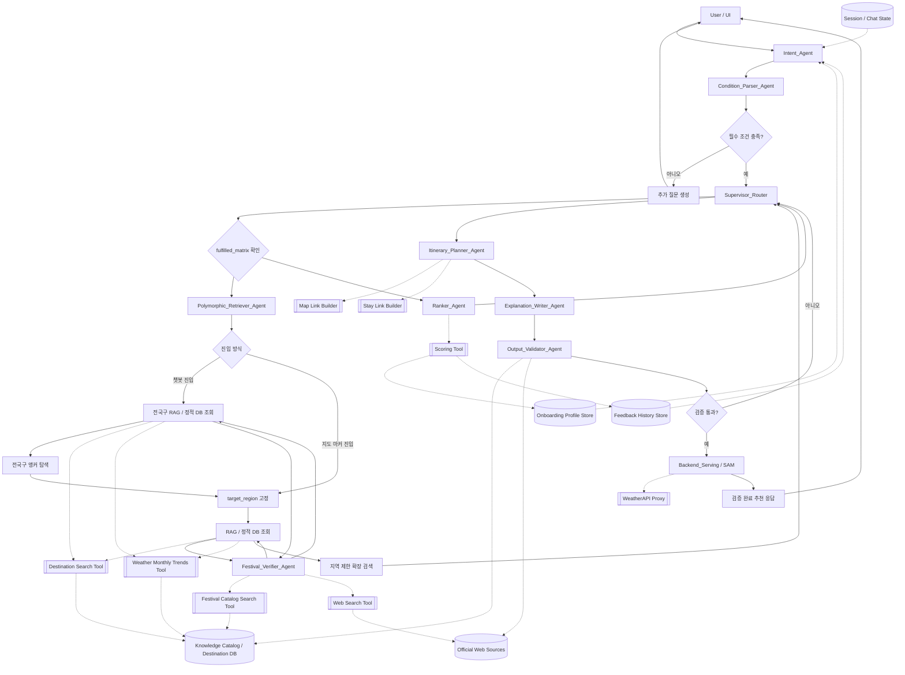

# 로브 (Lovv) Agent 명세서

> 문서 버전: v0.2
> 문서 상태: 검토 중 (Review)
> 기준 문서: `docs/01_requirements/01_requirements.md` v1.5

# 1. 문서 개요

## 1.1 목적

본 문서는 로브 추천 Agent의 역할, 단계별 입력·출력, 도구 사용, 폴백, 검증 기준을 정의한다.
Agent는 단일 LLM 호출이 아니라 의도 정리, 조건 분류, 검색, 축제 날짜 검증, 선정, 일정 구성, 설명 생성으로 나뉜 멀티스텝 파이프라인으로 동작한다.

# 2. Agent 목표

| 목표 | 설명 |
| --- | --- |
| 조건 구조화 | 자연어와 지도 진입 조건을 추천 조건 객체로 변환 |
| 근거 기반 추천 | RAG 검색 결과와 정적 데이터를 근거로 소도시 1곳 선정 |
| 개인화 반영 | 온보딩 선호와 좋아요/싫어요 피드백 반영 |
| 일정 구성 | 일정 유형에 맞는 일별 세부 일정 생성 |
| 설명 가능성 | 추천 이유와 일정 흐름 이유를 자연어로 제공 |
| 안전한 폴백 | 데이터 부족, API 실패, 조건 충돌 시 대체 안내 |

# 3. Agent 입력

에이전트 런타임 시작 시 세션의 연속적인 문맥 관리 및 유저 취향 추적 검증을 위해 아래 항목들을 필수 상태 변수로 바인딩합니다.

| 입력 | 출처 | 설명 | 필수 여부 |
| --- | --- | --- | --- |
| session_id | 시스템 | 세션 구분을 위한 고유 식별자 | **필수 (State 바인딩)** |
| onboardingProfile | 저장 데이터 | 유저 선호 테마 프로필 | **필수 (State 바인딩)** |
| feedbackHistory | 저장 데이터 | 좋아요/싫어요 피드백 이력 | **필수 (State 바인딩)** |
| naturalLanguageQuery | 챗봇 | 사용자 자연어 요청 | 선택 (챗봇 진입 시) |
| entryType | UI | chatbot 또는 map_marker | 필수 |
| country | UI/챗봇 | KR 또는 JP | 필수 |
| travelMonth | UI/챗봇 | 1~12월 | 필수 |
| travelYear | UI/시스템 | 해당 연도 축제 개최일 검증 기준 연도 | 선택 (없으면 현재 연도 또는 여행 시작일 기준) |
| destinationId | 지도 | 마커 클릭 시 고정 목적지 | 선택 (지도 진입 시) |
| tripType | UI/챗봇 | daytrip~5d4n | 필수 |
| includeFestivals | UI/챗봇 | 축제·행사 포함 여부 | 필수 |

# 4. Agent 출력

| 출력 | 설명 |
| --- | --- |
| selectedDestination | 선정된 소도시 1곳 |
| itinerary | 일정 유형에 맞춘 일별 세부 일정 |
| recommendationReasons | 사용자 조건, 계절, 혼잡도, 기상 경향 기반 추천 이유 |
| itineraryFlowReason | 일정 순서와 동선 흐름 이유 |
| alternativeItinerary | 기상 악화 시 실내 중심 대체 일정 |
| festivalDateVerifications | 축제별 해당 연도 날짜 검증 결과와 신뢰도 |
| externalLinks | 지도, 숙소 검색, 현지 탐색 링크 |
| confidence | 추천 신뢰도와 데이터 결측 안내 |

# 5. 파이프라인

기존의 기능 중심 단선형 7단계 일방통행 구조를 폐기하고, **`Intent_Agent`가 멀티턴 컨텍스트를 정리한 뒤 `Supervisor_Router`가 중앙 통제 센터(Hub) 역할을 수행하는 중앙 통제형(Supervisor Pattern) 아키텍처**를 적용합니다.
검색 및 후보 선정 구간은 `fulfilled_matrix`를 기준으로 순환 제어하고, `Itinerary Planner` 이후의 일정 생성·설명·검증 구간은 매트릭스 재평가 없이 Supervisor가 순차 호출합니다.

### 5.1 Agent 구성도



### 5.2 파이프라인 단계 및 모듈 구성

| 단계 | 노드/모듈명 | 중앙 통제 및 역할 | 입력 | 출력 |
| --- | --- | --- | --- | --- |
| 1 | `Intent_Agent` | [시작 노드] 멀티턴 대화 정리, 불필요한 컨텍스트 제거, handoff payload 생성 | 사용자 메시지, UI 조건, 온보딩, 피드백 이력 | Supervisor 전달용 최소 컨텍스트 |
| 2 | `Condition_Parser_Agent` | [입력 해석] 자연어 및 UI 조건 파싱, 필수 조건 검증 | handoff payload, UI 조건 | 구조화된 여행 조건 객체 |
| 3 | `Supervisor_Router` | [중앙 제어 엔진] `fulfilled_matrix` 상태를 기반으로 검색·후보 선정 구간을 제어하고, 이후 일정 생성 구간을 순차 호출 | 구조화 조건, fulfilled_matrix 상태 | 각 Agent 제어 호출 및 런타임 흐름 분기 |
| 4 | `Polymorphic_Retriever_Agent` | [Supervisor 제어 대상] 전국구 RAG/정적 DB 조회, 앵커 탐색, 지역 제한 검색 수행 | 국가, 월, 테마, target_region | 후보 소도시, 관광지, 축제, 기상 경향 데이터 |
| 5 | `Festival_Verifier_Agent` | [Retriever 위임 대상] 축제 후보의 해당 연도 개최일을 공식 웹 출처 기준으로 검증 | 축제 후보, target_region, travelYear, travelMonth | 축제 날짜 검증 JSON |
| 6 | `Ranker_Agent` | [Supervisor 제어 대상] 후보 정렬 및 최상위 1곳 선정 (Scoring Tool 활용) | 후보 목록, 개인화 피드백, 기상 경향 | 선정된 소도시 1곳 |
| 7 | `Itinerary Planner` | [Supervisor 순차 호출 대상] 소도시 맞춤형 일정 구성 | 선정 소도시, 일정 유형, 축제 검증 결과 | 일별 세부 일정 |
| 8 | `Explanation Writer` | [순차 호출 대상] 추천 이유 및 동선 흐름 이유 작성 | 조건, 랭킹 점수, 생성 일정 | 자연어 추천 이유 및 일정 흐름 설명 |
| 9 | `Output Validator` | [최종 검증 노드] 추천 결과 최종 검증 및 신뢰도 판단 | 최종 생성물 세트 | 누락·환각·정책 위반 검증 완료본 |
| 10 | `Backend_Serving / SAM` | [서빙 계층] 검증 완료 패키지 저장 및 UI 응답 제공 | 검증 완료 결과 | UI 응답 패키지 |

# 6. 단계별 명세

## 6.1 Intent_Agent

| 항목 | 내용 |
| --- | --- |
| 책임 | 멀티턴 대화에서 현재 추천 의도와 선호를 정리하고, Supervisor에 전달할 최소 컨텍스트를 생성 |
| 필수 상태 바인딩 | `session_id`, `onboardingProfile`, `feedbackHistory` |
| 필수 출력 | `extracted_inputs`, `user_preferences`, `fulfilled_matrix`, `excluded_themes` |
| 컨텍스트 정책 | 전체 대화 로그를 Supervisor에 기본 전달하지 않고, 라우팅과 검색에 필요한 정보만 전달 |
| 폴백 | 의도 또는 필수 조건이 불명확하면 추가 질문 생성 흐름으로 전이 |

## 6.2 Condition_Parser_Agent

| 항목 | 내용 |
| --- | --- |
| 책임 | 자연어 및 UI 입력에서 국가, 월, 테마, 동행, 일정 유형을 추출하고, 다중 진입점 분기 파라미터를 구조화 (기존 Entry Classifier의 역할 흡수 통합) |
| 필수 상태 바인딩 | `session_id`, `onboardingProfile`, `feedbackHistory` |
| 필수 출력 | `country`, `travelMonth`, `tripType` |
| 폴백 | 필수 값 누락 시 추가 질문 생성 흐름으로 전이 |
| 구현 위치 | 초기 구현에서는 `Intent_Agent` 내부 기능으로 포함 가능 |

## 6.3 Supervisor_Router

| 항목 | 내용 |
| --- | --- |
| 책임 | 중앙 통제 센터로서 `fulfilled_matrix` 상태판을 실시간 스캔 및 스케줄링하여 검색·후보 선정 구간을 제어하고, 목적지 선정 이후 `Itinerary Planner`, `Explanation Writer`, `Output Validator`를 순차 호출함 |
| 제어판 수렴 기호 | `X` (Pending/탐색 필요), `O` (Success/인출 성공), `△` (Fallback/기상 또는 시즌 폴백), `N/A` (Excluded/정책적 배제) |
| 충돌 해결 및 제어권 이동 | 전국구 앵커 모드, 지도 마커 진입, 지역 제한 확장 모드를 순서대로 제어 |

Supervisor_Router의 제어권 이동은 아래 기준을 따른다.

- **1회차 순환 (전국구 앵커 모드 제어)**: `Condition_Parser` 완료 후 `Supervisor`가 매트릭스를 `X`로 초기화한다. `Polymorphic_Retriever_Agent`는 전국구 RAG/정적 DB 조회로 대표 명소(Anchor) 후보를 찾고 `target_region`을 고정(`Lock-on`)한 뒤 복귀한다.
- **지도 마커 진입**: `destinationId`가 있으면 전국구 앵커 탐색을 생략하고 `target_region`을 고정한 뒤 지역 제한 검색으로 진입한다.
- **2회차 이후 순환 (지역 제한 확장 모드 제어)**: `Supervisor`가 남은 미충족 플래그(`X`)를 스캔하여 다음 타겟을 지정하고, 고정된 소도시 내부 범위의 상세 관광지/체험/서브 스팟을 추출하도록 호출한다.

## 6.4 Polymorphic_Retriever_Agent

| 항목 | 내용 |
| --- | --- |
| 책임 | 단일 물리 노드 내에서 State 조건에 따라 호출 모드를 변경하여 RAG/정적 DB 기반 소도시, 관광지, 축제 후보, 기상 경향 데이터를 인출 |
| 모드 1: 전국구 앵커 모드 | `state["target_region"]`이 `None`일 때 동작. 전국구 RAG/정적 DB 조회로 사용자 실시간 인텐트에 부합하는 최적의 대표 명소(Anchor) 및 소도시 1곳을 매칭하여 `target_region`을 고정(Lock-on)함 |
| 모드 2: 지역 제한 확장 모드 | `state["target_region"]`이 존재할 때 동작. 고정된 소도시 내부로 쿼리를 제한하고, 사용자의 온보딩 선호 프로필 및 피드백 이력을 바탕으로 상세 테마 관광지/체험/서브 스팟을 추출 |
| 축제 처리 | Knowledge Catalog에는 대략적인 개최 시기만 저장하고, 해당 연도의 정확한 개최일 검증은 `Festival_Verifier_Agent`에 위임 |
| 제약 조건 | 한국 요청에는 한국 데이터만, 일본 요청에는 일본 데이터만 검색되도록 강제 분리 |

## 6.5 Festival_Verifier_Agent

| 항목 | 내용 |
| --- | --- |
| 책임 | 축제 후보에 대해 해당 연도 정확한 개최 기간을 공식 웹 출처 기준으로 검증 |
| 입력 | 축제 후보, `target_region`, `travelYear`, `travelMonth`, 공식 출처 후보, 검색 키워드 |
| 출력 | `festival_id`, `date_status`, `start_date`, `end_date`, `source_url`, `source_type`, `verified_at`, `confidence` |
| 사용 도구 | `Festival Catalog Search Tool`, `Web Search Tool` |
| 날짜 상태값 | `confirmed`, `tentative`, `unknown`, `outdated` |
| 토큰 정책 | 웹 검색 원문 전체를 downstream Agent에 전달하지 않고 검증 결과 JSON만 반환 |
| 일정 반영 규칙 | `confirmed` 축제만 일정에 직접 배치하고, `tentative` 축제는 안내 문구 또는 후보 정보로만 사용 |

## 6.6 Ranker (동결)

| 점수 요소 | 방향 |
| --- | --- |
| 사용자 조건 매칭 | 높을수록 가점 (Scoring Tool 활용) |
| 계절 적합도 | 높을수록 가점 |
| 혼잡도 | 낮을수록 가점 |
| 월별 기상 악화 경향 | 높을수록 감점 |
| 좋아요 테마 태그 | 가점 |
| 싫어요 소도시 | 감점 (기존 가감점 기준 변경 없이 보존) |

## 6.7 Itinerary Planner (동결)

| 일정 유형 | 구성 기준 (기존 Itinerary Planner 기준 보존) |
| --- | --- |
| 당일치기 | 핵심 명소 2~3개, 이동 부담 최소화 |
| 1박2일 | 대표 명소, 식사, 휴식, 숙소 검색 링크 |
| 2박3일 이상 | 일자별 테마 분리, 과도한 이동 방지 |

## 6.8 Explanation Writer

추천 이유는 아래 항목 중 2개 이상을 포함합니다.

*   사용자 조건과의 매칭
*   계절 적합도
*   혼잡 회피 근거
*   월별 기상 경향
*   일정 흐름과 이동 효율

## 6.9 Output Validator

| 항목 | 기준 |
| --- | --- |
| 조건 충족 검증 | 입력된 국가, 월, 일정 유형이 최종 출력에 정확히 반영되었는지 검증 |
| 근거성 및 환각 검증 | 추천된 모든 장소와 추천 이유가 기구축된 통합 목적지 DB의 팩트와 부합하는지 검증 |
| 축제 날짜 검증 | 일정에 직접 배치된 축제는 `Festival_Verifier_Agent`의 `confirmed` 결과가 있는지 확인 |
| 단일 목적지 검증 | 최종 추천 대상이 소도시 1곳을 중심으로 구성되었는지 확인 |
| 설명 가능성 검증 | 추천 이유와 일정 흐름 이유가 모두 자연어로 온전히 포함되어 있는지 확인 |
| 안전성 검증 | 데이터 결측 및 연동 API 실패 상황 발생 시 안전한 폴백 및 결측 안내 메시지가 정상 적용되었는지 확인 |

# 7. 도구 및 데이터 사용

## 7.1 에이전트 사용 도구 명세

| 도구명 | 책임 역할 및 사용 목적 | 입력 매개변수 명세 | 비고 |
| --- | --- | --- | --- |
| `Destination Search` | 통합 목적지 DB에서 테마별 마스터 데이터를 인출하는 책임 | `theme` (필수 문자열 - 카테고리 기호), `target_region` (선택적 문자열/Nullable). 1회차 전국구 앵커 모드 시 `None`으로 전국 단위 조회, 2회차 이후엔 고정된 지역 코드로 소도시 내부 검색 제한 | 구조 교정 |
| `Festival Catalog Search` | Knowledge Catalog에서 축제명, 지역, 대략적인 개최 시기, 공식 출처 후보, 검색 키워드를 조회하는 책임 | `target_region` (필수 문자열), `travelMonth` (필수 정수), `theme` (선택) | `Festival_Verifier_Agent`가 호출 |
| `Web Search Tool` | 해당 연도 축제 개최일 검증을 위해 공식 사이트, 지자체, 관광공사 등 웹 출처를 검색하는 책임 | `query` (필수 문자열), `preferred_source_types` (선택 배열), `travelYear` (선택 정수) | `Festival_Verifier_Agent` 내부에서만 원문 소비 |
| `Weather Monthly Trends` | 타겟 월/지역의 **통계적 기상 조건(장마 플래그, 태풍 경향 등)의 정형 상태 값만 리턴**하는 순수 조회 책임 (스코어링 및 대체 일정 분기 연산 배제, 폴백 판단은 Supervisor가 전담) | `target_region` (필수 문자열), `travelMonth` (필수 정수) | 기능 수정 |
| `Scoring Tool` | 인출된 후보지들을 대상으로 기본 조건 부합도 및 개인화 이력을 고려하여 **정렬 우선순위(Score)를 연산하고 랭킹을 매겨주는 책임** (Ranker 노드 호출) | `candidates_list` (필수 배열), `onboardingProfile` (필수), `feedbackHistory` (필수) | **신설** |
| `WeatherAPI Proxy` | 목적지 상세 화면 표시용 실시간 날씨 데이터 조회 | `latitude` (필수 실수), `longitude` (필수 실수) | 기존 유지 |
| `Map Link Builder` | 지도 딥링크 생성 | `destinationId` (필수) | 기존 유지 |
| `Stay Link Builder` | 국가별 숙박 플랫폼 검색 딥링크 생성 | `destinationId` (필수), `tripType` (필수) | 기존 유지 |

## 7.2 fulfilled_matrix 제어판 규격

`Supervisor_Router`가 참조하고 갱신하는 `fulfilled_matrix` 제어판의 수렴 기호 규격은 다음과 같습니다.

*   `X` : Pending / 탐색 및 인출 필요
*   `O` : Success / 성공적으로 인출 완료
*   `△` : Fallback / 기상 악화 또는 시즌 오프에 따른 폴백 처리 상태
*   `N/A` : Excluded / 정책 또는 조건 미선택에 따른 배제 (예: 축제 비포함 선택 시)

## 7.3 Agent / Tool 분리 원칙

| 대상 | 결정 | 이유 |
| --- | --- | --- |
| `Festival_Verifier_Agent` | Agent로 운영 | 웹 검색 결과 해석, 공식 출처 판별, 날짜 충돌 해결, 신뢰도 산정이 필요 |
| `Destination Search` | Tool 유지 | 목적지 DB 조회는 단순 검색 책임 |
| `Festival Catalog Search` | Tool 유지 | Catalog에 저장된 축제 메타데이터 조회 책임 |
| `Weather Monthly Trends` | Tool 유지 | 월별 기상 경향 정형 데이터 조회 책임 |
| `Scoring Tool` | Tool 유지 | 후보 점수 계산은 결정적 함수에 가까움 |
| `Map Link Builder` / `Stay Link Builder` | Tool 유지 | 링크 생성은 단순 변환 작업 |
| `WeatherAPI Proxy` | Tool 유지 | 상세 화면 표시용 실시간 날씨 조회 프록시 |

`Festival_Verifier_Agent`는 긴 검색 결과나 원문을 그대로 반환하지 않고, 아래와 같은 최소 JSON만 downstream Agent에 전달합니다.

```json
{
  "festival_id": "kr_jinhae_cherry_blossom",
  "date_status": "confirmed",
  "start_date": "2026-03-28",
  "end_date": "2026-04-06",
  "source_url": "https://example.official.kr",
  "source_type": "official",
  "verified_at": "2026-06-01",
  "confidence": 0.92
}
```

# 8. 금지 사항

- 대화 로그 전문을 장기 저장하지 않는다.
- Supervisor에 전체 대화 로그를 기본 전달하지 않는다.
- WeatherAPI 실시간 예보를 추천 후보 스코어링 기준으로 사용하지 않는다.
- 출처 없는 장소 정보를 확정 사실처럼 제시하지 않는다.
- 검증되지 않은 축제 날짜를 확정 일정처럼 제시하지 않는다.
- 한국 요청에 일본 목적지를 섞거나, 일본 요청에 한국 목적지를 섞지 않는다.
- 숙소를 직접 추천하지 않고 검색 링크만 제공한다.

# 9. 품질 검증 기준

| 검증 항목 | 기준 |
| --- | --- |
| 조건 충족 | 국가, 월, 일정 유형이 결과에 반영됨 |
| 근거성 | 추천 이유가 데이터 근거와 연결됨 |
| 축제 날짜 정확성 | 일정에 배치된 축제는 해당 연도 `confirmed` 날짜 검증 결과가 있음 |
| 단일 목적지 | 최종 추천은 소도시 1곳 중심 |
| 설명 가능성 | 추천 이유와 일정 흐름 이유가 모두 존재 |
| 안전성 | 결측 데이터와 API 실패를 안내 |

# 10. 변경 이력

| 버전 | 날짜 | 작성자 | 변경 내용 |
| --- | --- | --- | --- |
| v0.3 | 2026-06-01 | 로브 기획팀 | Intent Agent 도입, Festival Verifier Agent 승격, Agent 구성도 및 전국구 RAG 조회 흐름 반영 |
| v0.2 | 2026-05-31 | 로브 기획팀 | LangGraph 기반 순환형 아키텍처 개편 및 Supervisor Router 도입, Polymorphic Retriever 노드 모드 분리, 하이브리드 데이터 조회 및 실시간 API 검증 반영 |
| v0.1 | 2026-05-29 | 로브 기획팀 | Agent 명세서 초안 작성 |

