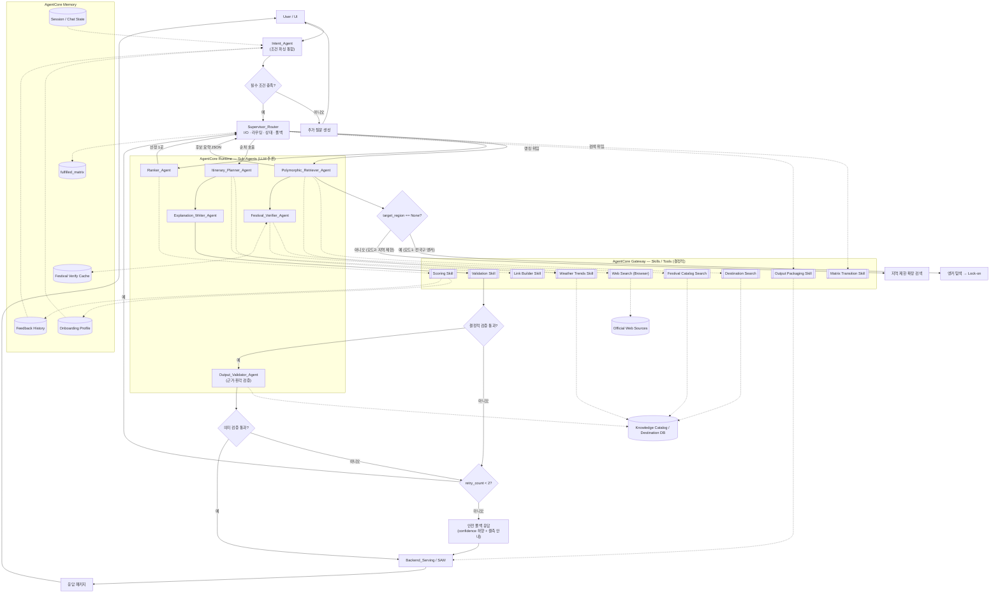

# 로브 (Lovv) Agent 명세서 수정 방안

> 문서 상태: 제안 (Proposal)
> 대상 문서: `docs/07_agent_spec/07_agent_spec.md` (v0.3)
> 연관 문서: `docs/07_agent_spec/agent_build_target.md`
> 작성일: 2026-06-07

# 1. 문서 목적

본 문서는 `07_agent_spec.md` 검토 과정에서 도출된 비효율 항목에 대한 수정 방안을 정리한다.
각 항목은 **현황 → 문제 → 수정안(전후 비교) → 영향 범위** 순으로 기술하며, 적용 시 `07_agent_spec.md`와 `agent_build_target.md`에 함께 반영한다.

우선순위는 런타임 비용·안정성에 직접 영향을 주는 **구조적 비효율(2장)** 을 먼저 처리하고, 유지보수 비용에 해당하는 **문서 정합성(3장)** 을 후속 처리한다.

# 2. 구조적 비효율 수정 방안 (우선)

## 2.1 Intent_Agent와 Condition_Parser_Agent 병합

| 항목 | 내용 |
| --- | --- |
| 신뢰도 | 높음 |
| 현황 | 6.2에서 "초기 구현에서는 `Intent_Agent` 내부 기능으로 포함 가능"(171행)이라 명시했으나, 파이프라인(5.2)에서는 별도 2단계로 분리 |
| 문제 | `Intent_Agent`가 이미 `extracted_inputs`, `fulfilled_matrix`를 출력하므로 조건 파싱 역할이 중복됨. 별도 LLM 노드 운영 시 호출 1회 + handoff 1회가 추가되어 지연·토큰 비용만 증가 |

**수정안 (전후 비교)**

- 변경 전: `Intent_Agent` → `Condition_Parser_Agent` → `Supervisor_Router` (3노드)
- 변경 후: `Intent_Agent`(조건 파싱 내장) → `Supervisor_Router` (2노드)

구체 조치:

1. 파이프라인 단계표(5.2)에서 단계 2 `Condition_Parser_Agent`를 단계 1 `Intent_Agent`의 하위 책임으로 통합하고, 단계 번호를 9단계로 재정렬한다.
2. `Condition_Parser_Agent`는 "논리적 책임"으로만 6.2에 유지하되, 물리 노드는 기본적으로 분리하지 않는다는 점을 명시한다.
3. 필수 조건 미충족 시 추가 질문 분기(`NEED_MORE`)는 `Intent_Agent` 출력 직후에 위치하도록 다이어그램을 수정한다.
4. 향후 분리가 필요할 경우의 기준(예: 파싱 정확도 저하, 프롬프트 비대화)을 "분리 트리거" 주석으로 남긴다.

> 영향 범위: 파이프라인 단계표, 5.1 다이어그램, 6.1/6.2. `agent_build_target.md`의 구현 우선순위 표(4장)도 동기화.

## 2.2 검증 실패 재진입 루프 가드 신설

| 항목 | 내용 |
| --- | --- |
| 신뢰도 | 높음 |
| 현황 | 다이어그램의 `VALID -- 아니오 --> SUPERVISOR`(128행)는 재시도 경로이나, 최대 재시도 횟수·종료 조건이 명세에 없음 |
| 문제 | 검증이 반복 실패하면 무한 순환 가능. LLM 호출 비용 폭증 및 응답 지연(최악의 경우 타임아웃) 위험 |

**수정안 (전후 비교)**

- 변경 전: 검증 실패 → 무조건 Supervisor 재진입 (상한 없음)
- 변경 후: 검증 실패 → 재시도 카운터 증가 → 상한 도달 시 안전 폴백으로 확정 종료

구체 조치(6.3 Supervisor_Router 또는 6.9 Output Validator에 명문화):

1. `state["validation_retry_count"]` 상태 변수를 신설하고 최대 재시도 횟수를 **2회**로 고정(초기값 제안, 추후 튜닝).
2. 재진입 시 Supervisor는 실패 사유에 따라 **재탐색 / 재작성 / 폴백 확정** 중 하나만 선택한다 (이미 `agent_build_target.md` 3.9에 서술된 원칙을 본 명세에 반영).
3. 상한 도달 시 `confidence`를 낮추고 결측 안내 메시지를 포함한 폴백 응답으로 종료한다 (8장 금지사항과 9장 안전성 기준에 연결).

```text
검증 실패
  └─ retry_count < 2 ?
       ├─ 예  → Supervisor 재진입 (재탐색/재작성/폴백 중 택1)
       └─ 아니오 → 안전 폴백 응답 확정 (confidence 하향 + 결측 안내)
```

> 영향 범위: 6.3, 6.9, 9장. `agent_build_target.md` 3.9 규칙과 정합 확인.

## 2.3 Festival_Verifier 웹검색 캐싱 정책 명시

| 항목 | 내용 |
| --- | --- |
| 신뢰도 | 중간 |
| 현황 | 축제 후보마다 웹 검색을 수행(204행). 결과 JSON에 `verified_at` 필드는 있으나 캐시 TTL·재사용 규칙이 없음 |
| 문제 | 동일 축제·동일 연도를 세션/요청 간 반복 검증할 가능성. 파이프라인에서 가장 비싼 단계(웹검색 + LLM 해석)가 중복 호출되어 비용·지연 증가 |

**수정안 (전후 비교)**

- 변경 전: 축제 후보 발생 시 매번 웹 검증
- 변경 후: `festival_id + travelYear` 키로 검증 결과 캐싱, TTL 내 재사용

구체 조치(6.5 Festival_Verifier_Agent에 추가):

1. 캐시 키를 `festival_id + travelYear`로 정의하고, `date_status`별 TTL을 차등 적용한다.

| `date_status` | 권장 TTL | 근거 |
| --- | --- | --- |
| `confirmed` | 30일 | 공식 확정일은 변동 가능성 낮음 |
| `tentative` | 7일 | 잠정값은 갱신 가능성 있음 |
| `unknown` / `outdated` | 1일 | 재검색 유도 |

2. 캐시 히트 시 웹 검색을 생략하고 저장된 JSON을 반환한다.
3. 캐시 저장소는 Knowledge Catalog 또는 별도 검증 캐시 테이블로 두되, 데이터 모델 영향은 `06_database_design.md`에서 확인한다.

> 영향 범위: 6.5, 7.1(도구 비고). `06_database_design.md` 검증 캐시 테이블 검토 필요.

# 3. 문서 정합성 수정 방안 (후속)

## 3.1 문서 버전 동기화

| 항목 | 내용 |
| --- | --- |
| 신뢰도 | 높음 |
| 현황 | 헤더는 `v0.2`(3행)인데 변경 이력 최신은 `v0.3`(325행). 기준 문서 표기도 `01_requirements.md v1.5`로 헤더에 고정 |
| 수정안 | 헤더 `문서 버전`을 `v0.3`으로 갱신. 기준 문서 버전은 `01_requirements.md` 실제 최신 버전과 대조 후 정정 |

## 3.2 fulfilled_matrix 기호 규격 중복 제거

| 항목 | 내용 |
| --- | --- |
| 신뢰도 | 높음 |
| 현황 | X/O/△/N/A 규격이 6.3(178행)과 7.2(266~271행)에 중복 기재 |
| 수정안 | 정본을 **7.2 한 곳**으로 통합. 6.3에서는 "기호 규격은 7.2 참조"로 대체하여 단일 출처(Single Source of Truth) 유지 |

## 3.3 다이어그램과 "단일 물리 노드" 설계 일치

| 항목 | 내용 |
| --- | --- |
| 신뢰도 | 중간 |
| 현황 | 6.4는 Polymorphic_Retriever를 "단일 물리 노드"로 정의(191행)하나, 다이어그램은 `NATIONAL_RAG`와 `RAG_SEARCH`를 별도 노드로 그려 거의 동일한 흐름을 중복 표현 |
| 수정안 | 두 경로를 하나의 `Polymorphic_Retriever_Agent` 노드로 합치고, 내부 분기를 "모드 1: 전국구 앵커 / 모드 2: 지역 제한 확장"의 조건 분기(`target_region == None?`)로 표현. 그래프 노드 수 감소 및 설계 의도와 일치 |

**다이어그램 단순화 방향(예시)**

```text
Polymorphic_Retriever_Agent
  └─ target_region == None ?
       ├─ 예  → 모드 1: 전국구 앵커 탐색 → target_region 고정
       └─ 아니오 → 모드 2: 지역 제한 확장 검색
```

## 3.4 노드 명칭 표기 통일

| 항목 | 내용 |
| --- | --- |
| 신뢰도 | 중간 |
| 현황 | 동일 노드가 `Itinerary_Planner_Agent`(다이어그램) / `Itinerary Planner`(6.7) / `Explanation_Writer_Agent` vs `Explanation Writer` 등으로 혼재 |
| 수정안 | `agent_build_target.md`의 `_Agent` 접미사 표기(`Itinerary_Planner_Agent`, `Explanation_Writer_Agent`, `Output_Validator_Agent`)를 정본으로 채택하고, `07_agent_spec.md` 전체를 일괄 통일 |

**명칭 매핑 표**

| 현재 혼용 표기 | 통일 표기 |
| --- | --- |
| Itinerary Planner / Itinerary_Planner_Agent | `Itinerary_Planner_Agent` |
| Explanation Writer / Explanation_Writer_Agent | `Explanation_Writer_Agent` |
| Output Validator / Output_Validator_Agent | `Output_Validator_Agent` |

# 4. Supervisor I/O 중심 재설계 및 위임 전략

> 신뢰도: 중간 (아키텍처 설계 제안. 토큰 절감 효과는 실제 페이로드 크기에 따라 달라지므로 구현 후 계측 필요)

## 4.1 설계 원칙

`Supervisor_Router`의 목적을 **I/O 오케스트레이션(입력 라우팅 · 상태 관리 · 출력 조립)** 으로 한정한다.
Supervisor는 어떤 콘텐츠도 직접 "추론"하거나 "가공"하지 않으며, **압축된 상태(state)와 참조(reference)만** 보유한다. 토큰을 많이 쓰거나 결정적으로 처리 가능한 작업은 모두 sub-agent 또는 skill로 위임한다.

위임 기준:

| 작업 성격 | 위임 대상 | 반환 형태 |
| --- | --- | --- |
| LLM 추론이 필요하고 **대량 컨텍스트를 소비**하는 작업 (자연어 해석, 웹 원문 해석, 생성형 작성) | **Sub-Agent** | 압축 JSON / 최소 요약 |
| **결정적·규칙 기반·반복적** 작업 (계산, 변환, 스키마 검증, 상태 전이, 링크 생성) | **Skill** | 구조화 값 (배열/객체) |
| 상태 읽기·쓰기, 다음 노드 결정, 폴백/재시도 제어, 최종 응답 패키징 | **Supervisor 직접 수행** | state 갱신 |

## 4.2 Supervisor 역할 경계 (재정의)

| 구분 | 항목 |
| --- | --- |
| Supervisor가 직접 수행 (I/O) | 입력 수신 및 라우팅, `fulfilled_matrix` 읽기/쓰기, handoff payload 조립(최소 컨텍스트·참조만), 재시도/폴백 흐름 제어(2.2), 최종 응답 패키징 |
| Supervisor가 보유하지 않음 | 대화 로그 전문, 웹 검색 원문, RAG 검색 원문, 후보 상세 레코드 전체 — 모두 **참조 키 또는 압축 결과로만** 보유 |
| Supervisor가 수행하지 않음 (위임) | 텍스트 추론, 점수 계산, 일정·설명 생성, 날짜 검증, 스키마/정책 검증, 링크 생성 |

## 4.3 작업별 위임 매핑

| 작업 | 현재 위치 | 위임 대상 | 유형 | 토큰/효율 근거 |
| --- | --- | --- | --- | --- |
| 멀티턴 대화 정리·조건 파싱 | Intent/Parser | `Intent_Agent` | Sub-Agent | 대화 로그 전문을 Supervisor가 들지 않고 압축 payload만 수신 |
| 전국/지역 RAG·정적 DB 검색 | Retriever | `Polymorphic_Retriever_Agent` | Sub-Agent | 검색 원문은 내부 소비, 후보 요약만 반환 |
| 축제 해당 연도 날짜 검증 | Festival Verifier | `Festival_Verifier_Agent` | Sub-Agent | 웹 원문 비전달, 검증 JSON만 반환(6.5) |
| 일정 생성 | Planner | `Itinerary_Planner_Agent` | Sub-Agent | 생성형 추론, 일정 구조만 반환 |
| 추천 이유·동선 설명 작성 | Writer | `Explanation_Writer_Agent` | Sub-Agent | 생성형 추론, 설명 텍스트만 반환 |
| 근거성·환각 검증 (의미 판단) | Validator | `Output_Validator_Agent` | Sub-Agent | DB 팩트 대조 추론, 판정 결과만 반환 |
| 후보 점수 계산·랭킹 | Scoring Tool | **Scoring Skill** | Skill | 결정적 함수, Supervisor가 LLM으로 계산할 이유 없음 |
| `fulfilled_matrix` 상태 전이 | Supervisor | **Matrix Transition Skill** | Skill | X/O/△/N/A 규칙 기반 전이를 코드로 처리해 라우팅 토큰 절감 |
| 스키마·정책 결정적 검증 (필드 누락, 국가 혼합, 단일 목적지) | Validator | **Validation Skill** | Skill | 규칙 검사는 결정적. LLM 검증(환각)과 분리 |
| 지도/숙소 딥링크 생성 | Link Builder | **Link Builder Skill** | Skill | 단순 변환 |
| 월별 기상 경향 조회 | Weather Tool | **Weather Trends Skill** | Skill | 정형 상태값 조회·반환 |
| 날짜 정규화·포맷 변환 | (분산) | **Date Normalize Skill** | Skill | 결정적 변환, 각 Agent 중복 제거 |
| 응답 패키징·민감정보 마스킹 | Serving | **Output Packaging Skill** | Skill | 결정적 직렬화/마스킹 |

## 4.4 Output Validator 분리 (위임 적용 예시)

현재 6.9 Output Validator는 결정적 검사와 의미 판단이 한 노드에 섞여 있다. 이를 분리한다.

- 변경 전: `Output_Validator_Agent`가 필드 검증 + 환각 검증 + 정책 검증을 모두 LLM으로 수행
- 변경 후: **Validation Skill**(결정적: 필드 누락, 국가 혼합, 단일 목적지, 축제 `confirmed` 여부)을 먼저 통과 → 통과분만 **`Output_Validator_Agent`**(의미: 근거성·환각·설명 가능성)로 전달

효과: 결정적 검사에서 걸러질 케이스는 LLM 호출 없이 조기 반려되어, 가장 비싼 의미 검증 단계의 호출 빈도와 입력 토큰이 감소한다.

## 4.5 토큰 절감 핵심 규칙

1. Supervisor는 **raw 콘텐츠를 절대 보유·전달하지 않는다.** 참조 키 또는 압축 결과만 다룬다.
2. 모든 Sub-Agent는 **반환 직전 압축**한다 (검증 JSON, 후보 요약, 일정 구조 등 downstream 필수 필드만).
3. 결정적으로 표현 가능한 로직은 **LLM 노드에서 제거하고 Skill로 이관**한다 (계산·검증·변환·상태 전이).
4. Skill 결과는 구조화 값으로 state에 누적하고, Supervisor는 이를 라우팅 판단에만 사용한다.

> 기존 명세의 "Tool"(Scoring/Link Builder/Weather Trends 등)은 본 전략에서 **Skill**로 재분류·구현하는 것을 권장한다. 결정적 절차를 재사용 가능한 모듈로 패키징하면 Supervisor·Agent가 동일 로직을 LLM으로 반복 수행하는 것을 막을 수 있다.

# 5. 최신 아키텍처 다이어그램 (Mermaid)

아래 다이어그램은 2~4장의 수정안을 모두 반영한 최신 구성도다. 기존 `07_agent_spec.md` 5.1 다이어그램을 본 버전으로 교체한다.

반영 사항: ① `Intent_Agent`에 조건 파싱 통합(2.1), ② Retriever 단일 노드 + 모드 분기(3.3), ③ 검증 실패 시 재시도 루프 가드(2.2), ④ 축제 검증 캐시(2.3), ⑤ Supervisor를 I/O·라우팅 허브로 한정하고 Sub-Agent / Skill 위임 분리(4장).



> 표기 규칙: 사각형 = Sub-Agent(LLM 추론), `[[ ]]` = Skill/Tool(결정적), 원통 = Memory/데이터 저장소. 점선(`-.->`)은 데이터 참조·조회, 실선(`-->`)은 제어 흐름.

# 6. AWS Bedrock 및 AgentCore 매핑

본 설계는 두 계층을 함께 사용한다: **Amazon Bedrock**(파운데이션 모델 추론·임베딩·관리형 RAG)과 **Bedrock AgentCore**(서버리스 런타임·메모리·게이트웨이·평가). AgentCore Runtime이 LangGraph 그래프를 호스팅하고, 그래프 안의 LLM 노드는 Bedrock 모델을, RAG/임베딩은 Bedrock 임베딩·Knowledge Bases를 호출한다.

## 6.1 계층 구분

| 계층 | 서비스 | 책임 |
| --- | --- | --- |
| 모델 계층 | **Amazon Bedrock** | 에이전트 LLM 추론(Converse API), 임베딩 생성, 관리형 RAG(Knowledge Bases) |
| 런타임 계층 | **Bedrock AgentCore** | 그래프 호스팅(Runtime), 상태(Memory), 도구(Gateway), 웹(Browser), 권한(Identity), 정책(Policy), 추적(Observability), 평가(Evaluations) |

## 6.2 AgentCore 서비스 매핑

AgentCore는 오픈소스 프레임워크(LangGraph, Strands Agents 등)와 MCP/A2A 프로토콜을 지원하는 서버리스 런타임이므로, 기존 LangGraph 기반 Supervisor 설계를 그대로 이식할 수 있다. 위 다이어그램의 구성요소를 AgentCore 서비스에 다음과 같이 매핑한다.

| 본 설계 요소 | AgentCore 구성요소 | 매핑 근거 |
| --- | --- | --- |
| `Supervisor_Router`, 각 Sub-Agent | **AgentCore Runtime** | 서버리스로 에이전트 배포·확장. LangGraph 그래프를 그대로 호스팅 |
| `onboardingProfile`, `feedbackHistory`, `session/chat state`, `fulfilled_matrix`, 축제 검증 캐시 | **AgentCore Memory** | 단기(세션 상태)·장기(선호/피드백) 컨텍스트 보관. 2.3 검증 캐시 TTL도 Memory로 운용 |
| Skill / Tool (Scoring, Matrix, Validation, Link, Weather, Destination/Festival Catalog Search 등) | **AgentCore Gateway** | API·Lambda를 에이전트 도구로 자동 노출. 결정적 Skill을 Lambda로 구현해 Gateway에 등록 |
| `Festival_Verifier_Agent`의 웹 검색 | **AgentCore Browser** + Web Search | 공식 출처 탐색·렌더링. 원문은 Agent 내부에서만 소비 |
| Scoring / Validation 등 계산형 Skill (선택) | **AgentCore Code Interpreter** | 결정적 연산을 격리 실행. Gateway/Lambda 대안 |
| 에이전트별 권한·인증 (Memory 접근, 도구 호출 범위) | **AgentCore Identity** | 에이전트 단위 ID 부여, IdP(Cognito 등) 연동 |
| 8장 금지사항·정책 검증(국가 혼합 금지, 미검증 날짜 차단 등) | **AgentCore Policy** | 에이전트 행동 제어 정책으로 강제 |
| 단계별 추적·디버깅·성능 모니터링 | **AgentCore Observability** | CloudWatch 기반 통합 대시보드로 파이프라인 추적 |

구현 권고:

1. 모델 호출 비용 최적화를 위해 Sub-Agent별 모델을 차등 적용한다 (예: 단순 파싱은 경량 모델, 환각 검증은 상위 모델). *(신뢰도: 중간 — 실제 품질·비용 계측 후 확정)*
2. 결정적 Skill은 LLM이 아닌 Lambda/Code Interpreter로 구현해 Gateway에 등록하고, Runtime의 Agent는 Skill을 도구로만 호출한다 (4장 위임 원칙과 일치).
3. `fulfilled_matrix`와 세션 상태는 Memory에 두어 Supervisor가 raw 콘텐츠 없이 상태만으로 라우팅하도록 한다 (4.5 토큰 절감 규칙).

## 6.3 Bedrock 모델 계층

> 신뢰도: 사실(모델·임베딩·KB 존재)은 높음 — AWS 공식 문서 근거. 단, 모델 선택·티어 배정은 비용/품질 계측 후 확정 권장(중간).

### 6.3.1 에이전트별 모델 배정 (비용·품질 티어링)

4.x 위임 전략과 일치하도록, 작업 성격에 따라 Bedrock 모델을 차등 배정한다. 모델 ID는 리전·버전에 따라 변하므로 Converse API로 추상화해 교체 가능하게 둔다.

| 에이전트 | 작업 성격 | 권장 모델 티어 (예시) |
| --- | --- | --- |
| `Intent_Agent` | 구조화 파싱/판별 | 경량 (Amazon Nova Lite / Claude Haiku 계열) |
| `Supervisor_Router` | 라우팅(주로 Matrix Skill 결정적) | LLM 최소·경량 |
| `Polymorphic_Retriever_Agent` | 검색 의도 해석 | 경량~중급 |
| `Festival_Verifier_Agent` | 웹 결과 해석·출처 판별 | 중급 |
| `Ranker_Agent` | Scoring Skill 결정적 + 보조 판단 | 경량 |
| `Itinerary_Planner_Agent` | 생성형 일정 구성 | 중급~상위 (Claude Sonnet 계열) |
| `Explanation_Writer_Agent` | 자연어 설명 생성 | 중급 |
| `Output_Validator_Agent` | 근거성·환각 의미 검증 | 상위 (정확도 우선) |

### 6.3.2 임베딩 및 벡터 검색

추천 흐름(7.3)의 장소 임베딩과 `theme_queries`/`soft_preference_query`/`cleaned_raw_query` 벡터는 Bedrock 임베딩으로 생성한다.

- 임베딩 모델: **Amazon Titan Text Embeddings V2**(1,024차원, 최대 8,192토큰; RAG·문서검색·재랭킹용) 또는 Cohere Embed.
- 벡터 스토어: Knowledge Bases 백엔드(OpenSearch Serverless / Aurora pgvector 등). `06_database_design.md`의 임베딩 벡터 컬럼과 정합.

### 6.3.3 관리형 RAG (Knowledge Bases)

전국구 RAG/정적 조회(Retriever 모드1)는 **Bedrock Knowledge Bases**로 구현 가능하다. S3의 목적지 코퍼스를 청킹·임베딩·벡터 저장·검색까지 관리형으로 처리한다.

- 정형 필터(거리, `theme` 컬럼 충족)는 DB로, 의미 검색(soft/raw 유사도)은 Knowledge Bases로 처리하는 **하이브리드** 구성을 권장한다.
- `Destination Search` Skill을 Knowledge Bases retrieve 호출에 매핑하거나, DB 조회와 병행한다.

### 6.3.4 추론 호출 규약

- 모든 LLM 노드는 Bedrock **Converse API**(통합 인터페이스)로 호출해 모델 교체 비용을 낮춘다.
- 모델 호출은 AgentCore Runtime이 관장하고, 모델·KB 접근 권한은 AgentCore Identity로 제한한다.

# 7. 추천 서비스 흐름 반영 (Recommendation Flow Integration)

> 신뢰도: 높음 — 정본 `recommendation_flow.md`·`user_raw_query_flow.md`·`theme_analysis_report.md`(40개 소도시 3,709개 장소 실측) 근거. 임계치는 실측 기반이나 운영 데이터로 재캘리브레이션 권장.

추천 서비스 흐름의 상세 로직이 에이전트 아키텍처 문서에 반영돼 있지 않았다. 본 장에서 판별 로직·후보 필터·점수 임계치·임베딩 유사도·예외 처리를 노드/상태/Skill에 흡수한다. 정본의 "판별 agent"는 본 설계의 **`Intent_Agent`** 에 대응한다.

## 7.1 UnifiedAgentState 확장

`langgraph_flow.md` 4장 상태 스키마에 추천 흐름 필드를 추가한다.

```python
    # --- 판별(Intent) 결과: 추천 흐름 핵심 ---
    onboarding_themes: List[str]              # 장기 선호 (온보딩 1~3개)
    chat_extracted_themes: List[str]          # 자연어에서 추출된 테마
    active_required_themes: List[str]         # 필수 충족 대상 (온보딩+자연어 병합, 최대 3)
    theme_priority: Dict[str, str]            # 테마별 high|normal|low
    soft_preferences: List[str]               # quiet, scenic_view 등 (랭킹 가산)
    cleaned_raw_query: str                    # 반영 가능 조건만 남긴 원문 (유사도 검색용)
    theme_queries: Dict[str, str]             # 테마별 벡터 검색 쿼리
    soft_preference_query: str                # 분위기 통합 쿼리
    unsupported_conditions: List[str]         # RAG 미전달 (예외 안내 대상)
    backup_themes: List[str]                  # 3개 초과 시 밀려난 온보딩 테마
    user_location: Optional[Dict[str, float]] # lat/lng (거리 1차 필터 기준)
    accommodation_link_required: bool
    user_notice: Optional[str]                # 예외 안내 문구 (100자 내외)
```

## 7.2 Intent_Agent(판별) 출력·병합 규칙

`Intent_Agent`는 자연어를 추천 가능한 정형 조건으로 변환한다. 온보딩=장기 선호, 자연어=현재 여행 의도로 해석하고 다음 규칙으로 `active_required_themes`를 만든다.

| 상황 | 처리 |
| --- | --- |
| 자연어가 분위기만 | 온보딩 테마 유지 + `soft_preferences` 반영 |
| 온보딩과 같은 테마 재언급 | 해당 테마 `theme_priority` 강화 |
| 새 테마 추가 | active theme에 추가 |
| 기존 테마 제외 | `excluded_themes`로 이동(`N/A`) |
| 완전히 다른 테마 강하게 요구 | 자연어 테마를 현재 핵심 조건으로 |
| active theme 3개 초과 | 자연어 우선, 잔여 온보딩은 `backup_themes`로 |

조건/책임 분담(정본 17장): 테마 목록·장소유형·soft 목록·unsupported 목록·우선순위 규칙·active 최대 개수·점수 방식은 **우리가 설계**, 자연어→분류·쿼리 생성·안내문 생성은 **LLM이 판단**.

## 7.3 Polymorphic_Retriever 추천 로직 (모드2 상세화)

지역 제한/후보 선정 단계에서 다음 순서를 수행한다.

1. **거리 기반 1차 필터** — `user_location` 기준 접근 가능 소도시만 남김. `tripType`별 허용 반경: 당일치기=근거리, 1박2일=중거리, 2박 이상=광범위.
2. **필수 테마 충족(결정적, theme 컬럼 집계)** — `city_id + theme` 장소 수로 `active_required_themes` 전체 충족 확인. 충족 임계(7.4-A).
3. **임베딩 유사도 재랭킹(가산, 탈락 아님)** — `theme_queries`/`soft_preference_query`/`cleaned_raw_query` 벡터를 장소 임베딩과 비교해 `city_id` 단위로 집계(매칭 장소 수·최고 유사도).
4. **`unsupported_conditions`는 RAG에 전달하지 않는다** — 예외 안내 또는 검색 링크로 분리.

## 7.4 Ranker / Scoring Skill 점수 요소 확정

기존 6.6 Ranker(6개 generic)를 추천 흐름 9요소로 확정한다. 임계치는 `theme_analysis_report.md` 4장 실측 제안값.

| 점수 요소 | 방향/규칙 | 임계·파라미터 |
| --- | --- | --- |
| 접근성(거리) | 가까울수록 가점 | `tripType`별 반경 |
| 선택 테마 충족도 | 필수(미충족 시 후보 탈락) | 일반(미식·역사·자연) 장소 **3개+**, 희소(바다·예술·온천)는 3테마 복수 선택 시 **1개+** 완화 |
| 테마 특화도 | 전체 평균 대비 배율 초과 시 가점 | 미식>42%(1.25×), 역사>38%(1.25×), 자연>28%(1.2×), 바다>12%(2.0×), 예술>6%(1.5×), 온천>4%(1.5×) |
| 희소 테마 보정 | 희소 테마 가중 | 미식·역사 1.0 / 자연 1.1 / 바다·예술 1.3 / 온천 1.5 |
| 도시 규모 보정 | 장소 수 과다 상한 | 테마별 장소 수 **Cap 10** (이상은 유사도·특화도로 결정) |
| 콘텐츠 타입 균형 | 일정 구성 가능성 | 관광/체험 2+, 음식 1+, 문화/휴식 1+ |
| soft preference 적합도 | 유사도 가산 | `soft_preference_query` 유사도 |
| cleaned raw query 적합도 | 유사도 가산 | `cleaned_raw_query` 유사도 |
| 축제 조건부 반영 | 사용자가 원할 때만 가점 | `confirmed` 축제 보유 도시 |

자연어 입력이 없으면 soft/cleaned raw 적합도는 제외하고 구조화 데이터로만 점수화한다.

## 7.5 Itinerary Planner 반영

`active_required_themes` 전체를 일정에 반영, `content_type` 균형, 동선 최소화, 운영시간 확인 장소 우선, `confirmed` 축제 고정 배치, soft/raw 적합 장소 우선, 일정 후 숙박 검색 링크 제공. (6.7 동결 기준에 추가)

## 7.6 예외(unsupported) 처리

숙박 품질·전망·가격·예약 가능 여부·실시간 혼잡도·재고·실시간 운영 여부 등은 RAG에 넣지 않고 `user_notice`(100자 내외) + 검색 링크로 분리한다. 출력 `confidence`·결측 안내와 연결.

## 7.7 추천 근거(Explanation) 구성

세 축으로 작성한다: ① 필수 조건 충족(선택 테마·국가·거리·일정유형), ② 도시 특성(특화도·희소 테마·규모 보정 후 근거), ③ 일정 구성 가능성(콘텐츠 균형·soft/raw 적합·축제). 자연어 유무/축제/예외별 템플릿은 정본 10장 사용.

## 7.8 멀티턴 정합

온보딩(장기 선호)과 자연어(현재 의도)의 병합은 턴마다 `Intent_Agent`가 `active_required_themes`를 재계산하는 것으로 구현한다. 테마 제외→`N/A`, 번복 재포함→`N/A→X`(4장 멀티턴 보강의 재활성 규칙)와 동일 경로를 사용한다.

## 7.9 검증·하네스·DB·API 영향

- **Validation Skill**: 거리 필터 적용 여부, `active_required_themes` 전체 충족, 단일 목적지, 배치 축제 `confirmed`를 결정적 검사에 추가.
- **테스트/Eval**: 거리필터·테마충족(일반3/희소1)·특화도 배율·희소 가중·Cap 10·soft/raw 유사도·unsupported 안내 케이스 추가. 임계치 회귀 테스트로 `theme_analysis_report` 값 고정.
- **DB**(`06_database_design.md`): 장소 임베딩 벡터, `theme` 컬럼, `city_id`, 좌표(거리), `content_type_id`, 축제 대략 시기+검증 캐시.
- **API**(`05_api_spec.md`): `POST /recommendations` 요청에 `user_location`·`naturalLanguageQuery`, 응답에 `recommendationReasons`·`confidence`·`user_notice`·축제 검증.

# 8. 적용 순서 제안

| 순서 | 항목 | 분류 | 이유 |
| --- | --- | --- | --- |
| 1 | 2.2 루프 가드 | 구조 | 무한 순환 차단, 안정성 직결 |
| 2 | 4. Supervisor I/O 경계 + 위임 | 구조 | Supervisor 토큰 절감의 핵심, 이후 항목의 전제 |
| 3 | 2.1 노드 병합 | 구조 | 호출/토큰 절감, 파이프라인 단순화 |
| 4 | 2.3 검증 캐싱 | 구조 | 최고 비용 단계 중복 제거 |
| 5 | 7. 추천 흐름 반영 | 기능 | 추천 품질의 핵심 로직·임계치 확정 |
| 6 | 5. 다이어그램 교체 | 정합성 | 위 구조 변경의 시각화 동기화 |
| 7 | 6. AgentCore 매핑 확정 | 구현 | 배포 아키텍처 기준 고정 |
| 8 | 3.1 버전 동기화 | 정합성 | 즉시 수정 가능 |
| 9 | 3.2 기호 중복 제거 | 정합성 | 단일 출처 확보 |
| 10 | 3.4 명칭 통일 | 정합성 | 참조/코드 매핑 혼선 제거 |

# 9. 변경 영향 체크리스트

수정 적용 시 아래 연관 문서의 정합성을 함께 확인한다 (AGENT.md Editing Rules 기준: 입출력 스키마 변경 시 API/DB 영향 확인).

- [ ] `langgraph_flow.md` 상태 스키마·Retriever·Ranker에 7장 반영
- [ ] `07_agent_spec.md` Intent/Ranker/Retriever 본문 및 다이어그램 반영
- [ ] `agent_build_target.md` Retriever/Ranker 책임·구현 우선순위 동기화
- [ ] `agent_harness_design.md` 추천 흐름 테스트·Eval·임계치 회귀 추가
- [ ] `06_database_design.md` 임베딩 벡터·theme·좌표·content_type·검증 캐시 검토
- [ ] `05_api_spec.md` 요청(`user_location`/`naturalLanguageQuery`)·응답(`recommendationReasons`/`confidence`/`user_notice`) 반영
- [ ] `02_service_flow.md` §7.3 Agent 처리 단계 갱신
- [ ] Skill 모듈 입출력 계약 문서 신규 작성 (Scoring/Matrix/Validation/Link/Weather/Date/Packaging)
- [ ] 변경 이력에 `v0.4` 항목 추가
