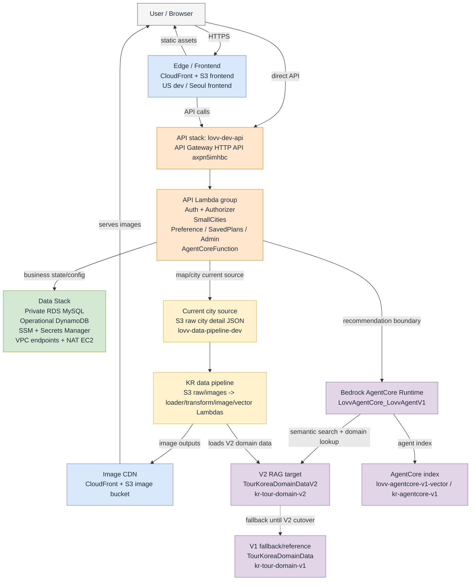

# 로브 (Lovv) V2 기준 AWS 시스템 아키텍처

> 문서 버전: v0.2
> 문서 상태: Review - V2 기준 작성
> 조회 기준일: 2026-06-29
> AWS 계정: `925273580929`
> 기준 리전: `us-east-1`, `ap-northeast-2`
> Mermaid 원본: `current_aws_system_architecture.mmd`
> 렌더링 이미지: `current_aws_system_architecture.png`

# 1. 요약

이 문서는 Lovv 개발 AWS 환경을 V2 도메인 데이터 기준으로 정리한 시스템 아키텍처 문서다. V2 기준은 `TourKoreaDomainDataV2`와 `lovv-vector-dev / kr-tour-domain-v2`를 향후 추천/RAG 도메인 데이터의 기준선으로 둔다는 뜻이다.

단, 2026-06-29 조회 기준 `TourKoreaDomainDataV2`는 생성되어 있고 KR pipeline Lambda 환경도 V2 테이블과 V2 vector index를 바라보지만, DynamoDB item count는 `0`이다. 따라서 V2는 문서와 파이프라인 기준선으로 작성하되, 실제 사용자 응답 경로의 cutover는 V2 적재, 인덱싱, API smoke test가 끝난 뒤 진행해야 한다. 기존 `TourKoreaDomainData`와 `kr-tour-domain-v1`은 cutover 전 fallback/reference로 유지한다.

현재 Lovv 개발 AWS 환경은 `us-east-1`을 주 리전으로 사용한다. API Gateway, Lambda, Cognito, RDS, DynamoDB, S3 Vectors, VPC 리소스는 대부분 `us-east-1`에 있으며, `ap-northeast-2`는 Seoul frontend S3/CloudFront 원본과 AgentCore runtime 보조 버킷 흔적 중심으로 확인된다.

| 영역 | V2 기준 구조 |
| --- | --- |
| Frontend/CDN | S3 정적 웹 자산 + CloudFront frontend 2개, 이미지 전용 CloudFront 1개 |
| API/Application | API Gateway HTTP API `lovv-dev-api` -> Python 3.12 Lambda 기능군 |
| Data Stack | CloudFormation stack `lovv-dev-data-stack`이 VPC, private RDS, DynamoDB, S3 image bucket, VPC endpoint, NAT instance를 소유 |
| V2 Domain/RAG | `TourKoreaDomainDataV2`, `kr-tour-domain-v2`, Bedrock AgentCore Runtime, KR pipeline Lambda |
| V1 Fallback | `TourKoreaDomainData`, `kr-tour-domain-v1`은 V2 cutover 전 검증/대체 경로로 유지 |

# 2. 전체 구성도



# 3. 현재 확인된 AWS 리소스

## 3.1 리전과 스택

| 리전 | 확인된 상태 |
| --- | --- |
| `us-east-1` | API, Data Stack, AgentCore Runtime, RDS, DynamoDB, Lambda, S3 Vectors의 주 리전 |
| `ap-northeast-2` | `lovv-frontend-dev-seoul-925273580929`, `bedrock-agentcore-runtime-925273580929-ap-northeast-2-5u7av7fyw` 버킷 확인. CloudFormation/Lambda/DynamoDB/RDS 활성 목록은 비어 있음 |

| Stack | 상태 | 역할 |
| --- | --- | --- |
| `lovv-dev-api` | `UPDATE_COMPLETE` | HTTP API, Cognito, API Lambda 기능군. 2026-06-29 업데이트 확인 |
| `lovv-dev-data-stack` | `UPDATE_COMPLETE` | VPC, RDS, DynamoDB, S3 image bucket, CloudFront image CDN, VPC endpoint, NAT instance |
| `AgentCore-LovvAgentCore-v1` | `UPDATE_COMPLETE` | Bedrock AgentCore Runtime `LovvAgentV1` |
| `AgentCore-MultiturnPlayground-v1` | `UPDATE_COMPLETE` | AgentCore 실험/플레이그라운드 계열 |
| `AgentCore-myagent-default` | `UPDATE_COMPLETE` | AgentCore 기본 실험 계열 |
| `CDKToolkit` | `CREATE_COMPLETE` | CDK bootstrap |
| `aws-sam-cli-managed-default` | `CREATE_COMPLETE` | SAM CLI managed bucket |

## 3.2 Frontend/CDN

| 리소스 | 값 | 역할 |
| --- | --- | --- |
| CloudFront | `d3nuef0zacpyj.cloudfront.net` | `lovv-frontend-dev` 원본의 dev frontend 배포 |
| CloudFront | `dkyiemfaw3g04.cloudfront.net` | `lovv-frontend-dev-seoul-925273580929` 원본의 Seoul frontend 배포 |
| CloudFront | `det7vj7wxfmim.cloudfront.net` | `lovv-image-dev-925273580929` 이미지 버킷 read-only CDN |
| S3 | `lovv-frontend-dev` | 정적 프론트엔드 자산, `us-east-1` |
| S3 | `lovv-frontend-dev-seoul-925273580929` | 정적 프론트엔드 자산, `ap-northeast-2` |
| S3 | `lovv-image-dev-925273580929` | 이미지 저장 버킷, `us-east-1` |

## 3.3 API/Application

| 리소스 | 값 |
| --- | --- |
| API Gateway | HTTP API `lovv-dev-api`, id `axpn5imhbc` |
| API URL | `https://axpn5imhbc.execute-api.us-east-1.amazonaws.com` |
| Cognito Hosted UI | `https://lovv-dev-auth-925273580929.auth.us-east-1.amazoncognito.com` |
| Cognito User Pool | `lovv-dev-auth-users`, id `us-east-1_ynarAQBR2` |
| Cognito IdP | Google, Kakao |

| Lambda | 런타임 | 주요 역할 |
| --- | --- | --- |
| `lovv-dev-api-AuthFunction-*` | Python 3.12 | Google/Kakao login, Cognito bridge session, logout, profile |
| `lovv-dev-api-AuthAuthorizerFunction-*` | Python 3.12 | Custom API authorizer |
| `lovv-dev-api-SmallCitiesFunction-*` | Python 3.12 | map markers, city list/detail, city places. 현재 S3 raw city detail JSON을 읽는 경로로 확인됨 |
| `lovv-dev-api-PreferenceFunction-*` | Python 3.12 | user preferences |
| `lovv-dev-api-SavedPlansFunction-*` | Python 3.12 | saved itineraries, public itinerary, reactions, share |
| `lovv-dev-api-AdminFunction-*` | Python 3.12 | admin data proposals, notices, monthly destinations, metrics, policies |
| `lovv-dev-api-AgentCoreFunction-*` | Python 3.12 | `POST /api/v1/recommendations`, Bedrock AgentCore Runtime 호출 경계 |

## 3.4 Data Stack and Network

| 리소스 | 값 | 상태/의미 |
| --- | --- | --- |
| VPC | `vpc-0ccb7e4be7b11b9fb` | 개발용 VPC |
| Private subnets | `subnet-0e04f80cfb58e0f35`, `subnet-0b3d1d99edd282504` | RDS/VPC endpoint 영역 |
| Public subnet | `subnet-0db1616e7e5db8baf` | NAT instance 영역 |
| NAT instance | `i-0c6dad9690abd0101`, `t4g.nano`, running | private subnet outbound/운영 접근 보조 |
| RDS | `lovv-dev-mysql`, MySQL 8.0.45, `db.t4g.micro`, DB `lovvdev` | `PubliclyAccessible=false`, StorageEncrypted=true, DeletionProtection=true |
| VPC endpoints | S3 Gateway, DynamoDB Gateway, SSM Interface, Secrets Manager Interface | private subnet AWS service 접근 |
| RDS secret | Secrets Manager ARN이 SSM에 등록됨 | 실제 secret 값은 문서화 금지 |

## 3.5 V2 Domain Data

| 리소스 | 상태/용도 |
| --- | --- |
| `TourKoreaDomainDataV2` | ACTIVE, V2 도메인 데이터 cutover target. 2026-06-29 조회 기준 item count `0` |
| V2 GSI | `CityDomainIndex`, `FestivalMonthIndex`, `ProvinceDomainIndex`, `EntityTypeDomainIndex` |
| `lovv-vector-dev / kr-tour-domain-v2` | V2 KR 도메인 추천 검색 인덱스. 2026-06-29 생성 확인 |
| `TourKoreaDomainData` | ACTIVE, 8,022 items. V2 cutover 전 fallback/reference |
| `lovv-vector-dev / kr-tour-domain-v1` | V1 KR 도메인 검색 인덱스. V2 cutover 전 fallback/reference |
| `lovv-agentcore-v1-vector / kr-agentcore-v1` | AgentCore V1 검색 인덱스. 도메인 V2 전환과 별도로 유지 |

## 3.6 Operational DynamoDB Tables

| 테이블 | 상태/용도 |
| --- | --- |
| `lovv_dev_auth_sessions` | session/refresh token hash lookup, TTL 세션 계열 |
| `lovv_dev_agent_runs` | agent run/request/recommendation trace lookup |
| `lovv_dev_api_logs` | API 로그 |
| `lovv_dev_async_jobs` | 비동기 작업 상태 |
| `lovv_dev_user_event_logs` | 사용자 이벤트 로그 |
| `lovv_dev_content_documents` | 콘텐츠 문서 조회 모델 |
| `lovv_dev_visitor_statistics` | 방문/관광 통계 |
| `lovv_dev_festival_verify_cache` | 축제 날짜 검증 캐시 |
| `lovv_dev_admin_authz_cache` | 관리자 권한 캐시 |

## 3.7 AI/RAG and Data Pipeline

| 리소스 | 값 | 역할 |
| --- | --- | --- |
| Bedrock AgentCore Runtime | `LovvAgentCore_LovvAgentV1-PumZyEGRsT` | LovvAgentV1 runtime |
| Recommendation Lambda | `lovv-dev-api-AgentCoreFunction-*` | API Gateway와 Bedrock AgentCore Runtime 사이의 호출 경계 |
| V2 S3 vector bucket/index | `lovv-vector-dev` / `kr-tour-domain-v2` | V2 KR 도메인 추천 검색 target |
| AgentCore vector bucket/index | `lovv-agentcore-v1-vector` / `kr-agentcore-v1` | AgentCore V1 검색 인덱스 |
| S3 | `lovv-data-pipeline-dev-925273580929` | 데이터 파이프라인 raw/processed 계열 |
| S3 | `lovv-pipeline-images-dev-925273580929` | 파이프라인 이미지 산출물 |
| Lambda | `kr-raw-ingest`, `kr-pipeline-loader`, `kr-pipeline-transform`, `kr-pipeline-image`, `kr-pipeline-vector` | KR 수집/전처리/이미지/벡터 적재 |

# 4. 주요 흐름

## 4.1 사용자 요청 흐름

1. 사용자는 CloudFront frontend 또는 직접 API Gateway HTTP API에 접근한다.
2. 공개 지도/도시/추천 조회는 `AuthorizationType=NONE`인 route를 통해 해당 Lambda로 전달된다.
3. 사용자 저장 일정, 선호, 관리자 기능은 Custom Authorizer 또는 Cognito JWT Authorizer를 거친다.
4. Lambda는 SSM Parameter Store에서 리소스 식별자를 참조하고, RDS/DynamoDB/S3/CloudFront/Secrets Manager와 연결한다.

## 4.2 소도시/지도 조회 흐름

1. API Gateway의 map/city 계열 route는 `SmallCitiesFunction`으로 전달된다.
2. 현재 함수 설명과 환경 기준으로 `SmallCitiesFunction`은 `lovv-data-pipeline-dev-925273580929`의 `raw/KR/details/20260609/` S3 raw city detail JSON을 읽는다.
3. 따라서 현재 문서에서는 `SmallCitiesFunction -> TourKoreaDomainDataV2`를 직접 화살표로 그리지 않는다.
4. 지도/도시 API까지 V2 도메인 테이블로 전환하려면 API 코드와 Lambda 환경 변수 변경, 응답 스키마 smoke test를 별도 cutover 작업으로 수행한다.

## 4.3 추천/RAG V2 흐름

1. `POST /api/v1/recommendations`는 `AgentCoreFunction`으로 라우팅된다.
2. `AgentCoreFunction`은 추천 실행 경계로 동작하며 Bedrock AgentCore Runtime을 호출한다.
3. V2 기준 RAG target은 `TourKoreaDomainDataV2`와 `lovv-vector-dev / kr-tour-domain-v2`다.
4. `TourKoreaDomainDataV2` item count가 0인 상태에서는 V2 기반 추천 품질 검증이 불가능하므로, V2 적재 완료 전까지 V1 fallback/reference를 유지한다.
5. 설계 문서상 Neptune은 현재 직접 도입하지 않으며, 관계 탐색은 Lambda/DynamoDB/S3 vector 조합으로 처리하는 방향이다.

## 4.4 V2 데이터 적재 흐름

1. 수집 원본과 이미지 산출물은 S3 pipeline bucket에 적재된다.
2. KR pipeline Lambda가 raw ingest, loader, transform, image, vector 단계를 수행한다.
3. 2026-06-29 기준 `kr-pipeline-loader`, `kr-pipeline-transform`, `kr-pipeline-vector`는 V2 테이블 또는 V2 vector index를 바라보는 구성으로 확인된다.
4. 정규화 결과는 `TourKoreaDomainDataV2`에 적재되어야 하며, 검색용 파생물은 `kr-tour-domain-v2`에 구성되어야 한다.
5. 적재 완료 후 V1/V2 item count, 샘플 entity 조회, vector 검색 smoke test, 추천 API smoke test를 통과해야 cutover 완료로 본다.

## 4.5 이미지 제공 흐름

1. 원본/서비스 이미지는 `lovv-image-dev-925273580929`에 저장된다.
2. Data Stack은 image CDN domain/base URL을 SSM `/lovv/dev/cloudfront/*`에 공개한다.
3. 이미지 CDN `det7vj7wxfmim.cloudfront.net`은 존재하지만, `SmallCitiesFunction`의 현재 이미지 CDN 사용 여부는 코드/환경 기준으로 별도 확인이 필요하다.

# 5. V2 전환 체크리스트

| 단계 | 확인 항목 | 완료 기준 |
| --- | --- | --- |
| V2 테이블 적재 | `TourKoreaDomainDataV2` item count 및 샘플 entity 조회 | V1 대비 필요한 도메인 범위가 누락 없이 적재됨 |
| V2 vector 생성 | `lovv-vector-dev / kr-tour-domain-v2` 검색 smoke test | 주요 도시/축제/콘텐츠 질의가 정상 응답 |
| 추천 경로 검증 | `POST /api/v1/recommendations` smoke test | AgentCore Runtime이 V2 검색 결과를 기반으로 추천 응답 생성 |
| 지도/도시 API 전환 여부 결정 | `SmallCitiesFunction`을 S3 raw detail 유지 또는 V2 조회로 변경할지 결정 | API 응답 스키마와 프론트엔드 화면 회귀 없음 |
| fallback 유지 | `TourKoreaDomainData`, `kr-tour-domain-v1` 유지 기간 정의 | V2 장애 시 rollback 기준과 owner 명확화 |
| 관측성 보강 | CloudWatch alarm, Lambda tracing, runbook | 핵심 API/Lambda/DDB/vector 실패 신호가 알림으로 연결 |

# 6. 기존 설계 문서와의 차이

| 항목 | 기존 문서 기준 | V2 기준 live AWS 해석 |
| --- | --- | --- |
| Lambda 분리 | `Auth-Function`, `Map-Function`, `AgentCore-Function` 중심 3분리 | 실제 API stack은 `Auth`, `AuthAuthorizer`, `SmallCities`, `Preference`, `SavedPlans`, `Admin`, `AgentCore`로 더 세분화됨 |
| Map Lambda 명칭 | `Map-Function` | 실제 함수는 `SmallCitiesFunction`이 지도/소도시 route를 담당 |
| SmallCities 데이터 원천 | 도메인 DynamoDB처럼 해석될 수 있음 | 현재는 S3 raw city detail JSON을 읽는 경로로 문서화해야 함 |
| 추천/RAG 데이터 | `TourKoreaDomainData`, `kr-tour-domain-v1` | V2 기준 target은 `TourKoreaDomainDataV2`, `kr-tour-domain-v2`; 단 V2 적재 완료 전까지 V1 fallback 유지 |
| 추천 Lambda 역할 | Lambda가 vector/DDB를 직접 참조하는 것으로 보일 수 있음 | `AgentCoreFunction`은 API와 Bedrock AgentCore Runtime 사이의 호출 경계로 표현하고, vector/DDB는 Agent/RAG target으로 분리 |
| Data Stack | SAM과 별도 Data Stack | `lovv-dev-data-stack`으로 실제 분리 생성됨 |
| RDS 접근 | private RDS, SSM/NAT 기반 운영 접근 | `PubliclyAccessible=false`, NAT EC2와 VPC endpoint 확인 |
| Graph DB | Neptune 직접 도입 보류 | Neptune 리소스 미확인, S3 vector + DynamoDB + Lambda 방향과 일치 |
| 관측성 | CloudWatch/X-Ray/OTel 기준 | CloudWatch alarm은 조회 시점 기준 0개. Lambda tracing은 `PassThrough` 중심이므로 보강 필요 |

# 7. 운영상 주의

- 이 문서는 2026-06-29 조회 시점의 snapshot이다. 배포가 진행되면 CloudFormation stack resource와 API route가 바뀔 수 있다.
- V2 기준 작성은 V2 cutover 완료를 뜻하지 않는다. `TourKoreaDomainDataV2` 적재와 `kr-tour-domain-v2` 검색 검증이 끝나야 실제 운영 기준으로 전환할 수 있다.
- SecureString/Secrets Manager 값과 Lambda 환경 변수의 실제 secret 값은 문서화하지 않는다. 문서에는 값이 아니라 관리 방식만 기록한다.
- 현재 AWS identity는 root ARN으로 조회되었다. 실제 변경/배포 작업은 least-privilege IAM 또는 SSO 권한으로 수행하는 것이 맞다.
- `ap-northeast-2`에는 frontend/CDN 흔적이 있으므로, 장애 대응 문서에서는 frontend 리전과 API/Data 리전이 다르다는 점을 명시해야 한다.

# 8. 검증에 사용한 조회

```bash
aws sts get-caller-identity
aws s3api list-buckets
aws cloudformation list-stacks --region us-east-1
aws cloudformation describe-stack-resources --region us-east-1 --stack-name lovv-dev-api
aws cloudformation describe-stack-resources --region us-east-1 --stack-name lovv-dev-data-stack
aws cloudformation describe-stack-resources --region us-east-1 --stack-name AgentCore-LovvAgentCore-v1
aws apigatewayv2 get-apis --region us-east-1
aws apigatewayv2 get-routes --region us-east-1 --api-id axpn5imhbc
aws lambda list-functions --region us-east-1
aws dynamodb list-tables --region us-east-1
aws dynamodb describe-table --region us-east-1 --table-name TourKoreaDomainData
aws dynamodb describe-table --region us-east-1 --table-name TourKoreaDomainDataV2
aws rds describe-db-instances --region us-east-1
aws ec2 describe-vpc-endpoints --region us-east-1
aws s3vectors list-vector-buckets --region us-east-1
aws s3vectors list-indexes --region us-east-1 --vector-bucket-name lovv-vector-dev
aws cloudfront list-distributions
```

# 9. 변경 이력

| 버전 | 날짜 | 작성자 | 변경 내용 |
| --- | --- | --- | --- |
| v0.2 | 2026-06-29 | Codex | V2 기준 아키텍처로 재작성. `TourKoreaDomainDataV2`, `kr-tour-domain-v2`, SmallCities S3 raw source, AgentCore runtime boundary, V1 fallback/cutover 조건 반영 |
| v0.1 | 2026-06-28 | Codex | 현재 AWS 시스템 구성 snapshot 최초 정리 |
