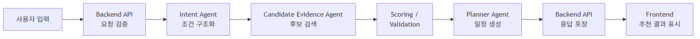

# 개발된 LLM 연동 웹 애플리케이션

> SK 네트웍스 Family AI 과정 5기<br>
> 제출 구분: 모델배포<br>
> 프로젝트: Lovv<br>
> 제출일자: 2026.07.09. (목)<br>
> 작성 팀: SKN05 1팀<br>
> 작성자: 조동휘<br>
> 문서 버전: v1.3<br>
> 문서 상태: 초안<br>
> 기준 문서: Agent 명세서 v0.15, 기술 명세서 v0.5, API 명세서 v0.7, Candidate Evidence Agent 평가 결과 보고서 v1.2

# 개요

## 목표

Lovv는 사용자의 자연어 여행 요청을 구조화하고, 수집·전처리된 관광 데이터를 기반으로 소도시 중심 여행 일정과 추천 이유를 제공하는 LLM 연동 웹 애플리케이션이다. 본 시스템의 목표는 단순 질의응답형 챗봇이 아니라, LLM과 RAG, Agent 파이프라인을 결합해 근거 있는 여행 추천 결과를 제공하는 것이다.

사용자는 웹 화면에서 국가, 여행 월, 여행 기간, 관심 테마, 축제 포함 여부, 자연어 요청을 입력한다. 시스템은 입력을 추천 가능한 조건으로 변환하고, S3 Vector와 DynamoDB 기반 후보 검색을 수행한 뒤, LLM을 이용해 일정과 추천 이유를 생성한다.

## 주요기능

- 사용자 자연어 요청을 여행 조건으로 구조화한다.
- 국가, 여행 월, 여행 기간, 테마, 축제 포함 여부를 추천 조건으로 반영한다.
- RAG 검색을 통해 도시, 관광지, 축제 후보 evidence를 수집한다.
- Candidate Evidence Agent가 후보를 검색·점수화하고 Planner Agent 입력 패키지를 구성한다.
- Planner Agent가 소도시 1곳 중심의 일정, 추천 이유, 일정 흐름 이유를 생성한다.
- 추천 결과에 지도, 숙소 검색, 맛집 검색 등 외부 확인 링크를 함께 제공한다.
- 추천 결과 저장, 저장 일정 조회, 좋아요·싫어요 피드백 API를 제공한다.
- 데이터 부족, 검증 실패, 실시간 정보 한계는 confidence와 user_notice로 분리해 안내한다.

# 기술 스택

## Frontend

- Core: React 19, TypeScript 6, Vite 8을 사용해 SPA 기반 웹 애플리케이션을 구성한다.
- Styling: Tailwind CSS 4, Headless UI, Lucide React를 사용해 온보딩, 홈 추천, 지도 탐색, Planner Workspace, 마이페이지 화면을 구성한다.
- 상태 관리: TanStack Query v5는 Backend API 서버 상태 캐싱에 사용하고, Zustand는 클라이언트 UI 상태 관리에 사용한다.
- 라우팅·다국어: React Router DOM, i18next, react-i18next를 사용해 화면 전환과 국가·언어 확장 기반을 구성한다.
- 지도: Google Maps API를 사용해 국가·테마별 소도시 마커, 지도 탐색, 상세 패널 연동을 제공한다.
- 인증: AWS Cognito Hosted UI와 Mock auth mode를 분리해 실제 인증 연동과 로컬 UI 검증을 모두 지원한다.
- 검증: Vitest, React Testing Library, ESLint로 컴포넌트, 상태, API 클라이언트, 정적 분석을 검증한다.

## Backend

- Serverless API: AWS SAM, API Gateway, Lambda를 사용해 인증, 지도 조회, 추천 요청, 저장 일정, 피드백 API를 구성한다.
- 인증·인가: Cognito session bridge와 access token 검증으로 사용자 세션과 보호 API 호출을 제어한다.
- 로컬 검증: unittest, local API smoke, SAM validate/build로 Lambda handler, API 계약, template, 패키징을 검증한다.
- 로컬 DB: Docker MySQL 8.0으로 Aurora MySQL 의존 기능의 로컬 스키마와 관리자 기능을 확인한다.
- Local Admin API: Python local admin server로 RDS/AWS 없이 관리자 제안 검토 흐름을 확인한다.

## Agent, LLM, RAG

- Agent orchestration: LangGraph와 Supervisor Router로 Intent, Candidate Evidence, Planner 단계 실행을 제어한다.
- Runtime: Amazon Bedrock AgentCore Runtime을 사용하며, LovvAgentV2 등록 완료 상태를 기준으로 실행·검증한다.
- LLM 호출: Amazon Bedrock 기반 LLM 호출 구조를 사용해 Agent별 추론 책임을 분리하고 추천 이유와 일정을 생성한다.
- Embedding/RAG: Amazon Titan Embeddings와 S3 Vector를 사용해 자연어·테마 기반 후보 검색을 수행한다.
- 정형 조회: DynamoDB에서 도시, 장소, 축제, 도메인 데이터를 조회한다.
- 로컬 live harness: `invoke_live_recommendation.py`로 AWS profile 등록 후 `src/` graph를 재배포 없이 확인한다.

## Data, External Integration, Verification

- 데이터 저장소: DynamoDB, Aurora MySQL, S3 Vector를 사용해 도메인 데이터, 사용자 저장 일정, 후보 검색 index를 관리한다.
- 실행·관측 데이터: Agent trace, feedback data, saved itinerary data를 추천 품질 분석과 후속 개인화 기반 데이터로 활용한다.
- 외부 연동: Google Maps, 지도 링크, 숙소 검색 링크, 맛집 검색 링크, WeatherAPI 표시용 데이터를 추천 결과 확인과 실제 여행 계획 보조에 사용한다.
- 평가: Candidate Evidence Agent evaluation, baseline comparison, blind LLM judge로 후보 충분성, 필수 테마 반영, 추천 품질 개선 여부를 확인한다.
- 구조 검증: schema contract, compile/test, HTML/PDF structure verification으로 제출 산출물과 실행 계약의 일관성을 확인한다.

# 외부 자료 반영 기준

본 보고서는 Lovv 내부 문서와 함께 외부 공식 문서 및 대표 샘플을 참고해 구조를 보강했다. 외부 자료는 그대로 복사하지 않고, Lovv의 실제 기술 구조와 일치하는 항목만 반영했다.

- LangGraph Overview는 장시간 실행되는 stateful workflow와 Agent orchestration 관점을 확인하기 위해 참고했다. Lovv에서는 Intent, Candidate Evidence, Planner를 분리한 멀티스텝 Agent 흐름을 설명하는 근거로 반영했다.
- Amazon Bedrock Knowledge Bases는 RAG가 관련 정보를 검색해 생성 응답의 관련성과 정확도를 높이는 방식이라는 점을 확인하기 위해 참고했다. Lovv에서는 S3 Vector와 DynamoDB를 활용한 customer-managed RAG 구조 설명에 반영했다.
- Amazon Bedrock AgentCore Memory는 short-term context와 long-term knowledge retention을 분리하는 관점을 확인하기 위해 참고했다. Lovv에서는 단기 대화 맥락과 장기 사용자 선호 프로필을 분리하는 향후 개인화 방향에 반영했다.
- Amazon Bedrock AgentCore Gateway는 Lambda, API, 기존 서비스를 agent-ready tool로 연결하는 방식을 확인하기 위해 참고했다. Lovv에서는 Scoring, Validation, Link Builder 같은 결정론적 Skill을 Agent tool로 확장하는 방향에 반영했다.
- AWS SAM Documentation은 Lambda, API Gateway, DynamoDB 등 serverless 리소스를 IaC로 정의하고 로컬 테스트·배포를 지원하는 기준을 확인하기 위해 참고했다. Lovv에서는 Backend API와 AgentCore 담당 Lambda 분리 및 생성·검증 명령 설명에 반영했다.
- AWS Travel Assistant Agent Sample은 Bedrock, LangGraph, React Web, backend, knowledge base를 결합한 여행 assistant 구조를 비교하기 위해 참고했다. Lovv에서는 여행 추천 도메인 특화 Agent 웹 애플리케이션이라는 설명 기준에 반영했다.
- Vercel Chatbot Template은 챗봇 UI, 모델 provider, 인증, 데이터 저장 등 AI 웹 앱의 기본 구성 요소를 확인하기 위해 참고했다. Lovv에서는 챗봇 입력, 결과 표시, 저장·피드백 UI 설명을 보완하는 기준에 반영했다.
- LangChain + Next.js Starter Template은 `.env.local`, LLM API key, dev server 방식의 로컬 실행 구조를 확인하기 위해 참고했다. Lovv에서는 LLM 챗봇 UI와 Agent 호출부를 로컬 개발 환경에서 분리 실행하는 기준에 반영했다.
- Amazon Bedrock RAG Sample은 frontend 실행과 AWS backend 배포 의존이 분리되는 구조를 확인하기 위해 참고했다. Lovv에서는 AWS 의존 RAG backend를 로컬 실행 범위에서 제외하고 UI 연결 방식만 참고하는 기준에 반영했다.
- Lovv_web은 organization 내 실제 Lovv 프론트엔드 저장소 기준을 확인하기 위해 참고했다. Lovv에서는 Frontend 기술스택, 환경 변수, 검증 명령을 외부 샘플이 아니라 실제 저장소 기준으로 반영했다.


# 기본 사용법

## 1. 메인 화면 진입

사용자는 Lovv 웹 애플리케이션에 접속한 뒤 온보딩 또는 메인 지도 화면으로 진입한다.

- 국가와 여행 월을 선택한다.
- 관심 테마를 선택한다.
- 여행 기간과 축제 포함 여부를 입력한다.
- 지도 마커 또는 챗봇 입력을 통해 추천 요청을 시작한다.

## 2. 챗봇 및 추천 요청

사용자는 자연어로 여행 조건을 입력할 수 있다.

예시:

```text
가을에 조용하고 감성적인 일본 소도시 1박 2일 여행지를 추천해줘
```

입력된 요청은 다음 흐름으로 처리된다.



이 흐름은 AWS Travel Assistant Agent 샘플처럼 웹 프론트엔드, 백엔드, Agent, 지식 기반을 분리하는 구조를 따른다. 다만 Lovv는 쇼핑이나 일반 여행 상담이 아니라 소도시 여행 추천, 후보 근거 검색, 일정 생성, 추천 이유 제공에 초점을 둔다.

## 3. 추천 결과 확인

추천 결과 화면에서는 다음 정보를 확인할 수 있다.

- 최종 추천 소도시
- 여행 기간에 맞춘 일정
- 추천 이유
- 일정 흐름 이유
- 추천 신뢰도
- 데이터 부족 또는 실시간 확인 필요 안내
- 지도, 숙소, 맛집 검색 링크
- 축제 포함 요청 시 축제 날짜 검증 결과

## 4. 저장 및 피드백

사용자는 추천 결과를 저장하거나 피드백을 남길 수 있다.

- `GET /me/itineraries`: 저장 일정 목록 조회
- `POST /me/itineraries`: 추천 일정 저장
- `DELETE /me/itineraries/{itineraryId}`: 저장 일정 삭제
- `POST /me/feedback`: 좋아요·싫어요 피드백 저장

피드백과 저장 일정은 후속 개인화 추천의 기반 데이터로 활용할 수 있다.

## 5. 단일 턴 Agent 답변

추천 생성 외에도 단일 질문에 대한 AI 답변을 생성할 수 있다.

- `POST /agent/answer`

이 API는 대화 원문을 영구 저장하지 않고, 현재 요청과 전달된 context를 기준으로 답변을 생성한다.

# 확장 및 커스터마이징

## 1. 시스템 분야 확장성

- 한국과 일본 소도시 외에 다른 국가·지역 데이터로 확장할 수 있다.
- 신규 도시, 관광지, 축제 데이터를 수집·전처리해 DynamoDB와 S3 Vector에 추가할 수 있다.
- 테마 taxonomy를 확장해 사용자가 선택할 수 있는 여행 취향을 세분화할 수 있다.

## 2. 추천 품질 커스터마이징

- Candidate Evidence Agent의 scoring weight를 조정해 거리, 혼잡도, 테마 균형, 후보 충분성의 우선순위를 변경할 수 있다.
- 최소 테마 quota, soft max quota, fallback 정책을 조정해 추천 결과의 다양성과 안정성을 개선할 수 있다.
- strict blind LLM judge와 human pairwise 평가를 추가해 추천 품질 검증을 강화할 수 있다.
- RAG 검색 결과에는 출처와 정규화 데이터 연결 키를 유지해, Amazon Bedrock Knowledge Bases 문서에서 강조하는 응답 근거 확인 가능성을 Lovv의 자체 데이터 구조에서도 확보한다.

## 3. 개인화 확장

- 사용자의 저장 일정과 피드백을 장기 선호 데이터로 축적할 수 있다.
- AgentCore Memory와 DynamoDB 기반 장기 프로필을 분리해 단기 대화 맥락과 장기 개인화를 함께 처리할 수 있다.
- 향후 사용자의 지역, 이동 선호, 선호 테마, 이전 저장 일정 기반으로 추천 결과를 조정할 수 있다.
- AgentCore Memory 문서의 short-term memory와 long-term memory 구분을 참고해, 최근 대화 맥락은 Agent 실행 상태로 처리하고 반복 사용자의 취향은 별도 프로필 저장소로 관리한다.

## 4. 운영 및 응답 방식 확장

- 응답 시간이 긴 추천 요청은 비동기 작업 또는 스트리밍 응답으로 분리할 수 있다.
- 실시간 영업시간, 교통, 예약 가능 여부 API를 연동해 실제 방문 가능성 검증을 강화할 수 있다.
- Agent trace, fallback 비율, token 사용량, latency를 관측해 운영 품질을 개선할 수 있다.
- AgentCore Gateway 문서의 tool 연결 방식처럼 외부 API, Lambda Skill, 검증 로직을 Agent가 호출 가능한 tool 경계로 분리하면 기능 확장 시 Agent prompt를 과도하게 키우지 않고 운영할 수 있다.

# 결론

## 성과

- LLM 기반 여행 추천 웹 애플리케이션 구조를 구현했다.
- 사용자 자연어 입력을 구조화해 추천 조건으로 변환하는 Intent Agent 흐름을 정의했다.
- S3 Vector와 DynamoDB를 활용한 RAG 기반 후보 검색 구조를 구성했다.
- Candidate Evidence Agent를 통해 후보 검색, 점수화, 후보 충분성 판단, fallback 처리를 수행했다.
- Planner Agent가 검색된 후보를 기반으로 일정과 추천 이유를 생성하도록 구성했다.
- API와 웹 화면을 연결해 추천 요청, 결과 표시, 저장, 피드백 흐름을 정리했다.
- Candidate Evidence Agent 평가에서 baseline 대비 후보 충분성, 필수 테마 반영, 테마 균형 개선 가능성을 확인했다.

## 검증 결과

| 항목 | 결과 |
| --- | --- |
| 로컬 결정적 테스트 | 38건 실행, 38건 통과, 실패 0건 |
| AWS 24건 평가 | 정상 후보 예산 충족 Baseline 7건, Ours 17건 |
| 후보 부족 | Baseline 17건, Ours 7건 |
| Blind LLM judge | Ours 승 19건, Baseline 승 0건, 동률 5건 |
| 주요 개선 항목 | 후보 충분성, 필수 테마 validity, 테마 균형 |

## 향후 발전 방향

- 브랜드별 또는 지역별 데이터 서브그래프를 활용해 추천 검색 범위를 세분화한다.
- 교통, 영업시간, 예약 가능 여부 등 실시간 API를 연동해 실제 방문 가능성 검증을 강화한다.
- 저장 일정과 피드백을 기반으로 사용자 맞춤형 추천 품질을 개선한다.
- 장기 메모리와 사용자 선호 프로필을 활용해 반복 방문 사용자의 개인화를 강화한다.
- 이미지, 지도, 일정표가 포함된 제출용 PDF 산출물로 확장한다.

# 참고 자료

본 보고서에서 사용한 참고 자료는 문서 본문에서 직접 링크를 반복하지 않고, 역할과 반영 위치를 중심으로 항목형으로 정리한다. 실제 URL은 부록 A에 별도로 모아 둔다.

- Agent workflow: LangGraph Overview를 참고해 Agent 런타임, 기본 사용법, 확장 방향을 정리했다.
- RAG: Amazon Bedrock Knowledge Bases를 참고해 RAG/검색, 근거 기반 응답, 출처 확인 기준을 정리했다.
- Memory: Amazon Bedrock AgentCore Memory를 참고해 개인화 확장과 단기·장기 memory 분리 방향을 정리했다.
- Tool gateway: Amazon Bedrock AgentCore Gateway를 참고해 Skill/tool 경계와 외부 API 확장 방향을 정리했다.
- Serverless backend: AWS SAM Documentation을 참고해 Backend API 구성 기준을 정리했다.
- Travel agent sample: AWS Travel Assistant Agent Sample을 참고해 여행 assistant 구조 비교와 웹+Agent+지식 기반 구성을 정리했다.
- Chatbot UI sample: Vercel Chatbot Template을 참고해 챗봇 UI, 인증, 데이터 저장, 모델 provider 구성 요소를 정리했다.
- LangChain UI sample: LangChain + Next.js Starter Template을 참고해 `.env.local`, LLM key, dev server 기준의 로컬 실행 구조를 정리했다.
- Bedrock RAG sample: Amazon Bedrock RAG Sample을 참고해 AWS 의존 RAG backend 제외 기준과 frontend 연결 방식을 정리했다.
- Lovv Frontend: Lovv_web 저장소의 `frontend/package.json`과 `frontend/README.md`를 참고해 React/Vite 프론트엔드 로컬 실행, `.env.local`, `npm run dev`, `localhost:5173` 기준을 정리했다.
- Lovv Backend: Lovv_BE 저장소의 Backend README, Local DB Docker guide, local API smoke script, local admin server script를 참고해 백엔드 로컬 테스트, Docker MySQL, local admin API 실행 기준을 정리했다.
- Lovv Agent: Lovv-agent 저장소의 README, scripts guide, live recommendation invocation script, deployed runtime invocation script, AgentCore config를 참고해 Agent 로컬 테스트, AWS 등록 후 local live harness, AgentCore Runtime 등록 완료 가정 실행 기준을 정리했다.

# 부록 A. 외부 링크

외부 URL은 본문 가독성을 위해 부록으로 분리한다.

- LangGraph Overview: `https://docs.langchain.com/oss/python/langgraph/overview`
- Amazon Bedrock Knowledge Bases: `https://docs.aws.amazon.com/bedrock/latest/userguide/knowledge-base.html`
- Amazon Bedrock AgentCore Memory: `https://docs.aws.amazon.com/bedrock-agentcore/latest/devguide/memory.html`
- Amazon Bedrock AgentCore Gateway: `https://docs.aws.amazon.com/bedrock-agentcore/latest/devguide/gateway.html`
- AWS SAM Documentation: `https://docs.aws.amazon.com/serverless-application-model/latest/developerguide/what-is-sam.html`
- AWS Travel Assistant Agent Sample: `https://github.com/aws-samples/sample-travel-assistant-agent`
- Vercel Chatbot Template: `https://github.com/vercel/chatbot`
- LangChain + Next.js Starter Template: `https://github.com/langchain-ai/langchain-nextjs-template`
- Amazon Bedrock RAG Sample: `https://github.com/aws-samples/amazon-bedrock-rag`
- Lovv Frontend: `https://github.com/Joraemon-s-Secret-Gadgets/Lovv_web`
- Lovv Backend: `https://github.com/Joraemon-s-Secret-Gadgets/Lovv_BE`
- Lovv Agent: `https://github.com/Joraemon-s-Secret-Gadgets/Lovv-agent`

# 변경 이력

| 버전 | 날짜 | 작성자 | 변경 내용 |
| :---: | :---: | :---: | --- |
| v1.3 | 2026-07-09 | 조동휘 | 제출 결과 보고서 본문에서 실행 준비 절차와 로컬 실행 상세 항목 전체 제거 |
| v1.2 | 2026-07-09 | 조동휘 | 표 내부 단어 개행을 줄이기 위해 기술스택과 참고자료를 항목형 서술로 바꾸고 외부 URL을 부록 A로 분리 |
| v1.1 | 2026-07-09 | 조동휘 | 기술스택을 개요 하위 항목에서 독립 섹션으로 분리하고 Frontend, Backend, Agent/LLM/RAG, Data/External/Verification 기준 표로 재구성 |
| v1.0 | 2026-07-09 | 조동휘 | 실제 Lovv_web 저장소 기준 프론트엔드 기술스택과 기능 범위를 보강하고 PDF에서 외부 자료 반영 기준을 다음 페이지에서 시작하도록 조정 |
| v0.9 | 2026-07-09 | 조동휘 | Frontend와 동일하게 Backend와 Agent 실행 기준에도 GitHub organization repo 주소 추가 |
| v0.8 | 2026-07-09 | 조동휘 | 로컬 실행 방법에서 절대 경로와 `cd` 이동 명령을 제거하고 실행 명령 중심으로 정리 |
| v0.7 | 2026-07-09 | 조동휘 | `04_Lovv-agent` local live harness를 AWS profile·권한 등록 후 실행으로 정리하고, AgentCore Runtime은 `LovvAgentV2` 등록 완료 가정으로 실행 절차 변경 |
| v0.6 | 2026-07-09 | 조동휘 | GitHub organization에서 `Lovv_web` 프론트엔드 저장소를 확인해 React/Vite 로컬 실행, 환경 변수, 검증 명령 추가 |
| v0.5 | 2026-07-09 | 조동휘 | 외부 샘플 중심 로컬 실행 설명을 현재 Lovv 로컬 레포 기준으로 교체하고, Backend·Local DB·Local Admin API·Agent local harness 명령 정리 |
| v0.4 | 2026-07-09 | 조동휘 | AgentCore와 AWS 배포 의존 항목을 제외한 로컬 실행 방법, 포함·제외 범위, GitHub 샘플 기준 명령 추가 |
| v0.3 | 2026-07-09 | 조동휘 | 외부 공식 문서와 대표 GitHub 샘플을 참고해 Agent, RAG, Memory, Gateway, SAM, 챗봇 UI 근거 보강 |
| v0.2 | 2026-07-09 | 조동휘 | 참조 PDF 양식에 맞춰 개요, 기본 사용법, 확장 및 커스터마이징, 결론 구조로 규격화 |
| v0.1 | 2026-07-09 | 조동휘 | LLM 연동 웹 애플리케이션 개발 결과 보고서 초안 작성 |
