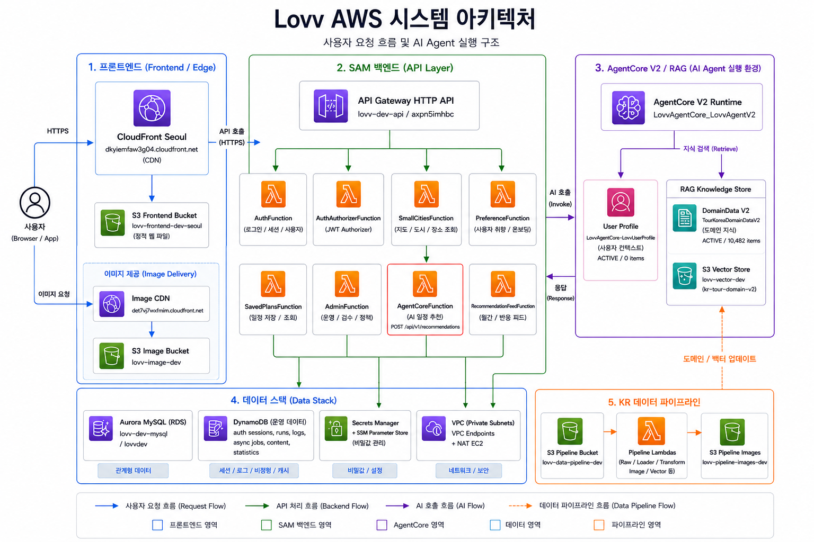
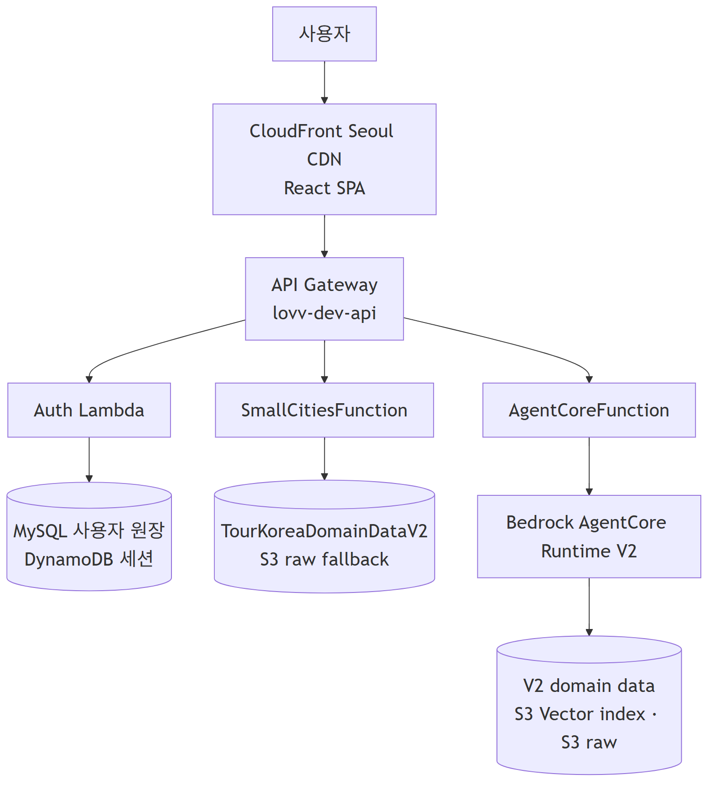
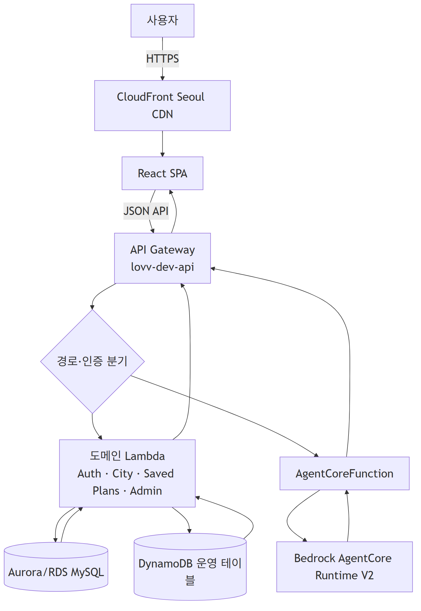
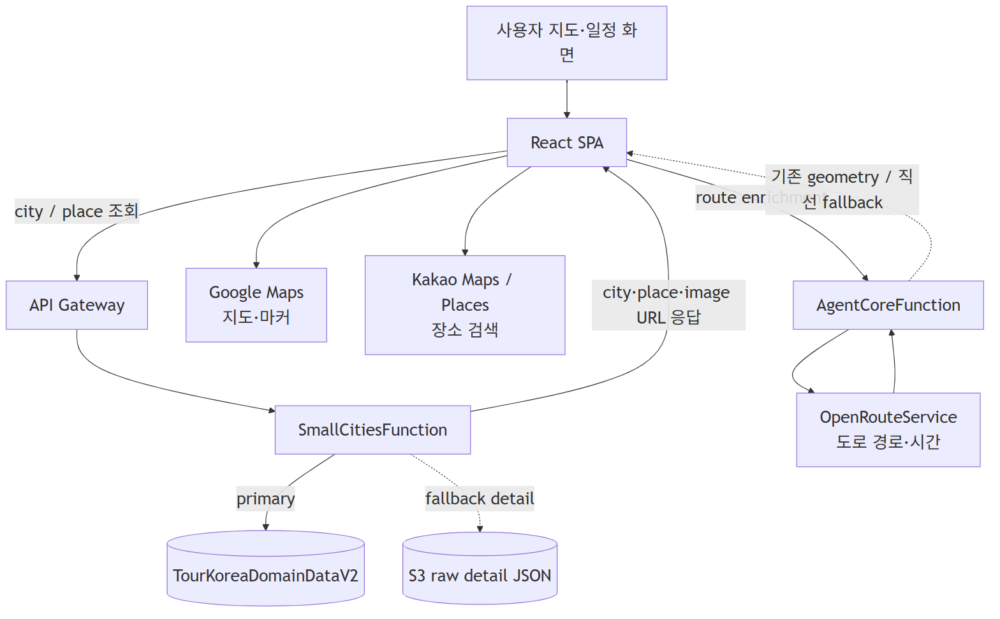
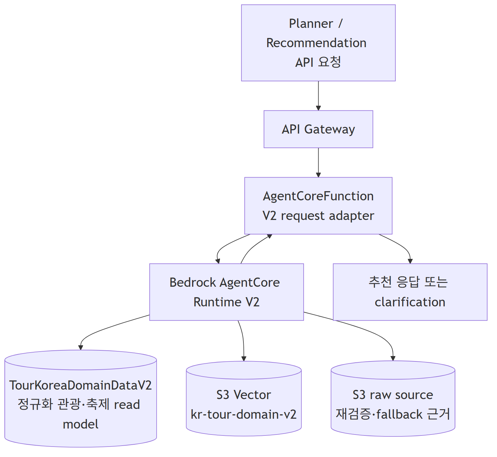
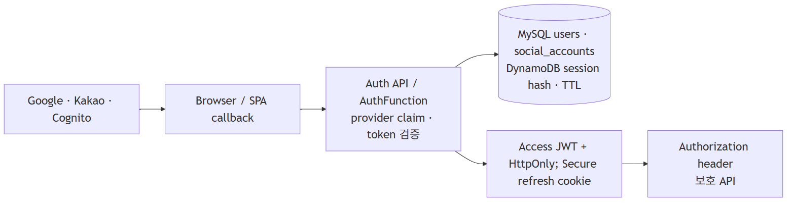
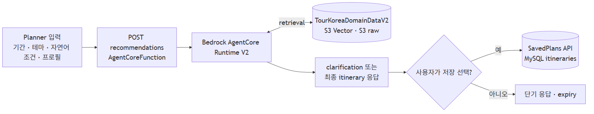
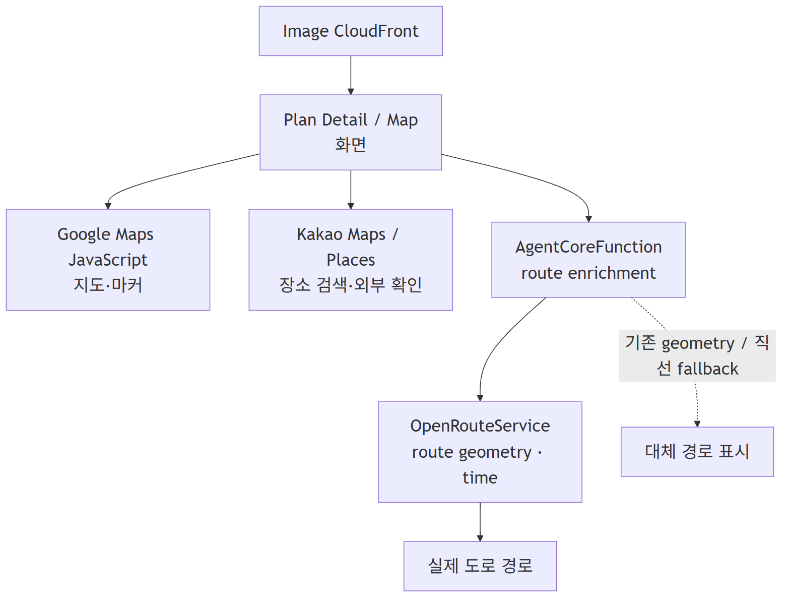

# 로브 (Lovv) 현재 시스템 아키텍처 및 구성도

> 문서 번호: 13<br>
> 문서 버전: v0.5<br>
> 문서 상태: Draft - 현재 핵심 아키텍처 정리<br>
> 조회 기준일: 2026-07-13<br>
> AWS 계정: `925273580929`<br>
> 기준 리전: `us-east-1`, `ap-northeast-2`<br>
> 작성 범위: 사용자 채널, 도메인/DNS, 프론트엔드, AWS 백엔드, AI 추천, 데이터 저장소, 보안, 운영, 배포 경계<br>

# 1. 요약

이 문서는 Lovv 서비스의 사용자 채널, 프론트엔드, AWS 백엔드, AI 추천, 데이터 저장소, 외부 연동, 네트워크 및 보안 경계, 운영, 배포 흐름을 번호가 부여된 독립 문서로 정리한다. 2026-07-09 live AWS 조회 결과와 2026-07-13 기준 전체 시스템 구성 문서를 함께 반영해 현재 아키텍처 판단 기준을 제시한다.

핵심 내용은 다음과 같다.

| 영역 | 핵심 내용 |
| --- | --- |
| 대표 도메인 | dev 대표 도메인은 `https://www.lovv.site`이며, `https://lovv.site`는 GoDaddy 301 포워딩 대상으로 관리한다. |
| 프론트엔드 배포 | React 19, TypeScript, Vite 기반 SPA를 Seoul S3 origin과 CloudFront로 제공한다. |
| AgentCore | `AgentCore-LovvAgentCore-v2` 스택과 `LovvAgentCore_LovvAgentV2-cy3tYk7nV4` runtime이 존재하며, 추천 Lambda가 V2 runtime ARN을 바라본다. |
| V2 도메인 데이터 | `TourKoreaDomainDataV2`는 `ACTIVE`이고 item count는 `10,482`이며, 현재 추천/RAG read model 기준이다. |
| 지도/소도시 API | `SmallCitiesFunction`은 `MAP_CITY_SOURCE=dynamodb`, `MAP_CITY_DYNAMODB_TABLE=TourKoreaDomainDataV2`를 사용하며 S3 raw detail fallback 환경도 유지한다. |
| 추천/RAG | `TourKoreaDomainDataV2`와 `lovv-vector-dev / kr-tour-domain-v2`만 현재 아키텍처 기준 RAG target으로 기록한다. |
| 개인화 프로필 | AgentCore V2는 `LovvUserProfile`을 개인화 프로필 저장소로 사용한다. |
| 보안/운영 | public recommendation route, Function URL, Agent session ownership, ORS key 노출, WAF/throttling/alarm/backup 설정은 운영 전 확인해야 할 위험 항목으로 관리한다. |

상태 표기는 다음 기준을 사용한다.

| 표시 | 의미 |
| --- | --- |
| 구현 | 현재 저장소 코드와 템플릿에 구현되어 있음 |
| 배포 확인 | dev 환경에서 실제 호출 또는 배포 정보가 확인됨 |
| 정의 | 템플릿이나 파라미터에는 있으나 해당 환경 배포 여부는 확인되지 않음 |
| 계획 | 설계 문서에만 있고 현재 기본 구현 범위가 아님 |
| 위험/확인 필요 | 운영 전 보완하거나 실제 AWS 설정을 추가 확인해야 함 |

# 2. 전체 시스템 구성도

아래 이미지는 AWS 권장 아키텍처 다이어그램 관례에 맞춰 Frontend/Edge, SAM API Layer, AgentCore V2/RAG, Data Stack, KR Data Pipeline을 고수준으로 분리해 표현한 전체 구성도다.



현재 대표 이미지는 「Lovv AWS 시스템 아키텍처」 구성도다. 세부 AWS 경계형 구성도 자산은 문서 관리용 원본과 렌더링 이미지로 별도 보존한다.

# 3. 구성 계층

## 3.1 Frontend and CDN

| 구성 | 현재 리소스 | 역할 |
| --- | --- | --- |
| Service domain | `www.lovv.site` | dev 대표 서비스 도메인, CloudFront 연결 |
| Apex domain | `lovv.site` | GoDaddy 301 forwarding으로 `www.lovv.site` 이동 |
| Seoul frontend CDN | `dkyiemfaw3g04.cloudfront.net` | `lovv-frontend-dev-seoul-925273580929` S3 origin을 제공하는 Seoul frontend |
| CloudFront distribution | `E1WB4Z0NNW98QR` | Seoul frontend SPA 배포와 invalidation 대상 |
| Image CDN | `det7vj7wxfmim.cloudfront.net` | `lovv-image-dev-925273580929` 이미지 버킷 read-only 제공 |
| Frontend bucket | `lovv-frontend-dev-seoul-925273580929` | 정적 웹 자산 저장 |
| ACM certificate | `lovv.site`, `*.lovv.site` | CloudFront custom domain용 `us-east-1` 인증서 |

Frontend는 Seoul CloudFront와 Seoul S3 정적 자산을 기준으로 기록한다. API 호출은 `lovv-dev-api` HTTP API로 전달되고, 이미지는 별도 CloudFront 배포와 S3 image bucket을 통해 제공된다. Route 53은 사용하지 않으며 GoDaddy DNS/포워딩과 CloudFront/ACM custom domain을 사용한다.

## 3.2 API and Lambda

| 구성 | 현재 리소스 | 역할 |
| --- | --- | --- |
| API Gateway | `lovv-dev-api`, id `axpn5imhbc` | HTTP API entrypoint |
| Auth | `lovv-dev-api-AuthFunction-*`, `AuthAuthorizerFunction-*` | social auth, service session, custom authorizer |
| Map/City | `lovv-dev-api-SmallCitiesFunction-*` | map markers, city list/detail, city places |
| Preferences | `lovv-dev-api-PreferenceFunction-*` | user preference API |
| Saved Plans | `lovv-dev-api-SavedPlansFunction-*` | saved itinerary, public itinerary, reactions, share |
| Admin | `lovv-dev-api-AdminFunction-*` | admin data proposals, notices, monthly destinations, metrics, policies |
| Recommendation | `lovv-dev-api-AgentCoreFunction-*` | Bedrock AgentCore runtime 호출 경계 |
| Feed | `lovv-dev-api-RecommendationFeedFunction-*` | monthly city and reaction-based feed |

API stack은 단일 Lambda가 아니라 기능별 Lambda 그룹으로 나뉘어 있다. RDS가 필요한 Lambda는 VPC private subnet과 보안 그룹을 통해 private MySQL에 접근하고, 공개 조회 성격의 SmallCities/AgentCoreFunction은 VPC 외부 Lambda로 구성되어 있다. API Gateway는 CORS credentials를 허용하고 `Authorization`, `Cookie`, `X-CSRF-Token` 헤더를 허용한다. dev allowlist에는 `https://www.lovv.site`가 포함된다.

## 3.3 Data Stack and Network

| 구성 | 현재 리소스 | 상태 |
| --- | --- | --- |
| Data stack | `lovv-dev-data-stack` | `UPDATE_COMPLETE` |
| RDS | `lovv-dev-mysql`, MySQL 8.0.45, DB `lovvdev` | `available`, `PubliclyAccessible=false`, encrypted, deletion protection enabled |
| VPC | `vpc-0ccb7e4be7b11b9fb` | 개발용 VPC |
| Private subnet | `subnet-0e04f80cfb58e0f35`, `subnet-0b3d1d99edd282504` | RDS와 VPC 연동 Lambda 영역 |
| NAT instance | `i-0c6dad9690abd0101`, `t4g.nano` | private subnet outbound 및 운영 접근 보조 |
| Secret management | Secrets Manager + SSM reference | 실제 secret 값은 문서화하지 않음 |

저장 일정과 사용자 선호 같은 핵심 서비스 ledger는 RDS MySQL에 둔다. DynamoDB는 세션, run trace, log, async job, content, visitor statistics, verification cache처럼 운영 상태와 조회 모델을 담당한다.

## 3.4 Domain Data and RAG

| 구성 | 현재 리소스 | 상태/역할 |
| --- | --- | --- |
| V2 domain table | `TourKoreaDomainDataV2` | `ACTIVE`, item count `10,482` |
| V2 indexes | `CityDomainIndex`, `FestivalMonthIndex`, `ProvinceDomainIndex`, `EntityTypeDomainIndex` | all `ACTIVE` |
| V2 vector index | `lovv-vector-dev / kr-tour-domain-v2` | V2 추천/RAG 검색 target |
| Profile table | `LovvUserProfile` | AgentCore V2 개인화 프로필 저장소 |

2026-07-09 기준 V2 도메인 데이터는 실제로 적재되어 있으며, 현재 운영 판단에서는 `ACTIVE / 10,482 items` 상태를 기준으로 삼는다.

AgentCore V2는 도메인/RAG target과 별도로 `LovvUserProfile`을 개인화 프로필 저장소로 사용한다.

## 3.5 KR Data Pipeline

| Lambda | 주요 환경 | 역할 |
| --- | --- | --- |
| `kr-raw-ingest` | pipeline bucket | raw ingest |
| `kr-pipeline-loader` | `DYNAMODB_TABLE=TourKoreaDomainDataV2` | S3-to-DynamoDB load |
| `kr-pipeline-transform` | `DYNAMODB_TABLE=TourKoreaDomainDataV2` | raw JSON preprocessing and DynamoDB load |
| `kr-pipeline-image` | image pipeline buckets | city-level image processing |
| `kr-pipeline-vector` | `VECTOR_BUCKET=lovv-vector-dev`, `VECTOR_INDEX=kr-tour-domain-v2`, `DYNAMODB_TABLE=TourKoreaDomainDataV2` | S3 Vector index build |

KR pipeline은 V2 DynamoDB table과 V2 vector index를 바라보는 상태다. `SmallCitiesFunction`도 V2 table을 primary city source로 사용하고 S3 raw detail fallback을 유지한다.

# 4. 주요 런타임 흐름

아래 개요는 사용자 요청이 인증, 도시·장소 조회, AgentCore 추천 실행으로 분기되는 현재 런타임 경계를 한 화면에 정리한 것이다.



## 4.1 사용자 웹/API 흐름

사용자는 Seoul CloudFront를 통해 정적 프론트엔드에 접근하고, API 요청은 `lovv-dev-api` HTTP API로 전달된다. API Gateway는 경로와 인증 상태에 따라 기능별 Lambda 그룹으로 요청을 라우팅하며, 각 Lambda는 필요에 따라 RDS MySQL 또는 DynamoDB 운영 테이블을 조회한 뒤 JSON 응답을 반환한다.



## 4.2 지도/소도시 조회 흐름

현재 SmallCities 계열 API는 V2 DynamoDB table을 primary로 쓰는 구성이다. 문서상으로는 S3 raw detail JSON을 완전히 제거된 것으로 쓰면 안 되고, fallback source로 남아 있음을 같이 표현한다. 이미지 자체의 전송 경로를 런타임 흐름에 모두 펼치기보다, city 응답에 이미지 URL이 포함되는 보조 출력으로만 표현한다.



## 4.3 추천/AgentCore 흐름

추천 경계는 API Gateway에서 `AgentCoreFunction`으로 들어오고, 이 Lambda가 Bedrock AgentCore Runtime V2를 호출한다. Runtime 내부의 상세 LangGraph/도구 흐름은 Agent 문서의 책임이고, 이 문서에서는 AWS 구성과 데이터 의존성을 기준으로 표현한다.



## 4.4 인증 및 세션 흐름

사용자는 Google, Kakao, Cognito 경로로 로그인한다. 프론트엔드는 provider callback 또는 Cognito callback을 받은 뒤 Auth API에 세션 생성을 요청하고, Auth Lambda는 provider claim/token을 검증해 사용자와 소셜 계정을 MySQL에 upsert한다. Refresh token은 `HttpOnly; Secure` cookie로 유지하고 DynamoDB session table에는 hash와 TTL을 저장한다. Access token은 짧은 수명의 서비스 JWT로 발급되어 `Authorization` header로 보호 API에 전달된다.

dev 배포의 Cognito redirect/logout은 각각 `https://www.lovv.site/auth/callback/cognito`, `https://www.lovv.site/`를 사용한다. prod/poc 파라미터는 외부 issuer/audience 연결 형태로 정의되어 있으나, 실제 prod 배포는 이 문서에서 확인된 상태로 단정하지 않는다.



## 4.5 AI 일정 생성 및 수정 흐름

AI 일정 생성은 프론트 Planner에서 여행 기간, 월, 축제 여부, 테마, 자연어 조건, 온보딩 프로필, feedback history를 수집해 `POST /api/v1/recommendations`로 요청하면서 시작한다. `AgentCoreFunction`은 V2 request를 구성해 Bedrock AgentCore Runtime V2를 호출하고, runtime은 V2 domain table, S3 vector index, S3 raw source를 검색 근거로 사용한다.

추가 선택이 필요하면 AgentCore는 `clarification`, `threadId`, `recommendationId`를 반환한다. 사용자가 선택지를 고르면 동일 `sessionId/threadId/recommendationId`로 실행을 재개한다. 최종 응답은 destination, itinerary, explainability, links, festival verification, alternative itinerary, expiry를 포함하며, legacy compatibility를 위해 `explanations`, `saveCompatibility`도 유지한다.

일정 수정은 생성 시 확보한 session/thread를 재사용한다. 사용자는 장소, 일차, 전체 일정 단위로 수정 요청을 보내고, backend adapter는 `entryType=modify`, 현재 일정 순서, 자연어 수정 조건을 AgentCore V2에 전달한다. 최종 저장은 사용자가 명시적으로 저장을 선택한 경우에만 SavedPlans API를 통해 MySQL 원장에 반영한다.



## 4.6 지도·장소·경로 연동

| 연동 | 사용 위치 | 실패 시 동작 |
| --- | --- | --- |
| Google Maps JavaScript | 상세 일정 지도와 마커 | 지도 미표시 또는 정적 정보 유지 |
| Kakao Maps/Places | 맛집 검색, 외부 장소 확인 | Kakao 검색 링크 제공 |
| OpenRouteService | 실제 도로 기반 route geometry/time | 기존 route geometry 또는 직선 경로 fallback |
| Image CloudFront | 도시·관광지·위시리스트 이미지 | 도시 대표 이미지 또는 준비 중 fallback |

현재 ORS는 브라우저 키와 백엔드 SSM/환경 변수 경로가 모두 존재한다. 운영에서는 브라우저 키 노출을 줄이기 위해 서버 프록시 또는 provider restriction, quota restriction을 적용해야 한다.



# 5. 프론트엔드/백엔드 구현 책임

## 5.1 프론트엔드 구성

| 영역 | 구현 | 책임 |
| --- | --- | --- |
| App shell / routing | React Router | 홈, 인증, 지도, 플래너, 상세 일정, 마이페이지 전환 |
| Server state | TanStack React Query | API 요청, mutation, 캐시 및 오류 상태 |
| Local/shared state | React state, Zustand | 플래너 단계, 인증 UI, 편집 상태 |
| Styling | Tailwind CSS | 반응형 UI와 디자인 토큰 |
| Auth adapter | `authApi.ts` | OAuth/Cognito bridge, session, logout, profile |
| Recommendation adapter | `recommendationsApi.ts` | V2 생성·clarify·modify 응답 매핑 |
| City adapter | `smallCityApi.ts` | 도시 목록·상세·장소 조회 |
| Saved plan adapter | `savedPlansApi.ts` | 저장·조회·삭제·반응·공유 |
| Planner | `usePlanner.ts` | 안내 질문, session/thread 유지, 생성·수정 orchestration |
| Plan detail | `PlanDetailView.tsx` | 일정 카드, 수정 챗봇, 드래그 순서, 위시리스트 |
| Maps/routes | Google Maps + ORS | 마커, 실제 도로 경로, 직선 fallback |

`VITE_*` 값은 브라우저 번들에 노출된다. Google/Kakao browser key처럼 공개 클라이언트 키만 사용해야 하며 서버 비밀값을 두어서는 안 된다. 주요 변수는 `VITE_LOVV_API_BASE_URL`, `VITE_API_BASE_URL`, `VITE_COGNITO_DOMAIN`, `VITE_COGNITO_CLIENT_ID`, `VITE_GOOGLE_MAPS_API_KEY`, `VITE_GOOGLE_MAPS_MAP_ID`, `VITE_KAKAO_MAP_JAVASCRIPT_KEY`, `VITE_OPENROUTESERVICE_API_KEY`, `VITE_IMAGE_CDN_BASE_URL`이다.

## 5.2 백엔드 Lambda 책임

| Lambda | 주요 API/책임 | 인증/데이터 |
| --- | --- | --- |
| `AuthFunction` | Google/Kakao 로그인, Cognito bridge, session, me, 계정 연결, logout | Public + Token/Cognito authorizer, MySQL, DynamoDB, Secrets Manager |
| `AuthAuthorizerFunction` | Lovv access JWT 검증과 권한 context | API Gateway Lambda authorizer |
| `PreferenceFunction` | 사용자 테마/선호 조회·수정 | Token authorizer, MySQL |
| `SavedPlansFunction` | 일정 CRUD, 공개 상태, 복제, 좋아요/싫어요 | Token/optional public 조회, MySQL |
| `RecommendationFeedFunction` | 월별·인기·사용자 반응 기반 도시 추천 | Public/Token, MySQL + DynamoDB + S3 |
| `SmallCitiesFunction` | 소도시 목록·상세·장소·지도 마커 | Public read, DynamoDB 우선 + S3 fallback |
| `AgentCoreFunction` | 추천 생성·clarify·modify adapter, V2 응답 매핑, ORS route enrichment | 현재 recommendation route는 authorizer 없음, AgentCore + SSM/ORS |
| `AdminFunction` | 사용자·운영 데이터·콘텐츠 제안/검수 기반 | Token + role/region authorization, MySQL |

# 6. 데이터 구성과 원장 경계

| 저장소 | 현재 책임 | 원장 여부 |
| --- | --- | --- |
| Aurora/RDS MySQL | users, social_accounts, user_preferences, itineraries, itinerary_items, plan_reactions, admin tables | 사용자 소유 데이터의 원장 |
| DynamoDB auth sessions | refresh token hash, session lookup, TTL | 단기 세션 저장소 |
| DynamoDB authz cache | 관리자 파생 권한 cache, TTL | 원장 아님 |
| DynamoDB Tour Korea | 도시·관광지·축제 정규화 read model | S3 원천에서 재생성 가능 |
| S3 raw | 도시 상세 JSON, metadata audit | 관광 원천 보존 |
| S3 vector | 의미 검색 인덱스 | 재생성 가능한 검색 보조 |
| S3 frontend/images | SPA 빌드와 이미지 파일 | 배포 산출물/정적 자산 |
| Agent checkpoint/memory | thread 실행과 clarification 재개 | 단기 실행 상태, 제품 데이터 원장 아님 |

관광·축제 원천 데이터는 S3 raw JSON으로 보존하고, 수집/정규화 pipeline을 통해 DynamoDB read model과 S3 vector retrieval index로 재생성한다. SmallCities API는 DynamoDB read model을 우선 사용하고 S3 raw detail JSON을 fallback source로 사용한다. AgentCore retrieval은 V2 domain table과 vector index를 함께 사용한다.

진행 중 채팅과 미확정 일정은 기본적으로 서버에 영구 저장하지 않는다. 사용자가 저장을 선택한 최종 일정만 MySQL에 저장한다.

# 7. 보안 신뢰 경계와 위험

브라우저와 사용자 입력은 신뢰하지 않는 client boundary에 둔다. CloudFront와 API Gateway는 public API boundary이며, public/optional-auth route와 authorizer-protected route를 분리한다. Lambda domain service와 AgentCore runtime은 service trust boundary에 있고, RDS, DynamoDB, S3, Secrets Manager, SSM은 private data boundary로 관리한다.

주요 보안 통제는 HTTPS, CloudFront, API Gateway CORS allowlist, API Gateway Lambda/Cognito authorizer, VPC private subnet과 security group 기반 RDS 접근, Secrets Manager/SSM 비밀값 관리, 최소 권한 IAM policy, refresh token hash + TTL, HttpOnly cookie, 사용자 입력 및 저장 일정 owner 검증이다.

| 우선순위 | 위험 | 권장 조치 |
| --- | --- | --- |
| 높음 | `AgentCoreFunction`에 `FunctionUrlConfig AuthType: NONE`가 정의됨 | 필요하지 않으면 Function URL 제거; 필요하면 IAM 또는 별도 인증 적용 |
| 높음 | `/api/v1/recommendations` route에 authorizer가 없음 | quota, rate limit, WAF 또는 사용자/세션 검증 적용 |
| 높음 | Agent session/thread 식별자를 클라이언트가 전달 | actor/session ownership을 백엔드에서 검증 |
| 중간 | 브라우저 ORS key 노출 가능 | 서버 경유 및 provider restriction 적용 |
| 중간 | Agent가 빈 itinerary, 중복 장소, 0분 이동을 반환할 수 있음 | Agent schema validation과 backend fail-closed 처리 |
| 중간 | 프론트의 mock/static fallback이 서버 장애를 가릴 수 있음 | 운영 모드에서 mock 비활성화 및 사용자 오류 상태 명시 |
| 중간 | Lambda SG egress가 `0.0.0.0/0` | 필요한 endpoint/NAT 경로만 허용 가능한지 검토 |
| 확인 필요 | WAF, API throttling, alarms, backup 정책 | 실제 AWS 계정 설정을 점검하고 IaC로 관리 |

# 8. 운영, 관측성, 배포

Lambda와 AgentCore는 CloudWatch Logs를 사용한다. AgentCore V2는 node metric, invocation metric, trace id, request id를 기록하고, Lambda는 request id, error type, AgentCore response key/day count 등 구조화 로그를 기록한다. dev log retention은 7일, prod 파라미터는 30일로 정의되어 있다.

운영 대시보드에는 API Gateway 4xx/5xx, Lambda error/throttle/duration, AgentCore latency/error, DynamoDB throttle, RDS connection/error, S3/CloudFront error 지표를 포함해야 한다. recommendation은 장시간 동기 호출이므로 timeout과 사용자 재시도 정책을 함께 관리한다. 백업은 RDS automated backup/PITR, DynamoDB PITR, S3 versioning/lifecycle의 실제 설정 확인이 필요하다.

권장 경보는 Recommendation 5xx 또는 AgentCore runtime error 급증, Recommendation p95 latency 초과, Lambda concurrency/throttle 또는 RDS connection 고갈, DynamoDB throttling 및 session write 실패, CloudFront origin error와 배포 후 SPA asset 404, ORS quota/timeout 증가와 직선 fallback 비율 상승이다.

현재 서울 프론트 dev 배포는 프론트엔드 release script가 Vite를 빌드하고 `s3://lovv-frontend-dev-seoul-925273580929`에 업로드한 뒤 CloudFront `E1WB4Z0NNW98QR`을 무효화하는 흐름으로 관리한다.

배포 게이트는 프론트 전체 Vitest, lint, TypeScript build, 주요 화면 browser smoke, 백엔드 unittest, `sam validate --lint`, `sam build`, API smoke, Agent create/clarify/modify 및 빈 query/빈 itinerary/중복 장소/날씨 대체 계약 테스트, 배포 후 auth session, city list/detail, recommendation, clarification, modify, save/share smoke를 포함한다. 실제 `.env`와 secret 파일은 Git에 포함하지 않는다.

# 9. 환경별 구성과 비기능 특성

| 환경 | 현재 상태 | 주요 특징 |
| --- | --- | --- |
| dev | 배포 확인 | `www.lovv.site`, 서울 CloudFront/S3, 미국 동부 `lovv-dev-api`·Cognito·RDS/DynamoDB/AgentCore |
| poc | 정의 | 별도 이름과 7일 로그 보존; 여러 값이 placeholder이므로 배포 준비 필요 |
| prod | 정의 | 30일 로그 보존, Cognito 자체 생성 비활성; RDS/VPC/secret 값이 placeholder |

파라미터 파일의 prod/poc 값은 배포 사실이 아니라 목표 구성이다. 실제 stack, DNS, certificate, WAF, backup, alarm 상태는 AWS 계정에서 별도 확인해야 한다.

| 특성 | 현재 구조 | 주요 고려사항 |
| --- | --- | --- |
| 확장성 | CloudFront, API Gateway, Lambda, DynamoDB 기반 수평 확장 | RDS connection과 Agent concurrency가 병목 가능 |
| 가용성 | 관리형 서비스와 private subnet 다중 AZ 파라미터 | Lambda가 일부 한 subnet만 사용하는 경로 확인 필요 |
| 성능 | 정적 CDN, DynamoDB read model, Agent retrieval | Agent 동기 추론과 ORS 외부 호출이 latency 지배 |
| 보안 | authorizer, VPC, secret store, IAM | public recommendation/Function URL과 client key 보완 필요 |
| 비용 | serverless 중심, pay-per-request | Agent/model/vector/외부 route 호출 quota 관리 필요 |
| 유지보수 | 도메인 Lambda와 frontend adapter 분리 | API 문서·Agent V2·frontend 타입 동기화 필요 |
| 복구성 | S3 raw에서 read model/vector 재생성 가능 | RDS/DynamoDB/S3의 실제 PITR/versioning 확인 필요 |

주요 단일 장애 또는 품질 지점은 단일 AgentCore V2 runtime ARN 집중, recommendation adapter가 빈 Agent 응답을 성공으로 전달할 때 프론트 mock이 장애를 숨길 가능성, RDS endpoint와 DB connection 한도가 인증·저장·추천 피드에 공통 영향을 주는 점, ORS 장애 시 직선 경로가 표시되는 점, 장소 영업시간·중복·거리 검증이 불완전할 때 유효하지 않은 일정이 생성될 수 있는 점이다.

# 10. 구현/계획 경계

이 절에서 **현재 구현 또는 배포 확인**은 코드·템플릿·실제 dev 리소스 중 하나 이상에서 실행 경로가 확인된 범위를 뜻한다. 설계 문서에만 있거나 도입 후보로 남은 항목은 현재 구성으로 간주하지 않고 계획 또는 미확정 범위로 분리한다.

## 10.1 현재 구현 및 배포 확인 범위

- **사용자 채널과 정적 배포**: React/Vite SPA를 S3 정적 버킷과 CloudFront dev 배포로 제공한다. 프론트엔드 정적 자산과 관광 이미지는 분리된 S3 origin 및 이미지 CDN 경로로 제공한다.
- **HTTP API와 도메인 Lambda**: 브라우저 요청은 API Gateway HTTP API를 단일 진입점으로 사용한다. 인증, 도시·장소 조회, 일정 저장·조회, 추천·AI 일정 어댑터 등 도메인 책임은 Lambda로 분리되어 있다.
- **인증과 세션**: Cognito를 인증 기반으로 사용하고 Google·Kakao 소셜 로그인 경로를 연결한다. 서비스 세션과 권한 확인은 DynamoDB의 auth session·authz cache를 사용하며, 브라우저가 데이터 저장소를 직접 호출하지 않는다.
- **트랜잭션 데이터와 관광 조회 모델**: 사용자, 취향, 저장 일정, 일정 항목과 반응의 원장은 Aurora/RDS MySQL에 둔다. 관광 조회용 read model은 DynamoDB에 두고, 원본 관광 데이터는 S3 raw 계층에서 관리한다. 따라서 사용자 소유 트랜잭션 데이터와 대량 관광 조회를 같은 저장소로 혼합하지 않는다.
- **AI·지도·경로 연동**: 이 문서의 2026-07-09 live 기준에서 Bedrock AgentCore V2는 create, clarify, modify 요청을 처리한다. 지도 표시는 Google/Kakao 지도 경로를 사용하고, 경로 계산은 OpenRouteService와 연동한다. 외부 지도·경로 API 장애 또는 제한은 Lambda 어댑터 경계에서 다룬다.
- **운영 관측**: Lambda와 AgentCore 실행 로그는 CloudWatch에서 확인한다. 이 로그는 요청 실패, Agent 호출 결과, 외부 연동 오류를 추적하는 운영 근거이며, 장기 사용자 원장을 대체하지 않는다.

## 10.2 계획 또는 미확정 범위

- **Neptune 그래프 DB**: 관광 엔터티 관계 탐색과 추천 보강을 위한 고도화 후보다. PoC와 Production 1차에는 직접 도입하지 않으며, 현재 관광 조회의 기준 저장소나 원장으로 사용하지 않는다. 3-hop 이상 임의 경로 탐색, 대규모 실시간 그래프 쓰기, 복잡한 그래프 알고리즘이 실제 병목으로 확인될 때 비용·적재·재생성 전략과 함께 재검토한다.
- **WebSocket 기반 채팅**: 현재 AgentCore 연동은 HTTP 요청·응답 흐름을 기준으로 한다. 실시간 토큰 스트리밍, 다중 턴 연결 유지, 접속 상태 관리는 WebSocket 도입 여부가 결정된 뒤 별도 설계가 필요하다.
- **완전한 CI/CD pipeline**: 테스트·검증 게이트는 문서화돼 있으나, 정적 배포와 서버리스 배포를 잇는 end-to-end 자동화 범위, 승인·롤백 단계, 환경별 배포 권한은 완전한 파이프라인으로 확정되지 않았다.
- **보안·네트워크 고도화**: 현재 dev VPC에는 S3·DynamoDB Gateway 및 SSM·Secrets Manager Interface endpoint와 NAT instance가 존재한다. 다만 endpoint 적용 범위·정책, NAT 경로의 세부 고도화와 egress 통제, WAF는 후속 확정 범위다. 현재 문서에서 이 항목들의 강화된 통제를 이미 적용된 보안 통제로 표시하지 않는다.
- **prod/poc 환경 분리**: dev 외 production 및 PoC stack의 리소스 분리, 파라미터, 데이터 초기화, 접근 권한과 운영 절차는 확정·배포 확인이 필요한 후속 범위다.

## 10.3 DNS 및 환경 운영 원칙

Route 53은 사용하지 않는다. 도메인 관리는 GoDaddy DNS와 apex 도메인의 301 forwarding을 사용하고, 서비스 도메인은 CloudFront custom domain과 ACM 인증서로 제공한다. 따라서 DNS 레코드 변경, apex-to-www 전달, CloudFront 배포 설정, ACM 인증서 갱신은 서로 다른 운영 책임으로 확인해야 하며, Route 53을 전제로 한 배포 자동화나 장애 대응 절차는 이 문서의 현재 범위에 포함하지 않는다.

# 11. 소스 오브 트루스

현재 구현 판단은 코드, SAM 템플릿, 파라미터, API adapter, Agent 문서, DB 설계 문서를 우선한다. README와 계획 문서가 코드 또는 SAM 템플릿과 다르면 현재 구현 판단에는 코드와 템플릿을 우선한다.

| 구분 | 기준 문서/구현 |
| --- | --- |
| 프로젝트 규칙 | AGENTS 문서 |
| 프로젝트 컨텍스트 | Lovv project context 문서 |
| 백엔드 IaC | Lovv backend SAM template |
| 환경 파라미터 | dev, poc, prod parameter files |
| 백엔드 구현 | Lovv backend source |
| 프론트 API 계약 | Frontend shared API adapters |
| Planner 구현 | Frontend planner feature |
| API 계약 | MVP confirmed API contract |
| Agent 사양 | Agent specification |
| DB 설계 | Database design document |

# 12. 현재 아키텍처 운영 기준

| 영역 | 현재 기준 | 관리 방식 |
| --- | --- | --- |
| AgentCore runtime | V2 stack/runtime을 추천 실행 기준으로 사용 | recommendation Lambda의 V2 runtime ARN 연결 상태를 배포 후 확인 |
| Domain Data | `TourKoreaDomainDataV2`와 `kr-tour-domain-v2`를 추천/RAG 기준 데이터로 사용 | V2 table item count, GSI 상태, vector index 상태를 함께 점검 |
| SmallCities data source | DynamoDB V2 primary + S3 raw detail fallback | API 응답 품질과 fallback 사용률을 운영 로그로 추적 |
| Personalization | `LovvUserProfile`을 개인화 프로필 저장소로 사용 | AgentCore domain/RAG target과 분리해 프로필 데이터만 관리 |
| Frontend CDN | Seoul CloudFront와 Seoul S3 frontend bucket을 대표 프론트 배포 경로로 사용 | CloudFront invalidation, S3 sync, custom domain 응답을 배포 게이트에 포함 |
| Public domain | `www.lovv.site`를 dev 대표 도메인으로 사용 | GoDaddy forwarding, CloudFront custom domain, ACM 인증서 상태를 함께 검증 |
| API route surface | auth, map, recommendation, saved-plan, admin, feed route를 도메인별 Lambda로 운영 | CORS, authorizer, route별 smoke test를 배포 검증에 포함 |
| Security boundary | public recommendation route, Function URL, Agent session ownership을 주요 위험으로 관리 | quota/rate limit/WAF, ownership 검증, Function URL 제거 또는 인증 적용을 후속 조치로 추적 |

# 13. 운영상 주의

- 이 문서는 2026-07-09 live AWS 조회와 2026-07-13 전체 시스템 구성 문서 반영 기준이다. AWS 리소스 상태와 Lambda 환경은 배포 후 변경될 수 있다.
- `TourKoreaDomainDataV2`와 `LovvUserProfile`은 각각 도메인/RAG 데이터와 개인화 프로필 저장소로 구분해 기록한다.
- API/Lambda 환경에는 secret 참조와 민감 설정이 섞일 수 있으므로 raw 환경 변수 전체를 문서에 붙여 넣지 않는다.
- 현재 AWS identity는 root ARN으로 조회되었다. 실제 운영 변경은 least-privilege IAM 또는 SSO 권한으로 수행해야 한다.
- CloudWatch alarm, tracing, runtime smoke test 등 운영 관측성은 별도 검증 문서 또는 운영 가이드에서 보강해야 한다.
- `lovv.site` apex 포워딩과 DNS 전파 상태는 시간에 따라 달라질 수 있으므로 배포 직후에는 301/200 응답을 재검증해야 한다.
- prod/poc 파라미터는 목표 구성이지 실제 배포 증거가 아니므로 AWS stack, DNS, certificate, WAF, backup, alarm을 별도 확인해야 한다.

# 14. 검증에 사용한 조회

아래 명령은 문서 작성 시 read-only 근거로 사용한 조회 범위다.

```bash
aws sts get-caller-identity
aws cloudformation list-stacks --region us-east-1 --stack-status-filter CREATE_COMPLETE UPDATE_COMPLETE UPDATE_ROLLBACK_COMPLETE
aws cloudformation describe-stack-resources --region us-east-1 --stack-name AgentCore-LovvAgentCore-v2
aws apigatewayv2 get-apis --region us-east-1
aws apigatewayv2 get-routes --region us-east-1 --api-id axpn5imhbc
aws lambda list-functions --region us-east-1
aws dynamodb list-tables --region us-east-1
aws dynamodb describe-table --region us-east-1 --table-name TourKoreaDomainDataV2
aws rds describe-db-instances --region us-east-1
aws s3vectors list-vector-buckets --region us-east-1
aws s3vectors list-indexes --region us-east-1 --vector-bucket-name lovv-vector-dev
aws cloudfront list-distributions
```

# 15. 변경 이력

| 버전 | 날짜 | 작성자 | 반영 내용 |
| --- | --- | --- | --- |
| v0.6 | 2026-07-13 | 조동휘 | 10장 구현/계획 경계를 현재 구현·배포 확인 범위, 계획·미확정 범위, DNS·환경 운영 원칙으로 구체화하고 각 저장소·인증·AI·지도·운영 책임을 분리 |
| v0.5 | 2026-07-13 | 조동휘 | 4장 런타임 개요와 4.3 추천/AgentCore, 4.6 지도·장소·경로 전용 Mermaid 흐름 이미지를 추가해 4.1~4.6 전체 흐름 이미지 구성을 완성 |
| v0.4 | 2026-07-13 | 조동휘 | 주요 런타임 흐름을 웹/API, 도시·경로, 인증·세션, 추천·AI 일정 생성·수정 이미지로 보강 |
| v0.3 | 2026-07-13 | 조동휘 | 요약을 현재 핵심 내용 중심으로 정리하고, 현재 아키텍처 운영 기준 표를 추가 |
| v0.2 | 2026-07-13 | 조동휘 | 전체 시스템 구성 문서 내용을 반영해 대표 도메인, DNS/CloudFront, frontend/backend 책임, 인증·AI·지도 흐름, 데이터 원장 경계, 보안 위험, 운영/배포/환경별 구성, 구현/계획 경계를 추가하고 Mermaid 코드는 제외 |
| v0.1 | 2026-07-09 | 조동휘 | `13_system_architecture` 번호 문서 초안 작성. V2 AgentCore runtime, V2 domain table 적재 상태, SmallCities DynamoDB primary 구성, V2 vector index, RDS/Data Stack, CDN/API 구성을 현재 상태 기준으로 정리 |
