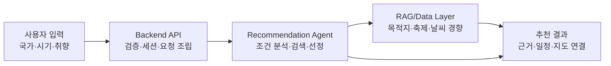
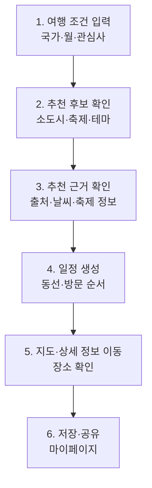
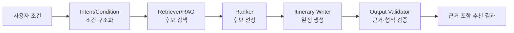

# 중간발표 PPT 리뷰 피드백 정리

> 문서 목적: 2026-06-13 기준 중간발표 PPT 리뷰 피드백을 실행 가능한 개편 요구사항으로 정리한다.
> 적용 대상: `docs/99_pptx/01_midterm_presentation/01_midterm_presentation.md` 및 HTML/PPT 발표본
> 핵심 방향: 감성적 설명보다 객관적 문제 제기, 기술 설계 이유, PoC 구현 근거를 중심으로 전문적인 발표 흐름을 만든다.

---

## 1. 전체 개편 원칙

### 1.1 표현·디자인

- 애니메이션은 전체적으로 제거한다.
- 슬라이드 타이틀은 짧게 쓴다.
- 발표 초반에 목차 슬라이드를 추가한다.
- 전체 톤은 전문적인 기술 발표 느낌으로 정리한다.
- 화면 텍스트는 줄이고, 기술 구조·데이터·흐름도·표 중심으로 시각화한다.
- 문제 제기는 감성적 문구보다 통계, 기사, 공신력 있는 외부 근거로 대체한다.

### 1.2 내용 구성

- 기술적인 내용이 전체 흐름에 계속 들어가야 한다.
- 단순 기능 소개가 아니라 "왜 이 구조를 선택했는가"를 설명한다.
- 트러블슈팅은 별도 장표로 분리하기보다 에이전트·RAG 설계 설명 안에 포함한다.
- 비즈니스 모델은 별도 장표로 둬도 되지만, 트리플과의 차별점과 함께 묶어도 좋다.
- WBS는 촘촘한 일정표 대신, 중간발표 시점까지의 주차별 구현 진행 현황으로 보여준다.
- 마지막에는 확장 방향, 출처, Q&A를 포함한다.

---

## 2. 권장 목차

1. 프로젝트 소개
2. 목차
3. 문제 정의: 오버투어리즘과 여행 정보 쏠림
4. 한일 타깃 선정 이유
5. 기존 서비스 한계와 Lovv의 기회
6. 시스템 흐름
7. 유저 플로우
8. 멀티 에이전트 설계 이유
9. RAG 중심 에이전트 구조
10. 데이터 구성
11. PoC 구현 현황
12. 차별점과 비즈니스 모델
13. 확장 방향
14. 출처
15. Q&A

> 기존 흐름에서 "문제 → 시장/타깃 → 기존 서비스 한계 → 기술 해결 → 구현 현황 → 비즈니스/확장" 순서가 더 자연스럽다.

---

## 3. 슬라이드별 수정 요구사항

### S1. 프로젝트 소개

**수정 방향**

- 타이틀은 짧게 유지한다.
- Lovv가 무엇인지 한 줄로 정의한다.
- 표지는 감성 카피 중심이어도 되지만, 다음 장부터는 객관적 문제 제기로 바로 넘어간다.

**화면 메시지 예시**

- 타이틀: `Lovv`
- 한 줄 정의: `한일 소도시를 찾아주는 대화형 여행 추천 서비스`

---

### S2. 문제 정의

**기존 피드백**

- 워드 클라우드를 통계 기반 문제 상황 작성으로 대체한다.
- 오버투어리즘의 정의 한 줄과 4가지 사례를 한 슬라이드로 합친다.
- 객관적인 대체 자료가 필요하다.

**수정 방향**

- 워드 클라우드는 제거한다.
- 오버투어리즘 정의 1줄 + 실제 사례 4개 + 공통 문제 구조를 한 장에 넣는다.
- 각 사례는 기사/통계 근거 기반으로 작성한다.

**구성안**

| 영역 | 내용 |
| --- | --- |
| 정의 | 오버투어리즘은 특정 지역의 수용 능력을 초과한 관광객 집중으로 주민 생활, 환경, 인프라에 부담이 발생하는 현상이다. |
| 사례 1 | 주민 생활 침해: 주거지·골목 관광지화로 소음, 무단 촬영, 사생활 침해가 발생한다. |
| 사례 2 | 환경 부담: 관광객 증가가 쓰레기, 플라스틱, 생활폐기물 처리 부담으로 이어진다. |
| 사례 3 | 인프라 압박: 교통, 숙박, 공공시설 수용 능력이 성수기·핫플 중심으로 초과된다. |
| 사례 4 | 지역 문화 훼손: SNS 명소화와 단기 소비형 방문이 지역 고유성과 생활 문화를 약화시킨다. |

**삭제**

- `여행지를 나눠가면 부담이 줄어든다` 문구는 삭제한다.

---

### S3. 문제의 영향

**기존 피드백**

- 4가지 사례에서 한 줄씩 더 설명을 붙인다.
- 여행지를 나눠가면 부담이 줄어든다는 문구는 삭제한다.

**수정 방향**

- S2와 합치거나, S2가 정의·사례라면 S3는 "왜 서비스 기회인가"로 바꾼다.
- 단순 비용 나열보다 "관광객은 유명지로 몰리고, 소도시는 발견되지 않는다"는 구조를 보여준다.

**메시지 예시**

| 문제 | 사용자 관점 | 지역 관점 | Lovv 연결 |
| --- | --- | --- | --- |
| 유명지 쏠림 | 익숙한 도시만 반복 방문 | 특정 지역만 과밀 | 소도시 후보 탐색 |
| 정보 파편화 | 축제, 날씨, 교통, 숙소를 따로 검색 | 덜 알려진 지역은 노출 부족 | 조건 기반 통합 추천 |
| 신뢰 부족 | 낯선 지역 정보의 근거 확인 어려움 | 방문 전환율 낮음 | 출처 기반 Explainable RAG |

---

### S4. 한일 타깃 선정 이유

**기존 피드백**

- 이 페이지의 목표는 왜 한국과 일본이 타깃인지 설명하는 것이다.
- 크게 문제는 없다.

**수정 방향**

- "왜 한국과 일본인가"에만 집중한다.
- 인바운드·아웃바운드 양방향 수요, 지리적 근접성, 여행 재방문 가능성, 소도시 관광 확장성을 근거로 정리한다.

**구성안**

| 근거 | 설명 |
| --- | --- |
| 양방향 여행 수요 | 한국인의 일본 여행, 일본인의 한국 여행 모두 서비스 타깃이 될 수 있다. |
| 근거리 반복 방문 | 장거리 여행보다 재방문·짧은 일정 설계 가능성이 높다. |
| 소도시 확장성 | 대도시 중심 여행에서 주변 도시·축제·지역 콘텐츠로 확장할 여지가 있다. |
| 데이터 확보 가능성 | 관광지, 축제, 날씨, 지도 등 추천에 필요한 공개 데이터·API 조합이 가능하다. |

---

### S5. 문제 근거

**기존 피드백**

- 3개의 축을 객관적인 뉴스 자료로 대체한다.
- 문제를 제기한 3가지 내용이 빈약하므로 뉴스 기사로 대체한다.

**수정 방향**

- 추상적인 3축 대신 기사 기반 문제 카드 3개로 구성한다.
- 각 카드는 `기사 장면 → 문제 해석 → Lovv가 푸는 방식`의 3단 구조로 쓴다.

**구성안**

| 기사 기반 문제 | 해석 | Lovv 연결 |
| --- | --- | --- |
| 유명 관광지 과밀 | 여행 수요가 특정 장소로 집중된다. | 대안 소도시 후보 추천 |
| 지역 생활 부담 | 관광객 유입이 주민 생활·환경 비용으로 이어진다. | 혼잡 회피·분산 관점 추천 |
| 정보 신뢰 부족 | 낯선 지역은 정보 탐색과 검증 비용이 높다. | 출처·근거 기반 RAG 응답 |

---

## 4. 시스템 흐름도

**기존 피드백**

- 한 눈에 잘 들어오게 만든다.

**수정 방향**

- 세부 컴포넌트를 모두 넣지 말고, 발표 화면에서는 5단계 흐름으로 압축한다.
- 기술 키워드는 각 단계 아래 보조 라벨로만 둔다.

**발표 포인트**

- 사용자는 도시를 먼저 고르지 않는다.
- 시스템이 조건을 해석하고, 데이터 기반 후보를 찾고, 근거와 함께 일정으로 변환한다.
- 핵심은 "검색 결과"가 아니라 "근거 있는 추천과 실행 가능한 일정"이다.

---

## 5. 유저 플로우

**기존 피드백**

- 그래프 등으로 시각화한다.
- 실제 사용자가 따라갈 수 있는 흐름을 그린다.

**수정 방향**

- 사용자가 실제로 누르고 확인하는 단계를 중심으로 그린다.
- 기능 목록이 아니라 사용자 여정으로 보여준다.

**강조할 점**

- 첫 질문은 "어디로 갈까?"보다 "언제, 어느 나라로, 어떤 분위기로 갈까?"에 가깝다.
- Lovv는 유명 도시 검색이 아니라 대안 여행지 발견부터 일정화까지 이어준다.

---

## 6. 에이전트 플로우

### 6.1 문제 제기 우선

**기존 피드백**

- 왜 멀티 에이전트로 가야 하는지 문제 제기를 먼저 한다.
- 그 다음 멀티 에이전트가 어떻게 구성되고 문제를 어떻게 해결했는지 보여준다.
- 툴과 에이전트의 구분은 크게 중요하지 않다.

**수정 방향**

- "우리가 왜 단일 LLM 호출로 끝내지 않았는가"를 먼저 설명한다.
- 핵심 이유는 검색, 검증, 랭킹, 일정 생성의 판단 기준이 서로 다르기 때문이다.

**문제 제기**

| 단일 호출의 한계 | 필요한 처리 |
| --- | --- |
| 사용자의 조건이 모호하다. | 조건을 구조화해야 한다. |
| 낯선 소도시 정보는 신뢰 검증이 필요하다. | RAG 검색과 출처 검증이 필요하다. |
| 후보가 많으면 추천 우선순위가 흔들린다. | 랭킹 기준이 필요하다. |
| 추천만으로는 여행 실행이 어렵다. | 일정 생성과 설명이 필요하다. |

### 6.2 에이전트 구조

**설계 이유**

- 조건 구조화와 검색을 분리해 사용자 입력의 모호성을 줄인다.
- RAG를 중심에 두어 추천 결과가 내부 데이터와 외부 근거에 연결되도록 한다.
- Ranker를 별도로 두어 "그럴듯한 답변"이 아니라 기준 기반 후보 선정을 만든다.
- 일정 생성과 검증을 분리해 결과 품질과 발표 데모 안정성을 확보한다.

---

## 7. 딥다이브 구성

**기존 피드백**

- 에이전트 구조 내 각각의 아키텍처 설계 이유를 넣는다.
- 왜 이렇게 설계했고 어떤 점이 어려웠는지 설명한다.
- PoC에서 가장 힘을 준 부분은 RAG를 중심으로 설명한다.

**권장 딥다이브 1: RAG**

| 항목 | 설명 |
| --- | --- |
| 설계 목표 | 소도시 추천 결과에 출처와 근거를 붙인다. |
| 어려움 | 관광지, 축제, 날씨, 위치 정보가 서로 다른 형태로 존재한다. |
| 해결 | 데이터를 검색 가능한 단위로 정리하고, 추천 후보와 근거를 함께 반환한다. |
| 발표 메시지 | Lovv의 추천은 LLM의 상상 답변이 아니라, 검색된 근거를 기반으로 생성된다. |

**권장 딥다이브 2: Ranker**

| 항목 | 설명 |
| --- | --- |
| 설계 목표 | 후보 중 사용자 조건에 맞는 도시·축제를 우선 선정한다. |
| 어려움 | 유명도, 계절성, 접근성, 테마 적합도를 동시에 고려해야 한다. |
| 해결 | 후보별 점수화 기준을 두고 추천 순서를 안정화한다. |
| 발표 메시지 | 단순 검색 결과를 나열하지 않고, 여행 조건에 맞는 우선순위를 만든다. |

**트러블슈팅 반영 방식**

- 별도 트러블슈팅 슬라이드를 만들지 않는다.
- 각 딥다이브에서 `어려움 → 설계 선택 → 결과` 구조로 녹인다.

---

## 8. 데이터 슬라이드

**기존 피드백**

- 데이터는 표로 정리해서 한 눈에 보여준다.

**구성안**

| 데이터 | 용도 | 추천 연결 |
| --- | --- | --- |
| 도시·지역 데이터 | 추천 후보의 기본 단위 | 소도시 후보 생성 |
| 관광지 데이터 | 방문 장소 후보 | 일정 구성 |
| 축제·이벤트 데이터 | 시기성 추천 | 여행 월·시즌 매칭 |
| 날씨 경향 데이터 | 계절 적합성 판단 | 월별 여행 적합도 |
| 지도·외부 링크 | 실행 가능한 이동 | 상세 확인·지도 이동 |
| 사용자 조건 | 개인화 입력 | 테마·일정 필터링 |

**발표 메시지**

- 데이터는 "많이 모았다"가 아니라 "추천 판단에 필요한 단위로 정리했다"를 강조한다.

---

## 9. 트리플과의 차별점

**기존 피드백**

- 서론에 있어야 한다.
- 트리플을 사용한 경험이 없어도 알 수 있게 시각적 이미지를 띄운다.
- 대비 포인트를 잡아 Lovv가 강한 부분 2~3개를 보여준다.

**수정 방향**

- 트리플 화면이나 대표 기능 이미지를 배경 근거로 두고, 비교 기준을 명확히 한다.
- "트리플이 부족하다"가 아니라 "Lovv가 다른 문제를 더 깊게 푼다"로 표현한다.

| 비교 기준 | 일반 여행 앱/트리플 중심 | Lovv |
| --- | --- | --- |
| 시작점 | 사용자가 목적지를 어느 정도 알고 검색한다. | 사용자가 조건만 입력해도 후보 도시를 발견한다. |
| 추천 근거 | 장소·후기·상품 중심 정보가 많다. | 추천 이유와 출처를 함께 보여준다. |
| 타깃 | 대도시·인기 여행지 중심 탐색에 강하다. | 한일 소도시·축제·분산 여행에 집중한다. |

---

## 10. 비즈니스 모델

**기존 피드백**

- 시장 가치가 있어야 서비스이므로 비즈니스 모델은 필요하다.
- 정량적 수치를 보여주는 것이 좋다.
- 트리플과의 차별점 슬라이드에 녹여도 된다.

**수정 방향**

- 차별점과 비즈니스 모델을 한 장으로 묶는 구성이 가능하다.
- 시장 수치, 관광 수요, 지자체 관광 활성화 예산, 여행 플랫폼 시장 등 정량 근거를 보강해야 한다.

**구성안**

| 수익/확장 축 | 설명 | 필요한 정량 근거 |
| --- | --- | --- |
| B2C 여행 추천 | 사용자 맞춤 소도시 여행 추천 | 한일 여행객 규모, 재방문 수요 |
| 제휴/예약 연결 | 숙박, 교통, 액티비티 딥링크 | 예약 전환율, OTA 수수료 구조 |
| B2G/지역 파트너 | 지자체 소도시 관광 홍보·분산 정책 지원 | 지역 관광 예산, 관광객 분산 정책 사례 |

---

## 11. 진행 현황

**기존 피드백**

- WBS 일정표는 잘 보이지 않는다.
- 중간 발표까지 구현한 부분을 주차별로 묶어 보여준다.
- 산출물 관점이 아니라 프로젝트를 진행하며 주차별로 무엇을 했는지 보여준다.

**구성안**

| 주차 | 진행 내용 | 발표에서 보여줄 증거 |
| --- | --- | --- |
| 1주차 | 문제 정의, 서비스 방향, 한일 소도시 타깃 설정 | 기획 문서, 문제 근거 |
| 2주차 | 데이터 수집·전처리 구조 정리 | 데이터 표, 수집 파이프라인 |
| 3주차 | 추천 흐름, 시스템 구조, 에이전트 설계 | 시스템 흐름도, 에이전트 플로우 |
| 4주차 | PoC 구현, RAG/랭킹/일정 생성 검증 | 데모 화면, 추천 결과 예시 |

**발표 메시지**

- 일정표를 보여주기보다 "문제 정의 → 데이터 → 설계 → PoC"의 진행 축을 보여준다.

---

## 12. 확장 방향

**포함할 내용**

- 더 많은 도시·축제 데이터 확장
- 사용자 피드백 기반 추천 품질 개선
- 혼잡도·계절성·이동시간을 반영한 랭킹 고도화
- 지자체/지역 파트너 대시보드
- 최종 발표에서는 실제 동작 결과, 성능 지표, 사용자 검증 결과로 확장

---

## 13. 출처

**수정 방향**

- 기사·통계 기반으로 문제 제기 슬라이드를 보강한다.
- 화면에는 짧은 출처명만 쓰고, 마지막 출처 장표에 전체 링크를 모은다.
- 뉴스 자료는 오버투어리즘, 한일 여행 수요, 지역 관광 활성화, 여행 플랫폼 시장 근거로 구분한다.

**출처 정리 표**

| 구분 | 필요한 근거 |
| --- | --- |
| 오버투어리즘 | 관광객 과밀, 주민 피해, 환경 부담, 인프라 압박 기사 |
| 한일 타깃 | 한국·일본 상호 여행 수요, 인바운드/아웃바운드 통계 |
| 소도시 기회 | 지역 관광 활성화 정책, 지방 관광 수요 |
| 비즈니스 | 여행 시장 규모, OTA/여행 플랫폼 수익 구조, 지자체 관광 예산 |

---

## 14. Q&A

**예상 질문**

| 질문 | 답변 방향 |
| --- | --- |
| 왜 한일 소도시인가? | 근거리 반복 방문 수요, 소도시 관광 확장성, 데이터 확보 가능성을 근거로 답한다. |
| 기존 여행 앱과 무엇이 다른가? | 목적지 검색이 아니라 조건 기반 소도시 발견과 근거 있는 추천이 차별점이라고 답한다. |
| 왜 멀티 에이전트인가? | 조건 분석, 검색, 랭킹, 일정 생성, 검증의 역할이 달라 분리했다고 답한다. |
| RAG가 왜 필요한가? | 낯선 지역 추천은 신뢰가 중요하므로 출처와 근거를 함께 제공해야 한다고 답한다. |
| PoC의 한계는 무엇인가? | 데이터 범위와 실시간성은 제한적이며, 최종 단계에서 확장·검증한다고 답한다. |

---

## 15. 작업 체크리스트

- [ ] 전체 애니메이션 제거
- [ ] 슬라이드 타이틀 단축
- [ ] 목차 슬라이드 추가
- [ ] S2 워드 클라우드 제거 및 통계/기사 기반 문제 정의로 대체
- [ ] S2/S3 오버투어리즘 정의와 4가지 사례 통합
- [ ] S4 한일 타깃 선정 이유 명확화
- [ ] S5 문제 근거를 뉴스 기반 3개 카드로 교체
- [ ] 시스템 흐름도 단순화
- [ ] 유저 플로우를 실제 사용자 여정 도식으로 변경
- [ ] 에이전트 플로우 앞에 멀티 에이전트 필요성 문제 제기 추가
- [ ] RAG 중심 딥다이브 강화
- [ ] 데이터 슬라이드를 표 중심으로 정리
- [ ] 트러블슈팅 내용을 에이전트 설계 이유 안에 통합
- [ ] 트리플과의 차별점 슬라이드를 서론부에 배치
- [ ] 차별점과 비즈니스 모델을 함께 강조
- [ ] WBS를 주차별 진행 현황으로 변경
- [ ] 확장 방향, 출처, Q&A 장표 추가
