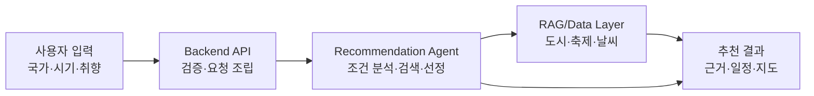

# 슬라이드 B1 — 시스템 흐름

> 원본 위치: `../01_midterm_presentation.md`
> 상태: Slide Content
> 역할: Lovv가 입력에서 추천 결과까지 동작하는 큰 그림 제시

## 화면 문구

**입력부터 근거 있는 추천·일정까지 한 흐름으로**

## 레이아웃

| 영역 | 내용 |
| --- | --- |
| 중앙 | 좌->우 5단계 파이프라인 |
| 하단 | 핵심 키워드: Explainable RAG, Candidate Evidence, Planner |

## 발표자 노트

- 사용자는 국가, 시기, 취향을 입력합니다.
- Backend는 요청을 검증하고 추천 실행에 필요한 조건으로 정리합니다.
- Agent는 데이터를 검색하고 후보를 선정한 뒤 근거와 일정으로 변환합니다.

## 제작 체크

- [ ] 세부 기술 스택을 과하게 넣지 않는다.
- [ ] 한눈에 들어오도록 5단계 이상 늘리지 않는다.
