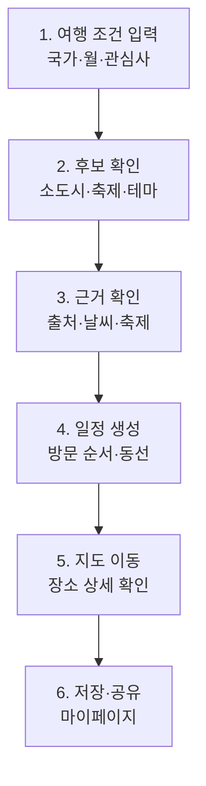

# 슬라이드 B2 — 유저 플로우

> 원본 위치: `../01_midterm_presentation.md`
> 상태: Slide Content
> 역할: 실제 사용자가 따라가는 흐름 제시

## 화면 문구

**사용자는 도시가 아니라 조건에서 시작한다**

## 레이아웃

| 영역 | 내용 |
| --- | --- |
| 중앙 | 6단계 사용자 여정 |
| 우측 또는 하단 | 기존 검색 흐름과의 차이: 목적지 검색 -> 조건 기반 발견 |

## 발표자 노트

- Lovv의 첫 질문은 어디로 갈지보다 언제, 어느 나라로, 어떤 분위기로 갈지에 가깝습니다.
- 사용자는 추천 후보를 보고, 왜 추천됐는지 확인하고, 일정과 지도로 이어집니다.

## 제작 체크

- [ ] 기능 목록이 아니라 사용자의 행동 순서로 보여준다.
- [ ] 추천 근거 확인 단계를 반드시 포함한다.
