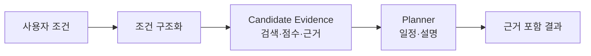

# 슬라이드 B3 — 에이전트 플로우

> 원본 위치: `../01_midterm_presentation.md`
> 상태: Slide Content
> 역할: 왜 멀티 에이전트 구조가 필요한지 설명

## 화면 문구

**단일 답변이 아니라, 검색·선정·일정 생성을 나눠 처리한다**

| 단일 LLM 호출의 한계 | 분리한 책임 |
| --- | --- |
| 조건이 모호하다 | 조건 구조화 |
| 소도시 정보는 검증이 필요하다 | RAG 검색·근거 수집 |
| 후보가 많다 | 점수화·랭킹 |
| 추천만으로는 실행이 어렵다 | 일정 생성·검증 |

## 레이아웃

| 영역 | 내용 |
| --- | --- |
| 상단 | 단일 LLM 호출의 한계와 책임 분리 메시지 |
| 중앙 | 4단계 에이전트 플로우 |
| 하단 | 발견, 근거, 일정 키워드 회수 |

## 발표자 노트

- 멀티 에이전트는 복잡해 보이기 위한 구조가 아닙니다.
- 조건 해석, 근거 검색, 후보 선정, 일정 생성은 실패 방식이 서로 다르기 때문에 책임을 나눴습니다.
- PoC에서는 특히 Candidate Evidence와 RAG 흐름을 중요하게 봤습니다.

## 제작 체크

- [ ] Tool/Agent 구분 자체보다 책임 분리를 강조한다.
- [ ] RAG 딥다이브로 자연스럽게 연결한다.
