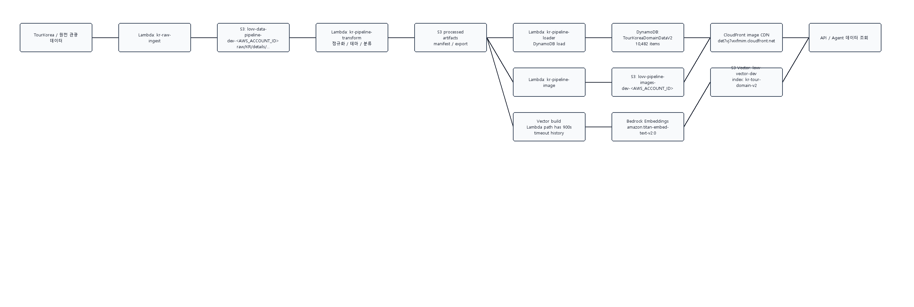
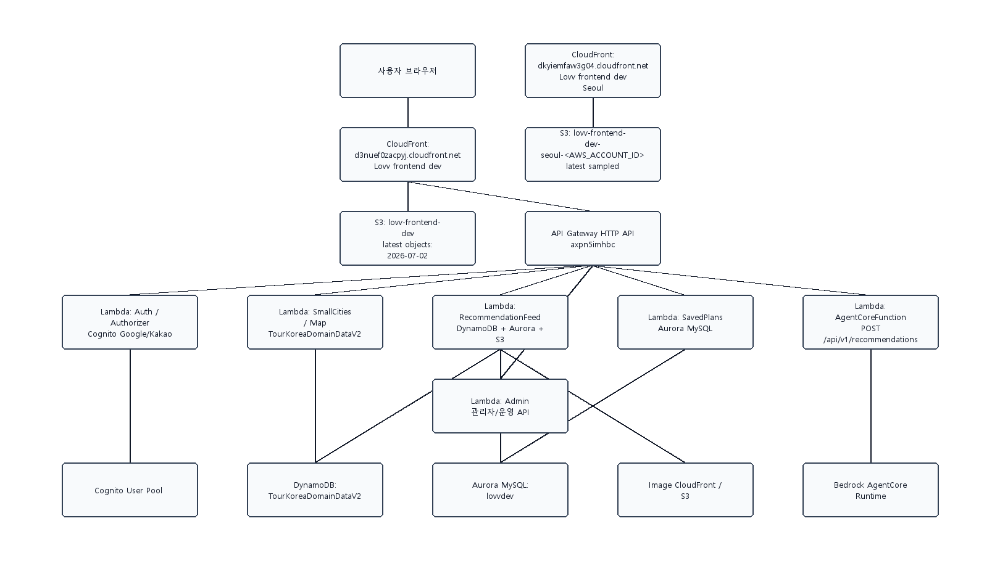
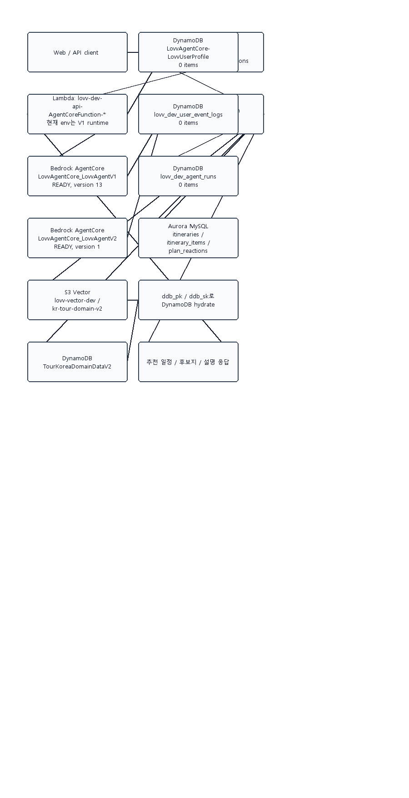

# Lovv AWS 서비스 구성 Mermaid

작성일: 2026-07-03
조회 기준: AWS CLI, `us-east-1`, 계정 ID는 `<AWS_ACCOUNT_ID>`로 마스킹

## 기존 문제점 3가지

1. Agent V1/V2 연결이 불일치한다.
   - `AgentCore-LovvAgentCore-v2` 스택과 `LovvAgentCore_LovvAgentV2` 런타임은 `READY` 상태다.
   - 하지만 `lovv-dev-api-AgentCoreFunction-*` Lambda의 `BEDROCK_AGENT_ARN`은 현재 `LovvAgentCore_LovvAgentV1-*` 런타임을 가리킨다.
   - 결과적으로 웹/API에서 추천을 호출해도 V2 Agent 구성, V2 메모리, V2 프로파일링 개선이 실제 사용자 경로에 붙지 않을 수 있다.

2. 개인화에 필요한 운영 데이터가 비어 있다.
   - `TourKoreaDomainDataV2`는 `ACTIVE`, `ItemCount=10482`로 도메인 데이터는 적재되어 있다.
   - 반면 `LovvAgentCore-LovvUserProfile`, `lovv_dev_user_event_logs`, `lovv_dev_anonymous_travel_segment_stats`, `lovv_dev_agent_runs`, `lovv_dev_async_jobs`는 모두 `ItemCount=0`이다.
   - 따라서 현재 추천은 개인화된 사용자 행동/저장 일정/세그먼트 기반이라기보다 도메인 데이터와 기본 로직 중심으로 동작할 가능성이 높다.

3. 전처리 벡터 빌드의 운영 경로가 안정적이지 않다.
   - `kr-tour-domain-v2` 벡터 인덱스는 존재하고, 최신 manifest 기준 `vector_success_count=7606`, `failed_count=0`이다.
   - 하지만 같은 manifest에 `kr-pipeline-loader`의 Lambda request-response 시도가 `900000 ms` 타임아웃 4회로 기록되어 있다.
   - 즉 산출물은 만들어졌지만, 전국 단위 재빌드가 Lambda 단일 실행 경로로 안정적으로 재현되는 상태는 아니다.

## AWS 조회 요약

| 영역 | 현재 AWS 리소스 |
| --- | --- |
| 스택 | `AgentCore-LovvAgentCore-v1`, `AgentCore-LovvAgentCore-v2`, `lovv-dev-api`, `lovv-dev-data-stack` |
| 데이터 테이블 | `TourKoreaDomainDataV2`: 10,482건, `attraction=7024`, `festival=398`, `city_metadata=240`, `visitor_statistics=2820` |
| 개인화/운영 테이블 | `LovvAgentCore-LovvUserProfile`, `lovv_dev_user_event_logs`, `lovv_dev_anonymous_travel_segment_stats`, `lovv_dev_agent_runs`, `lovv_dev_async_jobs`: 모두 0건 |
| 벡터 | `lovv-vector-dev/kr-tour-domain-v2`, manifest 기준 7,606개 벡터 검증 |
| 웹 | CloudFront `d3nuef0zacpyj.cloudfront.net` -> `lovv-frontend-dev`, CloudFront `dkyiemfaw3g04.cloudfront.net` -> `lovv-frontend-dev-seoul-<AWS_ACCOUNT_ID>` |
| API | HTTP API `axpn5imhbc`, Lambda `Auth`, `SmallCities`, `RecommendationFeed`, `SavedPlans`, `AgentCore`, `Preference`, `Admin` |
| 데이터 저장소 | Aurora MySQL `lovvdev`, DynamoDB 운영 테이블, S3 이미지/CDN, S3 Vector |

## 데이터 전처리 라인

## 웹 서비스 라인

## Agent 라인

## 바로 봐야 할 조치

1. API의 `AgentCoreFunction`이 V1을 호출하는 것이 의도인지 확인하고, V2 전환이 목표라면 `BEDROCK_AGENT_ARN`과 런타임 호환성을 맞춘다.
2. 개인화가 목표라면 `user_event_logs`, `LovvUserProfile`, `anonymous_travel_segment_stats`, `agent_runs`에 실제 이벤트가 쌓이는지 먼저 API 경로에서 검증한다.
3. 전국 단위 벡터 재빌드는 Lambda 단일 request-response가 아니라 배치/분할 실행 또는 Step Functions/queue 기반으로 재구성한다.
4. 웹 배포는 `us-east-1`/`ap-northeast-2` CloudFront 두 경로의 최신성, CORS allowlist, 운영 대상 도메인을 하나로 정리한다.
